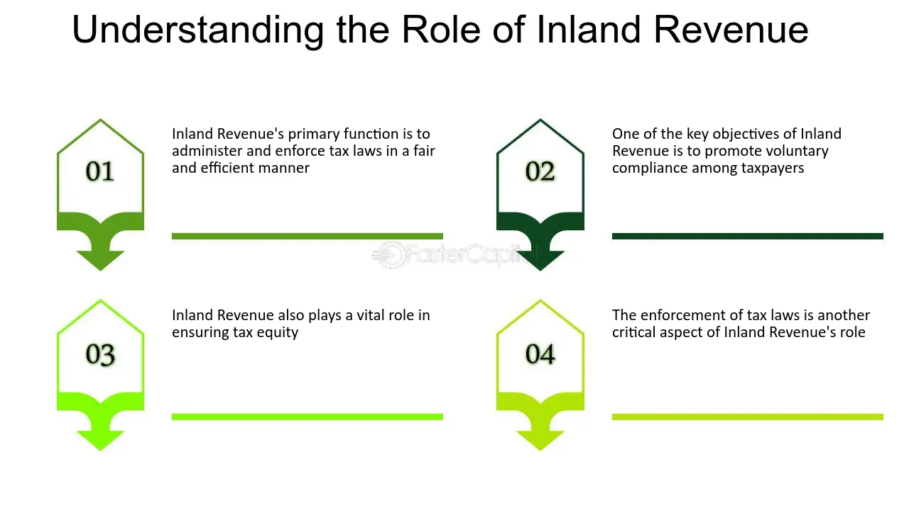

## Table of Contents

## What is Inland Revenue?

Inland Revenue is a term used in some countries to refer to the government department responsible for collecting taxes. It deals with taxes that are paid within the country, like income tax and sales tax. The main job of the Inland Revenue is to make sure that everyone pays the right amount of tax and follows the tax laws.

In some places, like the United Kingdom, the Inland Revenue used to be a separate department but it has now merged with another department to form HM Revenue and Customs (HMRC). This new department handles both inland revenue and customs duties, which are taxes on goods coming into the country. The goal is to make tax collection more efficient and easier to manage.

## What are the primary functions of Inland Revenue?

The main job of the Inland Revenue is to collect taxes from people and businesses within the country. This includes taxes like income tax, which is taken from what people earn, and sales tax, which is added to the price of things people buy. The Inland Revenue makes sure that everyone pays the correct amount of tax by checking tax returns and other financial information.

Another important function of the Inland Revenue is to enforce tax laws. This means they make sure that everyone follows the rules about paying taxes. If someone does not pay their taxes or tries to cheat the system, the Inland Revenue can take action, like fining them or even taking them to court. This helps keep the tax system fair for everyone.

In addition to collecting taxes and enforcing laws, the Inland Revenue also provides help and information to taxpayers. They answer questions about how to fill out tax forms and what taxes need to be paid. This service helps people understand their tax responsibilities and makes it easier for them to comply with tax laws.

## How does Inland Revenue collect taxes?

Inland Revenue collects taxes by making sure people and businesses report their income and pay the right amount of tax. They do this by asking people to fill out tax returns, which are forms where you write down how much money you made and what taxes you owe. Once the tax return is sent in, Inland Revenue checks it to make sure everything is correct. If someone doesn't send in their tax return or if they make a mistake, Inland Revenue can ask them to fix it or pay more tax.

Inland Revenue also collects taxes directly from people's paychecks. This is called withholding tax. When someone gets paid by their employer, a part of their pay is taken out for taxes before they even see it. This makes it easier for people to pay their taxes because it's done automatically. Inland Revenue works with employers to make sure the right amount of tax is taken out of each paycheck.

Sometimes, Inland Revenue collects taxes through audits. An audit is when Inland Revenue takes a closer look at someone's finances to make sure they are paying the right amount of tax. If they find that someone hasn't paid enough, they can ask for the missing tax to be paid. This helps make sure everyone pays their fair share of taxes.

## What types of taxes does Inland Revenue administer?

Inland Revenue is in charge of many different taxes that people and businesses have to pay. One of the main taxes they handle is income tax, which is the tax on the money people earn from their jobs or other sources. They also deal with sales tax, which is added to the price of things people buy. Another important tax they manage is the corporate tax, which is the tax that companies pay on their profits. These are just a few examples, but Inland Revenue covers a wide range of taxes that help the government run the country.

In addition to these, Inland Revenue also administers other types of taxes like property tax, which is based on the value of the property someone owns, and capital gains tax, which is a tax on the profit made from selling something like a house or stocks. They also handle taxes on things like inheritance, which is the money or property someone gets when someone else dies. All these different taxes help make sure that the government has the money it needs to provide services like schools, hospitals, and roads.

## How does Inland Revenue ensure tax compliance?

Inland Revenue makes sure people follow tax rules by checking their tax returns. When someone sends in their tax return, Inland Revenue looks at it to see if everything is correct. If they find a mistake or if someone didn't send in their return at all, they can ask them to fix it or pay more tax. This helps make sure everyone pays what they owe and follows the rules.

Inland Revenue also uses audits to check if people are paying the right amount of tax. An audit is when they take a closer look at someone's money to make sure everything is right. If they find someone hasn't paid enough, they can ask for the missing tax. This helps keep the tax system fair for everyone.

## What are the key operations involved in tax assessment?

When Inland Revenue does a tax assessment, they start by looking at the tax return that someone sends in. The tax return is a form where people write down how much money they made and what taxes they owe. Inland Revenue checks this form to make sure everything is correct. If they find any mistakes or if someone didn't send in their return, they can ask them to fix it or pay more tax. This helps make sure everyone pays what they owe and follows the rules.

Inland Revenue also uses audits as part of the tax assessment process. An audit is when they take a closer look at someone's money to make sure everything is right. They might check bank statements, receipts, and other financial documents. If they find that someone hasn't paid enough tax, they can ask for the missing tax to be paid. This helps keep the tax system fair for everyone and makes sure the government gets the money it needs to provide services like schools and hospitals.

## How does Inland Revenue handle tax disputes and appeals?

When someone disagrees with the tax Inland Revenue says they owe, they can start a dispute. The first step is usually to talk to Inland Revenue and try to sort things out. They might ask for more information or explain why they think the tax is correct. If they can't agree, the person can make a formal appeal. This means they ask a special group, like a tax tribunal, to look at the case and decide who is right.

The tax tribunal is like a court but just for tax issues. They listen to both sides and then make a decision. If the person still disagrees with the tribunal's decision, they can sometimes appeal again to a higher court. This process helps make sure everyone gets a fair chance to argue their case and that the tax rules are followed correctly.

## What role does Inland Revenue play in economic policy?

Inland Revenue plays an important role in helping the government make economic policy. They collect taxes from people and businesses, which gives the government money to spend on things like schools, hospitals, and roads. By deciding how much tax to collect and from whom, Inland Revenue helps shape how the economy works. For example, if they lower taxes for businesses, it might encourage more people to start companies and create jobs.

Inland Revenue also helps the government keep the economy stable. They can change tax rates to control how much money people have to spend. If the economy is growing too fast and prices are going up a lot, Inland Revenue might raise taxes to slow things down. On the other hand, if the economy is not doing well, they might lower taxes to give people more money to spend and help the economy grow. This way, Inland Revenue helps the government manage the economy and make sure it works well for everyone.

## How does Inland Revenue use technology to improve its operations?

Inland Revenue uses technology to make its work easier and faster. They use computers and special software to keep track of all the tax returns people send in. This helps them check the returns quickly and make sure everyone is paying the right amount of tax. They also use the internet to let people file their taxes online, which saves time and paper. This way, people can send in their tax returns from home without having to go to an office.

Inland Revenue also uses technology to talk to people about their taxes. They have websites and apps where people can ask questions and get help with their taxes. This makes it easier for people to understand what they need to do and how to do it. Plus, Inland Revenue uses data analysis to find patterns and catch people who might be trying to cheat the system. This helps them make sure everyone pays their fair share of taxes.

## What are the challenges faced by Inland Revenue in tax administration?

Inland Revenue faces many challenges when trying to collect taxes. One big problem is that some people and businesses might try to hide their money or not report all their income. This makes it hard for Inland Revenue to know how much tax they should be paying. They have to use audits and other checks to find these cases, but it takes a lot of time and effort. Another challenge is keeping up with new ways people make money, like through the internet or cryptocurrencies. These new ways can be hard to track and tax, so Inland Revenue has to keep learning and updating their rules.

Another challenge is dealing with all the different tax laws and rules. These laws can be very complicated, and it's hard to make sure everyone understands them and follows them correctly. Inland Revenue has to explain these rules to people and businesses, and sometimes people still make mistakes or disagree with how the rules are applied. This can lead to disputes and appeals, which take time and resources to handle. Also, Inland Revenue has to use technology to make their work easier, but keeping up with new technology can be expensive and difficult.

## How does Inland Revenue collaborate with other government agencies?

Inland Revenue works closely with other government agencies to make sure everything runs smoothly. They share information with agencies like the customs department to check if people are paying the right amount of taxes on goods they bring into the country. This helps stop people from cheating on their taxes. They also work with the social security office to make sure people get the right benefits and that their taxes are correct. By working together, these agencies can make sure the government has the money it needs and that people get the services they need.

Inland Revenue also teams up with law enforcement agencies to catch people who break tax laws. If they find someone who is not paying their taxes or trying to cheat the system, they can tell the police or other agencies to take action. This helps keep the tax system fair and makes sure everyone follows the rules. By working with other parts of the government, Inland Revenue can do a better job of collecting taxes and making sure everyone pays their fair share.

## What future trends might impact the operations of Inland Revenue?

In the future, technology will play a bigger role in how Inland Revenue works. They might use more [artificial intelligence](/wiki/ai-artificial-intelligence) and [machine learning](/wiki/machine-learning) to check tax returns faster and find people who are not paying the right amount of tax. This could make their work easier and help them catch more tax cheats. Also, as more people use digital money like cryptocurrencies, Inland Revenue will need to find new ways to track and tax these kinds of earnings. They will have to keep up with new technology to make sure they can collect taxes from everyone, no matter how they make or spend their money.

Another trend that could affect Inland Revenue is changes in how people work and earn money. More people might work from home or have jobs that are not traditional, like freelancing or working through apps. This could make it harder for Inland Revenue to know how much tax people should pay. They will need to update their rules and systems to keep up with these changes. Also, as the world becomes more global, Inland Revenue might need to work more with other countries to make sure people pay taxes on money they earn anywhere in the world. This will help them make sure everyone pays their fair share, no matter where they live or work.

## References & Further Reading

[1]: Court, J., & Sumption, M. (2004). ["The UK Tax System: An Introduction."](https://www.cambridge.org/core/journals/cambridge-law-journal/article/abs/judicious-review-the-constitutional-practice-of-the-uk-supreme-court/8EFB30F92A0F837547FE07555941C1EA) Institute for Fiscal Studies.

[2]: Lopez de Prado, M. (2018). ["Advances in Financial Machine Learning."](https://www.amazon.com/Advances-Financial-Machine-Learning-Marcos/dp/1119482089) Wiley.

[3]: Aronson, D. (2006). ["Evidence-Based Technical Analysis: Applying the Scientific Method and Statistical Inference to Trading Signals."](https://www.amazon.com/Evidence-Based-Technical-Analysis-Scientific-Statistical/dp/0470008741) Wiley.

[4]: Jansen, S. (2020). ["Machine Learning for Algorithmic Trading."](https://github.com/stefan-jansen/machine-learning-for-trading) Packt Publishing.

[5]: Chan, E. P. (2009). ["Quantitative Trading: How to Build Your Own Algorithmic Trading Business."](https://github.com/ftvision/quant_trading_echan_book) Wiley.