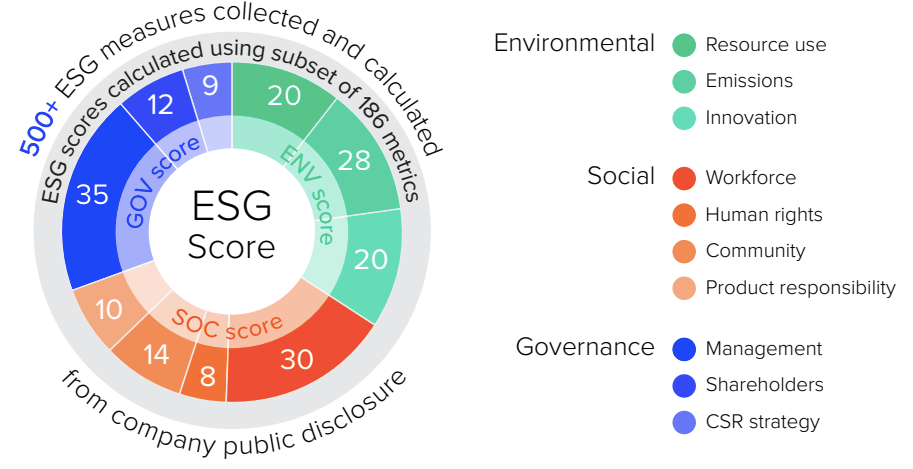

The world of investing is increasingly guided by sustainability considerations, with ESG (Environmental, Social, and Governance) metrics at the forefront of this transformation. ESG metrics offer insights into a company's environmental impact, commitment to social responsibilities, and governance practices. These metrics have become critical in evaluating a company's overall performance and potential for long-term value creation. Beyond traditional financial analysis, ESG considerations allow investors to assess the ethical and sustainable dynamics that could influence business success.

Algorithmic trading—an innovative approach that utilizes computer algorithms to execute trades—has begun to integrate these ESG metrics for more informed decision-making. Algorithmic trading harnesses the power of advanced computing to analyze vast datasets and execute trades at speeds and complexities beyond human capability. By incorporating ESG criteria into these algorithms, traders can identify investment opportunities aligned not only with financial goals but also with sustainable and ethical values. This approach caters to a growing demographic of investors who prioritize socially responsible investing.



This article explores the intersection of sustainability scoring, ESG, and algorithmic trading, showing how these elements redefine investment strategies. As investors increasingly focus on long-term value that includes societal and environmental impact, algorithmic trading models are evolving to incorporate ESG data effectively. This integration signifies a shift towards more holistic investment practices where profitability and ethical considerations are balanced. The growing emphasis on ESG reflects a fundamental change in how investors evaluate risk and opportunity, marking a paradigm shift in the principles guiding market decisions.

## Table of Contents

## Understanding ESG Scoring

ESG scoring involves a comprehensive evaluation of a company's operations across three main domains: environmental stewardship, social responsibility, and governance structures. This scoring system is increasingly pivotal in informing investment decisions, as it provides insights into a company's sustainability practices and potential for long-term value creation.

Environmental criteria consider how a company performs as a steward of the natural environment, examining factors such as energy use, waste management, and carbon emissions. Social responsibility assesses how a company manages relationships with stakeholders, including employees, suppliers, customers, and communities, focusing on aspects like labor practices, product safety, and community engagement. Governance evaluates a company's leadership, executive pay, audits, internal controls, and shareholder rights.

Major financial institutions such as Russell Investments have been at the forefront of developing methodologies to enhance ESG scores, thereby aligning them more closely with financial materiality. These methodologies often involve the integration of quantitative and qualitative data to assess how sustainability issues may impact a company's financial performance. By refining ESG scoring systems, these institutions aim to provide investors with a more accurate and comprehensive view of a company's sustainability profile.

Differentiating companies based on their [ESG](/wiki/esg-investing) scores enables investors to identify potential risks and opportunities. For instance, a company with a lower environmental score might face regulatory risks or increased operational costs due to non-compliance with environmental standards, while a company with strong governance practices may exhibit stability and resilience, making it a potentially more attractive investment. The insights from ESG scores can guide investors towards companies that not only promise financial returns but also demonstrate a commitment to ethical practices and sustainable growth.

## Algorithmic Trading and ESG Integration

Algorithmic trading, a dynamic form of trading that uses computer algorithms to execute trades swiftly, is progressively integrating Environmental, Social, and Governance (ESG) metrics into its strategies. Traditionally driven by quantitative financial data, [algorithmic trading](/wiki/algorithmic-trading) is now evolving to incorporate qualitative ESG data, thereby aligning with the growing market interest in sustainable investments. This integration allows algorithmic trading systems to identify and invest in companies that not only offer financial returns but also adhere to sustainable and ethical practices.

By incorporating ESG data, algorithmic trading systems can automate the selection of investments in a manner that appeals to socially responsible investors. These systems analyze vast datasets, including ESG metrics, to identify potential trading opportunities in companies with strong sustainability profiles. For instance, ESG-driven pairs trading algorithms are being developed to find pairs of stocks that not only have a statistical [arbitrage](/wiki/arbitrage) opportunity but also meet certain ESG criteria. 

Pairs trading is a type of [statistical arbitrage](/wiki/statistical-arbitrage) where two correlated stocks are traded based on their mean-reversion behavior. A basic pairs trading strategy involves identifying two historically correlated stocks, monitoring their price movements, and executing trades when their prices diverge significantly, expecting them to revert to their mean. When ESG metrics are integrated into these models, the selection process not only accounts for financial metrics but also evaluates the ESG performance of the companies involved. This ensures that the trades align with sustainability goals, potentially enhancing their appeal to investors focused on ethical and sustainable practices.

A potential algorithm for ESG-driven pairs trading could involve the following steps:

1. **Identify Eligible Stocks**: Select stocks with high ESG scores using a standardized ESG scoring system.
2. **Correlation Analysis**: Assess the historical price correlation of selected ESG-compliant stocks.
3. **Signal Generation**: Generate trading signals based on significant divergences from historical price ratios or spreads.
4. **Execution**: Execute trades when the stocks diverge beyond a certain threshold, anticipating convergence.
5. **Risk Management**: Monitor ESG changes and re-assess pair eligibility periodically to address any ESG rating changes. 

Enhanced with ESG insights, algorithmic trading stands to provide a dual advantage of financial profitability and adherence to responsible investing principles, thus catering to the increasing demand for investments that contribute positively to society.

## Innovative Approaches to ESG in Trading Algorithms

New research and tools have significantly advanced the integration of ESG (Environmental, Social, and Governance) into trading algorithms, making these sustainability considerations more actionable for investors. Notably, organizations like Sustainalytics have been at the forefront of this movement, offering robust tools for assessing and scoring ESG metrics. These scores are critical for investors looking to understand a company's sustainability posture and identify potential risks and opportunities in their portfolios.

A major innovative approach involves utilizing natural language processing models such as BERT (Bidirectional Encoder Representations from Transformers) to predict ESG scores. These sophisticated models excel at processing and interpreting large volumes of text data, such as the sustainability reports that companies produce. By analyzing this unstructured data, [machine learning](/wiki/machine-learning) frameworks can generate ESG scores with greater precision and relevance.

The integration of machine learning in ESG scoring works as follows: First, sustainability reports are collected and preprocessed. This data is then fed into a BERT-based model that has been fine-tuned to detect ESG-related content and score it according to various performance metrics. The predictive capability of these models allows for more nuanced assessments of a company's ESG standing, facilitating informed decision-making processes for investors and traders.

For example, a basic implementation of using BERT for ESG score predictions could involve the following steps in Python:

```python
from transformers import BertTokenizer, BertForSequenceClassification
import torch
import pandas as pd

# Load pre-trained BERT model and tokenizer
tokenizer = BertTokenizer.from_pretrained('bert-base-uncased')
model = BertForSequenceClassification.from_pretrained('bert-base-uncased', num_labels=3)

# Example function to predict ESG score
def predict_esg_score(text):
    inputs = tokenizer(text, return_tensors="pt", truncation=True, padding=True, max_length=512)
    outputs = model(**inputs)
    scores = torch.nn.functional.softmax(outputs.logits, dim=1)
    return scores.detach().numpy()

# Sample sustainability report text
report = "The company has reduced its carbon emissions by 20% over the past year."
esg_score = predict_esg_score(report)
print("ESG Score:", esg_score)
```

Advancements such as these underpin the critical role of technology in transforming ESG data from static reports into dynamic inputs for algorithmic trading. Machine learning enables a detailed and scalable analysis of sustainability factors, which can be integrated directly into trading algorithms. Consequently, investors can tailor their strategies not only for financial returns but also for social responsibility.

The growing sophistication of these tools and methodologies points to a future where ESG scores are increasingly influential in guiding investment strategies. With the continuous development of AI and machine learning capabilities, the precision of ESG data interpretation and integration into trading algorithms is expected to improve, offering more compelling insights and sustainable investment opportunities.

## Case Study: ESG Algorithmic Trading in the Indian Market

A recent study conducted by Indian researchers highlights the innovative application of an ESG-driven pairs trading algorithm within the Indian market. The strategy involves selecting pairs of correlated stocks and executing trades based on the relative performance of these pairs with respect to ESG principles. By doing so, the approach not only aims for financial profitability but simultaneously integrates environmental, social, and governance criteria.

The core concept of pairs trading consists of identifying two stocks, say $A$ and $B$, that have historically moved together. When the price of $A$ diverges from its usual correlation with $B$, the algorithm triggers trades: buying the underperforming stock and shorting the outperforming one, anticipating convergence. The ESG-driven strategy adds an additional layer by selecting pairs that meet certain ESG criteria, thus embedding ethical considerations into the trading process.

Back-testing performed on historical data in the Indian market has shown promising results. The algorithm demonstrated superior performance by aligning ESG compliance with financial metrics, suggesting that ESG factors can be harmonized with traditional financial goals. These positive outcomes underscore the feasibility and advantage of incorporating sustainability measures within trading algorithms.

This integration reflects the dual focus on maximizing financial returns while supporting socially responsible investing. It exemplifies a growing trend among market participants who seek to ensure their investment strategies align with broader societal values, confirming ESG's increasing relevance in the evolving landscape of the financial markets.

## Challenges and Future Prospects

The integration of Environmental, Social, and Governance (ESG) metrics into algorithmic trading presents several challenges and prospects, both of which are pivotal to understanding the future trajectory of sustainable investment strategies. One of the primary challenges is the need for standardized data. The current landscape of ESG data is fragmented, with varying metrics and reporting standards across different regions and industries. This inconsistency makes it difficult for traders to assess ESG performance reliably and develop universally applicable trading algorithms. The absence of a unified standard also hampers comparability between companies, which is essential for informed investment decisions.

To address these challenges, there is a critical need for refined scoring methodologies. Companies such as MSCI and Sustainalytics offer ESG ratings, but the absence of a universally accepted framework leads to discrepancies in scores. Efforts to standardize these methodologies are underway by organizations such as the Sustainability Accounting Standards Board (SASB) and the Task Force on Climate-related Financial Disclosures (TCFD). Standardization is expected to enhance data reliability and facilitate the incorporation of ESG factors into quantitative models used in algorithmic trading.

As technology advances, the accuracy and relevance of ESG scores in trading strategies are anticipated to improve. Machine learning and [artificial intelligence](/wiki/ai-artificial-intelligence) are at the forefront of this evolution, enabling the analysis of large datasets to extract actionable insights. These technologies can identify patterns and correlations that may not be apparent through traditional analysis, enhancing the predictive power of trading algorithms integrated with ESG factors.

Moreover, the growing demand for transparency and accountability in corporate practices is influencing the future landscape of ESG algorithmic trading. Investors and stakeholders are increasingly seeking assurance that investments align with ethical and sustainable practices. This demand is accelerating the push for companies to disclose ESG information more comprehensively and to be held accountable for their scores. Regulators and industry bodies are likely to play a crucial role in enforcing these disclosures, which will further integrate ESG considerations into global investment practices.

Overall, the future of ESG algorithmic trading is promising, with the potential to balance profitability with ethical investing. However, it hinges on overcoming the current challenges of data standardization and methodological refinement. As these hurdles are addressed, ESG metrics will become an integral part of the decision-making processes within algorithmic trading systems.

## Conclusion

Sustainability scoring and ESG integration in algorithmic trading exemplify a significant shift in how investment practices are structured. This transformation is driven by an increasing recognition among investors of the importance of long-term value creation that encompasses both financial returns and societal impact. The emphasis on ESG metrics encourages a holistic approach to investing, where ethical considerations are just as crucial as the pursuit of profit. 

In this evolving landscape, ESG metrics are becoming indispensable components of the algorithmic trading toolkit. By quantifying aspects like environmental stewardship, corporate governance, and social responsibility, these metrics offer a comprehensive picture that aids in making informed investment decisions. As technology advances, the precision and relevance of ESG data are anticipated to enhance, providing investors with tools that align their financial goals with ethical standards.

Ultimately, the future of investing is being redefined by an intrinsic need to balance profitability with ethical principles. As transparency and accountability continue to gain prominence, ESG integration will likely become a fundamental element in shaping strategies that not only seek financial gain but also contribute positively to society. This approach positions investors to not only see immediate returns but also partake in fostering sustainable economic growth.

## References & Further Reading

[1]: Bergstra, J., Bardenet, R., Bengio, Y., & Kégl, B. (2011). ["Algorithms for Hyper-Parameter Optimization."](https://dl.acm.org/doi/10.5555/2986459.2986743) Advances in Neural Information Processing Systems 24.

[2]: Sustainalytics. ["ESG Risk Ratings."](https://www.sustainalytics.com/esg-ratings) A trusted resource for assessing company-level ESG performance.

[3]: MSCI. ["ESG Ratings."](https://www.msci.com/web/msci/esg-ratings) Offers data and tools for integrating ESG into investment strategies.

[4]: Sustainability Accounting Standards Board (SASB). ["Standards & Guidance."](https://sasb.ifrs.org/standards/download/) Provides a framework for disclosure of sustainability information.

[5]: ["Advances in Financial Machine Learning"](https://www.amazon.com/Advances-Financial-Machine-Learning-Marcos/dp/1119482089) by Marcos Lopez de Prado, a comprehensive guide on applying machine learning to financial data.

[6]: Task Force on Climate-related Financial Disclosures (TCFD). ["Final Report: Recommendations of the Task Force on Climate-related Financial Disclosures."](https://www.fsb-tcfd.org/recommendations/) Offers guidelines for reporting climate-related financial risks.