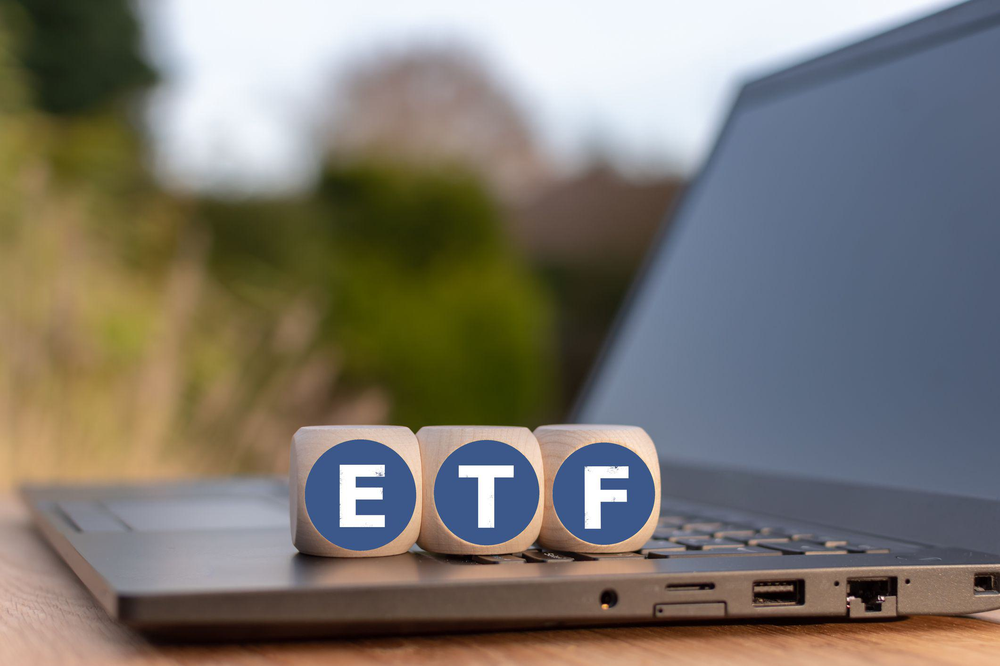

The landscape of investing has undergone profound transformations with the infusion of technological advancements, providing investors numerous tools and platforms to refine their trading methodologies. Central to this evolution are Exchange-Traded Funds (ETFs) and algorithmic trading, both of which have become vital constituents of modern investment strategies.

ETFs serve as a vehicle for investors, offering a diversified and often cost-effective approach to engaging with a broad spectrum of asset classes. By replicating the performance of indices, commodities, or bonds, ETFs allow for the consolidation of various assets under a singular tradeable instrument. This feature not only facilitates ease of access but also infuses the investment process with transparency, liquidity, and reduced fees. Consequently, both individual and institutional investors have gravitated towards ETFs, contributing to their significant growth in the financial markets.



Algorithmic trading, or algo trading, employs intricate algorithms to automate and execute trades. This automation elevates trading by minimizing human intervention, thus alleviating biases while enhancing speed and efficiency. As technology rapidly progresses, the capacity for algorithmic trading systems to process voluminous data sets instantaneously and execute sizable orders becomes increasingly invaluable. These attributes underscore algo trading’s pivotal role in achieving superior pricing strategies and mitigating market impact.

This article examines the intersection of investing in ETFs and the utilization of algorithmic trading within online trading platforms, highlighting how such integration can streamline investment processes and optimize returns. The synergy between these two facets represents a paradigm shift in trading, promising an innovative and efficient future for investors worldwide.

## Table of Contents

## Understanding ETFs

Exchange-Traded Funds (ETFs) represent a type of investment fund and exchange-traded product, meaning they are traded on stock exchanges much like stocks. ETFs are composed of a basket of assets such as stocks, bonds, or commodities, and are designed to track the performance of a specific index, sector, commodity, or asset class. This index-tracking feature allows investors to gain exposure to a particular market or investment strategy without the need to purchase individual assets.

One of the primary advantages of ETFs is transparency. They are required to regularly disclose their holdings, unlike mutual funds which may only do so quarterly. This transparency allows investors to have a clear understanding of the asset composition within the ETF at any given time. Furthermore, ETFs typically offer high liquidity; they can be bought and sold on the stock exchange throughout the trading day at market prices, allowing investors to enter and exit positions with relative ease.

Another key benefit of ETFs is their cost-effectiveness. ETFs often have lower expense ratios than mutual funds, as they are generally passively managed and aim to replicate the performance of an index rather than seeking to outperform it through active management. This low-cost structure makes ETFs a favorable option for cost-conscious investors.

The [ETF](/wiki/etf-trading-strategies) market has experienced significant growth over the years, evolving from a product that primarily tracked major indices in developed markets to one that provides exposure to various investment strategies, sectors, and regions. Investors can now choose from a wide array of ETFs, including those that focus on specific sectors such as technology, healthcare, energy, or financial services. There are also thematic ETFs that capitalize on emerging trends or demographic shifts like clean energy or aging populations.

In addition, the growing range of bond ETFs enables investors to access fixed income exposure across different durations, credit qualities, and geographies, while commodity ETFs offer a way to invest in physical resources such as gold, oil, or agricultural products without the complexities of direct ownership.

In summary, ETFs offer a versatile investment option by providing cost-effectiveness, [liquidity](/wiki/liquidity-risk-premium), and transparency. Their adaptive nature and the exponential growth in options available have solidified their prominence within modern investment portfolios, attracting both individual and institutional investors.

## The Rise of Algo Trading

Algorithmic trading has grown substantially, transforming the landscape of financial markets. Its rise is closely linked to technological advancements that have made it possible to execute trades on an unprecedented scale, with speed and precision. The core of [algorithmic trading](/wiki/algorithmic-trading), commonly known as algo trading, hinges on the use of computer algorithms to initiate trading actions based on a set of predefined rules and strategies. This approach allows for the minimization of human intervention, reducing emotional biases that can affect decision-making processes during volatile market conditions.

One of the primary advantages of algo trading is its capacity to process vast amounts of data swiftly. Traditional trading processes, reliant on manual inputs and analyses, are time-consuming and susceptible to human error. In contrast, algorithms can quickly parse through historical data, price fluctuations, and market trends to identify profitable trading opportunities. This computational power allows traders to manage significant volumes of transactions efficiently, often executing thousands of trades within milliseconds.

The effectiveness of algorithmic trading can be enhanced through [backtesting](/wiki/backtesting), where trading strategies are evaluated against historical data to estimate their performance. An example Python code snippet for a basic backtesting framework might look like this:

```python
import pandas as pd

def backtest_strategy(data, strategy):
    # apply strategy to historical data
    results = strategy(data)
    return results

# Sample data: Date, Open, High, Low, Close
data = pd.DataFrame({
    'Date': pd.date_range(start='2023-01-01', periods=10, freq='D'),
    'Open': [100, 102, 105, 107, 110, 108, 111, 115, 117, 119],
    'High': [102, 106, 109, 111, 113, 112, 118, 121, 122, 123],
    'Low': [99, 101, 104, 106, 109, 107, 110, 114, 116, 118],
    'Close': [101, 105, 108, 110, 112, 110, 117, 120, 121, 122]
})

def example_strategy(data):
    data['Signal'] = 0
    data.loc[data['Close'] > data['Open'], 'Signal'] = 1  # Buy signal
    data.loc[data['Close'] < data['Open'], 'Signal'] = -1 # Sell signal
    return data['Signal']

results = backtest_strategy(data, example_strategy)
print(results)
```

Algorithmic trading also excels in executing large orders without significantly impacting the market. The ability to split large trades into smaller orders helps maintain market stability and minimize price movements that could be detrimental if a significant transaction were executed all at once.

Despite its advantages, algorithmic trading comes with challenges, particularly in terms of technological and operational risks. Bugs in algorithms or unpredictable market behavior can lead to substantial financial losses. As such, the development and monitoring of trading algorithms demand expertise and continual refinement to adapt to the ever-evolving market landscape. Nonetheless, its rise signifies a new era in trading where automation and data-driven decision-making are at the forefront of investment strategies.

## Benefits of Combining ETFs and Algo Trading

Combining Exchange-Traded Funds (ETFs) with algorithmic trading offers several advantages that enhance investment strategies and improve portfolio performance. By integrating these two components, investors can implement a structured approach that optimally balances risk and return.

Algorithmic trading can significantly enhance the efficiency of executing ETF trades. Through automated processes, trading algorithms can determine the optimal timing for buying or selling, based on real-time market data and pre-defined strategies. This helps in securing better pricing and minimizing the adverse effects of market [volatility](/wiki/volatility-trading-strategies). For example, algorithms can be programmed to execute trades during periods of low bid-ask spreads, thereby reducing transaction costs.

Moreover, the adaptability of algorithmic trading allows investors to customize their strategies to align with specific financial objectives. Investors can design algorithms to focus on maximizing returns by identifying and capitalizing on short-term market inefficiencies. Additionally, strategies can be tailored to minimize taxes, for instance, by implementing tax-loss harvesting, which involves selling losing positions to offset capital gains taxes.

One of the key benefits of using algorithmic trading with ETFs is its capacity to analyze large datasets and execute trades in milliseconds, a speed unattainable by human traders. This rapid execution is crucial in volatile markets where price movements can quickly affect trading outcomes. Algorithms can continuously monitor market conditions and adjust ETF positions promptly to mitigate risks associated with sudden price changes.

Furthermore, algo trading facilitates risk management by enforcing disciplined, rule-based trading that eliminates emotional biases. Investors have the ability to backtest their strategies against historical data to evaluate potential outcomes and refine their approaches before deploying them with actual capital.

In summary, the integration of ETFs and algorithmic trading enables investors to enhance trade execution, customize investment strategies, and manage risks more effectively, offering a comprehensive method to achieve financial goals in the dynamic landscape of financial markets.

## Choosing the Right Online Trading Platforms

Selecting a suitable online trading platform is a critical step for investors looking to leverage Exchange-Traded Funds (ETFs) and algorithmic trading strategies effectively. An appropriate platform offers a seamless trading experience while providing the necessary tools and support to optimize investment decisions.

One of the foremost considerations when choosing a trading platform is the fee structure. Platform fees can significantly impact net returns, especially for active traders who execute frequent trades. Thus, it is essential to evaluate transaction fees, account maintenance charges, and any hidden costs that might arise. Comparing these expenses across different platforms ensures that investors select one that aligns with their trading frequency and budgetary constraints.

The range of investment options is another crucial [factor](/wiki/factor-investing). A versatile platform should offer a broad spectrum of ETFs, covering various asset classes, sectors, and geographical regions. This diversity enables investors to construct well-rounded portfolios and tap into niche markets for potentially higher returns.

Ease of use is paramount, particularly for those new to online trading. The platform should have an intuitive interface, with straightforward navigation and clear instructions for placing trades. Advanced platforms might also include educational resources, tutorials, and demo accounts to help beginners familiarize themselves with the trading environment without financial risk.

Quality customer support can differentiate a good platform from a mediocre one. Accessible, knowledgeable, and responsive customer service is vital, especially when technical issues or trading uncertainties arise. Many platforms offer support through various channels, such as phone calls, live chat, or email, ensuring that investors can resolve concerns promptly.

For those incorporating algorithmic trading strategies, robust trading features are essential. These features include advanced order types, real-time data feeds, and high-speed execution capabilities. Most importantly, platforms should provide algorithmic trading tools that support backtesting and strategy customization. Backtesting involves running trading strategies against historical data to evaluate their performance before deployment. For example, the following Python pseudocode demonstrates a simplified backtesting logic:

```python
def backtest_strategy(strategy, historical_data):
    results = []
    for data in historical_data:
        result = strategy(data)
        results.append(result)
    return analyze_results(results)

def example_strategy(data):
    # Implement trading logic using available data
    return execute_trade_logic(data)

# Historical data example and usage
historical_market_data = load_historical_data("market_data_source")
strategy_results = backtest_strategy(example_strategy, historical_market_data)
print(strategy_results)
```

Customizable trading strategies allow investors to tailor their algorithms to specific investment goals or market conditions. These customizations might include adjusting risk parameters, incorporating technical indicators, or modifying rebalancing frequencies.

In summary, choosing the right online trading platform requires careful consideration of fees, investment options, usability, customer support, and the adequacy of algorithmic trading tools. By assessing these factors, investors can identify platforms that enhance their ETF and algorithmic trading pursuits, thereby achieving their broader financial objectives.

## Risks and Challenges

Exchange-Traded Funds (ETFs) and algorithmic trading have transformed the investment landscape by offering numerous advantages such as diversification and automation. However, these technologies are not without their risks and challenges, which can significantly impact financial outcomes.

Market volatility is one of the primary risks associated with ETFs and algorithmic trading. ETFs, while providing diversified exposure, are still subject to market fluctuations that can affect their value. During periods of high volatility, the price of an ETF can deviate from its net asset value, leading to potential losses for investors. In algorithmic trading, rapid market movements can trigger unanticipated trading decisions by automated systems, exacerbating losses if the algorithms are not designed to handle such volatility effectively.

Algorithm errors also pose a considerable threat. These can arise from coding mistakes, incorrect data inputs, or flawed strategy logic, leading to erratic trading behavior or substantial financial losses. For instance, a minor error in an algorithm's logic could execute trades at unintended prices or volumes, potentially causing cascading effects on an investor’s portfolio. Ensuring that algorithms are thoroughly tested and monitored is crucial to mitigating these risks. 

Technology failures are another significant challenge. These can include server outages, network disruptions, or hardware malfunctions, which can prevent timely execution of trades or lead to execution at unfavorable prices. Such failures highlight the need for robust technical infrastructure and contingency plans to ensure continuity of trading operations.

To navigate these challenges, investors must stay informed about market trends and continuously update their trading strategies. This involves not only keeping abreast of economic developments and geopolitical events but also understanding how these factors may impact asset prices and trading algorithms. Adapting strategies to incorporate new data or insights can help mitigate potential risks.

Additionally, investors should implement rigorous testing and validation processes for their algorithms. This may include backtesting strategies using historical data to understand how they would have performed under various market conditions, as well as running simulations to identify potential vulnerabilities.

Ultimately, while ETFs and algorithmic trading offer promising opportunities, investors must remain vigilant and proactive in managing the associated risks. By doing so, they can better safeguard their investments and enhance their participation in the dynamic world of financial markets.

## Conclusion

Investing in Exchange-Traded Funds (ETFs) and employing algorithmic trading strategies offer considerable potential for investors aiming to navigate the complexities of contemporary financial markets effectively. The combination of the diverse and cost-effective nature of ETFs and the efficiency of algorithmic trading presents a significant opportunity to optimize investment portfolios.

Careful selection of trading platforms and strategies is essential for investors to realize these benefits. A robust platform not only provides access to a broad range of ETF options but also equips investors with essential tools like backtesting and customizable algorithmic trading capabilities. These features enable investors to execute well-timed trades while mitigating risks associated with market volatility and sudden price fluctuations.

Moreover, the dynamic nature of financial markets necessitates continuous learning and adaptation. Staying informed about technological advancements, evolving market trends, and regulatory changes is critical. Investors must be prepared to refine and adjust their strategies to sustain and enhance portfolio performance over time.

In conclusion, the strategic integration of ETFs and algorithmic trading into investment practices can significantly bolster financial outcomes for investors. By making informed decisions about the choice of platforms and continuously updating their knowledge and approach, investors can effectively pursue and achieve their financial goals in the ever-changing landscape of online trading and investments.

## References & Further Reading

[1]: ["Algorithms for Hyper-Parameter Optimization"](https://dl.acm.org/doi/10.5555/2986459.2986743) by Bergstra, J., Bardenet, R., Bengio, Y., & Kégl, B. (2011), Advances in Neural Information Processing Systems 24.

[2]: ["Advances in Financial Machine Learning"](https://www.amazon.com/Advances-Financial-Machine-Learning-Marcos/dp/1119482089) by Marcos Lopez de Prado

[3]: ["Evidence-Based Technical Analysis: Applying the Scientific Method and Statistical Inference to Trading Signals"](https://www.amazon.com/Evidence-Based-Technical-Analysis-Scientific-Statistical/dp/0470008741) by David Aronson

[4]: ["Machine Learning for Algorithmic Trading"](https://github.com/stefan-jansen/machine-learning-for-trading) by Stefan Jansen

[5]: ["Quantitative Trading: How to Build Your Own Algorithmic Trading Business"](https://www.amazon.com/Quantitative-Trading-Build-Algorithmic-Business/dp/1119800064) by Ernest P. Chan