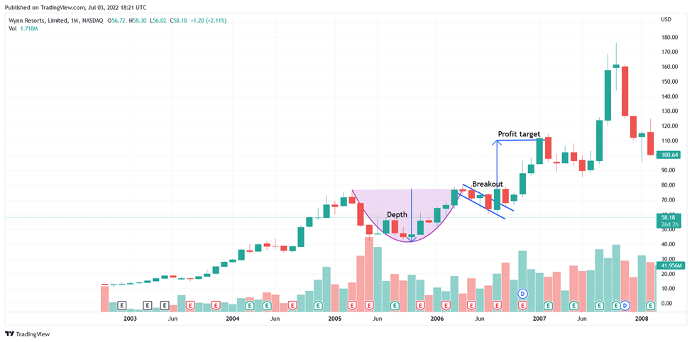

Stock trading has undergone significant evolution over the years, transforming from physical exchanges where trading was executed manually, to modern electronic and automated systems. Initially, stock trading involved the exchange of financial instruments based on direct human interaction or through communications sent wire via telegraph. The advent of digital technology in the late 20th century brought about a shift towards electronic trading platforms, which facilitated greater accessibility, efficiency, and speed. 

At the core of successful stock trading lies the implementation of robust trading strategies. These strategies can vary greatly, incorporating fundamental analysis, where traders evaluate a company's financial health and potential for growth, or technical analysis, which involves analyzing statistical trends from trading activity, such as price movement and volume. The latter approach often involves the use of technical patterns, which are graphic representations of past price movements, believed to forecast future movement.



A significant development in the field is algorithmic trading, which is the process of using computer algorithms to automatically make trading decisions and execute orders in financial markets. Algorithmic trading has gained increasing prominence, due in part to its capability to analyze large datasets, execute trades at optimal speeds, and remove human emotion from trading decisions. This form of trading utilizes pre-programmed instructions that can include timing, price, and volume to maximize efficiencies and enhance trading profitability.

Technical patterns play a crucial role in informing algorithmic trading strategies. Among such patterns is the Cup and Handle pattern, identified by a U-shaped cup followed by a small consolidation period resembling a handle. This pattern is often seen as a bullish continuation signal, suggesting an upward price movement post-formation.

The primary aim of this article is to examine how traders can integrate the Cup and Handle pattern into algorithmic trading strategies. This integration aims to harness the predictive power of technical patterns and pair it with the automation and precision of algorithmic trading. Readers can expect to learn about the mechanics of algorithmic trading, the identification and significance of the Cup and Handle pattern, and how these elements can be effectively combined to potentially enhance trading performance. Moreover, the article will cover aspects such as risk management, backtesting, and optimization, providing a holistic view of trading with pattern-based algorithmic strategies.

## Table of Contents

## Understanding the Cup and Handle Pattern

The Cup and Handle pattern is a widely recognized technical chart pattern in stock trading, named for its visual appearance that resembles a tea cup with a handle. This pattern was popularized by stock trader and author William J. O'Neil in his book "How to Make Money in Stocks," and it has since been a staple in technical analysis.

### Definition and Historical Background

The Cup and Handle pattern typically occurs in the context of a bullish continuation pattern and is characterized by two distinct phases: the "cup" and the "handle." The cup is formed when a stock experiences a rounded, U-shaped price decline and recovery, creating a bowl-like formation. This phase signifies a period where the market tests a support level, bounces back, and returns to its previous high. The handle, which follows the cup, is a smaller price consolidation period that drifts slightly downward or moves sideways, resembling a flag or pennant. The handle indicates a brief period of profit-taking or consolidation before the stock potentially breaks out to new highs.

### How to Identify the Pattern

Identifying the Cup and Handle pattern involves recognizing several key characteristics:

1. **Cup Formation**: The cup should have a U-shape, ideally exhibiting symmetry and taking approximately 1 to 6 months to form. A shorter duration may indicate a weaker pattern. The depth of the cup should retrace between one-third to two-thirds of the previous advance.

2. **Handle Formation**: The handle usually forms on the right side of the cup and should take a few days to several weeks. It typically retraces no more than one-third of the cup's advance. Ideally, the handle should exhibit decreasing volume.

3. **Breakout Point**: The breakout above the handle's resistance level is a critical confirmation of the pattern, often on increased trading volume. This is typically viewed as a potential buy signal.

### Technical Significance

The Cup and Handle pattern is popular among traders due to its potential to signify a bullish [breakout](/wiki/breakout-trading). The rounded bottom of the cup indicates buyer accumulation, while the handle suggests a pause or minor profit-taking phase before the continuation of the bullish trend. Traders often interpret the pattern as a cue for an impending upward trend, making it a tool for predicting price advances.

### Statistical Performance in Various Market Conditions

While the Cup and Handle pattern is generally regarded as a bullish signal, its performance can vary based on market conditions. Studies and empirical analyses suggest that it tends to perform better during a strong bullish market, where buying pressure is prevalent. In contrast, in a bearish or volatile market, the pattern may yield mixed results, as external factors could overshadow the pattern's predictive power.

### Common Misconceptions or Challenges

Despite its popularity, traders can face challenges in identifying the Cup and Handle pattern accurately. Common misconceptions include confusing it with other similar patterns, such as the rounded bottom without a handle. Misidentifying the handle's formation can also lead to premature actions. Moreover, a properly formed handle is crucial, and a lack of sufficient consolidation during this phase can lead to false breakouts.

In conclusion, the Cup and Handle pattern remains a salient tool in technical analysis, offering traders insight into potential bullish market movements when identified and applied correctly. However, the accuracy of this pattern can be enhanced through careful examination within the context of prevailing market trends and conditions.

## Basics of Algorithmic Trading

Algorithmic trading, also known as algo trading, refers to the use of computer algorithms to execute trading orders on financial markets. These algorithms are designed to make trading decisions at speeds and frequencies that are beyond human capabilities. The primary goal is to automate and optimize trading by executing orders more efficiently and at the best possible prices. 

Algo trading works by following a set of predefined instructions, which can include timing, price, quantity, or any mathematical model. These instructions determine when an order is placed and how it is executed. For instance, a simple algorithm might be designed to buy a stock when its 50-day moving average exceeds its 200-day moving average. 

There are several types of algo trading strategies, each with specific applications:

1. **Trend-following Strategies**: These algorithms identify trends in market prices and execute trades designed to benefit from these trends. Moving averages and channel breakouts are commonly used techniques.

2. **Arbitrage Opportunities**: These strategies exploit price discrepancies of the same asset in different markets to make risk-free profits.

3. **Market-making**: Algorithms are used to provide liquidity by continuously quoting bid and ask prices and profiting from the spread.

4. **Mean Reversion**: Rooted in the assumption that prices will return to their average, these strategies seek to capitalize on deviations from historical price levels.

5. **Statistical Arbitrage**: These involve a range of statistical techniques to identify profitable trading opportunities based on the historical emergence of correlations between asset prices.

Algorithmic trading offers several advantages in modern financial markets. These include increased speed and efficiency in trade execution, reduced transaction costs due to optimized timing and reduced market impact, and the ability to backtest strategies using historical data to evaluate performance. Moreover, algo trading eliminates emotional biases in trading, allowing for disciplined execution of trading strategies.

The key components of [algorithmic trading](/wiki/algorithmic-trading) systems include:

- **Data Analysis**: The process of collecting, cleaning, and analyzing large volumes of real-time and historical market data is fundamental. This data drives decision-making in the algorithm.

- **Signals**: Indicators or combinations of indicators that trigger buy or sell actions based on predefined conditions.

- **Execution Algorithms**: These are designed to determine the optimal way to enter or exit positions, often using tactics to minimize market impact and maximize execution efficiency.

Despite its advantages, algorithmic trading poses several challenges and considerations. Technological infrastructure is critical; delays in data feeds or execution due to technological failures can result in significant financial losses. There are also substantial costs related to the development and maintenance of these systems. 

Moreover, the risks associated with algo trading should not be underestimated. Algorithms may perform unpredictably in unforeseen market conditions, contributing to increased market [volatility](/wiki/volatility-trading-strategies), as seen during the "Flash Crash" of 2010. Regulatory scrutiny is intense, requiring traders to adhere strictly to compliance standards.

In summary, while algorithmic trading automates processes and potentially increases profits, it also requires a careful balance of strategy development, risk management, and technological investment to overcome its inherent barriers and capitalize on its benefits.

## Integrating the Cup and Handle Pattern into Algo Trading

Integrating the Cup and Handle pattern into algorithmic trading involves several technical steps and considerations. This process enhances the precision and efficiency of trading strategies.

### Step-by-step Guide on Coding the Cup and Handle Pattern Recognition

The Cup and Handle pattern can be identified algorithmically by examining historical price data for specific characteristics. Here is a simplified Python-based guide to recognize this pattern:

1. **Data Collection:** Obtain historical price data for the security of interest. This data typically includes daily open, high, low, and close prices.

2. **Smoothing the Data:** Use moving averages to smooth out price fluctuations and highlight potential patterns. For example:
   ```python
   import pandas as pd

   data['smoothed'] = data['close'].rolling(window=50).mean()
   ```

3. **Identifying the Cup:** The Cup part of the pattern is recognized by a 'U' shape in the price data. Identify this using conditions that check for a period of declining prices followed by a rise.

4. **Recognizing the Handle:** Following the Cup, the Handle is a short-term consolidation or slight decline in prices. Use logic to find this formation:
   ```python
   def identify_cup_and_handle(data):
       for i in range(len(data) - 10):
           cup = data['smoothed'][i:i+10].min()  # Simplified logic to locate a cup
           handle = data['smoothed'][i+10:i+15].max()  # Simplified logic to detect handle
           if data['smoothed'][i] > cup and handle < cup:
               print(f"Cup and Handle pattern starting at index {i}")
   ```

### Backtesting: Importance of Testing the Pattern’s Effectiveness

Backtesting uses historical data to evaluate the performance of a trading strategy. It's a critical step for assessing the Cup and Handle pattern's effectiveness in real-market conditions. This involves simulating trades using historical data:
```python
def backtest_strategy(data):
    # Implement the strategy logic and evaluate its performance
    buy_signals = identify_cup_and_handle(data)
    results = []
    for signal in buy_signals:
        # Hypothetical buy at 'signal' point and sell after a certain condition
        buy_price = data['close'][signal]
        sell_price = data['close'][signal + 10]
        profit = sell_price - buy_price
        results.append(profit)
    return results
```

### Machine Learning Applications

Machine learning can enhance pattern detection. Techniques such as supervised learning allow models to learn from labeled data to improve identification accuracy. For instance, training a [neural network](/wiki/neural-network) with input features derived from historical data can refine signal detection.

### Using Trading Bots to Automate Strategies

Trading bots execute trades automatically based on pre-defined algorithms. To implement this for the Cup and Handle pattern, you connect the detection logic to a trading platform API. This automates actions like placing buy and sell orders when the pattern is detected and certain conditions are met.

### Examples of Successful Integrations and Case Studies

Successful integration of the Cup and Handle pattern with algorithmic strategies includes case studies where trading firms utilized these algorithms to achieve significant returns. In such scenarios, firms used historical pattern performance data and continuous learning algorithms to refine the strategy, leading to better prediction accuracy and trading results over time. 

In conclusion, integrating the Cup and Handle pattern into algorithmic trading involves both precise pattern recognition and robust testing. New technologies, particularly [machine learning](/wiki/machine-learning), offer enhanced accuracy and adaptability, making these strategies incredibly compelling for modern traders.

## Risk Management and Optimization Strategies

Effective risk management and optimization are critical components when trading with patterns using algorithms. With the increasing complexity of financial markets and the popularity of algorithmic trading, it is essential to develop strategies that not only capitalize on opportunities but also protect against potential losses.

**Key Risk Management Techniques**

When trading with algorithms that incorporate patterns like the Cup and Handle, it is crucial to implement robust risk management techniques:

1. **Position Sizing**: Determining the appropriate amount of capital to allocate to each trade based on the risk-to-reward ratio. A common method is the Kelly Criterion, which helps optimize the growth of capital by sizing positions according to:
$$
   f^* = \frac{bp - q}{b}

$$

   where $f^*$ is the fraction of the capital to wager, $b$ is the odds received on the wager, $p$ is the probability of winning, and $q$ is the probability of losing.

2. **Stop-Loss and Take-Profit Levels**: Setting predefined exit points to limit losses and secure profits. These can be dynamically adjusted based on market volatility and historical price behavior.

3. **Diversification**: Spreading investments across different assets and markets to reduce exposure to any single source of risk.

4. **Algorithmic Checks and Balances**: Incorporating risk parameters directly into the algorithm's logic, allowing for real-time adjustments in response to market conditions.

**Optimization of Trading Algorithms**

Enhancing the robustness and profitability of trading algorithms involves several optimization techniques:

- **Parameter Tuning**: Adjusting the algorithm’s parameters, such as moving average periods or RSI thresholds, to optimize performance. This can be achieved using techniques like grid search or Bayesian optimization.

- **Regular Backtesting and Forward Testing**: Continuously testing the algorithm on historical data and out-of-sample data to ensure consistent performance across different market conditions.

- **Machine Learning Techniques**: Implementing machine learning models to refine pattern detection and enhance prediction accuracy. Models such as Support Vector Machines (SVM) or Neural Networks can be utilized for this purpose.

**Monitoring and Adjustment**

Continuous monitoring and adjustment are vital to adapting to varying market conditions. Algorithms should be designed to identify changes in market dynamics and adjust their strategy accordingly. This includes:

- **Volatility Adaption**: Modifying trading behavior based on volatility indicators such as the Average True Range (ATR).

- **Real-Time Performance Tracking**: Implementing dashboards and alerts to monitor key performance metrics in real time, allowing for swift decision-making.

**Importance of Continuous Learning and Development**

In the rapidly evolving landscape of algorithmic trading, continuous learning is paramount. Traders should:

- Stay updated with the latest research and developments in financial markets and algorithmic strategies.

- Regularly review and revise trading algorithms to incorporate new data and emerging patterns.

- Engage with trading communities and forums to exchange insights and strategies.

**Tools and Software Recommendations**

Utilizing the right tools and software can significantly enhance the management and optimization of trading strategies:

- **QuantConnect and QuantLib**: Platforms for building, backtesting, and deploying trading algorithms.

- **Pandas and NumPy**: Python libraries for data manipulation and analysis, crucial for preprocessing financial data.

- **Scikit-learn and TensorFlow**: Machine learning frameworks for developing and testing predictive models.

- **TradingView and MetaTrader**: Platforms offering comprehensive charting tools and script development for strategy testing.

By implementing sound risk management and optimization strategies, traders can improve the robustness and profitability of their pattern-based algorithms while minimizing potential losses.

## Future of Algo Trading with Cup and Handle Pattern

Emerging trends in algorithmic trading continue to shape the landscape of stock trading, with new technologies enhancing both strategy execution and pattern recognition capabilities. An important aspect of this evolution is the growing application of [artificial intelligence](/wiki/ai-artificial-intelligence) (AI) and machine learning (ML) in technical pattern trading, including the Cup and Handle pattern. By leveraging these technologies, traders can refine their strategies, leading to more precise and effective trading decisions.

AI and machine learning offer significant advancements in the detection and analysis of trading patterns. These technologies can process vast amounts of market data, recognize complex patterns more efficiently, and predict potential market movements with improved accuracy. Algorithms utilizing AI and ML can adapt to new patterns and market conditions through iterative learning processes. For instance, employing convolutional neural networks (CNNs) to analyze price charts can enhance the detection accuracy of patterns like the Cup and Handle by recognizing unique visual features. This machine-driven approach goes beyond traditional methodologies, allowing for continuous learning and adaptation in dynamic market environments.

The future of pattern-based algo trading strategies is expected to involve a more integrated use of AI and ML in building sophisticated models. These models can optimize decision-making processes by analyzing historical data and simulating potential outcomes. Incorporating [reinforcement learning](/wiki/reinforcement-learning) allows algorithms to refine their strategies based on feedback from market interactions, leading to improved performance over time.

To stay ahead in an ever-evolving market, traders must focus on continuous learning and embrace technological innovations. Developing skills in AI and ML, understanding new tools and platforms, and staying informed about emerging trends are essential for creating and maintaining competitive trading strategies. Engaging with developer communities and leveraging open-source resources can provide valuable insights and facilitate knowledge sharing among practitioners.

Despite technological advancements, the Cup and Handle pattern remains relevant as it embodies fundamental market psychology and investor behavior. Its continued relevance is supported by its ability to capture bullish market reversals and consolidation phases, providing opportunities for algorithmic traders to exploit these cyclical patterns. While integrating new technologies, it's crucial for traders to maintain an understanding of traditional technical analysis principles to synthesize both approaches effectively.

In summary, the future of algorithmic trading with the Cup and Handle pattern is bright, with emerging technologies offering enhanced precision and adaptability. By harnessing AI and machine learning, traders can refine and broaden their strategy toolbox, creating robust systems that can thrive in various market conditions. Staying informed, continuously learning, and experimenting with new technologies will be key to maintaining a competitive edge in the evolving marketplace.

## Conclusion

The exploration of integrating the Cup and Handle pattern with algorithmic trading has highlighted several pivotal aspects. Firstly, the combination of technical patterns like the Cup and Handle with algorithmic trading strategies offers traders a structured approach to leverage historical price movements and forecast future trends. This synergy not only enhances precision in trading decisions but also brings consistency by minimizing emotional biases.

Traders are encouraged to actively incorporate the Cup and Handle pattern within their algorithmic trading systems. This adoption can lead to improved trading outcomes and a deeper understanding of market behaviors. By experimenting with pattern recognition algorithms, traders can optimize their strategy execution and maximize profitability. This approach is particularly beneficial given the documented reliability of the Cup and Handle pattern in predicting bullish continuation trends, subject to proper validation through [backtesting](/wiki/backtesting) and statistical analysis.

In the rapidly evolving landscape of stock trading, innovation and adaptation stand as cornerstones for success. The continual advancements in technology, particularly machine learning and AI, offer unprecedented opportunities to refine technical pattern trading. By staying abreast of these developments and maintaining a commitment to learning and innovation, traders can enhance their competitiveness and ensure sustainable success in the stock market.

## References & Further Reading

[1]: O'Neil, W. J. (2009). ["How to Make Money in Stocks: A Winning System in Good Times or Bad"](https://www.amazon.com/How-Make-Money-Stocks-Winning/dp/0071614133). McGraw-Hill Education.

[2]: Aronson, D. (2006). ["Evidence-Based Technical Analysis: Applying the Scientific Method and Statistical Inference to Trading Signals"](https://www.amazon.com/Evidence-Based-Technical-Analysis-Scientific-Statistical/dp/0470008741). Wiley.

[3]: Jansen, S. (2018). ["Machine Learning for Algorithmic Trading: Discover techniques to build algorithmic trading systems with Python"](https://www.linkedin.com/in/trevormills1). Packt Publishing.

[4]: Chan, E. P. (2008). ["Quantitative Trading: How to Build Your Own Algorithmic Trading Business"](https://github.com/ftvision/quant_trading_echan_book). Wiley.

[5]: Lopez de Prado, M. (2018). ["Advances in Financial Machine Learning"](https://www.amazon.com/Advances-Financial-Machine-Learning-Marcos/dp/1119482089). Wiley.