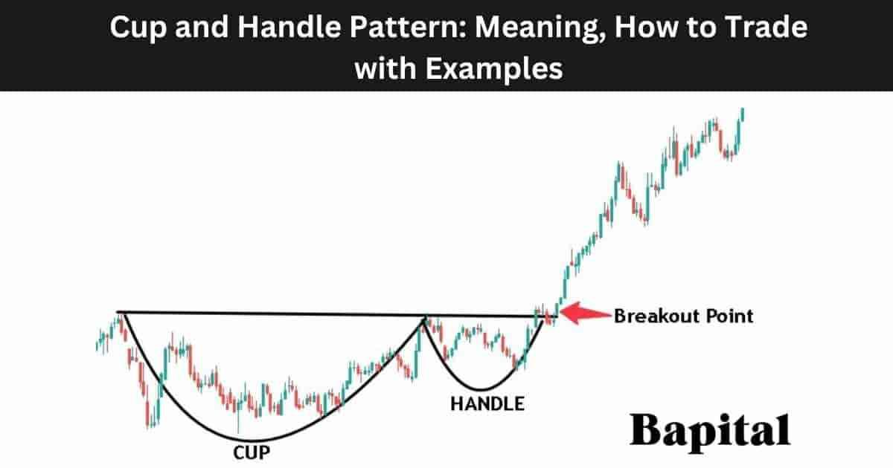

## Table of Contents

## What is the Cup and Handle pattern in trading?

The Cup and Handle pattern is a chart pattern used in trading to predict when a stock's price might go up. It looks like a cup with a handle on the side. The cup part of the pattern forms when the price of the stock goes down and then comes back up to about the same level it started at. This makes a rounded bottom that looks like a cup. The handle part comes after the cup and is a small dip in the price before it starts to go up again.

Traders watch for this pattern because it often means the stock's price will keep going up after the handle part is finished. When they see the handle forming, they might decide to buy the stock, hoping to make money as the price rises. The pattern can take a few weeks to several months to fully form, so patience is important when using it to make trading decisions.

## How can beginners identify the Cup and Handle pattern on a chart?

To spot a Cup and Handle pattern on a chart, beginners should first look for the cup part. This looks like a big, round dip in the price of the stock. The price goes down to make the bottom of the cup, then it slowly comes back up to about the same level it started at. The cup should be smooth and rounded, not sharp or jagged. It's important that the price at the end of the cup is close to the price at the start, but it doesn't have to be exactly the same.

After the cup is formed, beginners should watch for the handle. The handle is a smaller dip in the price that happens after the cup. It usually looks like a small downward slope or a little sideways movement. The handle should not go down too far, usually no more than a third of the cup's depth. Once the handle forms and the price starts to go up again, that's a good sign that the pattern is complete. Beginners can then think about buying the stock, hoping the price will keep going up.

## What are the key components of the Cup and Handle pattern?

The Cup and Handle pattern has two main parts: the cup and the handle. The cup looks like a big, round dip in the price of the stock. It starts when the price goes down to form the bottom of the cup, then it slowly comes back up to about the same level it started at. The cup should be smooth and rounded, not sharp or jagged. It's important that the price at the end of the cup is close to the price at the start, but it doesn't have to be exactly the same.

After the cup forms, the handle comes next. The handle is a smaller dip in the price that happens right after the cup. It usually looks like a small downward slope or a little sideways movement. The handle should not go down too far, usually no more than a third of the cup's depth. Once the handle forms and the price starts to go up again, that's a sign that the pattern is complete. This is when traders might decide to buy the stock, hoping the price will keep going up.

## What are the traditional entry and exit points for trading the Cup and Handle pattern?

The traditional entry point for trading the Cup and Handle pattern happens when the price breaks above the top of the handle. This is called the [breakout](/wiki/breakout-trading). Traders watch the price closely as it moves up from the handle. When it goes above the highest point of the handle, that's the signal to buy the stock. This breakout should be on higher trading [volume](/wiki/volume-trading-strategy), which means more people are buying the stock, making the signal stronger.

The traditional [exit](/wiki/exit-strategy) point, or when to sell the stock, is a bit trickier. One common way is to set a target price. To find this, measure the depth of the cup from the bottom to the top. Then, add that distance to the breakout point at the top of the handle. This gives you a target price where you might want to sell the stock to make a profit. Another way is to use a stop-loss order, which means selling the stock if the price drops to a certain level below the breakout point, to limit any losses.

## How can traders use volume to confirm the validity of a Cup and Handle pattern?

Traders can use volume to confirm the validity of a Cup and Handle pattern by watching how much the stock is being bought and sold at different points in the pattern. During the formation of the cup, volume should be lower. This means fewer people are trading the stock while it's making the big, round dip. But when the price starts to go back up to form the right side of the cup, the volume should start to increase. This shows that more people are interested in buying the stock as the price goes up.

When the handle forms, volume should drop again, showing less trading activity during this smaller dip. The most important part is the breakout from the handle. When the price breaks above the top of the handle, volume should go up a lot. This high volume during the breakout is a strong sign that the pattern is valid and that the price is likely to keep going up. If the volume doesn't increase during the breakout, traders might be less confident that the pattern will lead to a good trade.

## What are some common mistakes to avoid when trading the Cup and Handle pattern?

One common mistake when trading the Cup and Handle pattern is jumping into a trade too early. Some traders get excited and buy the stock as soon as they see the cup forming, but the pattern isn't complete until the handle forms and the price breaks out above the handle. If you buy too soon, you might end up holding the stock while it's still going down during the handle part, which could lead to losses. It's important to wait for the whole pattern to finish before making a move.

Another mistake is not paying attention to volume. Volume is a big clue that can tell you if the pattern is strong or not. If the volume doesn't go up when the price breaks out of the handle, the pattern might not be as reliable. Traders should look for a big increase in volume during the breakout to feel more confident about the trade. Ignoring volume can lead to bad trades because the pattern might not work out as expected without strong buying interest.

## How can the Cup and Handle pattern be integrated into a broader trading strategy?

The Cup and Handle pattern can be a useful tool in a broader trading strategy by helping traders decide when to buy and sell stocks. When you see a Cup and Handle pattern on a chart, it's a good sign that the stock might go up in price. You can use this pattern to find good times to buy the stock, especially when the price breaks above the handle with high volume. But it's important not to rely on the Cup and Handle pattern alone. You should also look at other things like the overall trend of the stock, the company's news, and the economy to make sure you're making a smart trade.

In a broader trading strategy, the Cup and Handle pattern can be part of a mix of different tools and methods. For example, you might use other chart patterns, technical indicators like moving averages or the Relative Strength Index (RSI), and [fundamental analysis](/wiki/fundamental-analysis) to get a fuller picture of the stock's potential. By combining the Cup and Handle pattern with these other tools, you can make more informed decisions and reduce the risk of making a bad trade. This way, the Cup and Handle pattern becomes just one piece of a larger puzzle that helps you trade more successfully.

## What advanced technical indicators can enhance the effectiveness of trading the Cup and Handle pattern?

To make trading the Cup and Handle pattern better, you can use a few advanced technical indicators. One helpful indicator is the Relative Strength Index (RSI). The RSI measures how fast the price is going up or down and can show if a stock is overbought or oversold. When you see a Cup and Handle pattern, you can check the RSI. If the RSI is not too high when the price breaks out of the handle, it can mean the stock still has room to go up, making the pattern more reliable. Another useful indicator is the Moving Average Convergence Divergence (MACD). The MACD can help you see the strength of a trend. If the MACD line crosses above the signal line right when the price breaks out of the handle, it can confirm that the upward trend is strong and likely to continue.

You can also use Bollinger Bands to add more information to your trading decisions. Bollinger Bands show the [volatility](/wiki/volatility-trading-strategies) of the stock's price. When the price is near the lower Bollinger Band during the handle part of the pattern, it might mean the stock is ready to bounce back up. If the price then breaks out of the handle and moves above the upper Bollinger Band, it can be a strong sign that the stock is going to keep rising. By combining these advanced indicators with the Cup and Handle pattern, you can get a clearer picture of when to buy and sell, making your trading strategy more effective and reducing the chances of making a bad trade.

## How does the time frame affect the interpretation and trading of the Cup and Handle pattern?

The time frame you use when looking at the Cup and Handle pattern can change how you see it and how you trade it. If you use a short time frame, like a daily chart, the pattern might form in just a few weeks. This can be good for quick trades where you want to make money fast. But, the pattern might not be as reliable because short time frames can have more noise and false signals. On the other hand, if you use a longer time frame, like a weekly chart, the pattern might take months to form. This can be better for more reliable trades because the pattern has more time to develop and is less likely to be a false signal.

Choosing the right time frame depends on your trading goals. If you are a day trader looking for quick profits, a shorter time frame might work better for you. You'll need to watch the charts closely and be ready to act fast. But if you are a long-term investor looking to hold onto a stock for a while, a longer time frame might be better. This way, you can wait for the pattern to fully form and be more sure that the stock's price will keep going up. No matter which time frame you choose, always remember to look at other factors like volume and other indicators to make the best trading decisions.

## What are the psychological aspects to consider when trading the Cup and Handle pattern?

When trading the Cup and Handle pattern, it's important to think about how you feel and what other traders might be thinking. This pattern can make you feel excited when you see it forming because it looks like a good chance to make money. But it's easy to get too excited and buy the stock too soon, before the pattern is finished. This can lead to bad trades because the price might still go down during the handle part. It's also important to remember that other traders are watching the same pattern. If everyone starts buying at the same time, it can push the price up quickly, but if the excitement fades, the price might fall back down.

Patience is a big part of trading the Cup and Handle pattern well. It can take a long time for the pattern to fully form, and waiting can be hard. You might feel like you're missing out on other trades while you wait for the pattern to finish. But rushing into a trade can make you lose money. It's also helpful to stay calm when the price breaks out of the handle. If you get too excited and buy a lot of the stock right away, you might not make the best choices. Keeping your emotions in check and sticking to your trading plan can help you trade the Cup and Handle pattern more successfully.

## How can algorithmic trading be applied to exploit the Cup and Handle pattern?

Algorithmic trading can be used to find and trade the Cup and Handle pattern by using computer programs to watch the stock market all the time. These programs can look at a lot of data quickly and spot the pattern as soon as it starts to form. They can also check things like volume and other indicators to make sure the pattern is strong. Once the program sees the price break out of the handle with high volume, it can automatically buy the stock. This can be faster and more accurate than a person trying to watch the market all day.

Using algorithms can also help traders avoid making bad choices because of their feelings. The computer follows a set plan and doesn't get excited or scared like a person might. It can also trade many stocks at the same time, which can be hard for a person to do. But, it's important to keep checking and updating the program to make sure it's working well and not missing any important changes in the market.

## What are the latest research findings or innovative approaches to trading the Cup and Handle pattern?

Recent research on the Cup and Handle pattern has focused on using [machine learning](/wiki/machine-learning) to make trading decisions more accurate. Scientists have been using computers to look at a lot of old stock data to find the best times to buy and sell based on the pattern. They found that adding things like volume and other chart patterns can help make the Cup and Handle pattern more reliable. They also found that looking at the pattern over different time frames, like daily or weekly charts, can give different results. This means that traders can use computers to help them find the best trades and make more money.

Innovative approaches to trading the Cup and Handle pattern also include using it with other trading strategies. Some traders are mixing the pattern with other chart patterns, like the Head and Shoulders or the Double Bottom, to get a clearer picture of what the stock might do next. Others are using it with fundamental analysis, which means looking at the company's financial health and news, to make better trading choices. By combining the Cup and Handle pattern with these other methods, traders can make more informed decisions and reduce the risk of losing money.

## What are Risk Management and Optimization Strategies?

Effective risk management and optimization are critical components when trading with patterns using algorithms. With the increasing complexity of financial markets and the popularity of [algorithmic trading](/wiki/algorithmic-trading), it is essential to develop strategies that not only capitalize on opportunities but also protect against potential losses.

**Key Risk Management Techniques**

When trading with algorithms that incorporate patterns like the Cup and Handle, it is crucial to implement robust risk management techniques:

1. **Position Sizing**: Determining the appropriate amount of capital to allocate to each trade based on the risk-to-reward ratio. A common method is the Kelly Criterion, which helps optimize the growth of capital by sizing positions according to:
$$
   f^* = \frac{bp - q}{b}

$$

   where $f^*$ is the fraction of the capital to wager, $b$ is the odds received on the wager, $p$ is the probability of winning, and $q$ is the probability of losing.

2. **Stop-Loss and Take-Profit Levels**: Setting predefined exit points to limit losses and secure profits. These can be dynamically adjusted based on market volatility and historical price behavior.

3. **Diversification**: Spreading investments across different assets and markets to reduce exposure to any single source of risk.

4. **Algorithmic Checks and Balances**: Incorporating risk parameters directly into the algorithm's logic, allowing for real-time adjustments in response to market conditions.

**Optimization of Trading Algorithms**

Enhancing the robustness and profitability of trading algorithms involves several optimization techniques:

- **Parameter Tuning**: Adjusting the algorithm’s parameters, such as moving average periods or RSI thresholds, to optimize performance. This can be achieved using techniques like grid search or Bayesian optimization.

- **Regular Backtesting and Forward Testing**: Continuously testing the algorithm on historical data and out-of-sample data to ensure consistent performance across different market conditions.

- **Machine Learning Techniques**: Implementing machine learning models to refine pattern detection and enhance prediction accuracy. Models such as Support Vector Machines (SVM) or Neural Networks can be utilized for this purpose.

**Monitoring and Adjustment**

Continuous monitoring and adjustment are vital to adapting to varying market conditions. Algorithms should be designed to identify changes in market dynamics and adjust their strategy accordingly. This includes:

- **Volatility Adaption**: Modifying trading behavior based on volatility indicators such as the Average True Range (ATR).

- **Real-Time Performance Tracking**: Implementing dashboards and alerts to monitor key performance metrics in real time, allowing for swift decision-making.

**Importance of Continuous Learning and Development**

In the rapidly evolving landscape of algorithmic trading, continuous learning is paramount. Traders should:

- Stay updated with the latest research and developments in financial markets and algorithmic strategies.

- Regularly review and revise trading algorithms to incorporate new data and emerging patterns.

- Engage with trading communities and forums to exchange insights and strategies.

**Tools and Software Recommendations**

Utilizing the right tools and software can significantly enhance the management and optimization of trading strategies:

- **QuantConnect and QuantLib**: Platforms for building, backtesting, and deploying trading algorithms.

- **Pandas and NumPy**: Python libraries for data manipulation and analysis, crucial for preprocessing financial data.

- **Scikit-learn and TensorFlow**: Machine learning frameworks for developing and testing predictive models.

- **TradingView and MetaTrader**: Platforms offering comprehensive charting tools and script development for strategy testing.

By implementing sound risk management and optimization strategies, traders can improve the robustness and profitability of their pattern-based algorithms while minimizing potential losses.

## References & Further Reading

[1]: O'Neil, W. J. (2009). ["How to Make Money in Stocks: A Winning System in Good Times or Bad"](https://www.amazon.com/How-Make-Money-Stocks-Winning/dp/0071614133). McGraw-Hill Education.

[2]: Aronson, D. (2006). ["Evidence-Based Technical Analysis: Applying the Scientific Method and Statistical Inference to Trading Signals"](https://www.amazon.com/Evidence-Based-Technical-Analysis-Scientific-Statistical/dp/0470008741). Wiley.

[3]: Jansen, S. (2018). ["Machine Learning for Algorithmic Trading: Discover techniques to build algorithmic trading systems with Python"](https://www.linkedin.com/in/trevormills1). Packt Publishing.

[4]: Chan, E. P. (2008). ["Quantitative Trading: How to Build Your Own Algorithmic Trading Business"](https://github.com/ftvision/quant_trading_echan_book). Wiley.

[5]: Lopez de Prado, M. (2018). ["Advances in Financial Machine Learning"](https://www.amazon.com/Advances-Financial-Machine-Learning-Marcos/dp/1119482089). Wiley.