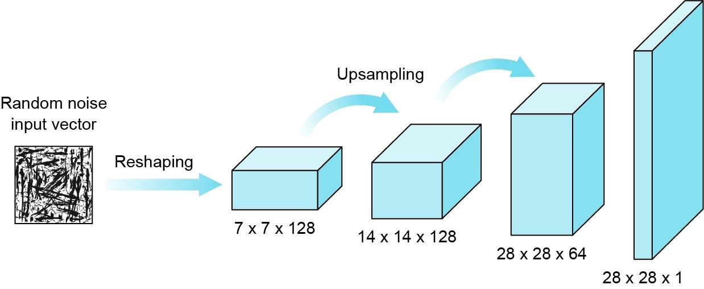

## Table of Contents

## What is an Input Generator in the context of machine learning?

An Input Generator in machine learning is a tool or method used to create or modify input data for training or testing machine learning models. It helps by making more data or changing existing data in ways that can make the model better at learning or performing its tasks. Think of it like a chef preparing different ingredients before cooking a meal. The chef might chop, mix, or cook the ingredients to make them ready for the recipe. Similarly, an Input Generator might adjust images, texts, or numbers to help the machine learning model learn from a variety of examples.

For example, if a model is being trained to recognize cats in photos, an Input Generator could create more images of cats by slightly changing existing images. It might rotate the images, change their brightness, or add small variations like different backgrounds. This helps the model learn to recognize cats under different conditions. By using an Input Generator, the model can become more robust and accurate, as it gets exposed to a wider range of data. This process is crucial in improving the performance and reliability of machine learning models.

## Why are Input Generators important in machine learning models?

Input Generators are important in machine learning because they help create more data for training models. When a model is trained with more data, it can learn better and make fewer mistakes. Imagine you're learning to play a new game. If you only practice with a few moves, you won't be very good. But if you practice with many different moves, you'll get much better. Input Generators do something similar by making new examples for the model to learn from, which helps the model understand the task better.

Another reason Input Generators are important is that they can make the data more varied. In real life, things can look different because of lighting, angles, or other changes. If a model only sees the same kind of data, it might not work well in new situations. Input Generators can change the data in small ways, like rotating pictures or adding noise, to help the model learn to handle these differences. This makes the model more reliable and useful in the real world, where things are always changing.

## How does an Input Generator work to produce data for machine learning?

An Input Generator works by taking existing data and making changes to it to create new examples. For instance, if you have a picture of a cat, the Input Generator might rotate the picture a little, change its brightness, or even add a new background. This helps the [machine learning](/wiki/machine-learning) model see the cat in different situations, which makes the model better at recognizing cats no matter how the picture looks. The generator uses rules or algorithms to make these changes, ensuring that the new data still looks realistic and useful for training.

These changes can be simple, like flipping an image, or more complex, like blending parts of different images together. The goal is to create a lot of new data that's similar to the original but different enough to help the model learn more. By doing this, the Input Generator helps the model see a wider range of examples, which is important for making the model work well in the real world. For example, if a model is trained to recognize numbers, the Input Generator might add noise or change the size of the numbers, helping the model learn to recognize them even if they're not perfect.

## What are the common types of Input Generators used in machine learning?

One common type of Input Generator is the Data Augmentation Generator. This type is used a lot in image recognition tasks. It takes existing images and makes small changes to them, like rotating, flipping, or changing the brightness. These changes help the model see the same thing in different ways, which makes it better at recognizing things in real life. For example, if you're training a model to recognize dogs, the Data Augmentation Generator might rotate the dog pictures a bit or change their colors. This way, the model learns to recognize dogs no matter how they look.

Another type is the Synthetic Data Generator. This one makes completely new data that looks like the real thing but is made up. It's useful when you don't have enough real data to train your model. For example, if you're trying to train a model to recognize rare diseases, you might not have many real examples. The Synthetic Data Generator can create new examples that look like real cases, helping the model learn from more data. This type of generator uses algorithms to make sure the new data is realistic and useful for training.

A third type is the Noise Generator, which adds random changes to the data. This can help the model learn to ignore small, unimportant differences and focus on what's important. For example, if you're training a model to recognize speech, the Noise Generator might add background noise to the recordings. This helps the model learn to understand speech even when there's noise around. By using these different types of Input Generators, machine learning models can be trained with more and better data, making them more accurate and reliable.

## Can you explain the difference between synthetic and real data in Input Generators?

Synthetic data is made up by computers using special rules or algorithms. It looks like real data but is created from scratch. For example, if you're training a model to recognize faces, synthetic data might include pictures of faces that were never taken in real life but look like they could be real. This type of data is useful when you don't have enough real examples to train your model. By using synthetic data, you can create as many examples as you need, helping the model learn better.

Real data, on the other hand, comes from the real world. It's collected from things like pictures, videos, or numbers that people have recorded. For instance, if you're training a model to recognize cars, real data would be actual photos of cars taken by cameras. Real data is important because it shows the model exactly what it will see in the real world. However, sometimes there isn't enough real data, which is where synthetic data can help by filling in the gaps.

## What are the challenges faced when using Input Generators in machine learning?

One challenge with using Input Generators is making sure the new data they create is good enough for training. If the generator makes data that's too different from the real world, the model might learn the wrong things. For example, if a generator makes pictures of cats that look too strange, the model might not recognize real cats. It's hard to find the right balance between making the data different enough to help the model learn, but still realistic enough to be useful.

Another challenge is that using Input Generators can take a lot of computer power and time. Making new data, especially if it's complex like synthetic images or sounds, can be slow. This means you might need big computers or a lot of time to generate enough data for training. Also, if the generator uses a lot of resources, it might not be practical for everyone to use, especially if they don't have access to powerful computers.

## How can Input Generators be used to improve model training?

Input Generators can improve model training by creating more data for the model to learn from. When a model sees more examples, it can learn to recognize patterns better. For example, if you're training a model to recognize different types of fruits, an Input Generator can make more pictures of fruits by rotating them, changing their colors, or adding different backgrounds. This helps the model learn to recognize fruits in many different situations, making it more accurate and reliable.

Another way Input Generators help is by making the data more varied. In real life, things can look different because of lighting, angles, or other changes. If a model only sees the same kind of data, it might not work well in new situations. Input Generators can change the data in small ways, like adding noise or changing the size of objects, to help the model learn to handle these differences. This makes the model more robust and able to perform well even when the data it sees is not exactly like what it was trained on.

## What are some best practices for designing an effective Input Generator?

When designing an effective Input Generator, it's important to make sure the new data looks like real data. The generator should make changes that are small enough to keep the data realistic but big enough to help the model learn. For example, if you're making pictures of dogs, the generator might rotate the pictures a little or change their brightness. This helps the model see dogs in different situations, making it better at recognizing them. It's also important to test the new data to make sure it's helping the model learn better. If the model starts making more mistakes with the new data, you might need to change how the generator works.

Another best practice is to use a variety of changes to make the data more diverse. Instead of just rotating pictures, the generator could also flip them, change their colors, or add different backgrounds. This helps the model learn to recognize things no matter how they look. It's also good to keep track of how much computer power and time the generator uses. If it takes too long to make new data, you might need to find a faster way to do it. By following these practices, you can make an Input Generator that helps your model learn better and work well in the real world.

## How do you evaluate the performance of an Input Generator?

Evaluating the performance of an Input Generator involves checking if the new data it creates helps the machine learning model learn better. You can do this by training the model with the new data and then seeing how well it performs on a separate set of real data. If the model does better with the new data than without it, that's a good sign the Input Generator is working well. You can measure this by looking at things like accuracy, which is how often the model gets things right, or by using other measures like precision and recall that show how well the model can identify the right things.

Another way to evaluate the Input Generator is to check the quality of the data it makes. You want to make sure the new data looks like real data and isn't too different from what the model will see in the real world. You can do this by having people look at the data and say if it looks real, or by using other computer programs to check if the data is good. If the new data is too strange or doesn't help the model learn, you might need to change how the Input Generator works to make better data.

## What advanced techniques can be applied to enhance Input Generators?

One advanced technique to enhance Input Generators is using Generative Adversarial Networks (GANs). A GAN has two parts: a generator that makes new data and a discriminator that checks if the data looks real. They work together to make better and better data. The generator tries to fool the discriminator by making data that looks more like real data. The discriminator gets better at telling real from fake data. This back-and-forth helps the generator make very realistic data. For example, if you're making pictures of cats, the GAN can make new cat pictures that look like real photos, helping the model learn to recognize cats in many different ways.

Another technique is using Variational Autoencoders (VAEs). VAEs learn how to make new data by understanding the patterns in the data they see. They can then create new data that follows those patterns. This is useful for making new examples that are similar to the real data but different enough to help the model learn. For instance, if you're training a model to recognize numbers, a VAE can make new pictures of numbers that look like the ones you have but with small changes. This helps the model learn to recognize numbers even if they're written in different ways.

## How do Input Generators integrate with other machine learning components?

Input Generators work together with other parts of machine learning to make models better. They fit into the training process by making new data that the model can learn from. For example, when you're training a model, you usually split your data into a training set and a testing set. The Input Generator can make more data for the training set, helping the model see more examples. This can be done by using the generator to change the existing training data in small ways, like rotating pictures or adding noise to sounds. By doing this, the Input Generator helps the model learn from a wider range of examples, making it more accurate and reliable.

Input Generators also work with other tools like data preprocessing and feature extraction. Before the data goes into the model, it often needs to be cleaned up or changed in some way. The Input Generator can be part of this process, making new data that fits well with the rest of the data. For example, if you're using a tool to make the data smaller or easier to work with, the Input Generator can make new data that matches these changes. This helps the whole system work together smoothly, making sure the model gets the best data possible to learn from.

## What are the future trends and developments expected in Input Generator technology?

In the future, Input Generators are expected to become even more advanced and realistic. One big trend will be the use of more powerful Generative Adversarial Networks (GANs). These networks will get better at making new data that looks just like real data. This means they can create pictures, sounds, or texts that are hard to tell apart from the real thing. As computers get faster and smarter, these GANs will be able to make more complex and varied data, helping machine learning models learn from even more realistic examples. This will make the models better at understanding the world around them.

Another trend will be the use of more personalized Input Generators. These will be able to make data that fits the needs of specific models or tasks. For example, if you're training a model to recognize faces, the Input Generator might make new pictures of faces that look like the ones the model will see in real life. This will help the model learn faster and work better. As we learn more about how to make these personalized generators, they will become a key part of making machine learning models that are good at specific jobs.