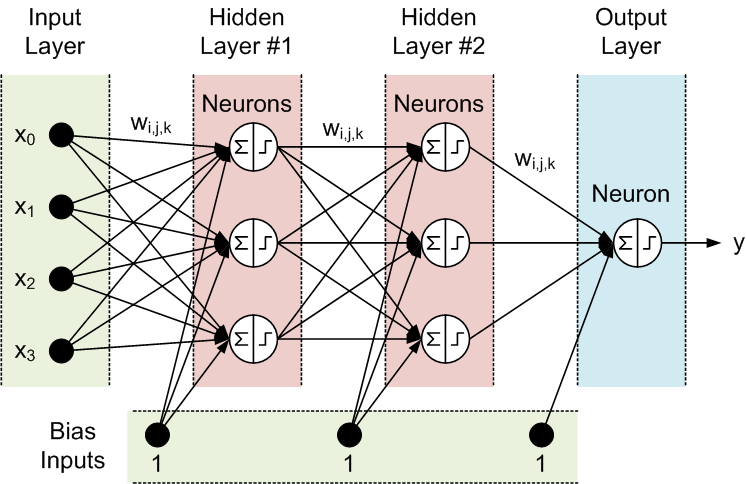

## Table of Contents

## What is an input layer in machine learning?

In machine learning, the input layer is the first layer of a neural network. It's where the data enters the model. Think of it like the front door of a house. When you have data, like images or numbers, you put it into the input layer. Each piece of data is called a feature, and each feature gets its own spot in the input layer. The number of spots, or neurons, in the input layer matches the number of features in your data.

Once the data is in the input layer, it gets passed on to the next layers in the neural network. These layers process the data and make predictions or decisions. The input layer itself doesn't do any processing; it just holds the data. For example, if you're trying to predict house prices and you have features like the number of rooms and the size of the house, these features would go into the input layer. From there, the neural network can start figuring out how these features relate to the price of the house.

## How does the input layer differ from other layers in a neural network?

The input layer in a neural network is special because it's where the data first comes in. It's like the starting line of a race. The input layer doesn't do any math or processing; it just holds the data. Each piece of data, called a feature, gets its own spot in the input layer. If you have an image, each pixel might be a feature. If you're predicting house prices, the number of rooms and the size of the house could be features. The number of spots, or neurons, in the input layer matches the number of features in your data.

Other layers in a neural network, like hidden layers and the output layer, do the actual work. Hidden layers take the data from the input layer and process it using weights and activation functions. They might find patterns or relationships in the data. The output layer then uses this processed data to make a prediction or decision. For example, if you're classifying images, the output layer might tell you if the image is a cat or a dog. The input layer just passes the data along, while the other layers do the heavy lifting to make sense of it.

## What types of data can be fed into an input layer?

An input layer in a [neural network](/wiki/neural-network) can handle different types of data, like numbers, images, and text. If you're working with numbers, such as the price of a house or the temperature outside, each number goes into a spot in the input layer. For images, each pixel's color value can be a feature. If you're using text, you might turn words into numbers using something called word embeddings, and then feed those numbers into the input layer.

The key thing is that whatever data you're using, it needs to be turned into a format that the neural network can understand. This usually means turning it into numbers. For example, if you're predicting house prices, you might use the number of rooms, the size of the house, and the age of the house as features. These numbers go into the input layer, and then the neural network can start figuring out how these numbers relate to the price of the house.

## How do you prepare data for the input layer?

Preparing data for the input layer means turning it into a format that the neural network can understand. This usually means turning your data into numbers. If you're working with numbers already, like the price of a house or the temperature outside, you can use them directly. But if you're working with other types of data, like images or text, you need to change them into numbers first. For images, you might use the color values of each pixel. For text, you might turn words into numbers using something called word embeddings.

Once you have your data in numbers, you need to make sure it's in the right shape. The input layer has a certain number of spots, or neurons, and each spot needs a number. If you're predicting house prices, you might use the number of rooms, the size of the house, and the age of the house as features. These numbers go into the input layer, and then the neural network can start figuring out how these numbers relate to the price of the house. Sometimes, you might need to scale your numbers so they're all on the same level, like making sure all the numbers are between 0 and 1. This helps the neural network learn better.

In some cases, you might need to do more to prepare your data. For example, if you're working with time series data, you might need to create sequences of numbers. If you're working with categorical data, like the color of a car, you might need to turn those categories into numbers using something called one-hot encoding. The key thing is to make sure your data is in a format that the neural network can use to learn and make predictions.

## What is the role of the input layer in feature extraction?

The input layer in a neural network is where the data first enters, but it doesn't do any feature extraction itself. Feature extraction is the process of pulling out important parts of the data that help the neural network learn. The input layer just holds the raw data, like numbers, images, or text that have been turned into numbers. Each piece of data, called a feature, gets its own spot in the input layer. For example, if you're trying to predict house prices, features like the number of rooms and the size of the house would go into the input layer.

The real work of feature extraction happens in the hidden layers of the neural network. These layers take the raw data from the input layer and use weights and activation functions to find patterns and relationships. For example, a hidden layer might learn that houses with more rooms tend to be more expensive. The input layer doesn't change the data; it just passes it along to the hidden layers where the feature extraction happens. So, while the input layer is important for getting the data into the network, it's the hidden layers that do the actual work of figuring out what's important in the data.

## How does the structure of the input layer affect the performance of a neural network?

The structure of the input layer in a neural network is crucial because it sets the stage for how the network will process the data. The number of neurons in the input layer must match the number of features in your data. If you have more or fewer neurons than features, the network won't be able to use the data correctly. For example, if you're predicting house prices and you have three features like the number of rooms, the size of the house, and the age of the house, you need three neurons in the input layer. If you have too many neurons, some will be empty, and if you have too few, some data won't fit, which can confuse the network and hurt its performance.

The way the data is organized in the input layer also matters. If the data is not in the right format or if it's not scaled properly, it can make it harder for the network to learn. For instance, if one feature has very large numbers and another has very small numbers, the network might focus too much on the large numbers and ignore the small ones. To fix this, you might need to scale your data so all the numbers are on the same level, like making sure they're all between 0 and 1. By getting the structure of the input layer right, you help the neural network start off on the right foot, which can lead to better performance overall.

## Can the input layer be modified during the training process?

The input layer in a neural network usually stays the same during the training process. It's like the front door of a house; once it's set up, it doesn't change. The input layer just holds the data, and the number of neurons in it matches the number of features in your data. If you change the input layer, you would need to change your data too, which could mess up what the network is learning.

While the input layer itself doesn't change, the data that goes into it can be adjusted through preprocessing. For example, you might scale your data so all the numbers are between 0 and 1, or you might use techniques like normalization. These adjustments help the neural network learn better, but they happen before the data enters the input layer. So, while the input layer stays the same, the way you prepare your data can affect how well the network performs.

## What are common techniques for optimizing the input layer?

Optimizing the input layer in a neural network means making sure the data going into it is in the best shape possible. One common technique is scaling the data. This means adjusting the numbers so they're all on the same level, like making sure they're all between 0 and 1. If one feature has very big numbers and another has very small numbers, the network might focus too much on the big numbers and ignore the small ones. By scaling the data, you help the network see all the features clearly. Another technique is normalization, which is a way of scaling that makes the data follow a normal distribution, often with a mean of 0 and a standard deviation of 1.

Another way to optimize the input layer is by using feature selection or feature engineering. Feature selection means [picking](/wiki/asset-class-picking) out the most important pieces of data to use, so you're not overwhelming the network with too much information. Feature engineering means creating new features from your existing data that might help the network learn better. For example, if you're predicting house prices, you might create a new feature that's the ratio of the house size to the number of rooms. This can give the network more useful information to work with. By using these techniques, you can make sure the input layer is set up to help the network perform its best.

## How do different neural network architectures handle the input layer differently?

Different neural network architectures handle the input layer in ways that suit their specific purposes. For example, in a simple feedforward neural network, the input layer is straightforward. It just holds the data as it comes in, with each feature getting its own neuron. The number of neurons in the input layer matches the number of features in the data. This setup is simple but effective for tasks like predicting house prices or classifying simple data sets. The data goes straight into the input layer and then gets passed on to the hidden layers for processing.

In contrast, convolutional neural networks (CNNs), which are often used for image processing, have a more complex approach to the input layer. CNNs are designed to recognize patterns in images, so they treat the input layer differently. The input layer in a CNN is usually a 3D tensor, where the dimensions represent the height, width, and color channels of the image. For example, a color image might have dimensions of $$32 \times 32 \times 3$$, where 32 is the height and width of the image, and 3 represents the red, green, and blue color channels. This setup allows the CNN to process the image in a way that captures spatial relationships between pixels, which is crucial for tasks like image classification or object detection.

Recurrent neural networks (RNNs) and their variants, like Long Short-Term Memory (LSTM) networks, handle the input layer in a way that's suited for sequential data. In an RNN, the input layer can accept a sequence of data, like a series of words in a sentence or time series data. The input layer might have a fixed number of neurons, but it can process the data one step at a time, allowing the network to remember past inputs as it processes new ones. This is useful for tasks like language translation or predicting stock prices, where understanding the order of the data is important. The input layer in an RNN helps set up the network to handle the flow of information over time.

## What are the challenges associated with high-dimensional input data?

High-dimensional input data can make things tricky for neural networks. When you have a lot of features, it's like trying to find a needle in a huge haystack. The more features you have, the more spots you need in the input layer, which can slow down the network and make it harder to train. This is called the curse of dimensionality. It means that as the number of features grows, the amount of data you need to train the network well grows even faster. If you don't have enough data, the network might not learn the right patterns and could make bad predictions.

Another challenge with high-dimensional data is that it can be hard to see what's really important. Some features might not matter much, but they can still make the network confused. This is called the problem of irrelevant features. To deal with this, you might need to use techniques like feature selection or dimensionality reduction. These methods help you pick out the most important features or combine them into fewer, more useful ones. By doing this, you can make the input layer simpler and help the network focus on what really matters.

## How can dimensionality reduction techniques be applied to the input layer?

Dimensionality reduction techniques can help make high-dimensional data easier to handle by reducing the number of features that go into the input layer. One common method is Principal Component Analysis (PCA). PCA looks at the data and finds new features, called principal components, that capture the most important information. These new features are combinations of the old ones, but there are fewer of them. So, instead of using all the original features, you can use these principal components in the input layer. This makes the network simpler and can help it learn better because it's not overwhelmed by too many features.

Another technique is t-SNE (t-Distributed Stochastic Neighbor Embedding), which is often used for visualizing high-dimensional data. t-SNE tries to keep similar data points close together in a lower-dimensional space. While t-SNE is not usually used directly in the input layer of a neural network, it can help you understand your data better. By seeing how the data looks in a lower-dimensional space, you might be able to pick out the most important features to use in the input layer. Both PCA and t-SNE can make the input layer more manageable and help the neural network focus on what really matters in the data.

## What advanced methods exist for dynamically adjusting the input layer based on incoming data?

One advanced method for dynamically adjusting the input layer is using adaptive feature selection. This means the neural network can pick which features to use based on the data it sees. For example, if the network is trying to predict house prices, it might decide that the number of rooms is more important than the age of the house for some houses, but not for others. This can be done using techniques like attention mechanisms, which let the network focus on different parts of the data at different times. By doing this, the input layer can change to fit the data better, which can help the network learn and make better predictions.

Another method is using online learning, where the neural network can update itself as new data comes in. This means the input layer can be adjusted on the fly. For example, if new features become available, the network can add them to the input layer without having to start over. This is useful for things like predicting stock prices, where the data is always changing. By using online learning, the input layer can stay up to date with the latest information, which can help the network keep learning and improving over time.