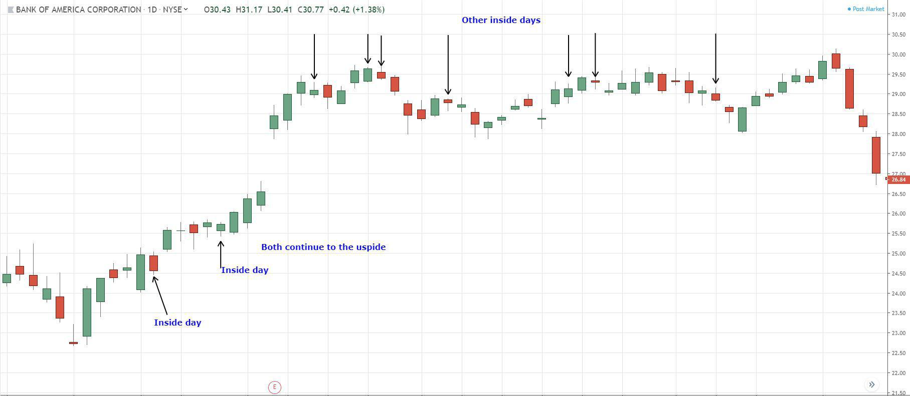

## Table of Contents

## What is an Inside Day Pattern in trading?

An Inside Day Pattern in trading happens when the price range of a stock or any financial asset on a particular day is completely within the price range of the previous day. This means that the highest price and the lowest price of the current day are both between the high and low of the day before. Traders watch for this pattern because it can signal that the market might be getting ready for a bigger move, either up or down.

When traders see an Inside Day Pattern, they often get ready for what might happen next. If the price breaks out above the high of the inside day, it could mean the price will keep going up. If it breaks below the low of the inside day, it might mean the price will keep going down. This pattern helps traders decide when to buy or sell, but it's important to use it along with other signs and not just by itself.

## How can beginners identify an Inside Day Pattern on a chart?

To spot an Inside Day Pattern on a chart, beginners should first look at the high and low prices of two days in a row. The high price is the most a stock cost that day, and the low price is the least it cost. If you see that the high and low prices of the second day are both inside the high and low prices of the first day, you've found an Inside Day Pattern. It's like the second day's price action is tucked inside the first day's range.

Once you think you've found an Inside Day Pattern, it's helpful to double-check by drawing lines on the chart. Draw a line across the highest price of the first day and another line across the lowest price of the first day. If the entire price movement of the next day stays between these two lines, you've confirmed the pattern. This simple check can help beginners feel more confident in spotting this pattern on their charts.

## What does an Inside Day Pattern indicate about market trends?

An Inside Day Pattern can tell us that the market might be taking a little break. It happens when the price of a stock stays within the range of the day before. This can mean that traders are not sure which way the market will go next, and they might be waiting for more information before deciding to buy or sell. It's like the market is taking a deep breath before making its next move.

When you see an Inside Day Pattern, it might mean that a bigger move is coming soon. If the price then breaks above the high of the inside day, it could be a sign that the market is going to go up. If it breaks below the low of the inside day, it might mean the market is going to go down. So, this pattern can help traders get ready for what might happen next, but they should also look at other signs to make sure.

## Can you explain the significance of an Inside Day Pattern in technical analysis?

An Inside Day Pattern is important in technical analysis because it shows that the market might be pausing. When the price of a stock stays inside the high and low of the day before, it means traders are not sure what to do next. They might be waiting for more news or signals before they decide to buy or sell. This pause can be a sign that the market is getting ready for a bigger move, either up or down.

Traders use the Inside Day Pattern to get ready for what might happen next. If the price breaks above the high of the inside day, it could mean the market is going to go up. If it breaks below the low of the inside day, it might mean the market is going to go down. This pattern helps traders make decisions, but they should also look at other signs to make sure they're making the right choice.

## What are the key components that form an Inside Day Pattern?

An Inside Day Pattern is formed when the price of a stock on one day stays completely within the price range of the day before. This means that the highest price the stock reaches on the second day is lower than the highest price of the first day, and the lowest price on the second day is higher than the lowest price of the first day. So, the entire price movement of the second day is inside the high and low of the first day.

This pattern shows that the market might be taking a break. Traders might be unsure about what will happen next, so they wait before deciding to buy or sell. When you see an Inside Day Pattern, it can mean that a big move is coming soon. If the price breaks above the high of the inside day, it might go up. If it breaks below the low of the inside day, it might go down.

## How does an Inside Day Pattern differ from other candlestick patterns?

An Inside Day Pattern is different from other candlestick patterns because it focuses on the price range over two days. It happens when the high and low prices of the second day are completely inside the high and low prices of the first day. This is unlike other patterns like the Doji, which looks at the shape of one candle to show uncertainty, or the Hammer, which shows a potential reversal after a downtrend. The Inside Day Pattern doesn't care about the shape of the candles; it just looks at where the prices are compared to the day before.

Other candlestick patterns often tell us about what might happen next based on the shape of one candle. For example, a Bullish Engulfing pattern, where a small bearish candle is followed by a larger bullish candle that covers it, suggests that buyers are taking over. On the other hand, an Inside Day Pattern tells us that the market might be taking a break and getting ready for a bigger move. It's like the market is pausing and waiting for more information before deciding which way to go. This makes the Inside Day Pattern unique because it's about the range over two days, not just the shape of one candle.

## What are the common strategies traders use when they spot an Inside Day Pattern?

When traders see an Inside Day Pattern, they often get ready for a possible big move in the market. They watch the price closely after the inside day to see if it breaks above the high or below the low of that day. If the price breaks above the high, traders might buy the stock, thinking it will go up. If the price breaks below the low, they might sell or short the stock, thinking it will go down. This strategy helps them make decisions based on the direction the price might take after the pattern.

Traders also use other tools and signs along with the Inside Day Pattern to make better choices. They might look at other chart patterns, trend lines, or indicators like moving averages to see if the break is strong. Sometimes, they set stop-loss orders to limit their risk if the price doesn't move as expected. By combining the Inside Day Pattern with other information, traders can feel more confident about their decisions and manage their trades better.

## How reliable is the Inside Day Pattern as a trading signal, and what are its limitations?

The Inside Day Pattern can be a helpful signal for traders, but it's not always reliable on its own. It shows that the market might be taking a break and getting ready for a big move. When traders see this pattern, they watch to see if the price breaks above the high or below the low of the inside day. If it does, it can be a good sign to buy or sell. But, the pattern works better when used with other signs and tools, like trend lines or other chart patterns. This helps traders make better decisions and feel more sure about their trades.

The main problem with the Inside Day Pattern is that it doesn't always lead to a big move. Sometimes, the price might break out but then go back to where it was. This can make traders lose money if they're not careful. Also, the pattern can happen a lot, so it's easy to see it and think it means something when it might not. That's why it's important to use it with other information and not just by itself. Traders should always be ready for the market to do something different than what they expect.

## Can you provide a step-by-step guide on how to trade using the Inside Day Pattern?

When you spot an Inside Day Pattern, the first thing you do is look at the high and low prices of the day before and the day after. If the high and low of the second day are both inside the high and low of the first day, you've found the pattern. After you see this, you need to watch the price closely. If the price goes above the high of the inside day, it might be a good time to buy the stock because it could keep going up. If the price goes below the low of the inside day, it might be a good time to sell or short the stock because it could keep going down. 

But, you shouldn't just use the Inside Day Pattern by itself. It's better to use it with other signs and tools, like trend lines or other chart patterns. This helps you make better choices and feel more sure about your trades. You can also set stop-loss orders to limit your risk if the price doesn't move the way you thought it would. By combining the Inside Day Pattern with other information, you can trade more safely and smartly.

## What are some advanced techniques for analyzing the Inside Day Pattern?

To get better at using the Inside Day Pattern, you can look at how strong the break is after the pattern. If the price breaks above the high of the inside day with a lot of [volume](/wiki/volume-trading-strategy), it might be a strong sign that the price will keep going up. On the other hand, if the price breaks below the low of the inside day with a lot of volume, it might mean the price will keep going down. Volume is how many shares are being traded, and a big volume can show that a lot of traders agree on the new direction.

Another way to make your analysis better is to use other indicators with the Inside Day Pattern. For example, you can look at moving averages to see if the price is above or below a certain average, which can help confirm the trend. You can also use other chart patterns like triangles or flags to see if they match up with the Inside Day Pattern. By combining these tools, you can get a clearer picture of what might happen next and make smarter trading decisions.

It's also helpful to look at the bigger picture when you see an Inside Day Pattern. Check the overall trend of the market or the stock to see if the pattern fits with what's been happening. If the stock has been going up for a while and then you see an Inside Day Pattern, a break above the high might be more likely to lead to more gains. By understanding the context, you can use the Inside Day Pattern more effectively and avoid making trades that don't fit with the bigger trend.

## How can the Inside Day Pattern be integrated with other technical indicators for better results?

To get better results from the Inside Day Pattern, you can use it with other technical indicators. One way is to look at the volume when the price breaks out of the inside day's range. If the price goes above the high of the inside day with a lot of volume, it's a strong sign that the price might keep going up. If the price goes below the low with a lot of volume, it might mean the price will keep going down. Volume shows how many people are buying and selling, so a big volume can mean that a lot of traders agree on the new direction.

Another way to improve your analysis is to use other chart patterns and indicators along with the Inside Day Pattern. For example, you can use moving averages to see if the price is above or below a certain average, which can help confirm the trend. You can also look for other patterns like triangles or flags to see if they match up with the Inside Day Pattern. By combining these tools, you get a clearer picture of what might happen next and can make smarter trading decisions.

It's also important to consider the bigger picture when you see an Inside Day Pattern. Check the overall trend of the market or the stock to see if the pattern fits with what's been happening. If the stock has been going up for a while and then you see an Inside Day Pattern, a break above the high might be more likely to lead to more gains. By understanding the context, you can use the Inside Day Pattern more effectively and avoid making trades that don't fit with the bigger trend.

## Can you discuss a real-world example where the Inside Day Pattern led to a successful trade?

Imagine you're looking at a chart for a stock called XYZ. One day, you see that the price of XYZ stays completely within the high and low of the day before. This is an Inside Day Pattern. The next day, you keep a close eye on the price. Suddenly, the price of XYZ jumps above the high of the inside day with a lot of trading happening. This tells you that a lot of people are buying the stock, so you decide to buy some shares of XYZ too.

After you buy, the price of XYZ keeps going up just like you hoped. You made a good choice because the Inside Day Pattern, along with the high volume, showed that the stock was likely to go up. You sell your shares a few days later when the price is high, making a nice profit. This example shows how the Inside Day Pattern can help you make a successful trade when you use it with other signs like volume.

## References & Further Reading

- Bergstra, J., Bardenet, R., Bengio, Y., & Kégl, B. (2011). "Algorithms for Hyper-Parameter Optimization." This work explores methodologies for optimizing hyper-parameters in machine learning algorithms. It is crucial for developing efficient algorithmic trading strategies as it helps in refining models to better predict and react to market patterns like inside days.

- Lopez de Prado, M. (2018). "Advances in Financial Machine Learning." This book provides comprehensive insights into the application of machine learning in financial markets. It discusses techniques and tools that can enhance the effectiveness of trading strategies, including those based on technical patterns such as inside days.

- Aronson, D. (2007). "Evidence-Based Technical Analysis." Aronson's work emphasizes the importance of empirical validation in technical analysis. It serves as a critical resource for traders looking to integrate inside day patterns into their strategies, as it encourages basing decisions on statistically significant data.

- Jansen, S. (2020). "Machine Learning for Algorithmic Trading." This book covers the use of machine learning to build and optimize algorithmic trading strategies. It is particularly useful for traders implementing inside day strategies within an automated trading system as it explains how to leverage machine learning for better decision-making.

- Chan, E.P. (2009). "Quantitative Trading: How to Build Your Own Algorithmic Trading Business." Chan provides practical advice on constructing and running a quantitative trading business. The book's insights into systematic trading approaches can be applied when trading based on inside day patterns, ensuring strategies are robust and consistently profitable.

These references offer a solid foundation for understanding the technical, statistical, and algorithmic components critical to leveraging inside day patterns in trading strategies effectively.

