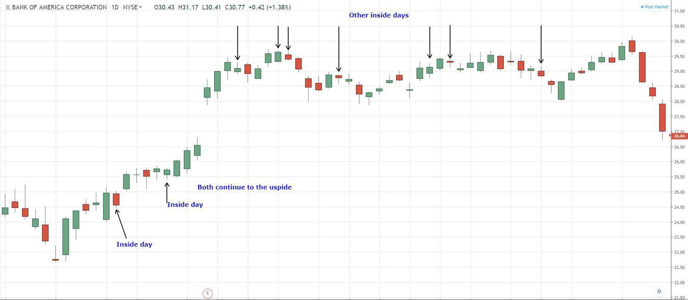

## Table of Contents

## What is an inside day in trading?

An inside day in trading happens when the price of a stock or other financial asset moves within the high and low range of the previous day. This means that the highest price the asset reaches on the inside day is lower than the highest price of the day before, and the lowest price on the inside day is higher than the lowest price of the day before. Traders watch for inside days because they can signal that the market might be getting ready for a bigger move in one direction or the other.

Inside days are important because they show a pause in the market's movement. When traders see an inside day, they often think that the market is taking a break and might soon start moving more strongly. This can be a good time for traders to get ready for the next big move, whether it's up or down. By watching for inside days, traders can try to predict when the market might start moving again and plan their trades accordingly.

## How does an inside day differ from other trading patterns?

An inside day is different from other trading patterns because it shows a period of rest in the market. When you see an inside day, it means the price of a stock or asset stayed within the high and low of the day before. This is unlike other patterns like a breakout, where the price moves beyond the previous day's range, or a reversal, where the price changes direction. An inside day suggests that the market is taking a break and might be preparing for a bigger move soon.

Other patterns, like a trend continuation, show that the market keeps moving in the same direction as before. For example, if the price has been going up for several days, a trend continuation pattern would show it keeps going up. In contrast, an inside day doesn't show a clear direction; it just shows the market is pausing. This pause can be important for traders because it might signal that a big move is coming, either up or down, which is different from patterns that show a steady trend or a sudden change in direction.

## What are the basic components of an inside day trading strategy?

An inside [day trading](/wiki/day-trading-spy) strategy involves looking for days when the price of a stock or asset stays within the high and low of the previous day. Traders use this pattern to spot when the market might be taking a break. The first step is to find an inside day on a price chart. This means checking if today's highest price is lower than yesterday's highest price, and today's lowest price is higher than yesterday's lowest price. Once an inside day is spotted, traders get ready for a possible big move in the market.

The next part of the strategy is to wait for the market to break out of the inside day's range. This means watching to see if the price moves above the high of the inside day or below the low of the inside day. If the price breaks above the high, traders might buy, expecting the price to keep going up. If the price breaks below the low, traders might sell, expecting the price to keep going down. Using stop-loss orders can help manage risk, so if the market moves the wrong way, traders can limit their losses. This strategy helps traders take advantage of the market's next big move after a pause.

## How can beginners identify an inside day on a chart?

To identify an inside day on a chart, beginners should first look at the high and low prices of two consecutive days. An inside day happens when the high price of the second day is lower than the high price of the first day, and the low price of the second day is higher than the low price of the first day. This means the price on the second day stays within the range of the first day. For example, if the first day's high was $50 and low was $40, an inside day would have a high less than $50 and a low more than $40.

Once you spot an inside day, you can use it to watch for the next big move in the market. After an inside day, traders wait to see if the price breaks out above the high of the inside day or below the low of the inside day. If the price goes above the high, it might be a good time to buy, expecting the price to keep going up. If the price goes below the low, it might be a good time to sell, expecting the price to keep going down. This can help beginners understand when the market might be ready to move after taking a break.

## What are the potential entry points for trading an inside day?

When trading an inside day, the first potential entry point is when the price breaks above the high of the inside day. This means if the price was stuck between the high and low of the previous day, and then it moves above that high, it could be a sign that the price might keep going up. Traders might see this as a good time to buy, hoping to make money as the price rises.

The second potential entry point is when the price breaks below the low of the inside day. If the price was inside the range of the previous day and then drops below that low, it could mean the price might keep going down. Traders might see this as a good time to sell or short sell, expecting to make money as the price falls. Both entry points help traders take advantage of the market's next big move after a pause.

## What risk management techniques should be used with inside day trading?

When trading an inside day, one important risk management technique is to use stop-loss orders. A stop-loss order is like a safety net that helps you limit how much money you could lose. If you buy a stock because the price broke above the high of the inside day, you can set a stop-loss order just below the high of the inside day. This way, if the price goes back down, your stop-loss order will sell the stock automatically, helping you avoid bigger losses.

Another technique is to only risk a small part of your money on each trade. This means you don't put all your money into one trade. Instead, you might decide to only use a small percentage, like 1% or 2%, of your total money for each trade. This way, even if a trade doesn't go your way, you won't lose too much. It's also a good idea to keep an eye on the market and be ready to change your plan if things start to look different from what you expected.

## How does market volatility affect the effectiveness of an inside day strategy?

Market [volatility](/wiki/volatility-trading-strategies) can make an inside day strategy more or less effective. When the market is very volatile, prices can move a lot in a short time. This can make it harder to spot an inside day because the price might not stay within the previous day's range. If the market is too jumpy, the inside day might not mean as much because the next big move could happen quickly and unpredictably. Traders need to be careful and might need to adjust their expectations and risk management when the market is very volatile.

On the other hand, in a less volatile market, an inside day can be a clearer signal. When prices are more stable, an inside day can show a real pause in the market, making it easier to predict the next move. Traders can use this time to get ready for a [breakout](/wiki/breakout-trading), either up or down. In a calm market, the inside day strategy can be more reliable because the market is more likely to follow the expected pattern after the pause.

## Can inside day trading be combined with other technical indicators for better results?

Yes, inside day trading can be combined with other technical indicators to get better results. For example, traders often use moving averages to help confirm the direction of the next move after an inside day. If the price breaks above the high of the inside day and is also above a key moving average, like the 50-day moving average, it might be a stronger sign that the price will keep going up. On the other hand, if the price breaks below the low of the inside day and is below a moving average, it might be a stronger sign that the price will keep going down.

Another useful indicator to combine with inside day trading is the Relative Strength Index (RSI). The RSI helps traders see if a stock is overbought or oversold. If the price breaks above the high of an inside day and the RSI is not in overbought territory, it might be a good time to buy. But if the RSI is already overbought, it might be a sign to wait or be careful. Using these indicators together with inside day trading can help traders make smarter decisions and improve their chances of making money in the market.

## What are the common mistakes traders make when using an inside day strategy?

One common mistake traders make when using an inside day strategy is not waiting for a clear breakout. Sometimes, traders get too excited and jump into a trade as soon as they see an inside day, without waiting to see if the price actually breaks above the high or below the low of that day. This can lead to false signals and losses if the price doesn't move as expected. It's important to be patient and wait for a clear sign that the market is moving in one direction before making a trade.

Another mistake is not using proper risk management. Traders might not set stop-loss orders or might risk too much money on one trade. This can lead to big losses if the trade doesn't go their way. It's important to only risk a small part of your money on each trade and to use stop-loss orders to limit losses. Without good risk management, even a good strategy like inside day trading can lead to problems.

Lastly, some traders ignore market conditions and use the inside day strategy in very volatile markets. When the market is jumping around a lot, an inside day might not be a reliable signal. Traders need to consider the overall market conditions and be ready to adjust their strategy if the market is too volatile. Combining inside day trading with other indicators can also help make better decisions and avoid common mistakes.

## How can an inside day strategy be adapted for different time frames?

An inside day strategy can be used on different time frames, like daily, hourly, or even 15-minute charts. On a daily chart, an inside day means the price stayed within the high and low of the day before. Traders wait for the price to break out of this range before making a trade. On shorter time frames like an hourly chart, an inside day happens when the price stays within the high and low of the previous hour. This can be useful for traders who want to make quick trades and need to watch the market closely.

When using the inside day strategy on different time frames, traders need to adjust their expectations and risk management. On a daily chart, the moves might be bigger and slower, so traders might need to be more patient and set wider stop-loss orders. On shorter time frames, the moves can be smaller and faster, so traders might need to act quickly and use tighter stop-loss orders. By understanding how the market behaves on different time frames, traders can adapt the inside day strategy to fit their trading style and goals.

## What advanced techniques can be used to enhance the profitability of inside day trading?

To make inside day trading more profitable, traders can use advanced techniques like combining it with other indicators. For example, using the Relative Strength Index (RSI) can help traders see if a stock is overbought or oversold. If the price breaks above the high of an inside day and the RSI is not in overbought territory, it might be a good time to buy. This can help traders avoid jumping into trades that might not have much room to grow. Another useful indicator is the moving average. If the price breaks above the high of an inside day and is also above a key moving average, like the 50-day moving average, it can be a stronger sign that the price will keep going up. Using these indicators together can help traders make smarter decisions and increase their chances of making money.

Another advanced technique is to use [volume](/wiki/volume-trading-strategy) analysis. When the price breaks out of an inside day's range, traders can look at the trading volume to see if the move is strong. If the volume is high when the price breaks above the high or below the low, it can be a sign that the move is more likely to continue. This can help traders feel more confident about their trades. Additionally, traders can use multiple time frames to get a better view of the market. For example, they might look at an inside day on a daily chart and then check shorter time frames like hourly or 15-minute charts to find the best entry points. By combining these advanced techniques, traders can enhance the profitability of their inside day trading strategy.

## How do professional traders refine and optimize their inside day trading strategies?

Professional traders refine and optimize their inside day trading strategies by combining them with other technical indicators and analyzing market conditions. They often use tools like the Relative Strength Index (RSI) to check if a stock is overbought or oversold before making a trade. If the price breaks above the high of an inside day and the RSI is not in overbought territory, it might be a good time to buy. They also look at moving averages, like the 50-day moving average, to confirm the direction of the next move. If the price breaks above the high of an inside day and is also above the moving average, it can be a stronger sign that the price will keep going up. By using these indicators together, professional traders can make smarter decisions and increase their chances of making money.

Another way professional traders optimize their inside day trading strategies is by paying close attention to volume and using multiple time frames. When the price breaks out of an inside day's range, they look at the trading volume to see if the move is strong. High volume during a breakout can be a sign that the move is more likely to continue, giving traders more confidence in their trades. Additionally, they might look at an inside day on a daily chart and then check shorter time frames like hourly or 15-minute charts to find the best entry points. By combining these advanced techniques and adapting to different market conditions, professional traders can refine their inside day trading strategies to be more profitable.

## References & Further Reading

[1]: Bergstra, J., Bardenet, R., Bengio, Y., & Kégl, B. (2011). ["Algorithms for Hyper-Parameter Optimization."](https://papers.nips.cc/paper/4443-algorithms-for-hyper-parameter-optimization) Advances in Neural Information Processing Systems 24.

[2]: ["Advances in Financial Machine Learning"](https://www.amazon.com/Advances-Financial-Machine-Learning-Marcos/dp/1119482089) by Marcos Lopez de Prado

[3]: ["Evidence-Based Technical Analysis: Applying the Scientific Method and Statistical Inference to Trading Signals"](https://www.amazon.com/Evidence-Based-Technical-Analysis-Scientific-Statistical/dp/0470008741) by David Aronson

[4]: ["Machine Learning for Algorithmic Trading"](https://github.com/stefan-jansen/machine-learning-for-trading) by Stefan Jansen

[5]: ["Quantitative Trading: How to Build Your Own Algorithmic Trading Business"](https://books.google.com/books/about/Quantitative_Trading.html?id=j70yEAAAQBAJ) by Ernest P. Chan