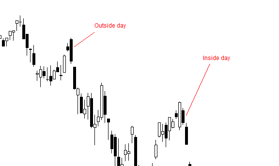

The world of trading has undergone significant transformation with the integration of algorithmic trading strategies. At the core of these strategies are concepts like inside days and outside days, which are crucial for identifying potential market movements. These candlestick patterns offer traders visual cues that signify periods of market consolidation or volatility, eventually leading to breakout signals. Understanding and utilizing these patterns are essential components of effective trading strategies.

Inside days and outside days provide valuable insights into market behavior. An inside day occurs when the entire trading range of a day falls within the high and low of the previous day, indicating a period of consolidation and potential indecision in the market. Conversely, an outside day represents a trading day where the high and low exceed the previous day's range, often signaling increased volatility and the possibility of a trend reversal or continuation.



Algorithmic trading leverages these patterns by employing sophisticated computer programs designed to execute trades based on predefined criteria. These algorithms can process vast amounts of data at speeds beyond human capabilities, thereby enabling more systematic and efficient trading. By integrating inside and outside day strategies into algorithms, traders minimize emotional biases and improve trade precision. The algorithms optimize trading by executing rapid and accurate transactions in response to market conditions, making them indispensable in today's fast-paced markets.

This article discusses how inside and outside days are integrated into algorithmic trading strategies. It highlights the advantages of utilizing algorithmic systems in trading and explores how these strategies can be tailored to enhance trading outcomes. Through technology and strategic pattern recognition, traders are better positioned to capitalize on market movements, ensuring they maintain competitive and informed positions in the ever-evolving trading landscape.

## Table of Contents

## Understanding Inside Days and Outside Days

Inside days and outside days are fundamental candlestick patterns used by traders to interpret potential market movements. An inside day refers to a pattern where the price action of a particular trading day is completely contained within the range of the previous day's high and low. This pattern suggests a period of market consolidation, indicating that buyers and sellers are in a state of equilibrium, which often precedes significant market movements. The formation of an inside day can be an early clue for traders that a potential breakout might occur in the direction of the previous trend or signal a possible reversal depending on other market indicators.

Conversely, outside days occur when the trading range of a day surpasses the high and low of the prior day. This signifies a surge in volatility and potentially denotes a strong [momentum](/wiki/momentum) shift in the market. An outside day typically implies that either buyers or sellers have gained dominance, leading to significant movement in the price. These patterns are, therefore, considered potential indicators for breakouts or reversals, signaling traders to consider entry or exit points in their strategies.

Understanding the implications of inside and outside days is crucial for developing effective trading strategies. These patterns serve as visual markers that can inform decision-making processes, helping traders to anticipate and respond to market movements strategically. The strategic use of these patterns can enhance the timing of market entries and exits, providing traders with opportunities to optimize their gains and manage risks adequately.

In conclusion, recognizing and understanding the significance of inside and outside day patterns can provide traders with valuable insights into market dynamics. By integrating these patterns into a broader analytical framework, traders can enhance their ability to forecast market movements and refine their trading strategies for better performance.

## The Role of Algorithmic Trading in Modern Markets

Algorithmic trading, often referred to as algo trading, employs sophisticated computer programs to conduct trades based on pre-defined criteria without human intervention. These algorithms leverage advanced mathematical models and quantitative analysis to make trading decisions at speeds and accuracies that surpass human capabilities. The ability of algorithms to rapidly process large volumes of data and to execute trades in fractions of a second is a critical advantage in the fast-paced environment of modern financial markets.

A distinctive feature of [algorithmic trading](/wiki/algorithmic-trading) is its capacity to integrate complex trading strategies, such as those based on candlestick patterns, including inside and outside days. An inside day occurs when the price range of a financial instrument remains within the high and low of the previous day's range, suggesting a period of market consolidation. Conversely, an outside day is characterized by a trading range that exceeds that of the prior day, often signaling a potential [breakout](/wiki/breakout-trading) or reversal. By integrating such patterns into algorithms, traders achieve a systematic approach to identifying and executing trades, which helps in mitigating the uncertainties associated with manual trading.

One of the paramount benefits of algorithmic trading is its ability to minimize emotional biases that can adversely affect trading outcomes. Human traders often fall prey to emotions, such as fear and greed, which can lead to impulsive and suboptimal decisions. Algorithms, in contrast, are devoid of emotion and follow pre-set rules with precision, leading to more consistent performance. Moreover, the precision of algorithms allows for more accurate entry and [exit](/wiki/exit-strategy) points in trades, enhancing the potential for profitability.

As markets continue to evolve and become more complex, the implementation of algorithmic trading has become increasingly vital. The speed and efficiency with which algo trading can operate provide a competitive edge in environments where a millisecond delay can result in significant financial losses or missed opportunities. According to a report by the Bank for International Settlements, algorithmic trading accounted for an estimated 60-80% of the trades in major equity markets as of 2020, underscoring its growing importance and prevalence.

In summary, algorithmic trading represents a transformative force in modern financial markets. By seamlessly incorporating strategies like inside and outside days and leveraging the power of computing, algo trading facilitates more precise and impartial trading decisions. As technology advances, its role in enhancing market efficiency and trader performance is poised to grow even further.

## Developing an Algorithm for Inside Days Trading Strategy

Developing a trading algorithm for inside days requires a systematic approach to pattern recognition, trade execution, and risk management. Inside day patterns occur when a candlestick's range is contained within the high and low of the previous day, indicating potential market consolidation.

To identify inside day patterns, an algorithm should check whether the day's high is lower than the previous day's high and the day's low is higher than the previous day's low. This can be translated into a simple code snippet in Python:

```python
def is_inside_day(previous_day, current_day):
    return current_day['high'] < previous_day['high'] and current_day['low'] > previous_day['low']
```

Once inside day patterns are identified, the next step is setting criteria for trade entry and exit. A common strategy involves taking positions in anticipation of a breakout following consolidation. For instance, entering a long position when the price exceeds the high of the inside day or a short position when it drops below the inside day low. An algorithm can be configured to trigger these trades automatically:

```python
def trade_entry_exit(signal, price):
    if signal == 'breakout_up':
        # Enter long position
    elif signal == 'breakout_down':
        # Enter short position
```

Risk management is crucial to protect against unexpected market movements. This can include setting stop-loss orders slightly below or above the inside day’s range and establishing take-profit levels based on a risk-reward ratio. For instance, a 2:1 reward-to-risk ratio can be implemented as follows:

```python
def calculate_stop_loss(entry_price, inside_day_low, inside_day_high, risk_ratio=2):
    if entry_price > inside_day_high:
        stop_loss = inside_day_low
    else:
        stop_loss = inside_day_high

    take_profit = entry_price + (entry_price - stop_loss) * risk_ratio 
    return stop_loss, take_profit
```

Backtesting the algorithm with historical data is essential to evaluate its performance. This process involves running the algorithm on past data to assess its effectiveness and profitability, allowing traders to identify any shortcomings and refine the code accordingly.

Finally, market dynamics change over time, necessitating continuous iteration and refinement of the strategy. This involves regular updates to the algorithm to adapt to new market conditions and incorporate any improvements identified through [backtesting](/wiki/backtesting) or live testing. Continuous optimization ensures the strategy remains relevant and effective amidst evolving market trends.

## Leveraging Outside Days with Algorithmic Strategies

Outside days in trading patterns are characterized by a day where the trading range, determined by the high and low, exceeds the previous day's range. This pattern signals potential breakouts or reversals, presenting significant opportunities for traders. Incorporating these patterns into algorithmic trading strategies can be highly advantageous, enabling traders to automate the execution of trades once an outside day is identified.

### Automation and Execution
Algorithms can be designed to automatically execute trades based on pre-determined parameters when an outside day pattern is detected. This automation removes emotional biases, ensuring that trades are executed with precision and speed. The algorithm may continuously scan market data for outside day patterns and trigger trades once the conditions are met.

### Differentiating Signals
To maximize the potential of outside [day trading](/wiki/day-trading-spy) strategies, it's crucial to differentiate between false signals and genuine trading opportunities. For instance, defining strict parameters such as minimum [volume](/wiki/volume-trading-strategy) requirements or additional confirming indicators can enhance the reliability of signals. Traders might use indicators like the Relative Strength Index (RSI) or Moving Average Convergence Divergence (MACD) to validate the breakout or reversal suggested by an outside day.

### Risk-Adjusted Strategy Development
Developing a risk-adjusted strategy involves setting clear stop-loss and take-profit levels, ensuring that the risk is proportionate to the potential rewards. This can be achieved by incorporating [volatility](/wiki/volatility-trading-strategies) measures such as the Average True Range (ATR) to dynamically adjust position sizes according to market conditions. Here's a simple Python example that demonstrates calculating position size based on the ATR:

```python
def calculate_position_size(capital, risk_per_trade, atr):
    # Assuming risk_per_trade as a percentage of capital
    risk_amount = capital * risk_per_trade
    position_size = risk_amount / atr
    return position_size

# Example usage
capital = 100000  # Portfolio capital
risk_per_trade = 0.01  # 1% risk per trade
atr = 2.5  # example ATR value

position_size = calculate_position_size(capital, risk_per_trade, atr)
print("Position size:", position_size)
```

### Monitoring and Optimization
Continuous monitoring and optimization of the algorithm are crucial for sustained trading success. As market dynamics evolve, an algorithm must be periodically reviewed and updated. This involves backtesting the strategy on recent data to assess its performance, as well as forward-testing in live markets to ensure its effectiveness under current conditions.

Moreover, [machine learning](/wiki/machine-learning) techniques can be applied to refine parameters and enhance predictive accuracy. By training models on historical data, algorithms can adapt to changing patterns, improving decision-making over time.

Overall, leveraging outside days with algorithmic strategies allows traders to systematically exploit potential market movements, balancing the need for precision and adaptability in an ever-evolving trading environment.

## Challenges and Considerations in Algo Trading

Market volatility introduces significant challenges for algorithmic trading strategies, especially when executing pattern recognition in real-time. Sudden price fluctuations can distort the anticipated market trends identified by algorithms, leading to erroneous trade signals. To improve the efficacy of pattern recognition, continuous refinement of algorithms is often necessary, taking into consideration the dynamic nature of markets.

Regulatory requirements pose another critical consideration that can impact the deployment of algorithmic trading across different jurisdictions. Various regions have distinct regulatory frameworks governing financial markets, necessitating compliance with localized legal standards. For instance, the European Union’s Markets in Financial Instruments Directive (MiFID II) imposes specific obligations on algo trading, like testing algorithms against unforeseen conditions. These regulations necessitate adaptable algorithmic systems capable of adhering to changing legal environments.

Moreover, trading outcomes can be affected by technical issues such as latency and slippage. Latency, or the delay between market data reception and trade execution, can lead to adverse selections if the algorithm operates on outdated information. Slippage occurs when the executed price differs from the expected price due to rapid price movements or insufficient market [liquidity](/wiki/liquidity-risk-premium). To mitigate these issues, implementing latency optimization techniques and maintaining robust, high-frequency connections to exchanges are essential.

Understanding the limitations of backtesting is crucial to avoid the dangers of over-optimization. Backtesting involves running an algorithm through historical market data to assess its performance. However, there's a risk of fitting the algorithm excessively to past data, which might not reflect future market conditions. This "overfitting" can lead algorithms to underperform in live trading scenarios. Instead, robust algorithms should generalize well across different datasets and market conditions, verified through out-of-sample testing.

Collaboration with data scientists and technologists can aid traders in overcoming these algorithmic trading challenges. Data scientists provide critical insights into data patterns and can enhance the predictive power of trading algorithms. Technologists ensure that the infrastructure supporting algorithmic trading is efficient, reliable, and compliant with prevailing regulations. By fostering interdisciplinary collaboration, traders can develop sophisticated strategies resilient to market volatility and regulatory changes, thereby optimizing trading outcomes.

## Conclusion

Inside and outside days are significant components of a trader's toolkit when applied correctly. These patterns offer valuable insights into market dynamics, serving as robust indicators for potential shifts in market trends. Algorithmic trading significantly enhances the utility of inside and outside days by providing a systematic and efficient means of capitalizing on these patterns. Algorithms, by design, can process large volumes of data far beyond human capacity, thereby enabling traders to make more informed and timely decisions.

The integration of pattern recognition with advanced technology not only improves precision but also optimizes market positions. As algorithms detect inside and outside day patterns in real-time, traders can execute strategies with reduced dependency on emotional decision-making, leading to improved consistency in trading outcomes.

Continued research and technological advancements are poised to further refine these strategies. The rapid evolution of machine learning and [artificial intelligence](/wiki/ai-artificial-intelligence) holds promise for more sophisticated pattern recognition capabilities and smarter decision-making frameworks. Furthermore, staying informed and adaptable is crucial for traders aiming to thrive in the fast-evolving trading landscape. The ability to swiftly adjust strategies in response to new information or market conditions is key to maintaining a competitive edge.

In conclusion, the judicious use of inside and outside days, bolstered by algorithmic trading, equips traders with a strategic advantage. This approach not only enhances the ability to predict market movements but also fortifies trading strategies against the complexities of modern markets. The continuous evolution of trading technologies presents an exciting frontier for traders eager to leverage these advancements for greater success.

## References & Further Reading

[1]: ["Advances in Financial Machine Learning"](https://www.amazon.com/Advances-Financial-Machine-Learning-Marcos/dp/1119482089) by Marcos Lopez de Prado

[2]: ["Evidence-Based Technical Analysis: Applying the Scientific Method and Statistical Inference to Trading Signals"](https://www.amazon.com/Evidence-Based-Technical-Analysis-Scientific-Statistical/dp/0470008741) by David Aronson

[3]: ["Machine Learning for Algorithmic Trading"](https://github.com/stefan-jansen/machine-learning-for-trading) by Stefan Jansen

[4]: ["Quantitative Trading: How to Build Your Own Algorithmic Trading Business"](https://www.amazon.com/Quantitative-Trading-Build-Algorithmic-Business/dp/1119800064) by Ernest P. Chan

[5]: Bergstra, J., Bardenet, R., Bengio, Y., & Kégl, B. (2011). ["Algorithms for Hyper-Parameter Optimization."](https://dl.acm.org/doi/10.5555/2986459.2986743) Advances in Neural Information Processing Systems 24.