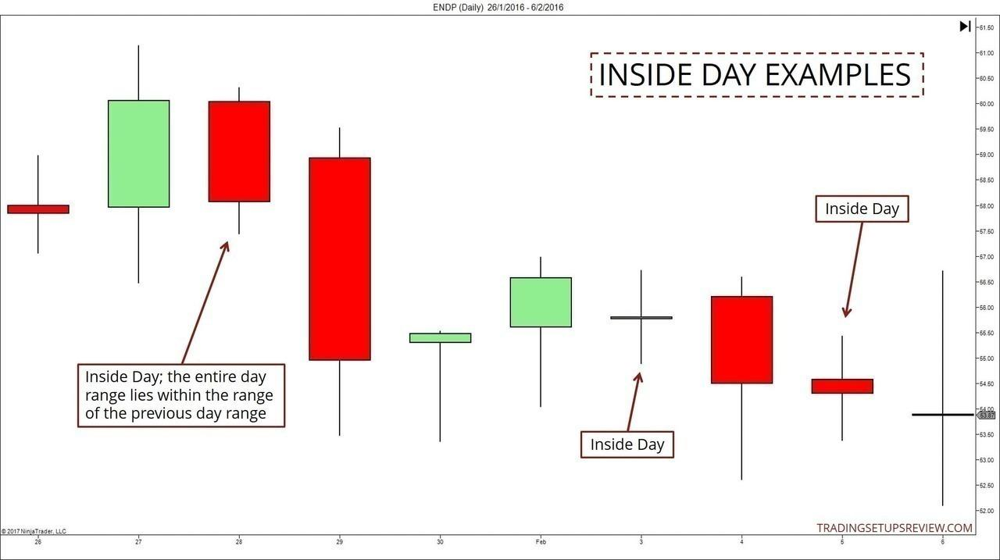

## Table of Contents

## What are inside days and outside days in trading?

Inside days and outside days are terms used in trading to describe specific patterns in price movement on a chart. An inside day happens when the trading range of a particular day is completely within the trading range of the previous day. This means the highest price and the lowest price of the inside day are both between the high and low of the day before. Traders often see inside days as a sign of consolidation or a pause in the market, suggesting that the market might be getting ready for a bigger move soon.

An outside day, on the other hand, occurs when the trading range of a day extends beyond the trading range of the previous day. This means the high of the outside day is higher than the high of the previous day, and the low of the outside day is lower than the low of the previous day. Outside days can indicate a strong shift in market sentiment, showing that traders are more active and the market might be starting a new trend. Both inside and outside days are useful for traders to watch because they can signal potential changes in market direction.

## How can you identify an inside day on a price chart?

To spot an inside day on a price chart, you need to look at the high and low prices of two days in a row. An inside day happens when the high price of the second day is lower than the high price of the first day, and the low price of the second day is higher than the low price of the first day. So, the whole trading range of the second day fits inside the trading range of the first day.

For example, if on Monday the stock's high was $50 and the low was $45, and on Tuesday the high was $49 and the low was $46, then Tuesday is an inside day. The price movement on Tuesday stayed completely within Monday's range. This pattern can show that the market is taking a break and might be getting ready for a bigger move soon.

## What does an outside day indicate about market volatility?

An outside day shows that the market is more volatile. It happens when the price on a new day goes higher than the highest price of the day before and also lower than the lowest price of the day before. This means the market is moving a lot more than it did the day before. Traders see this as a sign that the market might be starting a new trend because there's a lot of activity and strong feelings among buyers and sellers.

When you see an outside day on a chart, it tells you that the market could be getting ready for a big change. The big price swings show that people are not sure about the market's direction, and they are making bigger moves to buy or sell. This can lead to more ups and downs in the market as everyone tries to figure out what will happen next.

## Can inside days and outside days be used as standalone trading signals?

Inside days and outside days can be used as part of trading strategies, but they are usually not strong enough to use as the only reason to buy or sell. An inside day shows that the market is not moving much and might be getting ready for a bigger move. But just knowing that the market is quiet does not tell you if prices will go up or down next. So, traders often look at other things like trends, other chart patterns, or news to decide what to do.

An outside day shows that the market is moving a lot more than usual, which can mean a new trend is starting. This can be a good sign to pay attention to, but it does not always mean you should trade right away. The market can be unpredictable, and an outside day might just be a one-time big move that does not lead to a lasting trend. That is why traders usually use outside days along with other signs and tools to make better decisions about when to buy or sell.

## What are the key differences between inside days and outside days?

An inside day happens when the price of a day stays completely within the price range of the day before it. This means the highest price and the lowest price of the inside day are both between the high and low of the previous day. Inside days show that the market is not moving much and might be taking a break. Traders see this as a sign that the market could be getting ready for a bigger move, but it does not tell them if prices will go up or down next.

An outside day is different because it shows that the price on a new day goes beyond the high and low prices of the day before. This means the market is moving a lot more than it did the day before. Outside days can indicate that the market is getting more active and might be starting a new trend. Traders see this as a sign of higher market [volatility](/wiki/volatility-trading-strategies) and stronger feelings among buyers and sellers, but they still need to look at other signs to decide if it is a good time to buy or sell.

## How do inside days and outside days fit into different trading strategies?

Inside days and outside days can be useful for different trading strategies. For people who like to trade based on trends, an inside day can be a good sign to wait and see. It means the market is not moving much and might be getting ready for a bigger move. Traders who use trend strategies might wait for the market to break out of the inside day's range before deciding to buy or sell. They might also look at other signs like moving averages or other chart patterns to help them decide what to do.

For traders who like to take advantage of big price moves, an outside day can be a helpful signal. It shows that the market is moving a lot more than usual and might be starting a new trend. These traders might use outside days to jump into the market quickly, hoping to catch the start of a big move. But they also need to be careful and use other tools like support and resistance levels or [volume](/wiki/volume-trading-strategy) indicators to make sure they are making good trades.

Some traders might use both inside days and outside days together in their strategies. For example, they might wait for an inside day to show that the market is quiet, and then watch for an outside day to signal that a big move might be coming. This can help them time their trades better and make more informed decisions about when to buy or sell.

## What are the psychological factors influencing traders during inside and outside days?

During inside days, traders might feel calm and patient. The market is not moving much, so there is less excitement and stress. Traders might think the market is taking a break and getting ready for a bigger move. This can make them feel like they should wait and see what happens next. They might be more careful and take time to look at other signs and news before making any big decisions. The quiet market can make them feel more relaxed, but also a bit unsure about what will happen next.

During outside days, traders might feel more excited and nervous. The market is moving a lot, which can create a lot of energy and strong feelings. Traders might think a new trend is starting, so they might want to act quickly to catch the big move. This can make them feel more confident if they think they know which way the market is going, but also more stressed because the market is so unpredictable. The big swings in price can make traders feel like they need to make fast decisions, which can lead to more risk-taking and emotional trading.

## How can historical data on inside and outside days improve trading decisions?

Looking at past inside and outside days can help traders make better choices. By studying old charts, traders can see how often these days happen and what usually comes after them. For example, if inside days often lead to big price moves, traders might wait for an inside day before getting ready to trade. They can also see if outside days are good signs of new trends starting. This can help traders decide when to buy or sell, and how much risk to take.

Using historical data can also help traders understand how reliable inside and outside days are as signals. If the data shows that inside days do not always lead to big moves, traders might not rely on them as much. On the other hand, if outside days often start new trends, traders might pay more attention to them. By looking at past data, traders can build strategies that work better and make smarter trading decisions based on what has happened before.

## What are the common pitfalls when trading based on inside and outside days?

One common pitfall when trading based on inside and outside days is relying too much on these patterns without considering other important factors. Just because an inside day happens does not mean a big price move will follow, and outside days can sometimes be false signals of a new trend. Traders need to look at other things like trends, other chart patterns, and news to make better decisions. If they only focus on inside and outside days, they might miss out on important information and end up making bad trades.

Another pitfall is getting too emotional during outside days. When the market moves a lot, traders can feel excited or nervous and make quick decisions without thinking them through. This can lead to buying or selling at the wrong times and losing money. It's important for traders to stay calm and use historical data to guide their decisions, rather than letting their feelings take over. By being aware of these pitfalls, traders can use inside and outside days more effectively and avoid common mistakes.

## How do inside and outside days correlate with other technical indicators?

Inside and outside days can work well with other technical indicators to help traders make better decisions. For example, when an inside day happens, traders might look at moving averages to see if the market is in an uptrend or downtrend. If the inside day happens during an uptrend, and the price breaks out above the inside day's high, it could be a good sign to buy. On the other hand, if the price breaks below the inside day's low, it might be a signal to sell. Using moving averages can help traders understand the bigger picture and make more informed trades.

Outside days can also be used with other indicators like the Relative Strength Index (RSI) or volume. If an outside day happens and the RSI shows that the market is overbought or oversold, it can give traders more confidence in their trades. High volume during an outside day can also show that the market is really moving and that a new trend might be starting. By looking at these other indicators along with inside and outside days, traders can get a fuller picture of what the market is doing and make smarter trading choices.

## What advanced techniques can traders use to enhance the effectiveness of inside and outside day patterns?

Traders can use advanced techniques to make inside and outside day patterns work better for them. One way is to use multiple time frames. For example, if you see an inside day on a daily chart, you can look at a shorter time frame like an hourly chart to see if the market is getting ready to move in a certain direction. This can help you time your trades better and catch the start of a big move. Another technique is to combine inside and outside days with other chart patterns. If an inside day happens near a key support or resistance level, it can be a stronger signal that the market might break out soon. This can help traders feel more confident about their trades and make better decisions.

Another advanced technique is to use volume analysis. When an outside day happens with a lot of volume, it can be a stronger sign that a new trend is starting. Traders can look at volume indicators like the Volume Weighted Average Price (VWAP) to see if the market is really moving and if it's a good time to buy or sell. They can also use other indicators like the Average True Range (ATR) to measure how much the market is moving. If the ATR is high during an outside day, it can show that the market is more volatile and that a big move might be coming. By using these advanced techniques, traders can get a better understanding of the market and use inside and outside days more effectively.

## How do market conditions affect the reliability of inside and outside day signals?

Market conditions can change how well inside and outside day signals work. In a strong trend, an inside day might be a good sign that the market is taking a break before moving more in the same direction. But in a market that is moving sideways, an inside day might not mean much because the market is already not moving much. Outside days can be more reliable in a market that is starting to move a lot, like when big news comes out. But if the market is calm and not moving much, an outside day might just be a one-time big move that does not lead to a new trend.

Traders need to look at the bigger picture to understand how market conditions affect inside and outside days. If the market is very volatile, outside days might happen more often and be more important. But if the market is quiet, inside days might be more common and not as useful for predicting big moves. By paying attention to what the market is doing overall, traders can use inside and outside days better and make smarter trading choices.

## References & Further Reading

[1]: ["Advances in Financial Machine Learning"](https://www.amazon.com/Advances-Financial-Machine-Learning-Marcos/dp/1119482089) by Marcos Lopez de Prado

[2]: ["Evidence-Based Technical Analysis: Applying the Scientific Method and Statistical Inference to Trading Signals"](https://www.amazon.com/Evidence-Based-Technical-Analysis-Scientific-Statistical/dp/0470008741) by David Aronson

[3]: ["Machine Learning for Algorithmic Trading"](https://github.com/stefan-jansen/machine-learning-for-trading) by Stefan Jansen

[4]: ["Quantitative Trading: How to Build Your Own Algorithmic Trading Business"](https://www.amazon.com/Quantitative-Trading-Build-Algorithmic-Business/dp/1119800064) by Ernest P. Chan

[5]: Bergstra, J., Bardenet, R., Bengio, Y., & Kégl, B. (2011). ["Algorithms for Hyper-Parameter Optimization."](https://dl.acm.org/doi/10.5555/2986459.2986743) Advances in Neural Information Processing Systems 24.