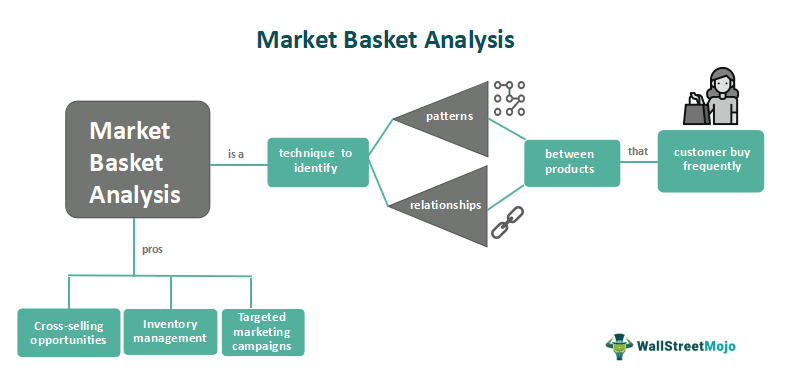

The modern trading landscape has undergone tremendous transformation with the integration of technology, particularly through the development of algorithmic trading. This form of trading, often referred to as algo-trading, utilizes sophisticated computer programs to execute trades at speeds and efficiencies beyond human capability. Algorithmic trading is characterized by its ability to process vast amounts of data in real-time, identify trading opportunities, and execute orders within milliseconds. This capability is augmented by advanced algorithms that can analyze market trends, assess risks, and make decisions without human intervention.

Algo-trading has revolutionized the way financial markets operate, providing enhanced liquidity and reducing transaction costs. It enables market participants to react instantaneously to market changes and to capitalize on price differentials. The speed at which algorithmic trading occurs means it can exploit even the smallest discrepancies in prices, a task that would be impossible through manual trading. This high level of efficiency contributes to more stable and efficient markets, benefiting individual traders and institutional investors alike.



A critical concept within algorithmic trading is the inside market. This term refers to the spread between the highest bid price and the lowest ask price among all market participants. Understanding this concept is essential for grasping the nuances of market operations and price movements. In this article, we explore the intricacies of market dynamics associated with algorithmic trading, with a focus on deciphering the role and function of the inside market. The inside market serves as a barometer for market health, influencing liquidity and trading strategies. As the trading environment continues to evolve, understanding such technical aspects becomes increasingly vital for success in financial markets.

## Table of Contents

## What Is Inside Market?

The inside market is a critical concept in financial trading, representing the spread between the highest bid price and the lowest ask price available in the market. This spread is essential for understanding both market operations and price dynamics, as it reflects the closest prices at which buyers and sellers are willing to transact. The inside market serves as a barometer of supply and demand forces within a trading environment, providing crucial information about market health and liquidity.

A narrow inside market spread often indicates high liquidity, as there is a greater number of participants willing to buy and sell at similar prices. Conversely, a wide spread typically suggests lower liquidity and potentially higher volatility, as fewer transactions are occurring at the bid and ask prices. In highly liquid markets, such as foreign exchange or major stock exchanges, the inside market spread is generally minimal, allowing for more efficient price discovery and reduced transaction costs.

The presence of an active and tight inside market also contributes significantly to enhancing liquidity by ensuring that there are available opportunities for market participants to execute trades without causing large price disruptions. Market makers and liquidity providers play an essential role in maintaining tight spreads by continuously quoting buy and sell prices, thus facilitating smoother market functioning.

Understanding the conditions of the inside market can be valuable for traders in making informed decisions. Changes in the spread can signal shifts in market sentiment or potential upcoming price movements. For instance, a sudden widening of the spread might imply increased uncertainty or reduced market confidence, prompting traders to adjust their strategies accordingly.

In summary, the inside market is a foundational concept for understanding market dynamics. It provides insight into the health of the market and plays a vital role in [liquidity](/wiki/liquidity-risk-premium) provision, contributing to more efficient and effective trading environments.

## Understanding Inside Market Operations

Market operations, particularly within the context of [algorithmic trading](/wiki/algorithmic-trading), hinge on a nuanced comprehension of bids, asks, and spreads. These elements dictate the price discovery process and the liquidity dynamics in financial markets. The inside market, defined by the highest bid price and the lowest ask price, provides the tightest spread available for a given asset, reflecting the best available prices that market participants are willing to transact at.

Historically, market makers played a pivotal role in determining the inside market by continuously quoting bid and ask prices, thereby providing liquidity and facilitating trades. Market makers would profit from the spread between the bid and ask prices and manage inventory risks by adjusting quotes in response to supply and demand changes. This practice ensured liquidity and smoother market operations, particularly for less liquid stocks or during volatile periods.

With the advancement of electronic trading, there has been a significant evolution in market dynamics. The advent of electronic trading platforms has led to increased transparency and efficiency, as these platforms can aggregate information from various market participants more effectively than traditional floor trading environments. In the electronic setting, multiple participants can simultaneously place bids and asks, automating the process of price discovery and reducing the time latency associated with manual order processing.

Algorithmic trading has further transformed the role of the inside market by enabling traders to execute complex strategies that rely on detailed [order book](/wiki/order-book-trading-strategies) information. Algorithms can assess the inside market in real time, allowing them to capitalize on fleeting opportunities. They can swiftly execute trades when conditions meet predefined criteria, optimizing execution speed and minimizing market impact.

Understanding the operations of the inside market is crucial for evaluating market health. A narrow bid-ask spread typically indicates a liquid and efficient market, where the cost for trading is minimized, and the price discovery process is robust. Conversely, a widening spread could suggest decreased liquidity, possibly due to heightened [volatility](/wiki/volatility-trading-strategies) or diminishing participant confidence.

This understanding also underscores the shift from traditional market-making to algorithmic strategies that can emulate market-maker behaviors. Algorithms can dynamically adjust their positions on either side of the market, replicating the role of market makers without the same level of inventory risk, and providing liquidity under varying market conditions.

Overall, the inside market represents a confluence of participant actions and technological advancements that shape the modern trading ecosystem. By comprehending its operations, traders and institutions can better navigate the complexities of financial markets, optimizing their strategies for improved performance and risk management.

## Inside Market and Algorithmic Trading

Algorithmic trading leverages the unique attributes of the inside market to execute trades with precision and speed. At its core, the inside market represents the narrowest spread between the highest bid and the lowest ask price, providing a snapshot of the most competitive trading range available. Algorithms use these bid and ask prices to make immediate trading decisions based on predetermined criteria, such as price movements, [volume](/wiki/volume-trading-strategy) thresholds, or order book imbalances.

A primary example of how algorithms react to changes in the inside market is through liquidity provision. Algorithms can be programmed to enter and [exit](/wiki/exit-strategy) positions as soon as the inside market fluctuates beyond a certain threshold. For instance, in a market-making strategy, an algorithm might continually update its buy and sell orders to stabilize the spread at the inside market levels, thereby enhancing liquidity and market efficiency.

Another critical example is the use of algorithms in [arbitrage](/wiki/arbitrage) strategies, where they exploit discrepancies in price across different markets or instruments. The swift reaction time of these algorithms allows traders to capitalize on even minute differences in the inside spreads before the market corrects itself. By continuously scanning multiple markets, the algorithm identifies opportunities whereby an asset might be underpriced in one market relative to another, initiating trades that exploit these inefficiencies.

Understanding the dynamics of the inside market is essential for the development of robust algorithmic trading strategies. Algorithms are designed to adapt to market conditions in real time, which requires a thorough analysis of historical data and market behavior. This involves creating predictive models and implementing [machine learning](/wiki/machine-learning) techniques to anticipate future changes in bid-ask spreads, thus optimizing trading outcomes.

Python, due to its extensive libraries and frameworks, is often used to implement these strategies. For example, using the `pandas` library, a trader could analyze historical inside market data to train algorithms on recognizing patterns indicative of profitable trading opportunities:

```python
import pandas as pd

# Load historical bid-ask spread data
data = pd.read_csv('historical_spreads.csv')

# Calculate the moving average of the spread to identify trends
data['moving_avg'] = data['spread'].rolling(window=50).mean()

# Logic for identifying trading signals based on the moving average
signals = data[data['spread'] < data['moving_avg']]

# Example output of identified signals
print(signals)
```

This understanding of inside markets not only informs the creation of trading algorithms but is vital for risk management. Reducing adverse selection and avoiding liquidity traps are essential components of a well-rounded algorithmic trading strategy that operates efficiently within the inside market. As technology continues to evolve, the ability to harness these dynamics effectively will be pivotal in maintaining a competitive edge in algorithmic trading.

## Examples of Inside Market in Algorithmic Trading

Algorithmic trading harnesses the power of computers and mathematical models to execute trades at lightning speed and precision. Within this framework, the concept of the inside market is pivotal, particularly in strategies such as arbitrage, market-making, and trend-following.

**Arbitrage Strategies**

In arbitrage, traders exploit price discrepancies of the same asset across different markets or exchanges. The inside market provides crucial information by identifying the tightest bid-ask spread. Arbitrage algorithms are designed to monitor and react to such spreads in real-time. For example, consider a situation where a stock is priced at $100 to $100.05 in Market A (inside market spread) and $99.95 to $100 in Market B. An arbitrage algorithm can instantly detect and trade on the price disparity to secure a risk-free profit. The formula for potential arbitrage profit (P) from a spread difference can be expressed as:

$$
P = \text{Bid}_\text{Market B} - \text{Ask}_\text{Market A}
$$

**Market-Making**

Market-making algorithms aim to provide liquidity by continuously quoting buy and sell prices. These algorithms rely on inside market data to adjust their bids and asks, ensuring they offer competitive pricing while balancing inventory risks. For instance, if an algorithm detects a narrow inside spread with high trading volumes, it may decide to increase its position size to capture the higher liquidity. By constantly updating quotes, these algorithms help stabilize the market and narrow spreads, contributing to overall market efficiency.

**Trend-Following Strategies**

Trend-following strategies capitalize on the [momentum](/wiki/momentum) of asset price movements. By analyzing changes in the inside market, these algorithms sense shifts in market sentiment. As the bid-ask spread tightens or widens, a trend-following algorithm might interpret this as a signal to enter or exit a position. For example, if a narrowing spread is detected alongside increasing bid prices, the algorithm might interpret this as a bullish trend and initiate a buying position.

**High-Frequency Trading**

High-frequency trading ([HFT](/wiki/high-frequency-trading-strategies)) strategies are highly dependent on minute changes in inside market spreads. HFT algorithms execute numerous trades in fractions of a second to exploit fleeting opportunities. These algorithms leverage their speed to capture small gains repeatedly, driven by even the slightest variations in bid and ask prices. The success of HFT is predicated on latency—the time delay before the transfer of data begins following an instruction for its transfer—and the algorithm's ability to anticipate and jump ahead in the order queue.

In conclusion, utilizing inside market dynamics within algorithmic trading allows for sophisticated strategies that exploit small, often transient, market inefficiencies. As technology continues to advance, the precision and speed of these algorithms will likely improve, further enhancing their capacity to capitalize on inside market conditions.

## Challenges and Considerations

Trading based on the inside market provides several advantages, such as enhanced liquidity and the ability to execute trades with greater speed and efficiency. However, it also presents a range of challenges that can complicate trading strategies and market operations. One of the primary challenges is increased market volatility, which can arise from the rapid execution of trades by algorithms. Due to the swift nature of these trades, sudden shifts in supply and demand can occur, leading to sharp price movements that may not accurately reflect the true state of the underlying market.

Additionally, the inside market is susceptible to potential manipulation. Traders or market participants might attempt to artificially influence the highest bid or the lowest ask prices to create an illusion of market movement or liquidity, a practice sometimes known as spoofing. This can mislead other traders and algorithms into making decisions based on distorted market data, undermining market integrity.

Regulatory considerations are crucial in addressing these challenges. Authorities such as the U.S. Securities and Exchange Commission (SEC) and the European Securities and Markets Authority (ESMA) have instituted measures to prevent market abuse, such as monitoring for suspicious trading patterns and implementing penalties for unethical practices. Despite these efforts, the fast-paced nature of algorithmic trading requires continuous advancements in regulatory frameworks to keep pace with technological developments.

Moreover, there is a growing need for ethical frameworks within the field of algorithmic trading. Ensuring that algorithms are designed and deployed in a manner that promotes fair and transparent trading is essential. This involves adhering to best practices in algorithm development, such as rigorous testing and compliance with legal standards before deploying trading systems in a live environment.

In conclusion, while trading based on the inside market offers significant potential for improving market operations and trading outcomes, it necessitates careful consideration of the associated risks and challenges. By addressing issues such as volatility, manipulation, and ethical compliance, market participants can better harness the benefits of algorithmic trading while maintaining market integrity and stability.

## Conclusion

The inside market serves as a foundational concept for algorithmic trading, playing a crucial role in determining the highest bid and lowest ask within a trading environment. For traders and algorithmic systems, understanding and leveraging the dynamics of the inside market can lead to the realization of significant trading opportunities. By effectively navigating these market nuances, traders can enhance market efficiency by improving liquidity and reducing transaction costs. 

As technology continues to advance, the landscape of algorithmic trading is poised for further transformation. Enhanced computational capabilities, coupled with sophisticated algorithms, are making it possible to analyze and react to market data with unprecedented speed and precision. This progress is expected to pave the way for more innovative trading strategies that adapt to evolving market conditions. 

The future of algorithmic trading will likely see an increased integration of machine learning and [artificial intelligence](/wiki/ai-artificial-intelligence), allowing systems to predict market trends and execute trades with minimal human intervention. As these technologies mature, they will play a pivotal role in shaping the efficacy and competitiveness of algorithms in financial markets. Understanding the inside market not only equips traders to maximize these technological advancements but also prepares them to contribute to an era of trading marked by efficiency and dynamic adaptability.

## References & Further Reading

[1]: Bergstra, J., Bardenet, R., Bengio, Y., & Kégl, B. (2011). ["Algorithms for Hyper-Parameter Optimization."](https://papers.nips.cc/paper/4443-algorithms-for-hyper-parameter-optimization) Advances in Neural Information Processing Systems 24.

[2]: ["Advances in Financial Machine Learning"](https://www.amazon.com/Advances-Financial-Machine-Learning-Marcos/dp/1119482089) by Marcos Lopez de Prado

[3]: ["Evidence-Based Technical Analysis: Applying the Scientific Method and Statistical Inference to Trading Signals"](https://www.amazon.com/Evidence-Based-Technical-Analysis-Scientific-Statistical/dp/0470008741) by David Aronson

[4]: ["Machine Learning for Algorithmic Trading"](https://github.com/stefan-jansen/machine-learning-for-trading) by Stefan Jansen

[5]: ["Quantitative Trading: How to Build Your Own Algorithmic Trading Business"](https://www.amazon.com/Quantitative-Trading-Build-Algorithmic-Business/dp/1119800064) by Ernest P. Chan