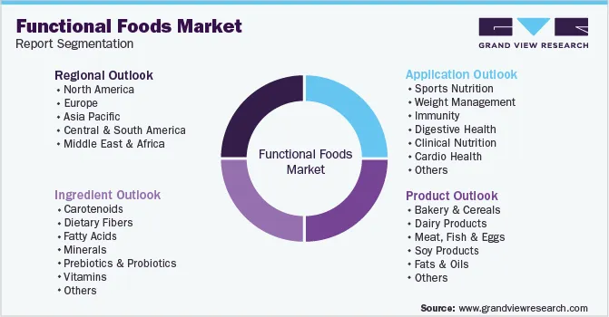

## Table of Contents

## What is an inside market?

An inside market is a term used in finance to describe the best available bid and ask prices for a security at a given time. It shows the highest price someone is willing to pay to buy the security (the bid) and the lowest price someone is willing to sell it for (the ask). This information is very important for traders because it helps them understand the current market conditions and make better trading decisions.

The inside market is often shown on trading platforms and financial news websites. It helps traders see how much they might have to pay to buy a security or how much they could get if they sell it. By looking at the inside market, traders can decide if the current prices are good for them or if they should wait for a better opportunity.

## How does the inside market differ from other types of markets?

The inside market is different from other types of markets because it focuses on the best current prices for buying and selling a security. It shows the highest price someone is willing to pay to buy (the bid) and the lowest price someone is willing to sell (the ask). Other markets might show a wider range of prices or might not update as quickly. For example, a general stock market might show all the different prices people are willing to buy and sell at, not just the best ones.

Another difference is that the inside market is very specific and real-time. It's like a snapshot of the best prices at that very moment. Other markets, like commodity markets or foreign exchange markets, might show trends over time or average prices. These markets can be useful for understanding long-term patterns, but they don't give you the immediate, best price information that the inside market does. So, if you need to make a quick trading decision, the inside market is the most helpful.

## What are the key components of an inside market?

The inside market has two main parts: the bid price and the ask price. The bid price is the highest amount someone is willing to pay to buy a security right now. It's like someone saying, "I'll give you this much money for that stock." The ask price is the lowest amount someone is willing to sell the security for. It's like someone saying, "I want at least this much money to sell my stock."

These two prices together show the best current prices for buying and selling. They are important because they help traders decide if they should buy or sell at that moment. If the bid price is high and close to the ask price, it means there's a lot of interest in the security, and it might be a good time to trade. If the prices are far apart, it might be better to wait for a better opportunity.

## How does the inside market function on a daily basis?

Every day, the inside market works by showing the best prices for buying and selling a security. Traders and investors use computers and trading platforms to see these prices. The bid price is the highest amount someone is willing to pay to buy the security right now, and the ask price is the lowest amount someone is willing to sell it for. These prices change all the time because people are always making new offers to buy and sell. If someone offers a higher bid or a lower ask, the inside market updates to show the new best prices.

Throughout the day, the inside market helps traders make quick decisions. If a trader sees that the bid and ask prices are close together, it might mean there's a lot of interest in the security, and it could be a good time to trade. If the prices are far apart, the trader might decide to wait for a better opportunity. The inside market is always moving and changing, reflecting what people are willing to do at that moment. This real-time information is really important for anyone trying to buy or sell securities.

## What are the primary benefits of trading within an inside market?

Trading within an inside market has several key benefits. One big advantage is that it gives you the best prices available at any given moment. When you see the bid and ask prices, you know the highest amount someone is willing to pay to buy and the lowest amount someone is willing to sell. This helps you make smart choices about when to buy or sell, so you can get the best deal possible.

Another benefit is that the inside market is always up-to-date. It changes in real-time as people make new offers to buy and sell. This means you can react quickly to changes in the market. If you see that the prices are close together, it might be a good time to trade because there's a lot of interest in the security. If the prices are far apart, you might decide to wait for a better chance. The inside market helps you stay on top of things and make the best decisions for your trading.

## What are the common challenges faced by participants in an inside market?

One common challenge in an inside market is that the prices can change very quickly. Since the inside market shows the best prices at that moment, it can be hard to keep up with all the changes. If you're not watching closely, you might miss out on a good price or end up buying or selling at a less favorable one. This fast pace can be stressful and requires you to stay focused and make quick decisions.

Another challenge is that the inside market can be affected by big traders or market makers. These are people or companies that buy and sell a lot of securities. They can influence the bid and ask prices, making it harder for smaller traders to get the best deals. Sometimes, the prices might not reflect the true value of the security because of these big players. This can make it tricky to decide when to trade and can lead to losses if you're not careful.

## How does regulation impact the operation of an inside market?

Regulation plays a big role in how an inside market works. Rules set by government agencies make sure that the market is fair and that everyone gets the same information. For example, they might require that all trades are reported quickly so that the bid and ask prices are always up-to-date. This helps traders see the best prices and make smart choices. Without these rules, some people might have an advantage, and the market wouldn't be fair.

Regulations also help prevent bad things like fraud and market manipulation. If someone tries to cheat by making fake offers to change the inside market prices, they can get in trouble. This keeps the market honest and helps traders trust that the prices they see are real. Overall, good regulation makes the inside market a safer and more reliable place to trade.

## What technologies are used to facilitate transactions in an inside market?

Computers and trading platforms are the main technologies used to help with transactions in an inside market. These platforms show the best prices for buying and selling a security at any moment. They update in real-time, so traders can see the latest bid and ask prices quickly. This helps traders make fast decisions about when to buy or sell. The platforms also let traders place their own orders to buy or sell, which can change the inside market prices.

Another important technology is the electronic communication network (ECN). ECNs connect buyers and sellers directly, without needing a middleman like a stockbroker. This can make trading faster and cheaper. ECNs also help make sure that the inside market prices are fair and accurate because they show what real people are willing to pay or accept for a security. Together, these technologies make it easier for traders to use the inside market and get the best deals.

## How do market makers contribute to the liquidity of an inside market?

Market makers help keep the inside market liquid by always being ready to buy and sell securities. They put up their own money to make sure there's always someone to trade with. This means if you want to buy a security, a market maker will sell it to you, and if you want to sell, they will buy it from you. By doing this, they make it easier for everyone to trade quickly and smoothly. Without market makers, it could be hard to find someone to trade with, and the inside market might not work as well.

Market makers also help keep the inside market stable. They set the bid and ask prices, which are the best prices for buying and selling at any moment. By doing this, they help control how much the prices change. If there are too many people wanting to sell and not enough wanting to buy, the market maker will buy securities to keep the prices from falling too fast. And if too many people want to buy, they will sell securities to keep the prices from going up too fast. This helps the inside market stay calm and makes it easier for traders to make decisions.

## What role do algorithms play in the trading strategies within an inside market?

Algorithms are like smart computer programs that help traders make decisions in the inside market. They can look at a lot of information very quickly, like the best prices for buying and selling a security. Traders use these algorithms to find the best times to buy or sell. For example, an algorithm might see that the bid and ask prices are close together and tell the trader it's a good time to trade. This can help traders make money by getting the best deals.

Algorithms also help traders follow their trading plans without getting too emotional. Sometimes, people can get excited or scared and make bad choices. But an algorithm doesn't feel these emotions. It just follows the rules the trader set up. This can make trading more consistent and less risky. By using algorithms, traders can take advantage of the fast-changing prices in the inside market and make better decisions.

## How can one assess the performance and efficiency of an inside market?

To assess the performance and efficiency of an inside market, you can look at how quickly the prices change and how close the bid and ask prices are to each other. If the prices update fast, it means the market is working well and giving traders the latest information. When the bid and ask prices are close, it shows that there's a lot of interest in the security, and it's easier for traders to buy and sell at good prices. This makes the market more efficient because traders can make quick decisions and get good deals.

Another way to check the inside market's performance is by looking at how much trading happens and how easy it is to buy or sell. If a lot of people are trading, it means the market is liquid, and it's easier to find someone to trade with. This is important because it helps keep the market moving smoothly. Also, if the market has good technology and rules to make sure everything is fair, it can help traders trust the market and trade more confidently. By looking at these things, you can tell if the inside market is working well and helping traders do their best.

## What are the future trends and potential developments for inside markets?

In the future, inside markets might use even more advanced technology to make trading faster and easier. Computers and algorithms will get better at looking at lots of information quickly. This could help traders find the best prices and make smart choices even faster. Also, more people might start using mobile apps to trade on the go. This would make it easier for anyone to check the inside market and buy or sell securities from their phone. As technology keeps improving, the inside market could become more efficient and accessible to everyone.

Another trend could be more rules to make sure the inside market stays fair and safe. Governments might make new laws to stop cheating and make sure everyone gets the same information. This would help traders trust the market more and feel confident when they trade. Also, there might be more ways to trade different kinds of securities, like cryptocurrencies, in the inside market. This could make the market more interesting and give traders more options to choose from. Overall, the inside market could become a better place for trading in the future, thanks to technology and better rules.

## What are examples of inside market in algorithmic trading?

Algorithmic trading harnesses the power of computers and mathematical models to execute trades at lightning speed and precision. Within this framework, the concept of the inside market is pivotal, particularly in strategies such as [arbitrage](/wiki/arbitrage), market-making, and trend-following.

**Arbitrage Strategies**

In arbitrage, traders exploit price discrepancies of the same asset across different markets or exchanges. The inside market provides crucial information by identifying the tightest bid-ask spread. Arbitrage algorithms are designed to monitor and react to such spreads in real-time. For example, consider a situation where a stock is priced at $100 to $100.05 in Market A (inside market spread) and $99.95 to $100 in Market B. An arbitrage algorithm can instantly detect and trade on the price disparity to secure a risk-free profit. The formula for potential arbitrage profit (P) from a spread difference can be expressed as:

$$
P = \text{Bid}_\text{Market B} - \text{Ask}_\text{Market A}
$$

**Market-Making**

Market-making algorithms aim to provide [liquidity](/wiki/liquidity-risk-premium) by continuously quoting buy and sell prices. These algorithms rely on inside market data to adjust their bids and asks, ensuring they offer competitive pricing while balancing inventory risks. For instance, if an algorithm detects a narrow inside spread with high trading volumes, it may decide to increase its position size to capture the higher liquidity. By constantly updating quotes, these algorithms help stabilize the market and narrow spreads, contributing to overall market efficiency.

**Trend-Following Strategies**

Trend-following strategies capitalize on the [momentum](/wiki/momentum) of asset price movements. By analyzing changes in the inside market, these algorithms sense shifts in market sentiment. As the bid-ask spread tightens or widens, a trend-following algorithm might interpret this as a signal to enter or [exit](/wiki/exit-strategy) a position. For example, if a narrowing spread is detected alongside increasing bid prices, the algorithm might interpret this as a bullish trend and initiate a buying position.

**High-Frequency Trading**

High-frequency trading ([HFT](/wiki/high-frequency-trading-strategies)) strategies are highly dependent on minute changes in inside market spreads. HFT algorithms execute numerous trades in fractions of a second to exploit fleeting opportunities. These algorithms leverage their speed to capture small gains repeatedly, driven by even the slightest variations in bid and ask prices. The success of HFT is predicated on latency—the time delay before the transfer of data begins following an instruction for its transfer—and the algorithm's ability to anticipate and jump ahead in the order queue.

In conclusion, utilizing inside market dynamics within [algorithmic trading](/wiki/algorithmic-trading) allows for sophisticated strategies that exploit small, often transient, market inefficiencies. As technology continues to advance, the precision and speed of these algorithms will likely improve, further enhancing their capacity to capitalize on inside market conditions.

## References & Further Reading

[1]: Bergstra, J., Bardenet, R., Bengio, Y., & Kégl, B. (2011). ["Algorithms for Hyper-Parameter Optimization."](https://papers.nips.cc/paper/4443-algorithms-for-hyper-parameter-optimization) Advances in Neural Information Processing Systems 24.

[2]: ["Advances in Financial Machine Learning"](https://www.amazon.com/Advances-Financial-Machine-Learning-Marcos/dp/1119482089) by Marcos Lopez de Prado

[3]: ["Evidence-Based Technical Analysis: Applying the Scientific Method and Statistical Inference to Trading Signals"](https://www.amazon.com/Evidence-Based-Technical-Analysis-Scientific-Statistical/dp/0470008741) by David Aronson

[4]: ["Machine Learning for Algorithmic Trading"](https://github.com/stefan-jansen/machine-learning-for-trading) by Stefan Jansen

[5]: ["Quantitative Trading: How to Build Your Own Algorithmic Trading Business"](https://www.amazon.com/Quantitative-Trading-Build-Algorithmic-Business/dp/1119800064) by Ernest P. Chan