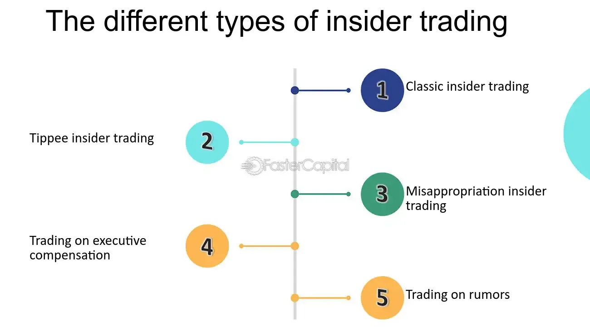

## Table of Contents

## What is insider buying?

Insider buying happens when people who work at a company, like executives or directors, buy shares of their own company's stock. These people are called insiders because they know a lot about what's going on inside the company. When they buy shares, it often means they think the company is doing well and its stock price might go up.

Seeing insiders buy stock can be a good sign for other investors. It shows that the people who know the company best believe in its future. However, it's important to remember that insider buying is just one piece of information. Investors should look at other things too, like the company's financial health and what's happening in the market, before deciding to buy the stock themselves.

## Who are considered insiders in a company?

Insiders in a company are people who have a special connection to the business. They usually work there or have a big say in how things are run. This group includes people like the CEO, other top executives, and members of the board of directors. They are called insiders because they know a lot about what's going on inside the company, more than the average person.

Sometimes, insiders can also be people who own a lot of the company's stock, even if they don't work there. These big shareholders can influence decisions and have access to important information. Knowing who the insiders are can help investors understand why certain things happen with the company's stock, like when insiders buy or sell shares.

## Why is insider buying important to investors?

Insider buying is important to investors because it can show that the people who know the company best believe it will do well. When insiders like the CEO or board members buy more stock, it often means they think the company's future looks bright. This can make other investors feel more confident about buying the stock too.

However, insider buying is just one piece of the puzzle. Investors should not base their decisions only on this. They need to look at other things too, like the company's financial reports and what's happening in the market. Insider buying can be a good sign, but it's important to consider all the information before making an investment choice.

## How can insider buying be identified?

Insider buying can be identified by looking at official reports that companies have to file with the government. In the United States, these reports are called Form 4 and are filed with the Securities and Exchange Commission (SEC). These forms show when insiders, like the CEO or board members, buy or sell the company's stock. You can find these reports on the SEC's website or on financial news websites that track insider transactions.

Another way to spot insider buying is by using financial news services or stock market websites that keep track of insider activity. These services often have tools that let you see a list of recent insider transactions for a company. They might also send alerts when there's a lot of insider buying happening. By keeping an eye on these sources, investors can stay updated on insider buying and use that information to help make their investment decisions.

## What are the different types of insider buying?

Insider buying can happen in different ways. One way is when insiders buy shares on the open market, just like regular investors. They go to the stock exchange and buy the company's stock at the current price. This is the most common type of insider buying and it's easy to see because they have to report it to the government.

Another type of insider buying is when insiders get stock options from the company. These options let them buy the company's stock at a special price, which is usually lower than what it's selling for on the market. When insiders use these options to buy stock, it's also considered insider buying. This type of buying can show that insiders believe in the company's future because they're willing to buy more stock even if they could sell their options for a profit.

## What is the difference between open market purchases and private transactions in insider buying?

Open market purchases happen when insiders buy their company's stock on the stock exchange, just like any other investor. They go to the market and buy shares at the current price. This type of buying is easy to see because insiders have to report these transactions to the government. When insiders buy on the open market, it often means they think the stock is a good buy at the current price, which can be a positive sign for other investors.

Private transactions, on the other hand, happen away from the public stock exchange. These are deals made directly between the insider and another person, like a big shareholder. These transactions don't always have to be reported right away, so they can be harder to track. Private transactions might happen for different reasons, like settling a debt or as part of a bigger business deal, and they don't always mean the same thing as open market purchases.

## How does insider buying impact stock prices?

Insider buying can make a company's stock price go up. When people inside the company, like the CEO or board members, buy more stock, it sends a message to other investors. It tells them that the people who know the company best think it's going to do well. This can make other investors want to buy the stock too, which can push the price higher. If a lot of insiders are buying at the same time, it can create a big wave of interest and make the stock price rise even more.

However, insider buying doesn't always mean the stock price will go up right away. Sometimes, the market might not react much if the buying is small or if there are other big things happening that affect the stock price more. Also, if insiders are buying for reasons that don't mean the company is doing better, like getting stock options, it might not have a big impact on the price. So, while insider buying can be a good sign, it's just one piece of information investors should look at.

## What are the legal requirements and regulations surrounding insider buying?

In the United States, insiders have to follow strict rules when they buy or sell their company's stock. They need to report their trades to the Securities and Exchange Commission (SEC) using a form called Form 4. This form has to be filed within two business days after the trade happens. The SEC makes these reports public so everyone can see what insiders are doing with their stock. This helps keep things fair and open for all investors.

There are also rules to stop insiders from using secret information to make money. This is called insider trading, and it's against the law. Insiders can't buy or sell stock if they know something important that other people don't know yet. For example, if they know their company is about to announce good news, they can't buy stock before the news comes out. The SEC watches closely to make sure insiders follow these rules and can punish them if they break the law.

## How can insider buying be used as a tool for investment analysis?

Insider buying can be a helpful tool for investors trying to figure out if a company's stock is a good buy. When people inside the company, like the CEO or board members, buy more stock, it often means they think the company is going to do well. This can be a good sign for other investors because insiders know a lot about what's going on inside the company. If a lot of insiders are buying at the same time, it might mean the stock is undervalued and could go up in price. Investors can look at these insider buying reports to help decide if they want to buy the stock too.

However, insider buying is just one piece of information investors should look at. It's important to also check the company's financial health, what's happening in the market, and other news about the company. Sometimes, insiders might buy stock for reasons that don't mean the company is doing better, like getting stock options. So, while insider buying can be a good sign, it's not the only thing to consider. Investors should use it along with other information to make smart choices about where to put their money.

## What are some notable examples of insider buying that led to significant stock price changes?

One famous example of insider buying that led to a big stock price change happened with Warren Buffett and Berkshire Hathaway. In 2012, Buffett bought millions of dollars worth of his own company's stock. When people saw that Buffett, who is known for being a smart investor, was buying more of his own company's stock, they wanted to buy it too. This made the price of Berkshire Hathaway's stock go up a lot. It showed how powerful it can be when insiders buy their own company's stock and other investors follow their lead.

Another example is with Netflix in 2018. The CEO, Reed Hastings, bought a lot of Netflix stock. This was a big deal because it showed that Hastings believed in Netflix's future, even though the stock had been going down. When other investors saw this, they started buying Netflix stock too. This helped push the stock price back up. It's a good example of how insider buying can help turn things around for a company's stock price.

## How does insider buying differ across various industries?

Insider buying can look different depending on the industry. In tech companies, insider buying might happen a lot because these companies often give their employees stock options. When tech insiders use these options to buy more stock, it can show they believe in the company's future, even if the stock price is going up and down a lot. In the finance industry, like banks and investment firms, insider buying might be more about showing confidence in the company's stability and growth. Insiders in finance might buy stock to show they think the company is doing well, especially during times when the economy is shaky.

In industries like healthcare and biotech, insider buying can be a big deal because these companies often work on new drugs or treatments that can take a long time to develop. When insiders in these companies buy stock, it might mean they think a new product is going to be successful. This can be a strong signal for investors because it shows the insiders believe in the company's long-term plans. Each industry has its own reasons for insider buying, but it always comes down to insiders showing they believe in their company's future.

## What advanced metrics and analyses can be applied to evaluate the significance of insider buying?

To really understand how important insider buying is, investors can use some advanced ways to look at the data. One way is to check the "Insider Buying Ratio," which is the number of insiders buying stock compared to the number selling it. A high ratio can mean insiders are feeling good about the company's future. Another useful metric is the "Cluster Buying," which happens when a bunch of insiders buy stock around the same time. This can be a strong sign that something good is about to happen with the company. Also, looking at the "Volume of Insider Buying" can help. If insiders are buying a lot of stock, it might mean they think the stock is a good deal at its current price.

Another way to dig deeper into insider buying is by using "Sentiment Analysis." This involves looking at what insiders say in public, like in interviews or on social media, to see if their words match their actions. If insiders are buying stock and also talking positively about the company, it can make their buying even more meaningful. "Price-to-Insider-Buying Ratio" is another tool that compares the stock's price to how much insiders are buying. A low ratio might mean the stock is undervalued, which can be a good sign for investors. By using these advanced metrics and analyses, investors can get a better picture of what insider buying really means for a company's stock.

## References & Further Reading

[1]: Lakonishok, J., & Lee, I. (2001). ["Are insider trades informative?"](https://academic.oup.com/rfs/article/14/1/79/1587398) Review of Financial Studies, 14(1), 79-111.

[2]: Abarbanell, J. S., & Bushee, B. J. (1997). ["Fundamental analysis, future earnings, and stock prices."](https://www.jstor.org/stable/2491464) Journal of Accounting Research, 35(1), 1-24.

[3]: Jegadeesh, N., & Kim, W. (2010). ["Do analysts herd? An analysis of recommendations and market reactions."](https://www.nber.org/system/files/working_papers/w12866/w12866.pdf) Review of Financial Studies, 23(2), 901-937.

[4]: Hirschey, M., & Zaima, J. K. (1989). ["Insider trading, ownership and the market evaluation of firm performance."](https://www.jstor.org/stable/2328619) Journal of Financial Review, 24(1), 1-12.

[5]: Lopez de Prado, M. (2018). ["Advances in Financial Machine Learning"](https://www.amazon.com/Advances-Financial-Machine-Learning-Marcos/dp/1119482089). Wiley.