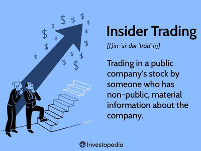

The intersection of insider buying, stock transactions, and algorithmic trading represents a dynamic area of financial markets that has garnered increasing interest from investors and analysts alike. Insider buying refers to the purchase of a company’s shares by its executives, directors, or employees. This activity is often viewed as a strong indicator of potential stock value appreciation because those within the company—who possess greater access to confidential information—are willing to invest their own capital, implying confidence in the firm's future performance. Studies have repeatedly shown that insider buying can be a precursor to positive stock movements, serving as a valuable signal to external investors looking for opportunities in the stock market.

Algorithmic trading, on the other hand, has revolutionized the manner in which stock transactions are executed. By employing sophisticated algorithms to make trading decisions, this approach offers advantages in terms of speed, efficiency, and precision. With the ability to analyze vast datasets and execute trades at fractions of a second, algorithmic trading minimizes human error and exploits small discrepancies in pricing across markets more effectively than traditional trading methods.



Combining insider buying insights with algorithmic trading strategies offers unique advantages and can optimize investment strategies for superior outcomes. By integrating insider buying patterns into algorithmic frameworks, investors can enhance their decision-making processes. This blending of strategies allows for the development of more nuanced trading algorithms that not only react to market movements but also incorporate insights from insider activities. As a result, such a combined approach could potentially yield greater returns by leveraging both the human element of insider confidence and the computational power of automated trading systems.

## Table of Contents

## Understanding Insider Buying

Insider buying is a legal activity where corporate insiders, such as executives, directors, or employees, purchase shares of their own company's stock. This activity is significant because it can indicate the insiders' confidence in the company's future performance. It is vital to distinguish insider buying from illegal insider trading, which involves trading based on non-public, material information and violates securities laws.

In the United States, insider buying is regulated by the Securities and Exchange Commission (SEC). Insiders must follow a legal framework that requires the disclosure of their trading activities to the SEC within a specified period. This is primarily governed by Section 16 of the Securities Exchange Act of 1934, which mandates insiders report their purchases and sales of company stock within two business days using the Form 4. This transparency allows the public and investors to access this data, helping them make informed investment decisions.

Insider transactions can have significant implications for stock prices and market perceptions. When company insiders are buying shares, it often signals to the market that they believe the stock is undervalued or that they expect positive future developments. This can lead to increased investor confidence and potentially drive up the stock price. Conversely, insider selling may lead to negative perceptions, although it is essential to consider that sales could occur for various reasons unrelated to the company's performance, such as personal financial needs.

Investors typically consider several indicators when analyzing insider buying patterns. These include:

1. **Frequency and Volume**: More frequent and larger-volume purchases may suggest stronger insider conviction.
2. **Timing**: Purchases made shortly before significant corporate announcements may hold particular significance.
3. **Market Context**: Understanding whether insider buying occurs during market downturns or when the stock is underperforming can add insights.
4. **Insider Position**: Transactions by high-level executives like CEOs and CFOs might carry more weight than purchases by lower-level employees.

By carefully monitoring these patterns, investors seek to gain insights into the potential future performance of a company, using insider buying as one of the indicators in their broader investment strategy.

## How Insider Buying Influences Stock Transactions

Insider buying, which occurs when executives, directors, or employees purchase shares of their own company's stock, can significantly influence stock transactions. The psychological impact of such actions on external investors is profound. When those with intimate knowledge of a company's operations and prospects invest their own capital, it often suggests confidence in the company's future, thereby influencing market perceptions favorably. For instance, studies have shown that external investors may interpret insider buying as a signal of undervaluation and a bullish indicator, prompting their own investment choices [1].

Historical case studies further illustrate the tangible impact of insider buying on stock value. A notable example is the surge in Apple Inc.'s stock following substantial insider purchases in 2008. As insiders acquired shares, investors perceived this as a sign of potential growth, contributing to a notable increase in the stock's market value. Such cases underscore the consequential role that insider buying plays in shaping stock transaction trends and influencing market behavior.

Incorporating insider buying into stock market strategies and investment decisions is a common practice among sophisticated investors. Using insider buying information, investors often adopt a contrarian approach, aligning their strategies with the belief that insiders possess superior insights about their company's true valuation and future performance. Additionally, insider buying data is frequently incorporated into quantitative strategies and models that assess the likelihood of stock price appreciation.

Corporate leaders strategically employ insider buying as a signal of confidence, especially during periods of uncertainty or when a company is embarking on transformative projects. By visibly purchasing shares, executives can communicate their positive outlook and reassure stakeholders about their commitment to the company's success. This strategic use of insider buying helps to build investor confidence, stabilize stock prices, and attract long-term capital investment.

In summary, insider buying exerts considerable influence on stock transactions through its psychological impact on investors, its inclusion in market strategies, and its role as a confidence signal from corporate leadership. When expertly utilized, such transactions can lead to advantageous outcomes in financial markets, underscoring the significance of insider buying as both an indicator and a strategic tool.

---

[1] Lakonishok, J., & Lee, I. (2001). Are insider trades informative? Review of Financial Studies, 14(1), 79-111.

 to Algorithmic Trading

Algorithmic trading refers to the use of computer algorithms to automate trading strategies and execute orders in financial markets. This trading method has become increasingly relevant, as it enables participants to respond to market conditions in real time, allowing for more effective trade execution compared to traditional methods. It leverages mathematical models and statistical analysis to identify potential trading opportunities, which are then executed without human intervention.

The core technology behind [algorithmic trading](/wiki/algorithmic-trading) involves sophisticated software that processes high volumes of data to make decisions. These systems can analyze market conditions, such as price movements and [volume](/wiki/volume-trading-strategy) changes, and execute trades based on predefined criteria. Strategies employed by such systems range from simple rules, like moving average crossovers, to complex models incorporating [machine learning](/wiki/machine-learning) techniques to predict future price changes. Python and C++ are popular programming languages used to develop these algorithms due to their speed and robust libraries.

One of the key advantages of algorithmic trading is its speed. Automated systems can execute orders within microseconds, much faster than human traders, giving them an edge in markets where the timing of trades is crucial. For instance, algorithms capitalize on small price discrepancies across different markets – a strategy known as [arbitrage](/wiki/arbitrage) – exploiting opportunities that are fleeting and can be missed by manual trading.

Efficiency is another advantage, as algorithms can manage high volumes of trades simultaneously without errors that might occur in manual operations. This enables better utilization of market conditions and opportunities, as well as reducing transaction costs by optimizing the timing and size of trades.

Precision is enhanced, as algorithmic trading systems reduce the possibility of human error. These systems follow strict logic and criteria, ensuring the trading decisions adhere to the designed strategy without emotional bias or fatigue affecting their judgment.

A significant component of algorithmic trading is high-frequency trading ([HFT](/wiki/high-frequency-trading-strategies)), which involves rapid buying and selling of securities within very short time frames to capitalize on small price movements. HFT uses sophisticated algorithms and high-speed data feeds, often executing thousands of trades per second. Its impact on market dynamics is substantial, as it adds [liquidity](/wiki/liquidity-risk-premium) and tightens bid-ask spreads. However, it also raises concerns about market [volatility](/wiki/volatility-trading-strategies) and fairness, as only firms with significant technological resources can effectively participate.

In summary, algorithmic trading has transformed modern financial markets by automating and optimizing trade executions. Its advantages in speed, efficiency, and precision make it an indispensable tool for market participants. Understanding its technology and strategies, including the nuances of high-frequency trading, is critical for investors seeking to maximize their returns in today's fast-paced markets.

## Algorithmic Trading Strategies and Their Applications

Algorithmic trading strategies have become integral to modern financial markets, leveraging the power of automation and computational algorithms to execute trades. Popular strategies include trend-following and [statistical arbitrage](/wiki/statistical-arbitrage), among others. These strategies capitalize on market inefficiencies and patterns to generate profits.

Trend-following strategies involve identifying and capitalizing on market trends. Traders using this approach assume that financial instruments that have been moving in a particular direction will continue to do so. The strategy often employs moving averages, [momentum](/wiki/momentum) indicators, and other technical analysis tools to identify trends. For instance, a simple moving average crossover system might buy a stock when a short-term moving average crosses above a long-term moving average, signaling an upward trend.

Statistical arbitrage, on the other hand, involves taking advantage of price differentials between related financial instruments. This strategy uses statistical models to identify pairs or groups of securities that are historically correlated but have temporarily diverged in price. By simultaneously buying and selling the mispriced securities, traders aim to profit from the convergence to their historical relationships.

Algorithm development for trading involves several key stages, beginning with the conceptualization of a strategy. Traders or quants design a hypothesis which is then coded into an algorithm using programming languages like Python. This code outlines the rules for entering and exiting trades. 

Before implementation, the algorithm is rigorously backtested using historical market data to evaluate its performance. This process assesses the robustness of the strategy by simulating how it would have performed in the past, taking into account transaction costs, slippage, and other real-world factors. Python libraries such as pandas and NumPy are commonly used for data manipulation and [backtesting](/wiki/backtesting), while libraries like Zipline offer complete algorithmic trading engines for simulation.

The integration of [artificial intelligence](/wiki/ai-artificial-intelligence) (AI) and machine learning into algorithmic trading has further enhanced strategy sophistication. Machine learning algorithms can analyze vast amounts of market data to detect patterns and make predictive decisions. Techniques such as [reinforcement learning](/wiki/reinforcement-learning), where models learn optimal trading actions through trial and error, and natural language processing (NLP), used to extract trading signals from news articles and sentiment data, are increasingly prevalent.

Despite their advantages, algorithmic trading strategies also face significant risks and challenges. Market conditions can change rapidly, rendering previously successful algorithms ineffective. Overfitting, where models are too closely tailored to historical data, is a common pitfall that can lead to poor real-world performance. Moreover, the reliance on technology introduces operational risks, including software bugs, data feed errors, and cybersecurity threats. Additionally, high-frequency trading, a subset of algorithmic trading that executes numerous trades in milliseconds, has been criticized for its potential to increase market volatility and contribute to flash crashes.

In conclusion, while algorithmic trading strategies offer speed, efficiency, and often greater returns, they require careful development, testing, and risk management to be successful in the dynamic financial markets.

## Combining Insider Buying with Algorithmic Trading

The fusion of insider buying patterns and algorithmic trading algorithms offers a compelling strategy for investors seeking to optimize investment decisions. Insider buying, which involves company executives and key stakeholders purchasing shares of their own company, can signal potential value appreciation and confidence in future growth. Meanwhile, algorithmic trading employs advanced mathematical models and computer programs to execute trades, capitalizing on speed, precision, and efficiency.

### Analyzing Integration of Insider Buying Data in Algorithmic Models

Algorithmic models can incorporate insider buying data through statistical analysis and machine learning techniques. For instance, when insiders purchase their company stock, it often indicates positive expectations, which can be quantified. A typical approach is to employ a regression model where insider buying activities are used as an independent variable to predict future stock price movements.

```python
import pandas as pd
from sklearn.linear_model import LinearRegression

# Sample data: `insider_buying` tracks the amount of stock bought by insiders,
# `stock_price_change` is the stock's subsequent price change
data = {'insider_buying': [1000, 1500, 1100, 1800],
        'stock_price_change': [5.0, 7.2, 6.1, 7.8]}
df = pd.DataFrame(data)

# Fit a linear regression model
X = df[['insider_buying']]
y = df['stock_price_change']
model = LinearRegression().fit(X, y)

# Predict price change for a given volume of insider buying
predicted_change = model.predict([[1300]])
predicted_change
```

The above code demonstrates how regression models can predict the stock price change based on insider buying activity. Incorporating such predictions in trading strategies allows automated systems to dynamically adjust to new insider transactions.

### Multi-Strategy Approaches

Combining insider buying signals with algorithmic efficiencies can involve multiple strategies:

1. **Event-Driven Strategies**: Trigger trades when significant insider buying activity is detected. Algorithms can rapidly respond to these events, adjusting positions based on pre-defined criteria.

2. **Sentiment Analysis**: Analyze public and insider sentiment data concurrently. Algorithms can process large volumes of data, integrating insider trading with news and social media sentiment to formulate a comprehensive market outlook.

3. **Risk Management Techniques**: Implement dynamic stop-loss and take-profit strategies adjusted according to insider activity, maintaining a balance between potential gains and risk exposures.

### Hypothetical Scenarios

Consider an instance where a technology company experiences substantial insider buying. An algorithm tuned for such signals may allocate additional resources to buying shares before a quarterly earnings report, anticipating a positive outcome based on insider confidence. 

Simultaneously, the algorithm could analyze historical price behavior following similar insider patterns to optimize entry and [exit](/wiki/exit-strategy) points. The synergy of these methods can potentially result in outperforming traditional strategies that do not consider insider transactions.

This holistic approach, utilizing both insider buying insights and algorithmic prowess, underscores the strategic advantage that can be attained by bridging human market intuition with data-driven automation.

## Case Studies: Success Stories in Financial Markets

Real-world examples of successful investments utilizing insider buying insights demonstrate the practical significance of this strategy. A notable case occurred in the technology sector when executives of a major software company increased their stakes sharply just before a substantial upward movement in stock price. These transactions were reported and scrutinized by external investors, who then mirrored the trades, resulting in profitable outcomes for those who followed the lead of the insiders. This event highlighted the potential of insider buying to signal future stock appreciation and spotlighted the pattern of buying spikes preceding positive performance forecasts.

Algorithmic trading systems have capitalized on insider buying data to outperform traditional market strategies. By integrating insider transaction information, algorithms can adjust predicted asset movements, enhancing the accuracy of trade recommendations. An example from the past includes a [hedge fund](/wiki/hedge-fund-trading-strategies) that incorporated insider buying signals into its quantitative models. This integration facilitated the early identification of emerging trends, leading to considerable gains during volatile market conditions.

However, not all attempts to leverage insider insights have been successful. Some traders have faced challenges due to the complexity and the potential noise in insider buying signals. In particular, an investment firm faced setbacks when they failed to differentiate between opportunistic and routine insider purchases, leading to suboptimal trade initiations. This failure emphasized the necessity for comprehensive strategy integration and a clear understanding of insider motives.

Industry experts agree that future trends in the combination of insider buying and algorithmic trading involve more sophisticated data analytics and machine learning enhancements. These tools have the potential to refine the understanding of insider patterns and enhance predictive capabilities within trading algorithms. Insider buying data, when paired with technological advancements, holds promise for optimizing investment strategies. Financial analysts advocate for ongoing development in this area, suggesting that the integration of [alternative data](/wiki/best-alternative-data) sources and enhanced algorithmic strategies will establish new benchmarks in investment performance.

Continuous improvement and strategic refinement are essential, as the financial markets evolve rapidly. Historical knowledge combined with cutting-edge technology can provide investors with significant opportunities to capitalize on insider insights.

## Conclusion

Integrating insider buying data with algorithmic trading practices presents significant potential for enhancing investment decisions and portfolio performance. This synthesis can help uncover unique market insights by combining qualitative signals from insider transactions with the quantitative rigor of algorithmic models. Insider buying often indicates a belief in a company's future performance, providing a compelling signal for investment opportunities. When algorithmic systems integrate this data, they can optimize trading strategies by aligning them with patterns of corporate confidence. 

Investors are encouraged to explore these multifaceted strategies to elevate their investment outcomes. The integration of insider buying data with algorithmic mechanisms not only increases investment precision but also allows for more informed and dynamic trading decisions, which can be particularly beneficial in today’s fast-paced and complex financial markets.

Continuous learning and adaptation are essential for thriving in evolving financial markets. The landscape is continuously shifting due to advancements in technology and changes in regulatory frameworks. As a result, both novice and experienced investors should prioritize learning and applying new tools and strategies. This approach is vital to harness the full potential of insider buying signals coupled with algorithmic trading, ensuring robust and adaptive portfolio management.

Looking to the future, insider buying and algorithmic trading are likely to play more significant roles in finance. As algorithmic trading becomes increasingly sophisticated through the integration of artificial intelligence and machine learning, its ability to exploit insider buying data will only improve. Moreover, advancements in data processing and real-time analytics could offer deeper insights into insider transactions, leading to more precise and timely trading decisions.

In summary, the convergence of insider buying and algorithmic trading methodologies offers a promising avenue for enhancing investment strategies. By staying informed and adaptable, investors can harness the full potential of this integration for better risk management and return optimization.

## References & Further Reading

[1]: Lakonishok, J., & Lee, I. (2001). ["Are insider trades informative?"](https://academic.oup.com/rfs/article/14/1/79/1587398) Review of Financial Studies, 14(1), 79-111.

[2]: Abarbanell, J. S., & Bushee, B. J. (1997). ["Fundamental analysis, future earnings, and stock prices."](https://www.jstor.org/stable/2491464) Journal of Accounting Research, 35(1), 1-24.

[3]: Jegadeesh, N., & Kim, W. (2010). ["Do analysts herd? An analysis of recommendations and market reactions."](https://www.nber.org/system/files/working_papers/w12866/w12866.pdf) Review of Financial Studies, 23(2), 901-937.

[4]: Hirschey, M., & Zaima, J. K. (1989). ["Insider trading, ownership and the market evaluation of firm performance."](https://www.jstor.org/stable/2328619) Journal of Financial Review, 24(1), 1-12.

[5]: Lopez de Prado, M. (2018). ["Advances in Financial Machine Learning"](https://www.amazon.com/Advances-Financial-Machine-Learning-Marcos/dp/1119482089). Wiley.