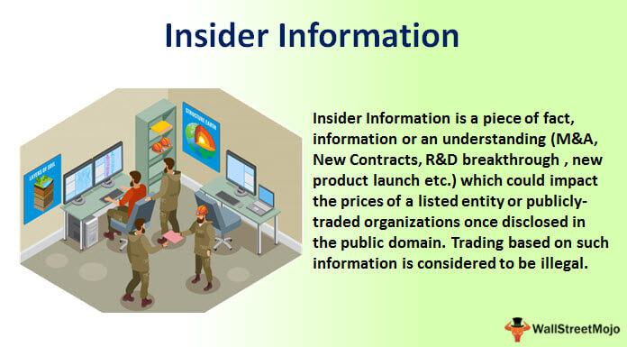

Insider trading often brings to mind images of stock market scandals and corporate misconduct. At its core, insider trading involves the buying or selling of stocks based on confidential information that is not available to the general public. This type of trading can provide significant financial advantages to those with access to privileged information, but it also undermines the principle of fair market practices, potentially harming uninformed investors.

This article examines the complexities of insider information and insider trading, shedding light on the ways in which technology, particularly algorithmic trading, is reshaping the financial landscape. Algorithmic trading uses complex algorithms to execute trades at high speeds, raising new concerns about the potential misuse of insider information. The advent of such technologies has made monitoring and regulating financial markets increasingly challenging.



Understanding the legal framework that governs insider trading is crucial. The laws aim to create a level playing field, where all investors have access to the same information. However, the effectiveness of these laws is constantly tested by the rapid evolution of trading technologies. This article will consider how advancements in technology can simultaneously aid in detection and enforcement while also creating new avenues for potential abuse.

By examining the regulatory landscape and the role of technology in financial markets, we can better understand the ongoing efforts to preserve market integrity and protect investors. As the world of trading continues to evolve, so too must the strategies to combat misuse and maintain trust in financial systems.

## Table of Contents

## Understanding Insider Information

Insider information refers to sensitive data about a company that has not been disclosed to the public. This information is considered material if its disclosure would likely impact an investor's decision to buy or sell the associated stock. Examples include financial earnings, mergers and acquisitions, or significant shifts in product lines. When such information is kept within the confines of a company, it provides those with access a potential unfair advantage in the stock market.

Individuals who might have access to insider information include corporate executives, employees, or external associates such as auditors and consultants. These individuals can potentially influence stock prices significantly by either trading on this information or sharing it with others who might trade. For instance, if a company executive is aware of a forthcoming merger that could enhance the company's profitability, purchasing stock before this information becomes public leverages an unfair advantage.

Under U.S. law, the act of trading stocks based on material, nonpublic information is illegal and categorized as insider trading. This illegality stems from the unfairness this practice introduces to the financial markets. The concept of fairness is rooted in ensuring all investors, regardless of their connections or positions, have equal access to market-relevant information. This principle is central to maintaining trust and integrity in financial systems.

Regulatory bodies, such as the U.S. Securities and Exchange Commission (SEC), oversee the enforcement of laws pertaining to insider information. The SEC closely monitors trading activities to detect potential instances of insider trading, often using sophisticated software to identify unusual trading patterns that coincide with key corporate events. Robust compliance programs within corporations also help mitigate risks by educating employees on legal boundaries and emphasizing adherence to disclosure policies.

## Legal and Illegal Aspects of Insider Trading

Insider trading becomes illegal when individuals engage in trading based on material, nonpublic information. This conduct undermines the principles of market fairness established to ensure all investors have equal access to significant corporate information. The crux of illegal insider trading lies in the advantage that insiders possess due to their access to confidential data not available to the general public, allowing them to potentially skew market outcomes in their favor.

The U.S. Securities and Exchange Commission (SEC) plays a pivotal role in regulating insider trading activities. To uphold transparency and deter illegal practices, the SEC mandates that insiders—such as company executives, directors, and significant shareholders—disclose their trades. These disclosures are typically made through forms like the SEC Form 4, which insiders must file within two business days of executing a transaction. This form lists details about the transacted securities, the nature of the trading activity, and the insider's position, offering the public an opportunity to monitor potential influences on a company's stock valuation.

Legal insider trading, conversely, involves trades that are conducted following full compliance with SEC regulations and often include pre-arranged trading plans. One prevalent method of legal trading is through Rule 10b5-1 plans. This rule provides a defense against accusations of insider trading by allowing corporate insiders to establish predetermined plans for buying or selling stocks, thereby facilitating securities transactions at future dates irrespective of any material nonpublic information the insider may possess at the time of execution.

When an insider creates a Rule 10b5-1 plan, they must do so in good faith at a time when they are not in possession of material nonpublic information. The insider sets the plan to specify the total shares to be bought or sold, the prices at which the transactions will occur—or outline a formula for these details—and the dates on which the trades should take place. This legal framework provides a structured process for insiders to manage their investments without breaching regulatory statutes, thereby supporting a fair trading environment.

The distinction between legal and illegal insider trading emphasizes the balance regulators strive to maintain: enabling insiders to continue legally engaging in financial markets while safeguarding against the misuse of privileged knowledge that could disadvantage other investors.

## High-Profile Insider Trading Cases

Insider trading, characterized by buying or selling publicly-traded securities based on material, non-public information, carries significant legal and ethical implications. High-profile cases have vividly illustrated these boundaries, underscoring the serious consequences for those involved.

One of the most notable insider trading cases involves Martha Stewart, a prominent businesswoman and television personality. In 2004, Stewart was convicted of obstruction of justice and lying to investigators about a stock sale. The case centered around her sale of ImClone Systems shares in December 2001, just before the company's announcement of an FDA decision that sent its stock plummeting. Stewart avoided a loss of approximately $45,000 due to a tip from her broker, who had received the information from ImClone's CEO. Her conviction resulted in a five-month prison sentence, followed by house arrest and two years of probation. This case highlights how a lapse in ethical judgment can tarnish reputations and careers, emphasizing the legal risks of exploiting insider information.

Another prominent figure, Raj Rajaratnam, co-founder of the Galleon Group [hedge fund](/wiki/hedge-fund-trading-strategies), was at the center of one of the largest insider trading cases in recent history. Rajaratnam was convicted in 2011 on 14 counts of securities fraud and conspiracy, accused of creating a vast network of insiders from companies such as Goldman Sachs, Intel, and McKinsey & Company. These insiders provided confidential information, allowing Rajaratnam to generate illicit profits and avoid losses amounting to tens of millions of dollars. Investigators used wiretap evidence to demonstrate his extensive misuse of insider information, setting a precedent for the use of such technology in financial crime investigations. Rajaratnam was sentenced to 11 years in prison and fined $10 million, illustrating the severe legal outcomes of insider trading on such a massive scale.

These high-profile cases serve as powerful reminders of the stringent legal frameworks governing securities trading and the ethical obligations of those in privileged positions. They also reflect the heightened scrutiny faced by individuals who choose to breach these boundaries, reinforcing the importance of transparency and integrity in maintaining fair and equitable financial markets.

## The Role of Algorithmic Trading in the Financial Markets

Algorithmic trading, also known as algo trading, refers to the use of computer algorithms to execute trading decisions at speeds and frequencies impossible for human traders. These algorithms can process complex mathematical formulas and decision-making processes to conduct trades, often completing them in fractions of a second. The speed and efficiency of algo trading offer significant advantages in terms of reducing transaction costs and exploiting market opportunities, but they also present notable challenges, particularly concerning the potential misuse of insider information.

The mechanism of [algorithmic trading](/wiki/algorithmic-trading) relies on pre-set rules programmed within the algorithms. These rules can involve various factors, such as timing, price, quantity, or any model that predicts movements in the financial markets. For instance, a simple algorithmic strategy might involve buying a stock when its 50-day moving average crosses above the 200-day moving average, signaling a potential upward trend. Alternatively, more sophisticated models might integrate various data sources to perform trades.

A significant concern associated with algorithmic trading is the possibility of exploiting proprietary or non-public information. The high-speed nature of these transactions can obscure illegal trading activities, making it difficult for regulators to identify and prove insider trading violations. This challenge is compounded by the complexity of the algorithms, which may embed logic that reacts to insider information without leaving an easily traceable footprint.

To illustrate the operational mechanics of algorithmic trading, consider the following simple Python code snippet that executes a trading strategy based on moving averages:

```python
def moving_average_strategy(prices, short_window, long_window):
    signals = []
    for i in range(len(prices)):
        if i < long_window:
            signals.append(0)  # Not enough data to compute both averages
            continue

        short_avg = sum(prices[i-short_window:i]) / short_window
        long_avg = sum(prices[i-long_window:i]) / long_window

        if short_avg > long_avg:
            signals.append(1)  # Signal to buy
        else:
            signals.append(0)  # Signal to hold

    return signals

# Example usage
prices = [100, 102, 101, 105, 107, 110, 112, 115, 118, 120]
buy_signals = moving_average_strategy(prices, short_window=3, long_window=5)
print(buy_signals)
```

In this example, the `moving_average_strategy` function generates buy signals based on the specified short-term and long-term moving averages, illustrating how algorithmic strategies are structured to make trade decisions without human intervention.

Regulatory bodies such as the U.S. Securities and Exchange Commission (SEC) face significant hurdles in monitoring algorithmic trading. The primary difficulty lies in deciphering the intricate and proprietary nature of algorithms that traders use, which can obscure illegal trading patterns. Moreover, the anonymous and global nature of trading platforms complicates cross-border regulatory enforcement.

To address these challenges, regulators implement sophisticated monitoring systems and leverage advanced technologies, including [artificial intelligence](/wiki/ai-artificial-intelligence), to identify suspicious trading activity patterns that could indicate insider trading. Additionally, regulatory frameworks require firms engaged in algorithmic trading to maintain adequate risk controls and compliance measures that prevent the misuse of insider information.

In summary, while algorithmic trading enhances market efficiency and [liquidity](/wiki/liquidity-risk-premium), it introduces complexities in regulation, particularly concerning insider trading. Both technology and regulatory strategies must advance continuously to detect and prevent potential misconduct and maintain trust in the financial markets.

## Legal Challenges and Regulatory Measures

Efforts to prevent illegal insider trading are multifaceted, involving stringent surveillance mechanisms and severe penalties to uphold the integrity of financial markets. The U.S. Securities and Exchange Commission (SEC) is at the forefront of this mission, utilizing sophisticated technology and regulatory frameworks to detect and deter illicit activity.

The SEC employs advanced data analytics tools, such as the Market Information Data Analytics System (MIDAS), to monitor trading activity in real-time. MIDAS collects and analyzes tens of millions of records each day, providing the SEC with critical insights into trading patterns and potential violations. By leveraging big data, regulators can identify abnormal trading behaviors that may suggest insider trading activities.

Additionally, the SEC enforces severe penalties for those found guilty of insider trading, which can include hefty fines, disgorgement of profits, and imprisonment. High-profile cases serve as a deterrent, signaling the significant repercussions of engaging in illegal trading practices. For instance, the case against Raj Rajaratnam, who was sentenced to 11 years in prison, underscores the severity of consequences for exploiting non-public information for personal gain.

Algorithmic trading presents a new set of challenges for regulators, as these high-frequency trading systems can execute thousands of trades in milliseconds, potentially amplifying the effects of insider trading. Algorithms may exploit even minor informational advantages if left unchecked. Therefore, the SEC has prioritized the regulation of algorithmic trading by instituting measures such as the Consolidated Audit Trail (CAT). This system aims to trace all trades and orders across U.S. exchanges, providing a comprehensive view of market activity.

Furthermore, the SEC's Risk and Examinations Office (REO) conducts periodic reviews of trading firms, particularly those employing algorithmic strategies, to ensure compliance with existing regulations. These inspections assess the adequacy of firms' internal controls and risk management frameworks, ensuring they are robust enough to prevent the misuse of confidential information.

To complement these regulatory efforts, corporations are encouraged to adopt preventative measures such as regular audits and training programs to educate employees about insider trading laws. Establishing effective whistleblower programs also plays a crucial role in surfacing potential violations before they escalate.

In conclusion, the SEC's focus on both traditional and algorithmic trading reflects its unwavering commitment to maintaining market integrity. By integrating cutting-edge technology with strict regulatory frameworks, the Commission endeavors to protect investors and promote fairness across the financial landscape.

## Preventative Measures and Compliance

Corporations aiming to prevent insider trading must establish robust compliance programs that educate employees about the legal and ethical implications associated with the misuse of insider information. An effective compliance program is not static; it involves ongoing education, regular audits, and the promotion of a culture where compliance is integral to business operations. 

Education plays a pivotal role in these programs. Regular training sessions should be conducted to ensure employees understand what constitutes insider trading, why it is illegal, and its consequences. Training should be both general and role-specific, tailored to the different levels of access employees might have to sensitive information. Furthermore, leveraging technology for training—such as e-learning modules and interactive scenarios—can enhance engagement and retention of information.

Regular audits are another cornerstone of preventative measures. These audits involve verifying that trading activities and information disclosures comply with existing regulations and company policies. Compliance audits should be systematic and thorough, covering various aspects of business operations. Advanced data analytics tools can be used to analyze trading patterns and detect anomalies indicative of insider trading. For instance, a Python script can help identify unusual trading volumes or price movements correlated with confidential company announcements:

```python
import pandas as pd

# Example function to check trading volumes
def detect_anomalies(df):
    threshold = df['Volume'].mean() + 2*df['Volume'].std()  # Set threshold for anomaly detection
    anomalies = df[df['Volume'] > threshold]
    return anomalies

# Sample DataFrame with trading data
data = {'Date': ['2023-10-01', '2023-10-02', '2023-10-03', '2023-10-04'],
        'Volume': [100, 150, 130, 400]}  # Simulated trading volumes

df = pd.DataFrame(data)
anomalies = detect_anomalies(df)
print(anomalies)
```

Beyond audits, establishing whistleblower programs is essential in fostering an environment where employees feel safe to report suspicious activities without fear of retaliation. Encouraging a community where transparency and accountability are valued can significantly deter potential misconduct. Companies should ensure whistleblowers have accessible channels to report violations confidentially, and that their concerns are taken seriously and investigated with due diligence.

Additionally, the use of pre-clearance protocols for trading activities by employees, especially those with access to sensitive information, can be a proactive step to prevent insider trading. These protocols require employees to seek approval before executing trades, ensuring that transactions are lawful and ethical.

Ultimately, a comprehensive approach incorporating education, auditing, and whistleblower programs, complemented by technological tools and clear protocols, establishes a strong foundation to mitigate the risks of insider trading, safeguarding both the corporation’s integrity and the fairness of financial markets.

## Conclusion

Insider trading continues to pose a significant threat to the fairness and integrity of financial markets. This illicit practice undermines investor confidence and skews the level playing field that open markets strive to maintain. Vigilant regulation is crucial in mitigating its impact. Regulatory bodies, such as the Securities and Exchange Commission (SEC), play a pivotal role in detecting and prosecuting illegal insider trading activities, thereby deterring potential violators through stringent enforcement and significant penalties.

Education is equally critical in combating insider trading. Educating market participants, from corporate executives to everyday traders, about the legal implications and ethical considerations associated with insider trading fosters a culture of transparency and adherence to market regulations. Corporations are increasingly recognizing the importance of establishing robust compliance programs that include regular training, audits, and the implementation of whistleblower policies to identify and address unlawful trading activities promptly.

As technology advances, so must the strategies employed to prevent and detect the misuse of insider information. Algorithmic trading, while beneficial for market efficiency, creates new avenues for potential violations where confidential information could be exploited at unprecedented speeds. Advanced monitoring systems and analytical tools are essential for regulators to keep pace with sophisticated trading strategies, ensuring that any exploitation of non-public information is swiftly curtailed.

Protecting investor trust in these evolving financial systems requires adaptive regulatory frameworks and continuous innovation in surveillance technologies. By fostering an environment of accountability and transparency, markets can effectively counteract the threats posed by insider trading, thus preserving their role as fair and open investment platforms.

## References & Further Reading

[1]: Manne, H. (1966). "Insider Trading and the Stock Market." Free Press.

[2]: Bhattacharya, U., & Daouk, H. (2002). ["The World Price of Insider Trading."](https://onlinelibrary.wiley.com/doi/abs/10.1111/1540-6261.00416) The Journal of Finance, 57(1), 75-108.

[3]: MacKenzie, D. (2006). ["An Engine, Not a Camera: How Financial Models Shape Markets."](https://academic.oup.com/mit-press-scholarship-online/book/20588) MIT Press.

[4]: Elder, A. (1993). ["Trading for a Living: Psychology, Trading Tactics, Money Management."](https://www.amazon.com/Trading-Living-Psychology-Tactics-Management/dp/0471592242) John Wiley & Sons.

[5]: Lopez de Prado, M. (2018). ["Advances in Financial Machine Learning."](https://www.amazon.com/Advances-Financial-Machine-Learning-Marcos/dp/1119482089) Wiley.

[6]: Financial Industry Regulatory Authority (FINRA). ["Insider Trading."](https://www.finra.org/media-center/finra-unscripted/insider-trading-detection-program-update) 

[7]: Securities and Exchange Commission (SEC). ["Insider Trading: How, When and Why You Should Report it."](https://www.sec.gov/resources-small-businesses/small-business-compliance-guides/insider-trading-arrangements-and-related-disclosures)