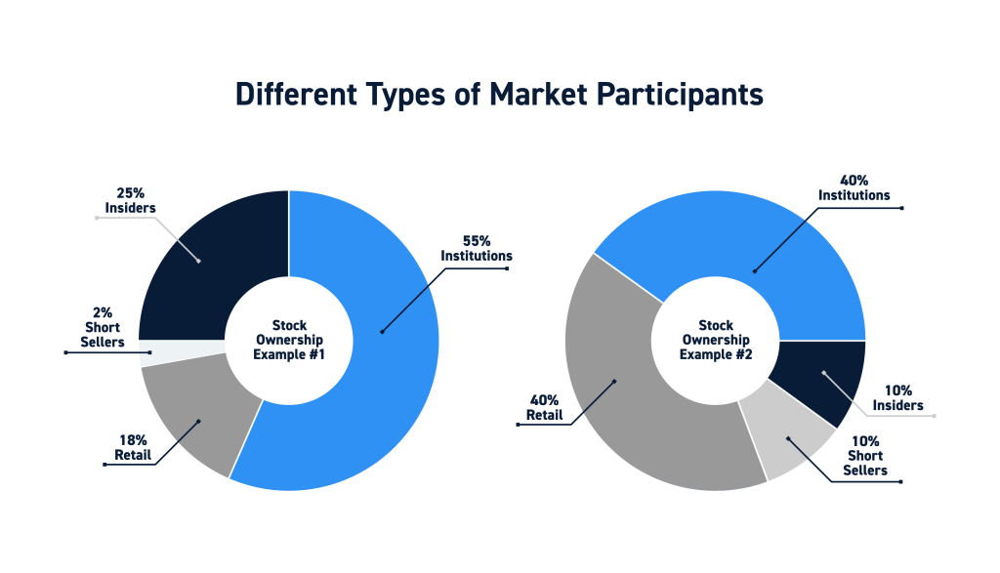

## Table of Contents

## What is insider stock ownership?

Insider stock ownership refers to the shares of a company's stock that are owned by people who work for the company or have a close relationship with it. These insiders can include executives, directors, and sometimes even large shareholders who have access to important information about the company before it becomes public.

When insiders buy or sell their company's stock, it can be a signal to other investors about how the company is doing. If insiders are buying a lot of stock, it might mean they think the company will do well in the future. On the other hand, if they are selling a lot, it could mean they think the stock price might go down. This information is important for other investors to consider when making their own decisions about buying or selling the stock.

## What is institutional stock ownership?

Institutional stock ownership means that big organizations like banks, insurance companies, and mutual funds own shares in a company. These organizations have a lot of money to invest, so they can buy a lot of stock. When they own a big part of a company, it's called institutional ownership. This can be important because these big investors often do a lot of research before they buy, so other people might look at what they're doing to help decide if they should buy the stock too.

Sometimes, if a lot of these big organizations start buying or selling a company's stock, it can make the stock price go up or down. This is because they are moving a lot of money around. People who watch the stock market pay attention to what these big investors are doing because it can give them clues about what might happen to the stock price in the future.

## How can one identify insider and institutional ownership in a company?

To find out about insider ownership in a company, you can look at the company's official documents. These are called SEC filings, and they are public records that show who owns the company's stock. You can find these on the SEC's website or on financial websites that track this information. When you look at these filings, you will see the names of the insiders, like the CEO or other top executives, and how many shares they own. If insiders own a lot of the company's stock, it might mean they believe in the company's future.

To check institutional ownership, you can also use the SEC filings, but there are easier ways too. Many financial websites and stock market apps show how much of a company's stock is owned by big investors like banks and mutual funds. These websites often have a section called "Institutional Ownership" or something similar. If you see that a lot of the stock is owned by these big investors, it can tell you that they think the company is a good place to put their money. This can be a helpful sign for other people who are thinking about buying the stock.

## What are the legal requirements for reporting insider stock transactions?

In the United States, insiders like company executives and directors have to report their stock transactions to the Securities and Exchange Commission (SEC). They must do this within two business days of the transaction. This rule is part of something called the Securities Exchange Act of 1934, and it helps keep the stock market fair by making sure everyone knows what insiders are doing with their stock.

The reports insiders file are called Form 4. They have to include details like how many shares were bought or sold, the price, and the date of the transaction. This information is public, so anyone can look at it on the SEC's website. By making insiders report their trades quickly, the law helps prevent them from using their special knowledge to make unfair profits.

## How does insider ownership affect a company's stock price?

Insider ownership can have a big effect on a company's stock price. When insiders, like the CEO or other top executives, buy a lot of their company's stock, it can make other investors feel more confident. They might think that if the insiders are buying, it means they believe the company will do well in the future. This can make more people want to buy the stock, which can push the stock price up.

On the other hand, if insiders start selling a lot of their stock, it can worry other investors. They might think the insiders know something bad is going to happen to the company, so they are getting out while they can. This can make the stock price go down as more people start selling their shares too. So, watching what insiders do with their stock can give clues about where the stock price might be headed.

## What role do institutional investors play in the stock market?

Institutional investors are big organizations like banks, insurance companies, and mutual funds that have a lot of money to invest. They play a big role in the stock market because they can buy and sell a lot of stock at once. When they buy a lot of a company's stock, it can make the stock price go up because there is more demand for it. On the other hand, if they start selling a lot of stock, it can make the price go down because there is more supply. This is important because their actions can move the market a lot.

These big investors also do a lot of research before they buy or sell stock. They have teams of people who look at companies very closely to decide if they are good investments. Because of this, other people often watch what institutional investors are doing. If a lot of them are buying a certain stock, it might mean they think the company will do well in the future. This can give other investors clues about which stocks might be good to buy. So, institutional investors not only affect stock prices directly but also influence what other people do in the market.

## Can insider trading be legal, and under what circumstances?

Yes, insider trading can be legal under certain circumstances. Legal insider trading happens when company insiders, like executives or directors, buy or sell their company's stock but follow all the rules. They have to report these transactions to the SEC within two business days, and this information becomes public so everyone can see it. This kind of trading is okay because it's done openly and follows the law.

However, insider trading becomes illegal when insiders use secret information that the public doesn't know to make money. For example, if a CEO knows about a big problem in the company that will make the stock price go down and sells their stock before the news comes out, that's illegal. The law is there to make sure everyone has a fair chance in the stock market and that no one can use secret information to get an unfair advantage.

## How do institutional investors influence corporate governance?

Institutional investors have a big say in how companies are run because they own a lot of the company's stock. When they own a big part of a company, they can vote on important things like who should be on the board of directors or if the company should do certain things. This means they can help decide who runs the company and what decisions get made. If they think the company is not doing a good job, they might vote to change the board or push for different ways of running the company.

Because these big investors have a lot of money and power, companies often listen to what they say. They might meet with the company's leaders to talk about how the company is doing and what it should do next. This can lead to changes in how the company works, like making it more open about what it's doing or trying to make more money for shareholders. So, institutional investors not only affect the stock price but also help shape how the company is managed.

## What are the potential risks associated with high insider ownership?

High insider ownership can be risky for a few reasons. One big risk is that if insiders own too much of the company's stock, they might make decisions that are good for them but not so good for other shareholders. For example, they might pay themselves big salaries or bonuses, which could make the company's profits go down and hurt the stock price. This can make other investors unhappy because they want the company to focus on making money for everyone, not just the insiders.

Another risk is that high insider ownership can make it hard for the company to grow. If insiders own most of the stock, it might be tough for the company to raise more money by selling new shares. New investors might not want to buy into a company where the insiders have too much control. Also, if insiders sell a lot of their stock all at once, it can make the stock price drop fast, which can scare off other investors. So, while insider ownership can show that insiders believe in the company, too much of it can bring some big problems.

## How do insider and institutional ownership patterns differ across industries?

Insider and institutional ownership patterns can be different depending on the industry. In some industries, like tech startups, insiders might own a lot of the stock. This is because the people who started the company often keep a big part of it to show they believe in what they're doing. They might not need as much money from big investors at first, so institutional ownership could be lower. On the other hand, in big, well-known companies like banks or car makers, institutional investors might own more of the stock. These companies need a lot of money to grow, so they sell shares to big investors who can give them the cash they need.

In industries like healthcare or energy, the mix of insider and institutional ownership can change a lot. For example, in a new biotech company, insiders might own a lot of the stock because they are the ones who came up with the new ideas and want to keep control. But as the company gets bigger and needs more money for research, institutional investors might start buying more shares. In the energy sector, big companies might have a lot of institutional ownership because they need a lot of money to build things like oil rigs or wind farms. So, the balance between insider and institutional ownership can tell you a lot about how a company in a certain industry is doing and what it might do next.

## What advanced metrics can be used to analyze the impact of insider and institutional ownership on stock performance?

To understand how insider and institutional ownership affect stock performance, you can use a few special numbers or metrics. One important metric is the Insider Buying/Selling Ratio. This shows how many insiders are buying the stock compared to how many are selling it. If more insiders are buying than selling, it might mean they think the stock will go up in the future. Another useful metric is Institutional Ownership Concentration, which looks at how much of the stock is owned by the biggest institutional investors. If a few big investors own a lot of the stock, it can make the stock price move more when they buy or sell.

Another metric to consider is the Insider Ownership Percentage, which tells you what part of the company's stock is owned by insiders. A high percentage might mean insiders have a lot of control over the company, which can be good or bad depending on how they use that control. You can also look at the Institutional Ownership Turnover, which measures how often institutional investors are buying and selling the stock. High turnover might mean these big investors are not sure about the company's future, which can make the stock price more unstable. By using these metrics, you can get a better idea of how insider and institutional ownership might affect the stock's performance.

## How do global regulations on insider and institutional ownership vary, and what are the implications for multinational corporations?

Global rules about insider and institutional ownership can be different in each country, which can make things tricky for big companies that work all over the world. In the United States, insiders have to report their stock trades to the SEC within two days, and this information is public. But in other places, like the European Union, the rules might be a bit different. For example, in the EU, insiders have to report their trades too, but the time they have to do it might be longer, and the information might not be as easy to find. In some countries, like Japan, the rules are strict and insiders have to be very careful about what they do with their stock. These differences mean that multinational companies have to keep track of many different rules and make sure they follow all of them, which can be hard.

The different rules around the world can affect how multinational companies handle their stock and how they report what they're doing. If a company is listed on stock markets in different countries, they have to follow the rules in each place. This can make things more complicated and expensive because they might need to hire lawyers and experts to help them follow all the rules. It can also affect how insiders and institutional investors decide to buy or sell the company's stock. If the rules in one country are stricter, insiders might be more careful about trading, while in another country with looser rules, they might be more willing to buy or sell. So, understanding these differences is important for big companies that want to do well in the global stock market.

## References & Further Reading

[1]: Bergstra, J., Bardenet, R., Bengio, Y., & Kégl, B. (2011). ["Algorithms for Hyper-Parameter Optimization."](https://dl.acm.org/doi/10.5555/2986459.2986743) Advances in Neural Information Processing Systems 24.

[2]: ["Advances in Financial Machine Learning"](https://www.amazon.com/Advances-Financial-Machine-Learning-Marcos/dp/1119482089) by Marcos Lopez de Prado

[3]: ["Evidence-Based Technical Analysis: Applying the Scientific Method and Statistical Inference to Trading Signals"](https://www.amazon.com/Evidence-Based-Technical-Analysis-Scientific-Statistical/dp/0470008741) by David Aronson

[4]: ["Machine Learning for Algorithmic Trading"](https://github.com/stefan-jansen/machine-learning-for-trading) by Stefan Jansen

[5]: ["Quantitative Trading: How to Build Your Own Algorithmic Trading Business"](https://github.com/LucindaYa/quant-resources/blob/master/Quantitative%20Trading%20How%20to%20Build%20Your%20Own%20Algorithmic%20Trading%20Business.pdf) by Ernest P. Chan