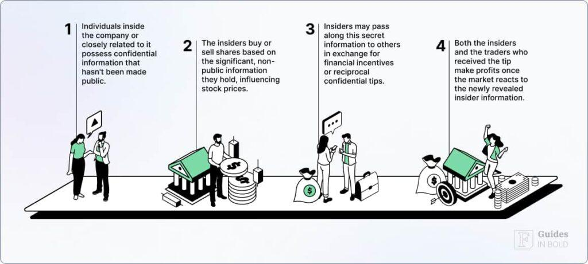

## Table of Contents

## What are insider stock purchases?

Insider stock purchases happen when people who work at a company, like managers or directors, buy shares of their own company's stock. These insiders have a good understanding of how the company is doing and what might happen in the future. When they buy stock, it often means they think the company will do well and the stock price will go up.

People pay attention to insider purchases because it can be a sign that the company is in a good position. If many insiders are buying, it might mean they have confidence in the company's future. However, it's important to remember that insider buying is just one piece of information. It's always a good idea to look at other things, like the company's financial reports and what's happening in the market, before making any decisions about buying or selling stocks.

## Why should investors track insider stock purchases?

Investors should track insider stock purchases because it can give them clues about how well a company might do in the future. Insiders, like the company's top managers or directors, know a lot about what's going on inside the company. When they buy their company's stock, it often means they think the stock price will go up. This can be a good sign for other investors, showing that people who know the company best believe in its future.

However, insider buying is just one piece of the puzzle. It's important for investors to look at other information too, like the company's financial reports and what's happening in the overall market. Just because insiders are buying doesn't mean the stock will definitely go up. Investors should use insider buying as one of many tools to help them make smart choices about where to put their money.

## How can someone access information about insider stock purchases?

You can find information about insider stock purchases on several websites. One popular place to look is the U.S. Securities and Exchange Commission (SEC) website. They have a tool called EDGAR where companies have to report any insider buying or selling. You can search for a company and see if any insiders have bought or sold stock recently.

Another easy way to track insider purchases is by using financial news websites and stock market apps. Many of these sites, like Yahoo Finance or Bloomberg, have sections where they list recent insider transactions. They often show you who bought the stock, how many shares they bought, and when they bought them. This can help you keep up with what insiders are doing without having to dig through a lot of official documents.

## What are the key regulatory bodies that oversee insider trading?

The main group that watches over insider trading in the United States is the Securities and Exchange Commission (SEC). They make sure that people who work at companies don't use secret information to buy or sell stocks unfairly. The SEC has rules that say insiders have to report their stock trades so everyone can see them. If someone breaks these rules, the SEC can take them to court and they might have to pay a fine or even go to jail.

Another important group is the Financial Industry Regulatory Authority (FINRA). FINRA helps the SEC by making sure that the people and companies that buy and sell stocks follow the rules. They check to see if anyone is trading stocks in a way that's not fair, like using inside information. If they find something wrong, they can tell the SEC, who can then decide what to do next. Together, the SEC and FINRA work to keep the stock market honest and fair for everyone.

## What is the difference between open market purchases and private transactions?

Open market purchases happen when insiders buy their company's stock on a public stock exchange, like the New York Stock Exchange or NASDAQ. This means they are buying the stock at the current market price, just like any other investor. When insiders make open market purchases, they have to report it to the SEC, and this information becomes public. This kind of buying can be a good sign to other investors because it shows that insiders believe in the company's future.

Private transactions, on the other hand, are deals that happen away from the public stock exchanges. In these cases, insiders might buy stock directly from the company or from other shareholders in a private agreement. These transactions don't happen at the current market price and might involve special terms agreed upon by the people involved. Private transactions also need to be reported to the SEC, but they can be harder to find and understand because they are not as straightforward as open market purchases.

## How can one interpret the significance of an insider's purchase volume?

When an insider buys a lot of stock, it can mean they really believe in the company's future. The more stock they buy, the stronger their belief might be. For example, if a CEO buys a small amount of stock, it might not mean much. But if they buy a lot, it could be a big sign that they think the company will do well and the stock price will go up. Investors often look at how much insiders are buying to get a sense of how confident they are.

However, it's important to look at other things too. Just because an insider buys a lot of stock doesn't mean it's a sure thing. You should also check the company's financial reports and see what's happening in the market. Sometimes, insiders might buy a lot of stock for reasons that don't have to do with the company's future, like getting a discount or for tax reasons. So, while a big insider purchase can be a good sign, it's just one piece of information to consider when making investment decisions.

## What are the common tools and platforms used to track insider stock purchases?

One of the most common tools to track insider stock purchases is the SEC's EDGAR database. This is where companies have to report any insider buying or selling. You can go to the SEC's website, search for the company you're interested in, and see if any insiders have bought or sold stock recently. It's a bit like looking up information in a big library, but once you find what you're looking for, it can tell you a lot about what insiders are doing.

Another easy way to keep track of insider purchases is by using financial news websites and stock market apps. Sites like Yahoo Finance and Bloomberg often have sections where they list recent insider transactions. These platforms make it simple to see who bought the stock, how many shares they bought, and when they bought them. They gather the information from the SEC and present it in a way that's easy to understand, so you don't have to dig through a lot of official documents yourself.

## How can insider trading data be integrated into a broader investment strategy?

Insider trading data can be a helpful part of a bigger investment plan. When insiders, like company managers or directors, buy a lot of their own company's stock, it can be a sign that they think the company will do well in the future. This can give investors more confidence in the company. But it's important not to make decisions based on insider buying alone. Investors should also look at the company's financial reports, what's happening in the market, and other news about the company. By using insider trading data along with all this other information, investors can make smarter choices about where to put their money.

It's also good to keep an eye on patterns in insider trading over time. If insiders keep buying more and more stock over several months, it might be a stronger sign that they really believe in the company's future. But if they only buy a little bit once in a while, it might not mean as much. By looking at insider trading data as part of a bigger picture, investors can get a better sense of whether a company is a good investment. It's like putting together a puzzle – insider trading data is just one piece, but it can help complete the whole picture.

## What are the legal and ethical considerations when using insider trading data?

When using insider trading data, it's important to follow the rules and be fair. The SEC has strict laws about insider trading to make sure no one uses secret information to make money unfairly. If you're looking at insider trading data, you can't use it to buy or sell stocks if you know something that other people don't. That would be illegal and could get you in big trouble. Instead, you can only use the public information that insiders have to report to the SEC. This way, everyone has the same chance to see what insiders are doing.

It's also important to think about what's right and wrong when using insider trading data. Just because insiders are buying stock doesn't mean you should automatically do the same. You should look at other information too, like the company's financial reports and what's happening in the market. It's not fair to other investors if you only focus on insider trading data and ignore everything else. By using insider trading data the right way, you can make better investment choices without breaking any laws or being unfair to others.

## How do insider purchases correlate with stock performance, and what are the limitations of this data?

Insider purchases can sometimes be a good sign for stock performance. When people who work at a company, like the CEO or other top managers, buy a lot of their own company's stock, it often means they think the stock price will go up. This can make other investors feel more confident about the company too. Studies have shown that stocks tend to do better after insiders buy a lot of them. So, if you see insiders buying, it might be a hint that the stock could go up in the future.

But there are limits to how much you can trust insider buying data. Just because insiders are buying doesn't mean the stock will definitely go up. Sometimes, insiders might buy stock for reasons that don't have to do with the company's future, like getting a discount or for tax reasons. Also, insider buying is just one piece of information. You should look at other things too, like the company's financial reports and what's happening in the market. If you only focus on insider buying, you might miss important signs that the stock could go down instead.

## What advanced analytics can be applied to insider trading data to predict market trends?

Advanced analytics can help us understand insider trading data better and maybe even predict what the market will do next. One way to do this is by using [machine learning](/wiki/machine-learning). This is when computers learn from a lot of data to find patterns that people might not see. For example, a computer can look at lots of past insider trading data and see if there are certain times or situations when insider buying leads to the stock going up. By finding these patterns, the computer can help predict if the stock might go up again in the future when similar things happen.

Another way to use advanced analytics is by looking at how much insiders are buying and when they are buying it. This is called time series analysis. It helps us see if there are any regular patterns in insider buying over time. For example, if insiders tend to buy more stock right before the company announces good news, this could be a sign that the stock might go up soon. But it's important to remember that even with these fancy tools, predicting the market is hard. Insider trading data is just one piece of the puzzle, and we need to look at other things too, like the company's financial reports and what's happening in the market, to make the best guesses about what might happen next.

## How can machine learning models enhance the tracking and prediction of insider stock purchases?

Machine learning models can make tracking and predicting insider stock purchases easier and more accurate. They do this by looking at a lot of data from the past to find patterns that people might not see. For example, a machine learning model can learn from years of insider trading data and figure out when insiders tend to buy more stock. If the model sees that insiders usually buy more stock right before the company does well, it can help predict when the stock might go up in the future. This way, investors can get a heads-up about what might happen next.

These models can also help by looking at how much insiders are buying and when they are doing it. This is called time series analysis. By studying these patterns over time, the model can spot trends that might not be obvious to someone just looking at the numbers. For example, if insiders often buy a lot of stock in the months before a big company announcement, the model can predict that similar buying might mean good news is coming. But even with these smart tools, it's important to remember that predicting the market is tricky. Insider trading data is just one piece of information, and investors should also look at other things like the company's financial reports and what's happening in the market to make the best guesses about the future.

## References & Further Reading

[1]: ["Advances in Financial Machine Learning"](https://www.amazon.com/Advances-Financial-Machine-Learning-Marcos/dp/1119482089) by Marcos Lopez de Prado

[2]: ["Evidence-Based Technical Analysis: Applying the Scientific Method and Statistical Inference to Trading Signals"](https://www.amazon.com/Evidence-Based-Technical-Analysis-Scientific-Statistical/dp/0470008741) by David Aronson

[3]: ["Machine Learning for Algorithmic Trading"](https://github.com/stefan-jansen/machine-learning-for-trading) by Stefan Jansen

[4]: ["Quantitative Trading: How to Build Your Own Algorithmic Trading Business"](https://www.amazon.com/Quantitative-Trading-Build-Algorithmic-Business/dp/1119800064) by Ernest P. Chan

[5]: Lynch, A., & Weinberg, J. (2006). ["The Excess Returns of 'Insider' Purchases"](https://quizlet.com/214414873/chapter-11-the-efficient-market-hypothesis-flash-cards/). The Journal of Business. 

[6]: Graham, B. (2006). ["The Intelligent Investor: The Definitive Book on Value Investing. A Book of Practical Counsel"](https://www.amazon.com/Intelligent-Investor-Definitive-Investing-Essentials/dp/0060555661) by Benjamin Graham

[7]: SEC. ["Insider Trading"](https://www.sec.gov/investment/insider-trading-arrangements-and-related-disclosures). U.S. Securities and Exchange Commission. 

