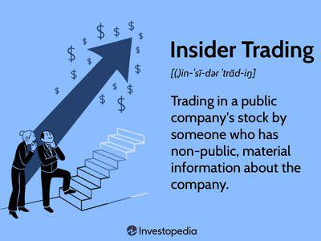

In the world of finance, regulations play a crucial role in maintaining market integrity and investor trust by establishing a framework that dictates fair practices and protects market participants from fraudulent activities. The Insider Trading Act of 1988 is a prominent regulation seeking to address the unfair advantages gained through insider information. It represents a significant step in the legal battle against insider trading, where individuals exploit non-public information to gain unfair advantages in the stock market.

The development and implementation of this legislation underscore a critical effort to instill confidence in financial systems, assuring investors that markets operate on a level playing field. The Act enhances the enforcement capabilities of the Securities and Exchange Commission (SEC), primarily through stricter penalties intended to deter such unethical behavior. By introducing substantial fines and jail time for violations, the Act serves as a deterrent and illustrates the seriousness with which authorities view insider trading.

As financial technologies evolve, particularly with the advent of algorithmic trading, understanding the delicate intersections between legal and illegal trading practices becomes essential. Algorithmic trading, characterized by high-speed trade execution and data-driven decisions, presents new challenges for regulators tasked with identifying and curbing insider trading activities. These challenges necessitate a comprehensive understanding of both existing laws and emerging technologies, ensuring that regulatory frameworks remain robust and effective. 

This article explores the complexities of the 1988 Act, its long-lasting impact on insider trading, and the role of algorithmic trading today, providing insights into the continuous need for vigilance and adaptation in financial market regulation.

## Table of Contents

## Understanding the Insider Trading Act of 1988

The Insider Trading Act of 1988 is a significant legislative amendment to the Securities Exchange Act of 1934, signed into law by President Ronald Reagan. This Act was designed to enhance the enforcement capabilities of the U.S. Securities and Exchange Commission (SEC) in its battle against insider trading violations, a practice that undermines market integrity and investor confidence. The 1988 Act emerged as a response to growing public concern over insider trading scandals in the 1980s, aiming to curb these malpractices through legislative reform.

At the core of the Act were stricter penalties intended to serve as a substantial deterrent against insider trading. Prior to the 1988 amendments, penalties for insider trading were often seen as insufficient to dissuade individuals from leveraging non-public information for personal financial gain. The Act introduced increased financial penalties, allowing the SEC to pursue civil penalties that could reach up to three times the profits gained or losses avoided by the insider trading activities. Additionally, the Act sought to augment criminal penalties, including potential imprisonment, thereby signaling a rigorous stance against such violations.

To broaden the scope of enforcement, the Insider Trading Act of 1988 also targeted not just the insider traders themselves, but also "controlling persons" who could be held liable if they knowingly or recklessly failed to prevent insider trading within their firms. This provision highlighted the Act’s focus on promoting corporate accountability and governance, recognizing the role that organizational oversight can play in deterring insider trading.

A notable aspect of the Act was its provision for rewarding whistleblowers who provided information about insider trading. By incentivizing individuals to come forward with information, the Act aimed to uncover and address violations that might otherwise go undetected by regulators. This initiative reflected a broader strategy to engage both individuals and firms in the effort to maintain fair market practices.

Overall, the Insider Trading Act of 1988 marked a pivotal moment in U.S. financial regulation, equipping the SEC with enhanced tools to combat insider trading and reinforcing the legal framework needed to uphold equitable trading environments.

## Historical Context and Evolution

Insider trading, characterized by the use of non-public information for financial gain, has long been a subject of concern and regulation. The first significant regulatory step can be traced back to the New York Stock Exchange's (NYSE) response to disclosure failures in 1914. This marked the advent of regulatory oversight aimed at maintaining transparency and fairness in the financial markets. The early 20th century saw numerous attempts to regulate stock markets more effectively, but it wasn't until the aftershocks of the 1929 stock market crash that substantial legal frameworks were established.

The Securities Exchange Act of 1934 laid the groundwork for federal regulation of securities markets and explicated the legal boundaries of trading practices, including insider trading. As markets evolved, so did the tactics employed by those with access to privileged information, necessitating further refinement of insider trading regulations. The need for more robust enforcement became increasingly apparent during the late 20th century when high-profile cases spotlighted existing loopholes and deficiencies.

The Insider Trading Act of 1988 emerged as a significant strengthening of regulatory measures against insider trading. Enacted amidst growing public scrutiny and prominent insider trading scandals of the 1980s, this Act expanded the Securities and Exchange Commission's (SEC) enforcement capabilities. Cases like the insider trading charges against Martha Stewart in 2004 underscored the importance of such regulations. Although not directly linked to the 1988 Act, the Martha Stewart case exemplified the societal and legal challenges surrounding the use of non-public information for personal gain.

The Act of 1988 introduced tougher penalties, positioning itself as a substantial deterrent against insider trading. By imposing penalties that could triple the profits gained from illegal trades and establishing legal recourse against firms' controlling persons, the Act targeted both individual and corporate wrongdoings. It also incentivized whistleblowers to report illegal activities, reflecting a sophisticated strategy to tackle insider trading through both deterrence and incentivization.

Over time, as financial markets have become increasingly sophisticated and technology-driven, the complexities surrounding insider trading have similarly evolved. The regulatory frameworks continue to adapt to the changing landscape, ensuring that financial markets operate on principles of fairness and transparency, which remain crucial for maintaining investor confidence and market integrity.

## Key Provisions of the 1988 Act

The Insider Trading and Securities Fraud Enforcement Act of 1988 introduced several significant measures to enhance the enforcement capabilities of the Securities and Exchange Commission (SEC) against insider trading violations. One of the pivotal provisions was the increase in financial penalties. The Act stipulated that civil penalties for insider trading could be set at three times the profit gained or loss avoided through illicit trading activities. This provision aimed to act as a substantial deterrent against engaging in such illegal practices, thereby reinforcing the integrity of financial markets.

Another crucial aspect of the Act was its focus on penalizing controlling individuals within firms, thereby underscoring the importance of corporate governance. The provision allowed for the imposition of monetary penalties not only on the individuals directly involved in insider trading but also on those in positions of control who failed to prevent such activities within their organizations. This aspect emphasized the responsibility of corporate leaders to enforce compliance and maintain ethical standards within their institutions.

Additionally, the 1988 Act established a bounty program designed to encourage whistleblowers to come forward with information regarding insider trading violations. Individuals providing evidence that led to the imposition of penalties could receive a reward, thereby incentivizing the reporting of illegal activities. This measure aimed to enhance the SEC's ability to detect and prosecute insider trading by leveraging insights from insiders and knowledgeable individuals willing to aid enforcement efforts.

Overall, these key provisions of the 1988 Act significantly strengthened the regulatory framework in place for monitoring and penalizing insider trading, contributing to enhanced transparency and fairness in the securities markets.

## Algorithmic Trading and Modern Challenges

Algorithmic trading represents a significant transformation in the financial markets, offering rapid trade execution and the capability to process vast amounts of data in real time. This technology, while enhancing market efficiency, simultaneously poses challenges for monitoring and regulating insider trading. The complexity arises because algorithmic systems can execute large volumes of trades at speeds beyond human capability, using not only publicly available information but potentially exploiting patterns or data that could include non-public insights.

Central to the challenge of supervising [algorithmic trading](/wiki/algorithmic-trading) is the concern over the misuse of non-public information. Algorithms are designed to respond to a variety of data inputs, ranging from simple market data to more complex and potentially sensitive information. In scenarios where these algorithms inadvertently or intentionally incorporate non-public information, the risk of insider trading increases exponentially. For example, if an algorithm is programmed to react to specific news releases or financial data streams that are not yet widespread, it could inadvertently conduct trades based on information that provides an unfair advantage.

To address these issues, regulators are tasked with updating and adapting existing securities laws to effectively govern algorithmic trading practices. This involves not only enhancing the technological capabilities of regulatory bodies to monitor trading activities more effectively but also creating legal frameworks that deter the exploitation of such technologies for illicit gains. One potential method could involve the use of advanced data analytics and [machine learning](/wiki/machine-learning) algorithms by regulators themselves to detect unusual trading patterns that may signify the use of insider information.

Moreover, the legal definition of insider trading may need to be re-evaluated to encompass the nuances introduced by algorithmic trading. Traditional insider trading laws focus on individuals exploiting confidential information, but in the context of algorithmic systems, the definition could extend to include the authors of algorithms, the data feeders, and even the operators of such systems.

Despite these challenges, algorithmic trading can be regulated effectively through international collaboration and the development of technologies that can scrutinize and analyze trading activities efficiently. As the financial markets continue to integrate more technological advancements, the regulatory frameworks governing trading practices must evolve concurrently to safeguard market integrity and ensure fairness for all participants.

## Regulatory Efforts and International Cooperation

International cooperation plays a pivotal role in enforcing insider trading laws as financial markets become more interconnected. With the globalization of securities markets, insider trading can often involve actors and activities that span multiple jurisdictions, making it imperative for regulatory bodies to work collaboratively.

The U.S. Securities and Exchange Commission (SEC) actively engages in cross-border cooperation with regulatory agencies worldwide to tackle instances of insider trading that breach international boundaries. This cooperation is facilitated through formal mechanisms such as Memorandums of Understanding (MoUs) and participation in international organizations like the International Organization of Securities Commissions (IOSCO). These collaborations ensure that information is shared efficiently between jurisdictions, enabling regulators to trace and prosecute illegal trading activities effectively. For instance, the SEC often partners with agencies in Europe and Asia to conduct investigations and enforce actions against individuals and entities involved in cross-national insider trading schemes.

Ongoing studies and assessments focus on evaluating the effectiveness of current securities regulations in this complex global environment. The dynamic nature of financial markets requires that these regulations continually evolve to address new challenges, such as those posed by advanced trading technologies and cross-border fraudulent activities. Researchers and policymakers are examining the adequacy of existing laws and the need for harmonized international regulations to ensure consistency and effectiveness.

These efforts underscore the importance of a cohesive global regulatory framework that aligns the diverse legal systems and enforcement capabilities of different countries. Such an alignment is crucial to mitigate the risks associated with transnational insider trading and to uphold the integrity of global financial markets. Continual dialogue and cooperation among international regulatory bodies are essential to address these challenges and enhance the overall resilience of financial market regulations.

## Conclusion

The Insider Trading Act of 1988 serves as a fundamental component of financial market regulation, underpinning efforts to preserve market integrity and investor confidence. Its introduction brought about enhanced enforcement mechanisms and punitive measures aimed at deterring the unfair exploitation of non-public information. However, as financial markets evolve, so too must the regulatory frameworks that govern them. The rise of algorithmic trading exemplifies the need for modernized regulations that adequately address the complexities introduced by advanced technological systems.

Algorithmic trading leverages sophisticated computer algorithms for rapid trade execution, creating a landscape where trades can be made in fractions of a second. While this improves market efficiency, it also introduces significant challenges for regulatory bodies. Ensuring that these automated systems do not exploit non-public information requires vigilant oversight and potentially new regulatory approaches. As markets become more technologically driven, the risk of illicit trading activities becoming more sophisticated also increases, posing formidable challenges to current regulatory measures.

In this context, regulatory agencies such as the U.S. Securities and Exchange Commission (SEC) must continuously adapt their strategies. They can do so by employing advanced data analytics and machine learning techniques to detect and prevent illegal trading behaviors effectively. Moreover, regulatory frameworks need to foster international cooperation since financial markets operate on a global scale, and insider trading activities often transcend national borders.

In conclusion, while the Insider Trading Act of 1988 remains a critical tool in safeguarding market fairness, the dynamic nature of financial markets demands ongoing adaptation of regulatory approaches. Stakeholders, including regulators, financial institutions, and participants, must collaborate to ensure robust enforcement of trading laws in this rapidly changing environment. By maintaining vigilance and leveraging technological advancements, it is possible to uphold market fairness and protect investor interests despite the challenges posed by evolving trading methodologies.

## References & Further Reading

[1]: Bhattacharya, U., & Daouk, H. (2002). ["The World Price of Insider Trading."](https://onlinelibrary.wiley.com/doi/abs/10.1111/1540-6261.00416) The Journal of Finance, 57(1), 75-108.

[2]: ["Securities Exchange Act of 1934."](https://www.nyse.com/publicdocs/nyse/regulation/nyse/sea34.pdf) U.S. Securities and Exchange Commission.

[3]: Bainbridge, S. M. (2000). ["Insider Trading: An Overview."](https://papers.ssrn.com/sol3/papers.cfm?abstract_id=132529) UCLA School of Law, Law-Econ Research Paper No. 00-6.

[4]: Lhabitant, F. S., & Humblot, T. (2019). ["Algorithmic and High-Frequency Trading."](https://assets.cambridge.org/97811070/91146/frontmatter/9781107091146_frontmatter.pdf) Springer.

[5]: Boatright, J. R. (2010). ["Finance Ethics: Critical Issues in Theory and Practice."](https://onlinelibrary.wiley.com/doi/book/10.1002/9781118266298) Wiley.

[6]: Gomber, P., Arndt, B., Lutat, M., & Uhle, T. (2011). ["High-Frequency Trading."](https://papers.ssrn.com/sol3/papers.cfm?abstract_id=1858626) Wirtschaftsinformatik, 53, 383-386.