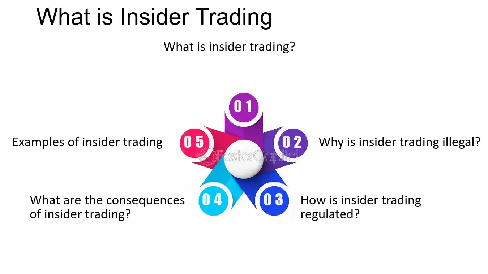

## Table of Contents

## What is the Insider Trading Act of 1988?

The Insider Trading Act of 1988 is a law in the United States that makes it illegal for people to trade stocks using secret information that is not available to the public. This law was created to make sure that everyone has a fair chance in the stock market. Before this law, some people could make a lot of money by using information that others did not have.

The law says that if someone knows important secrets about a company, they cannot buy or sell that company's stocks until the information is shared with everyone. This includes people who work at the company and anyone else who might find out the secrets. If someone breaks this law, they can be punished with fines or even jail time. The Insider Trading Act helps keep the stock market fair for everyone.

## Why was the Insider Trading Act of 1988 introduced?

The Insider Trading Act of 1988 was introduced because people were using secret information to make money in the stock market, which was not fair. Before this law, some people could find out important news about a company before everyone else and use that information to buy or sell stocks. This gave them an unfair advantage over other investors who did not know the secrets. The government wanted to stop this unfair practice and make sure that everyone had the same chance to make money in the stock market.

To fix this problem, the Insider Trading Act was created to make it illegal to trade stocks using secret information. The law says that if someone knows something important about a company that the public does not know, they cannot use that information to buy or sell stocks. This helps to keep the stock market fair and honest. By introducing this law, the government aimed to protect all investors and maintain trust in the financial markets.

## What are the key provisions of the Insider Trading Act of 1988?

The Insider Trading Act of 1988 has some important rules to stop people from using secret information to make money in the stock market. One key rule is that it is illegal for anyone to buy or sell stocks if they know something important about a company that the public does not know. This includes people who work at the company and anyone else who might find out the secrets. The law wants to make sure that everyone has the same information when they are making decisions about buying or selling stocks.

Another important part of the law is that it sets out punishments for people who break the rules. If someone is caught using secret information to trade stocks, they can be fined a lot of money or even sent to jail. This is to make sure that people think twice before they try to cheat in the stock market. By having these rules and punishments, the Insider Trading Act helps to keep the stock market fair and honest for everyone.

## How does the Insider Trading Act of 1988 define 'insider trading'?

The Insider Trading Act of 1988 defines 'insider trading' as the act of buying or selling stocks using secret information that is not available to the public. This means that if someone knows something important about a company that others don't know, they cannot use that information to trade stocks. The law covers not just people who work at the company, but also anyone else who might find out the secrets.

The goal of the law is to make sure that everyone has the same information when they are making decisions about buying or selling stocks. This helps keep the stock market fair and honest. If someone breaks this rule and uses secret information to trade, they can be punished with fines or jail time. This makes people think twice before trying to cheat in the stock market.

## What penalties can be imposed under the Insider Trading Act of 1988?

Under the Insider Trading Act of 1988, people who use secret information to trade stocks can face big penalties. If someone is caught breaking the rules, they can be fined a lot of money. The fines can be very high, sometimes even millions of dollars, depending on how serious the crime is and how much money the person made from the illegal trading.

Besides fines, people can also go to jail for insider trading. The law says that someone can be sent to prison for up to 20 years if they are found guilty. This is to make sure that people think twice before they try to cheat in the stock market. By having these strong punishments, the law helps keep the stock market fair and honest for everyone.

## How does the Insider Trading Act of 1988 differ from previous regulations?

The Insider Trading Act of 1988 made the rules about insider trading clearer and stronger than they were before. Before this law, there were some rules about insider trading, but they were not as strict. The old rules did not always say exactly what was illegal, and the punishments were not as tough. The 1988 Act changed this by making it very clear that using secret information to trade stocks is against the law, no matter who you are.

The new law also set much harsher penalties for people who break the rules. Before 1988, the fines and jail time for insider trading were not as severe. The Insider Trading Act of 1988 said that people could be fined millions of dollars and could go to jail for up to 20 years. This was a big change from the earlier rules and made people think twice before trying to cheat in the stock market. By making the rules clearer and the punishments stronger, the 1988 Act helped to make the stock market fairer for everyone.

## Can you explain the concept of 'tipping' as per the Insider Trading Act of 1988?

The Insider Trading Act of 1988 also talks about something called 'tipping.' Tipping is when someone who knows secret information about a company tells that information to someone else. If the person who gets the secret information then uses it to buy or sell stocks, both the person who told the secret and the person who used it can get in trouble. This is because the law wants to stop people from sharing secrets to help others make money unfairly.

The law makes it clear that tipping is just as bad as using the secret information yourself. If you know something important about a company that the public does not know, you cannot tell anyone else so they can use it to trade stocks. If you do, you can be fined a lot of money or even go to jail. This rule helps to make sure that no one has an unfair advantage in the stock market.

## What are some notable cases that were prosecuted under the Insider Trading Act of 1988?

One famous case under the Insider Trading Act of 1988 was the case of Ivan Boesky. In the 1980s, Ivan Boesky was a big name on Wall Street. He made a lot of money by trading stocks, but he was using secret information to do it. He got caught and had to pay a huge fine of $100 million. He also went to jail for three years. This case showed everyone that the new law meant business and that even big players on Wall Street could get in trouble for insider trading.

Another well-known case involved Martha Stewart. In 2001, she got a tip that a company called ImClone Systems was going to have bad news, so she sold her stocks before the news came out. This saved her from losing a lot of money. But it was against the law because she used secret information. She was found guilty of lying to investigators about the tip. Martha Stewart went to jail for five months and had to pay a fine. Her case showed that the law applies to everyone, no matter how famous they are.

## How has the enforcement of the Insider Trading Act of 1988 evolved over time?

Since the Insider Trading Act of 1988 was passed, the way it is enforced has changed a lot. At first, the law was new, and people were still figuring out how it worked. Over time, the government got better at catching people who were breaking the rules. They started using more technology and working with other countries to stop insider trading. The fines and jail time for breaking the law also got bigger, which made people more scared to try it.

Now, the enforcement of the Insider Trading Act is much stronger than it used to be. The government uses special computer programs to watch for strange trading patterns that might be a sign of insider trading. They also work with other countries to share information and catch people who try to cheat in the stock market. Because of these changes, the law has become better at keeping the stock market fair for everyone.

## What are the criticisms and limitations of the Insider Trading Act of 1988?

Some people think the Insider Trading Act of 1988 has problems. One big issue is that the law can be hard to understand. It's not always clear what counts as secret information, and this can make it tough for people to know if they are breaking the rules. Also, the law can be hard to enforce because it's not easy to prove that someone used secret information to trade stocks. This means that some people who break the law might not get caught.

Another criticism is that the penalties can be too harsh. Some people think that the fines and jail time are too big for what might seem like small mistakes. They say that this can scare people away from working in the stock market because they are afraid of getting in trouble. Also, the law only works in the United States, so it can be hard to stop insider trading that happens in other countries. This makes it tough to keep the stock market fair all around the world.

## How does the Insider Trading Act of 1988 impact corporate governance?

The Insider Trading Act of 1988 makes companies think more about how they handle secret information. It tells companies to be careful about who knows important secrets and to make sure that these secrets are not used to trade stocks. This law makes companies set up rules and training to stop people from using secret information the wrong way. It also makes companies keep a close eye on their employees to make sure no one is breaking the law. By doing this, the law helps companies be more honest and fair.

The law also makes companies more open about what they are doing. Because of the Insider Trading Act, companies have to share important news with everyone at the same time, not just with a few people. This helps everyone in the stock market have the same information, which makes trading fair. Companies that follow these rules build more trust with people who invest in them. This trust is important because it helps the company do well and grow.

## What future legislative changes might be considered to improve the effectiveness of the Insider Trading Act of 1988?

To make the Insider Trading Act of 1988 work better, lawmakers might think about making the rules clearer. Right now, it can be hard to know what counts as secret information. If the law was easier to understand, people would know better what they can and can't do. Also, the government might want to make it easier to prove that someone broke the law. Right now, it's tough to show that someone used secret information to trade stocks. If this was easier, more people who break the rules might get caught.

Another change could be to make the law work better with other countries. Insider trading can happen all over the world, and the U.S. law only works in the U.S. If countries worked together more, it would be harder for people to cheat in the stock market by using secret information. This would help keep the stock market fair for everyone, no matter where they are. By making these changes, the law could do a better job of stopping people from using secret information to make money unfairly.

## References & Further Reading

[1]: Bhattacharya, U., & Daouk, H. (2002). ["The World Price of Insider Trading."](https://onlinelibrary.wiley.com/doi/abs/10.1111/1540-6261.00416) The Journal of Finance, 57(1), 75-108.

[2]: ["Securities Exchange Act of 1934."](https://www.nyse.com/publicdocs/nyse/regulation/nyse/sea34.pdf) U.S. Securities and Exchange Commission.

[3]: Bainbridge, S. M. (2000). ["Insider Trading: An Overview."](https://papers.ssrn.com/sol3/papers.cfm?abstract_id=132529) UCLA School of Law, Law-Econ Research Paper No. 00-6.

[4]: Lhabitant, F. S., & Humblot, T. (2019). ["Algorithmic and High-Frequency Trading."](https://assets.cambridge.org/97811070/91146/frontmatter/9781107091146_frontmatter.pdf) Springer.

[5]: Boatright, J. R. (2010). ["Finance Ethics: Critical Issues in Theory and Practice."](https://onlinelibrary.wiley.com/doi/book/10.1002/9781118266298) Wiley.

[6]: Gomber, P., Arndt, B., Lutat, M., & Uhle, T. (2011). ["High-Frequency Trading."](https://papers.ssrn.com/sol3/papers.cfm?abstract_id=1858626) Wirtschaftsinformatik, 53, 383-386.