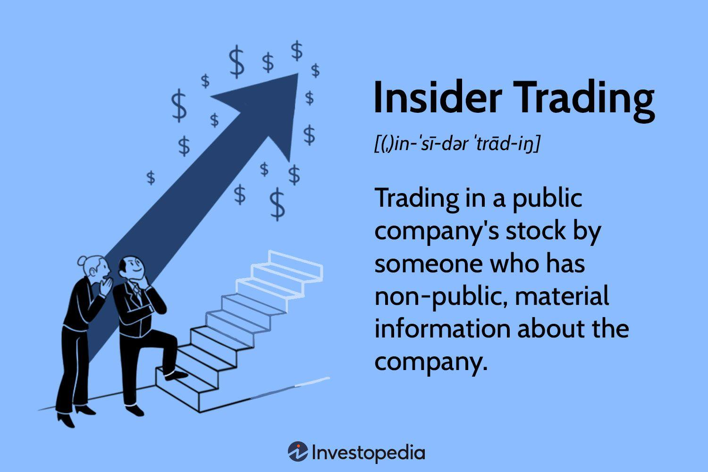

In the intricate world of finance, insider trading occupies a crucial position that intertwines legality, ethics, and market dynamics. Insider trading, at its core, involves the buying or selling of a publicly traded company's stock by individuals who have access to nonpublic, material information about the company. This practice raises pressing issues regarding fairness, transparency, and trust in financial markets. The challenge lies in distinguishing between legal insider trading activities and those deemed illegal, which can undermine market integrity and erode investor confidence.

Legal frameworks such as the Securities Exchange Act of 1934 in the United States have been established to regulate insider trading practices, aiming to protect investors by ensuring that all market participants operate on a level playing field. These regulations play a pivotal role in maintaining the function and stability of financial markets. However, the distinction between legal and illegal insider trading is often blurred, necessitating a nuanced understanding of the laws governing such activities and adherence to ethical standards.

As financial markets evolve, modern dynamics like algorithmic trading have introduced new complexities in the identification and regulation of insider trading. Algorithmic trading leverages powerful computers and mathematical models to execute orders at high speed. The interaction between algorithmic trading and insider information poses significant challenges for regulatory bodies tasked with mitigating insider trading risks while fostering innovation and efficiency in the markets.

This article will explore the multifaceted nature of insider trading by examining the legal frameworks that underpin this practice, assessing its real-world implications, and addressing emerging issues like the integration of algorithmic trading. By analyzing these facets, we aim to provide a comprehensive understanding that demystifies the boundary between legal and illegal practices and the implications for market participants.

## Table of Contents

## Understanding Insider Trading

Insider trading generally involves the buying or selling of a publicly-traded company's shares based on substantial and confidential information that is not available to the general public. This form of trading is significant due to the potential impact it can have on market fairness and investor trust. The Securities Exchange Act of 1934 established the foundation for regulating insider trading in the United States. It was designed to protect investors and the market from unfair practices by ensuring that all participants have access to the same information.

The Act was a response to the lack of transparency in the securities markets following the Stock Market Crash of 1929. It aimed to restore investor confidence by mandating comprehensive disclosures and prohibiting fraudulent activities in securities trading. One of its key elements is Section 10(b), which addresses securities fraud and forms the basis for Rule 10b-5, a rule implemented by the Securities and Exchange Commission (SEC) to curb deceptive practices.

It's essential to note that not all actions of insiders in the market are illegal. Legal insider trading occurs when corporate insiders, such as officers, directors, and employees, buy or sell stock in their own companies but do so in a way that does not violate any laws or regulations. These transactions need to be reported and are often carried out during specified periods when nonpublic information does not substantially impact the trades. This ensures transparency and fairness, safeguarding investor interests.

Differentiating between legal insider transactions and illegal insider trading is crucial for the integrity of the financial markets. Legal insider trading is disclosed to the market, allowing investors to monitor and understand the insider activities, whereas illegal insider trading is characterized by the exploitation of undisclosed information that offers unfair advantages. Maintaining a clear distinction between the two helps protect the market's integrity and ensures that all investors operate on a level playing field.

## Legal Insider Trading: What It Entails

Legal insider trading occurs when corporate insiders—such as executives, directors, and employees—buy or sell shares in their own companies based on information that is already available to the public. This type of trading is permissible under the law, provided it adheres to certain regulations designed to prevent fraud and ensure market transparency.

One key regulatory framework that governs legal insider trading is SEC Rule 10b5-1. This rule allows insiders to establish predetermined trading plans or contracts that specify the amount, price, and date of transactions well before any insider information becomes available. By doing so, insiders can trade in their company's securities even if they later become privy to nonpublic information, as the trades are executed automatically according to the previously established plan. This safeguards against the use of insider information for personal gain, thus maintaining a fair trading environment.

To further promote transparency in financial markets, insiders are required to disclose their trades through documents such as SEC Form 4. This form must be filed within two business days of the transaction, providing the public with timely visibility into the trading activities of insiders. The requirement to file SEC Form 4 applies to all officers, directors, and beneficial owners of more than ten percent of a class of a company's equity securities. By mandating these disclosures, regulatory bodies aim to prevent illicit activities and reassure market participants of the ongoing integrity of the market.

Together, SEC Rule 10b5-1 and the disclosure requirements under Form 4 facilitate a transparent and orderly market, where legal insider trading does not disadvantage other investors. These mechanisms help balance the needs of companies and their insiders to manage their equity holdings while upholding the principles of fairness and trust in the financial markets.

## Illegal Insider Trading: Recognizing the Boundaries

Illegal insider trading is a significant breach of both legal and ethical standards in financial markets. It involves the trading of a company's securities by individuals with access to material, nonpublic information, thereby violating fiduciary duties. This activity threatens the principles of market integrity and fairness, creating an uneven playing field for investors.

A primary example of illegal insider trading is "tipping." This occurs when an insider provides confidential information to an outsider, who can then use this information to make profitable trades. The insider, termed the "tipper," breaches their fiduciary duty, while the recipient, known as the "tippee," becomes equally culpable if they act on the given information. This scenario came to legal prominence in cases such as Dirks v. SEC, where the U.S. Supreme Court elaborated on the duties and liabilities involved in tipping.

Another prevalent example is the "misappropriation theory," which holds that individuals who exploit nonpublic information acquired through a breach of duty owed to the source of the information are liable for insider trading. This theory was encapsulated in the United States v. O'Hagan case, which extended the scope of insider trading liability to individuals outside a corporation who misappropriate confidential information for securities trading.

Regulatory frameworks aim to combat illegal insider trading in several ways. The Securities and Exchange Commission (SEC) enforces severe penalties for those found guilty, including hefty fines and imprisonment. These measures are designed to deter potential violators and restore trust in the fairness of financial markets.

To detect and enforce insider trading laws, regulatory bodies have developed sophisticated tools. Advanced data analytics and [artificial intelligence](/wiki/ai-artificial-intelligence) are increasingly employed to identify unusual trading patterns that might suggest insider trading activity. By tracking such anomalies, the SEC and other enforcement agencies aim to preempt and penalize illegal trades effectively, thereby upholding market fairness.

The complexity of insider trading requires continuous oversight and regulation to adapt to new challenges and maintain investor confidence.

## Algorithmic Trading and Insider Information

Algorithmic trading has significantly transformed financial markets by employing sophisticated algorithms to execute trades at unprecedented speed and [volume](/wiki/volume-trading-strategy). These algorithms analyze multiple market parameters and historical data to make, modify, or cancel trade orders automatically. The integration of technology into trading strategies provides an edge in market execution, but also presents specific challenges, especially regarding insider information.

Legal insider trading occurs when trades are conducted on publicly available information or through predefined plans, adhering to regulatory standards. However, the complexity of algorithms and their ability to process vast amounts of data rapidly raises concerns about potentially leveraging nonpublic, material information inadvertently or intentionally. Algorithms could potentially identify and exploit patterns similar to insider information, such as unusual trading activity or news events before they become widely known.

Regulatory bodies face significant challenges in overseeing [algorithmic trading](/wiki/algorithmic-trading) due to its high-speed nature and the opaque strategies employed. To adapt, regulatory frameworks must consider the intricacies of algorithmic processes and ensure that trades are being executed within legal boundaries. Developing new technologies and methodologies for monitoring trading activities is crucial. Advanced data analytics and [machine learning](/wiki/machine-learning) tools are being utilized to identify anomalies that might suggest the use of insider information.

Ultimately, understanding how algorithmic trading systems might exploit insider information is vital for the continuous evolution of regulations. By addressing these challenges, regulatory bodies can maintain fair and equitable market conditions, ensuring that technological advancements align with legal and ethical standards.

## The Role of Regulatory Bodies: Tracking and Enforcement

The Securities and Exchange Commission (SEC) and the Department of Justice (DOJ) are central to the enforcement of insider trading laws in the United States. Their primary role is to ensure that all market participants have fair and equal access to material information, which is crucial for maintaining market integrity and investor trust. By leveraging legal frameworks and advanced technologies, these regulatory bodies aim to identify and prosecute instances of illegal insider trading.

Recent advancements in artificial intelligence (AI) and data analytics have significantly enhanced the SEC and DOJ's ability to monitor trading activities. These technologies facilitate the detection of anomalous patterns which might suggest insider trading. For example, AI algorithms can analyze large datasets of trading activity to identify unusual spikes in trading volume or stock price movements that coincide with significant corporate events. Machine learning models are often employed to discern patterns indicative of insider trading, as they can be trained to recognize complex relationships within the data.

Moreover, the SEC has developed an advanced system called the Market Information Data Analytics System (MIDAS), which collects and analyses large volumes of trade and order data. This system allows the SEC to track real-time market activities comprehensively, making it possible to identify potential insider trading more quickly and accurately than ever before.

Besides domestic surveillance, the SEC and DOJ engage in collaborative efforts with international regulatory bodies. Insider trading is a global issue, necessitating a cooperative approach to enforcement. Through partnerships with organizations like the International Organization of Securities Commissions (IOSCO), these bodies work to establish unified standards and procedures for detecting and prosecuting insider trading on a global scale. Cross-border cooperation is vital as it helps in tracking complex trading activities that span multiple jurisdictions, offering a broader perspective on suspect trading patterns and behavior.

In conclusion, through the use of advanced technological tools and international cooperation, the SEC and DOJ play fundamental roles in identifying and mitigating insider trading. These efforts are crucial for preserving market fairness and ensuring that all investors operate on a level playing field.

## Case Studies: Lessons from Past Insider Trading Scandals

Notable insider trading scandals have highlighted the complex interplay of legal, ethical, and social aspects surrounding the misuse of confidential information in financial markets. Examining cases such as those involving Martha Stewart and Rajat Gupta can provide valuable insights into common illicit tactics and underscore the importance of strict adherence to legal standards.

Martha Stewart's case is a quintessential example of the collateral damage insider trading can cause to both personal reputation and corporate integrity. In 2001, Stewart sold her shares in the biotechnology company ImClone Systems based on nonpublic information about the FDA's impending decision on the company's drug. This sale, orchestrated with the help of her broker, led to allegations of insider trading. Although Stewart was not convicted of insider trading per se, she faced charges of obstruction of justice, resulting in a five-month prison sentence. This case emphasized the significance of transparency and the severe repercussions celebrities and businesses may face when caught in such scandals [SEC, 2003].

The case of Rajat Gupta, former director of Goldman Sachs, further illustrates the breach of fiduciary duties inherent in insider trading. In 2012, Gupta was convicted of passing confidential information about Goldman Sachs to Raj Rajaratnam, a [hedge fund](/wiki/hedge-fund-trading-strategies) manager at Galleon Group. This information led to illicit gains worth millions. The court found significant evidence linking Gupta's actions directly to stock trading, which laid bare the sophisticated means by which insider information can be communicated and capitalized upon unlawfully. Gupta's conviction resulted in a two-year prison sentence, highlighting the serious legal consequences facing high-profile corporate insiders [U.S. Department of Justice, 2012].

The lessons from these cases are clear: insider trading involves not just the breach of legal statues but also ethical lapses that can irreparably harm reputations and careers. These scandals illustrate the need for rigorous enforcement of insider trading regulations and robust compliance frameworks within organizations. They also serve as a warning to corporate insiders about the grave risks associated with exploiting confidential information. As financial markets evolve and new trading technologies emerge, maintaining a clear boundary between legal trading activities and insider trading becomes ever more critical for preserving market fairness and integrity.

## Conclusion

Insider trading occupies a complex position within financial markets, straddling the boundary between legal trading opportunities and illicit activities. The dual nature of insider trading can significantly impact market confidence, investor trust, and overall market integrity. While legal insider trading involves adhering to established guidelines, illegal practices can undermine the foundational principles of transparency and fairness in markets.

Investors and market participants must remain vigilant to avoid crossing into illegal activities. It is essential for them to understand the legal regulations governing insider trading, typically outlined by regulatory bodies such as the U.S. Securities and Exchange Commission (SEC). Adherence to these regulations not only ensures legal compliance but also promotes ethical standards and market stability.

Moreover, the rapid evolution of algorithmic trading, characterized by the use of complex algorithms to execute trades at high speed and volume, adds another dimension to the insider trading landscape. These advancements necessitate continuous review and adaptation of insider trading laws to address the potential misuse of algorithms. Regulatory frameworks must evolve to effectively prevent the exploitation of nonpublic information for illicit gains, ensuring that algorithmic trading adheres to strict ethical and legal standards.

In conclusion, maintaining market integrity in the face of insider trading requires a comprehensive understanding of both legal opportunities and illegal boundaries. Continuous vigilance, ethical commitment, and regulatory oversight are critical for fostering trust and confidence within financial markets. As trading technologies advance, it remains crucial to update and enforce insider trading laws to safeguard the principles of fairness and transparency that underpin a robust and equitable financial system.

## References & Further Reading

[1]: Cramton, P., & Schwartz, A. (2004). ["Collusion in the U.S. Treasury Securities Market: A Memo to the Advisory Committee to the Treasury Market Practices Group."](https://onlinelibrary.wiley.com/doi/full/10.1002/9780470400531.eorms0783) Available as PDF download.

[2]: Bainbridge, S. M. (2012). ["Insider Trading: An Overview."](https://papers.ssrn.com/sol3/papers.cfm?abstract_id=2141457) The concise guide to the rules and regulations.

[3]: Abarbanell, J. S., & Bushee, B. J. (1998). ["Abnormal Returns to a Fundamental Analysis Strategy"](https://www.jstor.org/stable/248340) The Accounting Review, 73(1), 19-45.

[4]: Hasbrouck, J. (2003). ["Intraday Price Formation in U.S. Equity Index Markets"](https://onlinelibrary.wiley.com/doi/10.1046/j.1540-6261.2003.00609.x) Journal of Finance, 48(2), 1175-1199.

[5]: Malkiel, B. G. (2015). ["A Random Walk Down Wall Street: The Time-Tested Strategy for Successful Investing"](https://www.academia.edu/10850809/A_Random_Walk_Down_Wall_Street_The_Time_Tested_Strategy_for_Successful_Investing) W.W. Norton & Company.

[6]: U.S. Securities and Exchange Commission. (2003). ["SEC Charges Martha Stewart, Broker Peter Bacanovic with Illegal Insider Trading, Cover-Up."](https://www.sec.gov/rules-regulations/statutes-regulations)

[7]: U.S. Department of Justice. (2012). ["Manhattan U.S. Attorney Announces Charges Against Rajat Gupta For Insider Trading Crimes"](https://www.justice.gov/usao-sdny/pr/manhattan-us-attorney-announces-criminal-charges-against-us-bancorp-violations-bank) 

[8]: Hirschey, M., & Nofsinger, J. R. (2008). ["Investments: Analysis and Behavior"](https://archive.org/details/investmentsanaly0000hirs) (2nd Edition). McGraw-Hill Education.