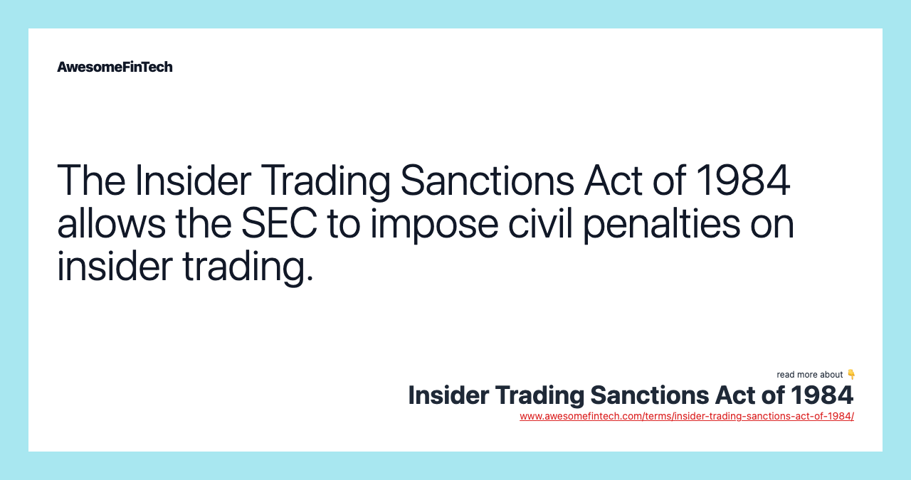

## Table of Contents

## What is the Insider Trading Sanctions Act of 1984?

The Insider Trading Sanctions Act of 1984 is a law passed by the United States Congress to prevent people from using secret information to make money in the stock market. Before this law, it was hard to punish people who used inside information because there were not many rules about it. The Act made it clear that using secret information to buy or sell stocks is illegal and set up punishments for people who do it.

This law was important because it helped to make the stock market fairer for everyone. It allowed the government to fine people who used inside information up to three times the amount of money they made from their illegal trades. By doing this, the law tried to stop people from using secret information and to protect regular investors who do not have access to that information.

## Why was the Insider Trading Sanctions Act of 1984 introduced?

The Insider Trading Sanctions Act of 1984 was introduced because there was a growing problem with people using secret information to make money in the stock market. Before this law, it was hard to punish people for using inside information because there were not many clear rules about it. This made the stock market unfair because some people could make a lot of money by knowing things that others did not know.

To fix this problem, Congress passed the Act to make it clear that using secret information to buy or sell stocks is against the law. The Act set up punishments, like fines that could be up to three times the amount of money made from illegal trades. This was meant to stop people from using inside information and to make the stock market a fairer place for everyone who invests in it.

## What are the key provisions of the Insider Trading Sanctions Act of 1984?

The Insider Trading Sanctions Act of 1984 made it clear that using secret information to buy or sell stocks is illegal. Before this law, it was hard to punish people for using inside information because there were not many rules about it. The Act changed this by setting up clear rules that said using secret information is against the law. This helped to make the stock market fairer for everyone.

The Act also set up punishments for people who use inside information. It said that people could be fined up to three times the amount of money they made from their illegal trades. This was meant to stop people from using secret information because the fines could be very high. By doing this, the law tried to protect regular investors who do not have access to secret information and to make the stock market a fairer place for everyone.

## How does the Insider Trading Sanctions Act of 1984 define insider trading?

The Insider Trading Sanctions Act of 1984 defines insider trading as using secret information to buy or sell stocks. This secret information is something that not everyone knows, and it can give someone an unfair advantage in the stock market. Before this law, it was hard to punish people for using inside information because there were not many clear rules about it.

The Act made it clear that using this secret information is against the law. It set up rules that said if someone uses inside information to make money, they can be punished. The punishment can be a fine that is up to three times the amount of money they made from their illegal trades. This was meant to stop people from using inside information and to make the stock market a fairer place for everyone.

## What penalties can be imposed under the Insider Trading Sanctions Act of 1984?

The Insider Trading Sanctions Act of 1984 says that if someone uses secret information to buy or sell stocks, they can be fined. The fine can be up to three times the amount of money they made from their illegal trades. This means if someone made $10,000 by using inside information, they could be fined up to $30,000.

This law was made to stop people from using secret information to make money in the stock market. Before this law, it was hard to punish people for using inside information because there were not many rules about it. The Act made it clear that using secret information is against the law and set up these fines to make the stock market a fairer place for everyone.

## How does the Act differentiate between civil and criminal penalties for insider trading?

The Insider Trading Sanctions Act of 1984 sets up both civil and criminal penalties for insider trading, but it focuses more on civil penalties. Civil penalties are fines that the government can make someone pay if they use secret information to buy or sell stocks. The Act says that these fines can be up to three times the amount of money someone made from their illegal trades. This means if someone made $10,000 by using inside information, they could be fined up to $30,000. The Act made it easier for the government to go after people who use inside information by setting up these clear rules and fines.

Criminal penalties for insider trading are not directly set by the Insider Trading Sanctions Act of 1984. Instead, criminal penalties are handled by other laws, like the Securities Exchange Act of 1934. If someone is found guilty of insider trading under these criminal laws, they could face jail time, along with fines. The Insider Trading Sanctions Act helps by making it easier to prove that someone used inside information, which can then be used in criminal cases. This way, the Act works together with other laws to stop people from using secret information and to make the stock market fair for everyone.

## What impact did the Insider Trading Sanctions Act of 1984 have on the financial markets?

The Insider Trading Sanctions Act of 1984 had a big impact on the financial markets. Before this law, it was hard to punish people for using secret information to make money in the stock market. The Act made it clear that using inside information is against the law and set up fines that could be up to three times the amount of money someone made from their illegal trades. This made people think twice before using secret information because they knew they could be caught and fined a lot of money.

This law helped to make the stock market a fairer place for everyone. It stopped people from using secret information to get an unfair advantage over other investors. By doing this, the Act made the financial markets more trustworthy. People felt more confident that the market was fair, which encouraged more people to invest. This was good for the economy because it helped money to flow into the stock market in a way that was fair for everyone.

## How has the enforcement of the Insider Trading Sanctions Act of 1984 evolved over time?

Since the Insider Trading Sanctions Act of 1984 was passed, the way it is enforced has changed a lot. At first, the Act made it easier for the government to go after people who used secret information to make money in the stock market. It set up fines that could be up to three times the amount of money someone made from their illegal trades. This helped to stop people from using inside information because they knew they could be caught and fined a lot of money.

Over time, the enforcement of the Act has gotten even stronger. The government has used new technology and better ways to watch the stock market to catch people who use inside information. They also work more closely with other countries to stop insider trading that happens across borders. This has made the financial markets even fairer and more trustworthy for everyone who invests in them.

## Can you explain a notable case that was prosecuted under the Insider Trading Sanctions Act of 1984?

One notable case that was prosecuted under the Insider Trading Sanctions Act of 1984 is the case of Ivan Boesky. Ivan Boesky was a famous Wall Street trader in the 1980s. He made a lot of money by using secret information to buy and sell stocks. In 1986, the government found out that Boesky had been using inside information to make money. They used the Insider Trading Sanctions Act to go after him. Boesky agreed to pay a huge fine of $100 million and he went to jail for about two years. This case showed everyone that the government was serious about stopping insider trading and that they would use the new law to punish people who broke it.

The Boesky case had a big impact on the financial markets. It made people realize that using secret information to make money was very risky because they could get caught and punished. The case also helped to make the stock market a fairer place for everyone. After Boesky was caught, more people felt confident that the market was being watched closely and that it was a safer place to invest their money. This helped to make the financial markets more trustworthy and encouraged more people to invest in them.

## How does the Insider Trading Sanctions Act of 1984 interact with other securities laws?

The Insider Trading Sanctions Act of 1984 works together with other securities laws to stop people from using secret information to make money in the stock market. Before this law, it was hard to punish people for insider trading because there were not many rules about it. The Act made it clear that using inside information is against the law and set up fines that could be up to three times the amount of money someone made from their illegal trades. This helped to make the stock market fairer for everyone by giving the government a clear way to go after people who use secret information.

Other laws, like the Securities Exchange Act of 1934, also help to stop insider trading. This law can lead to criminal penalties, like jail time, for people who use inside information. The Insider Trading Sanctions Act of 1984 makes it easier to prove that someone used secret information, which can then be used in these criminal cases. By working together, these laws help to make sure that the financial markets are fair and that people who use inside information can be caught and punished.

## What are the criticisms and limitations of the Insider Trading Sanctions Act of 1984?

The Insider Trading Sanctions Act of 1984 has been criticized for not being strong enough to stop all insider trading. Some people say that the fines, which can be up to three times the amount of money made from illegal trades, are not big enough to scare everyone away from using secret information. They think that some people might still take the risk because the fines are not as scary as going to jail. Also, the Act only focuses on civil penalties, which means it does not directly lead to jail time. This can make some people think that the punishment is not serious enough.

Another limitation of the Act is that it can be hard to prove that someone used inside information. The government needs to show that the person knew something secret and used it to make money. This can be tricky because people can hide their actions or say they did not know the information was secret. Also, the Act does not cover all types of insider trading. For example, it might not catch people who use secret information to make money in ways that are not directly buying or selling stocks. This means that some insider trading can still happen even with the Act in place.

## How have subsequent laws and regulations built upon or modified the Insider Trading Sanctions Act of 1984?

Since the Insider Trading Sanctions Act of 1984 was passed, other laws and rules have been added to make it even stronger. One big change came with the Insider Trading and Securities Fraud Enforcement Act of 1988. This new law made it easier for the government to go after people who used inside information by letting them use more types of evidence in court. It also made the punishments tougher by adding jail time for people who broke the rules. This showed that the government was serious about stopping insider trading and made the fines from the 1984 Act even more scary because people could also go to jail.

Another important change was the Dodd-Frank Wall Street Reform and Consumer Protection Act of 2010. This law added more rules to stop insider trading and made it easier for people to report it. It also set up a special office to watch for insider trading and other bad actions in the financial markets. These new rules and offices have helped to catch more people who use secret information and have made the stock market a fairer place for everyone. By building on the 1984 Act, these new laws have made it harder for people to use inside information and have helped to keep the financial markets honest.

## References & Further Reading

[1]: ["Insider Trading: Law and Practice"](https://www.paulhastings.com/insights/practice-area-articles/the-law-of-insider-trading-legal-theories-common-defenses-and-best-practices) by Daniel J. W. Nelson

[2]: ["The Law of Insider Trading: Legal Theories, Common Defenses, and Best Practices"](https://www.cahill.com/publications/published-articles/00128/_pdfx/style=pdf/00128.pdf) by John P. Anderson

[3]: Bainbridge, Stephen M. (2009). ["The Law and Economics of Insider Trading: A Comprehensive Primer."](https://pages.stern.nyu.edu/~jhasbrou/Teaching/POST%202015%20Fall/Materials/SSRN-id261277.pdf) Research Handbook on Insider Trading.

[4]: ["High-Frequency Trading: A Practical Guide to Algorithmic Strategies and Trading Systems"](https://www.ahmetbeyefendi.com/wp-content/uploads/2020/07/High-Frequency-Trading-Irene-Aldridge.pdf) by Irene Aldridge

[5]: ["Regulating Financial Markets: When will we learn?"](https://www.britannica.com/money/financial-market-regulators) by Peter Loscher

[6]: MacNeil, I. G., & Li, X. (2009). ["'Comply or Explain': Market Discipline and Non-compliance with the Combined Code."](https://onlinelibrary.wiley.com/doi/full/10.1111/j.1467-8683.2006.00524.x) Corporate Governance: An International Review.