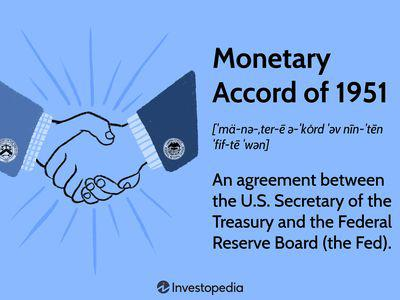

In the evolving landscape of financial trading, regulations are pivotal in ensuring market integrity and protecting investor interests. As trading technologies continue to advance, regulatory frameworks must also adapt to address new challenges and opportunities. One of the most significant regulatory measures introduced to combat illegal trading activities was the Insider Trading Sanctions Act of 1984. This Act was designed to curb insider trading by empowering the Securities and Exchange Commission (SEC) to impose substantial civil penalties on violators, thereby increasing the risk associated with illicit trading activities.

The introduction of the 1984 Act marked a significant shift in the regulatory approach toward insider trading, focusing more on offender punishment than victim compensation. By tripling the profit gained or the loss avoided through insider trading, the Act aimed to deter such activities and promote market fairness. As we examine the impact of this legislation, it becomes evident that its provisions were crucial in enhancing transparency and accountability in financial markets.

In today's landscape, characterized by rapid technological advancements and the rise of algorithmic trading, the lessons and structures established by the 1984 Act remain relevant. The intersection of technology and regulation presents unique challenges, particularly in ensuring that automated trading systems comply with existing laws and ethical standards. As we move forward, the evolution of trading regulations will need to balance the benefits of technological innovation with the necessity of maintaining fair and transparent markets, creating a framework that supports both growth and integrity.

## Table of Contents

## Understanding the Insider Trading Sanctions Act of 1984

The Insider Trading Sanctions Act of 1984 was introduced as a robust legislative measure to address the pernicious issue of insider trading in the financial markets, which involves trading securities based on material, non-public information resulting in unfair advantages. Recognizing the detrimental impact of such practices on market integrity and investor trust, the Act aimed to fortify the enforcement arsenal of the Securities and Exchange Commission (SEC) by significantly amplifying the penalties associated with insider trading infractions.

One of the principal features of the 1984 Act was its empowerment of the SEC to levy civil penalties that could reach up to triple the amount of profits gained or losses avoided through illicit trading activities. This provision aimed to transform the economic calculus for would-be violators by elevating the financial consequences of getting caught. Prior to the enactment of this legislation, the penalties imposed were often seen as mere slaps on the wrist, inadequate to deter those who considered insider trading as a lucrative yet risky endeavor.

By focusing more on punishment rather than victim compensation, the Act marked a paradigm shift in how regulatory bodies addressed violations. The potential for tripled penalties means that if insider trading profits amounted to $10,000, the violator could be liable for up to $30,000 in civil penalties. This advanced punitive approach aimed to dissuade individuals and entities by altering the risk-to-reward balance they might calculate before engaging in such illegal activities. 

Additionally, the Act facilitated a broader discourse on the ethics and legality of trading practices, emphasizing the role of transparency and an equitable playing field in securities markets. The 1984 Act laid the groundwork for subsequent legal frameworks that further defined the boundaries of insider trading, ensuring that market manipulations did not undermine the financial ecosystem's foundational principles. 

In conclusion, the Insider Trading Sanctions Act of 1984 was a transformative regulation designed to penalize insider trading more effectively, thereby fostering a fairer financial market environment. By instituting stringent penalties, the Act sought to curb illegal trading practices and protect the integrity of the markets.

## Key Features and Impact of the 1984 Act

The Insider Trading Sanctions Act of 1984 significantly altered the landscape of financial regulations by introducing more stringent penalties for insider trading activities. Prior to its enactment, the financial repercussions for those caught engaging in insider trading were relatively minimal, often failing to act as a strong deterrent. The 1984 Act aimed to rectify this by increasing the severity of penalties, thus reducing the allure and increasing the risk associated with illegal insider trading practices.

One of the pivotal changes introduced by the Act was the empowerment of the Securities and Exchange Commission (SEC) to impose civil penalties that could reach up to three times the profit gained or the loss avoided as a result of insider trading. This tripling of penalties, often referred to as "treble damages," was a substantial shift from previous financial sanctions and represented a move towards a punitive approach rather than one focused solely on compensating harmed parties.

The implementation of the Act marked a critical turning point in financial regulation by enhancing market transparency and fairness. By imposing significant fines and stringent sanctions, the Act aimed to cultivate an environment where the integrity of financial markets was preserved and respected. With the introduction of these harsher penalties, potential offenders faced a steeper risk-to-reward ratio, effectively serving as a deterrent to engaging in illegal trading based on non-public information.

The increased risk was intended to outweigh the possible benefits of insider trading, aligning the costs of infractions more closely with the damages they inflicted on market trust and fairness. This strategic regulatory change helped build a more level playing field in the securities market, boosting investor confidence and encouraging the dissemination of information in a transparent manner.

In essence, the Act not only transformed the approach towards insider trading by focusing more on punishment, but also set a precedent for future regulatory measures aimed at curbing financial misdemeanors. Its impact continues to resonate in the ongoing efforts to refine and adapt securities regulations to the evolving dynamics of modern trading environments.

## Insider Information and Trading: A Detailed Overview

Insider trading involves the use of non-public, material information for trading stocks or other securities, a practice considered illegal if the information has not been disclosed. Material information refers to any data that could reasonably affect an investor's decision to buy or sell securities. This can include news about mergers and acquisitions, changes in executive leadership, financial results before they are made public, or any other significant corporate activities.

Historically, insider trading laws have aimed to maintain market integrity by ensuring all investors have equal access to pertinent information. The core legislative framework established by the Securities Exchange Act of 1934 targets fraudulent practices in securities trading. Section 10(b) of this Act and SEC Rule 10b-5 form the foundation of legal prohibitions against insider trading.

Legal repercussions for engaging in illegal insider trading are severe, encompassing both civil and criminal penalties. Civil penalties can involve fines of up to three times the profit gained or loss avoided, in accordance with the Insider Trading Sanctions Act of 1984. Criminal penalties may include substantial fines and imprisonment. The enforcement of these laws aims to deter individuals within corporations, such as executives and directors, from utilizing privileged information to their advantage at the expense of uninformed investors.

Not all insider trading is illegal, however. When insiders trade their own company's stock, they must report these trades to the Securities and Exchange Commission (SEC) through forms such as Form 4, which must be filed within two business days of the transaction. The SEC's rule mandates full and prompt disclosure, ensuring transparency and enabling public accessibility to information about insider conduct.

Corporate settings provide various examples of what constitutes insider knowledge. For instance, knowledge of an impending merger or acquisition is crucial for investors and could significantly impact stock prices. Similarly, information about undisclosed financial woes, regulatory issues, or unexpected technological breakthroughs can be pivotal. These insights, being non-public and material, are tightly regulated to prevent unfair trading advantages.

In conclusion, insider trading regulations strive to uphold fairness within financial markets by privileging equal access to essential information. Compliance with legal obligations, particularly concerning disclosure, is vital for corporate insiders engaged in trading activities to avert legal consequences. As markets evolve rapidly with technological advancements, these regulatory measures ensure the continuous integrity of trading systems.

## Algo Trading and Regulatory Challenges

Algorithmic trading, commonly known as algo trading, has transformed the landscape of financial markets by enabling rapid execution of trades through automated systems. This innovation offers substantial benefits in terms of speed and efficiency. However, it also presents several regulatory challenges, especially concerning the potential for market manipulation.

The primary regulatory challenge posed by algo trading is the risk of market manipulation. Algorithms are designed to execute trades at an extremely [high frequency](/wiki/high-frequency-trading), often across multiple markets and securities simultaneously. This complexity can be exploited to engage in manipulative practices such as spoofing and layering. Spoofing involves placing a large number of orders with the intention of canceling them before execution to create false market signals. Similarly, layering involves placing multiple orders at different price levels to mislead other market participants about supply and demand. Both practices can distort market prices and undermine investor confidence.

Given these challenges, regulatory bodies worldwide are increasingly focused on updating their frameworks to address the nuances of algo trading. One of the main issues is the existing regulatory measures' inability to keep up with the technological advancements in trading arenas. Regulators need to implement systems that facilitate real-time monitoring and analysis of trading activities to detect anomalies indicative of manipulative behavior. Machine learning algorithms could be employed to predict and identify suspicious activity patterns in enormous data streams, potentially mitigating risks before they materialize.

Moreover, the high-speed nature of [algorithmic trading](/wiki/algorithmic-trading) complicates compliance with insider trading laws. Algorithms can make trades based on minute-by-minute changes in market conditions, reducing the window for detecting and preventing non-compliant activities. This rapid pace necessitates an evolution in regulatory approaches, emphasizing dynamic and automated detection systems to oversee market activity in near real-time.

In summary, while algorithmic trading offers remarkable advantages to market efficiency, it simultaneously introduces risks that necessitate vigilant regulation. The regulatory environment must adapt by embracing technology-driven solutions, ensuring they align with the rapid developments in trading technologies. The integration of advanced monitoring tools and updated legal frameworks will help safeguard market integrity in an era increasingly dominated by algorithmic transactions.

## Future Outlook: Harmonizing Regulation with Technology

In the context of rapid technological advances, especially in algorithmic trading, the future of financial regulation hinges on integrating cutting-edge monitoring and detection systems. Potential future regulations may prioritize real-time monitoring and automatic detection of trading anomalies, crucial in maintaining market integrity. By leveraging [artificial intelligence](/wiki/ai-artificial-intelligence) and [machine learning](/wiki/machine-learning), regulatory bodies can develop systems capable of detecting irregular trading patterns in real-time, thus offering a proactive approach to regulation rather than a reactive one.

Continual adaptation of insider trading laws to new technologies is paramount. The dynamic nature of technology necessitates a flexible regulatory framework that can evolve with technological shifts. This adaptability ensures that regulations not only cover traditional insider trading activities but also address new scenarios brought about by advancements such as high-frequency trading and blockchain technologies.

Harmonizing financial regulations with technological innovations could lead to more efficient and robust market frameworks. For instance, blockchain technology, known for its transparency and immutability, could play a significant role in enhancing market transparency. By implementing this technology, market participants could benefit from increased trust and reduced risks of insider trading.

Prospective policy adjustments could focus on enlarging the scope of existing regulations to encompass new technological capabilities. This might involve extending the reach of surveillance tools or redefining legal frameworks to include guidelines specific to algorithmic trading. The implications for market participants would likely include stricter compliance requirements, necessitating the integration of advanced risk management systems within their trading operations.

In essence, the future landscape of financial regulation will likely be shaped by the continuous and symbiotic evolution of technology and regulatory frameworks. By embracing these shifts, regulatory bodies can maintain market integrity while fostering an environment conducive to innovation and growth.

## Conclusion

The Insider Trading Sanctions Act of 1984 marked a significant advancement in establishing fair and transparent market practices by imposing substantial penalties on those benefiting from non-public information. This legislative measure was instrumental in deterring unethical behavior by increasing the cost of violations through hefty fines, thus altering the risk-reward calculation for potential offenders. However, the financial sector continues to evolve, driven by technological advancements and changing market dynamics, which necessitates ongoing updates to regulatory frameworks to remain effective and relevant.

As we transition into the era of algorithmic trading, finding an equilibrium between market freedom and the need for regulatory oversight has become increasingly challenging. Algorithmic trading, characterized by its speed and complexity, introduces potential risks such as market manipulation and demands more sophisticated regulatory approaches. Ensuring compliance with insider trading laws requires innovative strategies that can address these new forms of trading activities without stifling innovation.

With the continuous development of technology, there is a potential for regulations to harmonize with these innovations in ways that promote both efficient and ethical market activities. Real-time monitoring systems, enhanced data analysis tools, and automatic detection mechanisms for trading irregularities could become essential components of future regulatory strategies. These advancements offer promising avenues for fostering innovation while maintaining the integrity of financial markets.

In summary, the pursuit of a balanced regulatory environment that accommodates technological growth while ensuring fair market practices remains imperative. The ongoing dialogue between regulators and market participants will play a crucial role in shaping a framework that nurtures innovation and upholds market integrity.

## References & Further Reading

[1]: ["Insider Trading: Law and Practice"](https://www.paulhastings.com/insights/practice-area-articles/the-law-of-insider-trading-legal-theories-common-defenses-and-best-practices) by Daniel J. W. Nelson

[2]: ["The Law of Insider Trading: Legal Theories, Common Defenses, and Best Practices"](https://www.cahill.com/publications/published-articles/00128/_pdfx/style=pdf/00128.pdf) by John P. Anderson

[3]: Bainbridge, Stephen M. (2009). ["The Law and Economics of Insider Trading: A Comprehensive Primer."](https://pages.stern.nyu.edu/~jhasbrou/Teaching/POST%202015%20Fall/Materials/SSRN-id261277.pdf) Research Handbook on Insider Trading.

[4]: ["High-Frequency Trading: A Practical Guide to Algorithmic Strategies and Trading Systems"](https://www.ahmetbeyefendi.com/wp-content/uploads/2020/07/High-Frequency-Trading-Irene-Aldridge.pdf) by Irene Aldridge

[5]: ["Regulating Financial Markets: When will we learn?"](https://www.britannica.com/money/financial-market-regulators) by Peter Loscher

[6]: MacNeil, I. G., & Li, X. (2009). ["'Comply or Explain': Market Discipline and Non-compliance with the Combined Code."](https://onlinelibrary.wiley.com/doi/full/10.1111/j.1467-8683.2006.00524.x) Corporate Governance: An International Review.