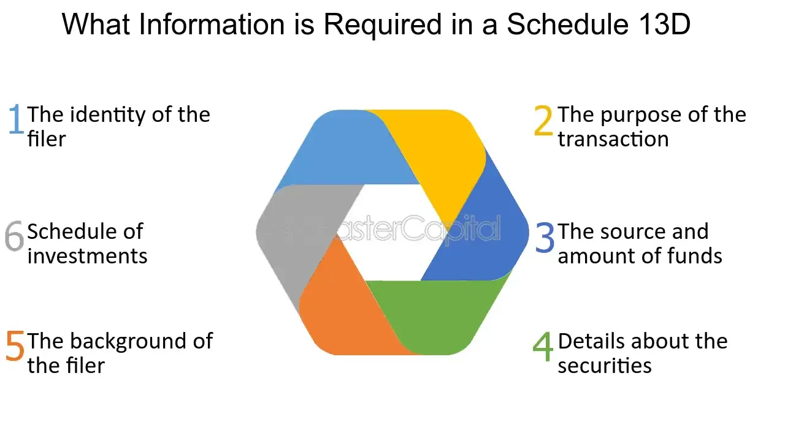

## Table of Contents

## What is Schedule 13D?

Schedule 13D is a form that someone has to file with the Securities and Exchange Commission (SEC) in the United States. They need to do this if they own more than 5% of a company's stock. This form helps the public know who owns a big part of a company. It's important because it keeps things fair and open in the stock market.

The form has to be filed within 10 days of the person owning more than 5% of the stock. It includes details like the person's name, how many shares they own, and why they bought the shares. If anything changes, like if they buy or sell more shares, they need to update the form. This way, everyone can see what's happening with the company's ownership.

## Who is required to file a Schedule 13D?

Anyone who owns more than 5% of a company's stock needs to file a Schedule 13D with the Securities and Exchange Commission (SEC). This rule applies to individuals, groups, and other entities that gain significant control over a company through their stock ownership. The purpose of this filing is to keep the public informed about who has a big stake in a company, which helps maintain transparency in the stock market.

The person or group must file the Schedule 13D within 10 days of crossing the 5% ownership threshold. The form requires them to provide their name, the number of shares they own, and the reason for buying the shares. If their ownership changes, like if they buy or sell more shares, they need to update the form to keep the information current. This ensures that everyone can see who owns a significant portion of the company at any given time.

## What is the purpose of Schedule 13D for investors?

Schedule 13D helps investors by giving them important information about who owns a big part of a company. When someone owns more than 5% of a company's stock, they have to tell the SEC about it. This means investors can see if someone is trying to take over the company or if big investors are buying or selling shares. Knowing this can help investors make better choices about whether to buy, sell, or hold their own shares in the company.

The form also shows why someone bought the shares. This can tell investors if the buyer thinks the company will do well in the future or if they have other plans for the company. By looking at Schedule 13D, investors can understand the big picture of what's happening with the company's ownership and make smarter decisions based on that information.

## How does Schedule 13D differ from Schedule 13G?

Schedule 13D and Schedule 13G are both forms that need to be filed with the SEC when someone owns more than 5% of a company's stock. The main difference is the purpose and the timing of the filings. Schedule 13D is used when someone plans to influence or control the company. They have to file it within 10 days of owning more than 5% of the stock. This form asks for a lot of details about the person's plans and reasons for buying the shares.

On the other hand, Schedule 13G is for people who own more than 5% of a company's stock but don't plan to influence or control the company. They might be passive investors. The filing deadlines for Schedule 13G are more relaxed. For example, institutional investors and certain other groups can file within 45 days after the end of the calendar year in which they crossed the 5% threshold. Schedule 13G requires less information than Schedule 13D, focusing mainly on the ownership details without the need to explain the investor's plans.

## What are the key sections of Schedule 13D that investors should focus on?

When looking at Schedule 13D, investors should pay close attention to the section that lists the identity and background of the person or group filing the form. This section tells you who owns the shares, which can be important if you want to know if someone influential or a big investor is involved. It also includes their business and any past legal issues, which can give you a better idea of who is behind the investment.

Another key section is the one that explains why the person bought the shares and what they plan to do with them. This part can show if the buyer wants to change how the company is run or if they think the company will do well in the future. Knowing these reasons can help investors decide if they should buy, sell, or keep their own shares in the company. 

The section on the amount of shares owned and any recent changes in ownership is also crucial. This tells you how much control the person has over the company and whether they are buying more shares or selling some. Keeping an eye on these changes can give investors a heads-up on big moves in the company's ownership, helping them make smarter investment choices.

## How can investors access Schedule 13D filings?

Investors can access Schedule 13D filings through the Securities and Exchange Commission's (SEC) official website, called EDGAR. On the EDGAR website, you can search for a company's name or the name of the person who filed the Schedule 13D. Once you find the right filing, you can read it online or download it to your computer. The website is easy to use and helps investors stay informed about who owns big parts of a company.

Another way to access Schedule 13D filings is through financial news websites and databases that track SEC filings. These websites often have tools that let you search for filings by company or by the person who filed them. Some of these services might require a subscription, but they can be very helpful for investors who want to keep up with the latest ownership changes in companies they are interested in.

## What are some common reasons for filing a Schedule 13D?

One common reason for filing a Schedule 13D is when someone wants to take over a company. They buy more than 5% of the company's stock to gain control and influence how the company is run. This can be part of a bigger plan to change the company's direction or to merge it with another business. By filing a Schedule 13D, they let everyone know about their intentions, which helps keep things fair and open in the market.

Another reason is when an investor thinks a company is undervalued and wants to buy a big stake in it. They might believe the company will do well in the future and want to benefit from its growth. Filing a Schedule 13D in this case shows their confidence in the company and can even encourage other investors to take a closer look at the company's potential.

## How can Schedule 13D filings influence stock prices?

Schedule 13D filings can make a company's stock price go up or down. When someone files a Schedule 13D, it often means they think the company is worth investing in. If other investors see this, they might also want to buy the stock, thinking it's a good deal. This increased demand can push the stock price higher. For example, if a well-known investor like Warren Buffett files a Schedule 13D, it might make other people think the company is a good investment, causing the stock price to rise.

On the other hand, if the person filing the Schedule 13D says they want to change how the company is run, it can scare some investors. They might worry about what will happen to the company and sell their shares. This can make the stock price go down. For instance, if the filing shows the person wants to break up the company or make big changes, it might make the stock price drop because investors don't like uncertainty.

## What are the potential investment strategies based on Schedule 13D insights?

Investors can use Schedule 13D filings to find good investment opportunities. When someone files a Schedule 13D, it often means they think the company is worth buying into. If the person filing the form is well-known or has a good track record, other investors might want to buy the stock too. This can make the stock price go up. So, one strategy is to look at Schedule 13D filings and buy shares in the same companies, hoping to benefit from the rising stock price.

Another strategy is to watch for signs of a takeover or big changes in the company. If someone files a Schedule 13D because they want to take over the company, it can create uncertainty. Some investors might sell their shares, making the stock price go down. But if the takeover goes well, the stock price might go up later. So, investors can buy shares when the price drops because of the uncertainty, and then sell them when the price goes up after the takeover is successful. This can be a bit riskier, but it can also lead to big gains if it works out.

## How can investors use Schedule 13D to identify activist investors?

Investors can use Schedule 13D to spot activist investors by looking at the reasons why someone bought more than 5% of a company's stock. If the filing says the person wants to change how the company is run or has plans to influence the company's decisions, they might be an activist investor. These investors often have a plan to make the company better, like changing its management or pushing for new strategies.

By reading the Schedule 13D carefully, investors can learn about the activist investor's goals and how they might affect the company. This can help investors decide if they want to buy or sell their own shares. If an activist investor has good ideas, it might make the company's stock price go up, which could be a good time to invest. But if the changes seem risky or might not work out, investors might want to sell their shares to avoid losing money.

## What are the limitations and risks of relying on Schedule 13D for investment decisions?

While Schedule 13D can give investors useful information about who owns a big part of a company and their plans, it has some limits. One big limit is that the information might not be up to date. The person filing the Schedule 13D has to do it within 10 days of owning more than 5% of the stock, but a lot can change in that time. Also, the person filing the form might not tell the whole truth about their plans. They might say they want to help the company grow, but really, they have other ideas. This can make it hard for investors to make good choices based on the form.

Another risk is that the stock market can be unpredictable. Even if an activist investor has good plans, those plans might not work out. The company might not do well, or other investors might not like the changes. This can make the stock price go down instead of up. Also, if a lot of people see the Schedule 13D and start buying the stock, it might become overvalued. This means the price goes up too much and could drop later, causing investors to lose money. So, while Schedule 13D can be a helpful tool, investors should use it carefully and look at other information too.

## How can advanced data analytics enhance the use of Schedule 13D information for expert investors?

Advanced data analytics can help expert investors get more out of Schedule 13D information by looking at patterns and connections that might be hard to see otherwise. For example, analytics can track how often certain investors file Schedule 13Ds and what happens to the stock prices of the companies they invest in. This can help investors see if someone is a good activist investor or if their plans usually work out. Also, by using data analytics, investors can quickly look at a lot of Schedule 13D filings at once and find trends or common reasons why people are buying into certain companies.

Another way data analytics can help is by making predictions based on past Schedule 13D filings. By studying what happened after similar filings in the past, analytics can guess what might happen to a company's stock price in the future. This can give expert investors a heads-up on whether to buy or sell shares. Plus, data analytics can connect Schedule 13D information with other data, like news about the company or the economy, to give a fuller picture of what's going on. This can help investors make smarter choices and maybe even find investment opportunities that others might miss.

## References & Further Reading

[1]: ["Schedule 13D."](https://www.law.cornell.edu/cfr/text/17/240.13d-1) U.S. Securities and Exchange Commission. 

[2]: Damodaran, A. ["Investment Valuation: Tools and Techniques for Determining the Value of Any Asset."](https://archive.org/details/investmentvaluat0000damo_n6k9) John Wiley & Sons.

[3]: Lo, A. W. ["Adaptive Markets: Financial Evolution at the Speed of Thought."](https://www.amazon.com/Adaptive-Markets-Financial-Evolution-Thought/dp/0691135142) Princeton University Press.

[4]: Aronson, D. R. ["Evidence-Based Technical Analysis: Applying the Scientific Method and Statistical Inference to Trading Signals."](https://www.amazon.com/Evidence-Based-Technical-Analysis-Scientific-Statistical/dp/0470008741) John Wiley & Sons.

[5]: Jansen, S. ["Machine Learning for Algorithmic Trading."](https://github.com/stefan-jansen/machine-learning-for-trading) Packt Publishing.

[6]: Chan, E. P. ["Quantitative Trading: How to Build Your Own Algorithmic Trading Business."](https://github.com/ftvision/quant_trading_echan_book) John Wiley & Sons.