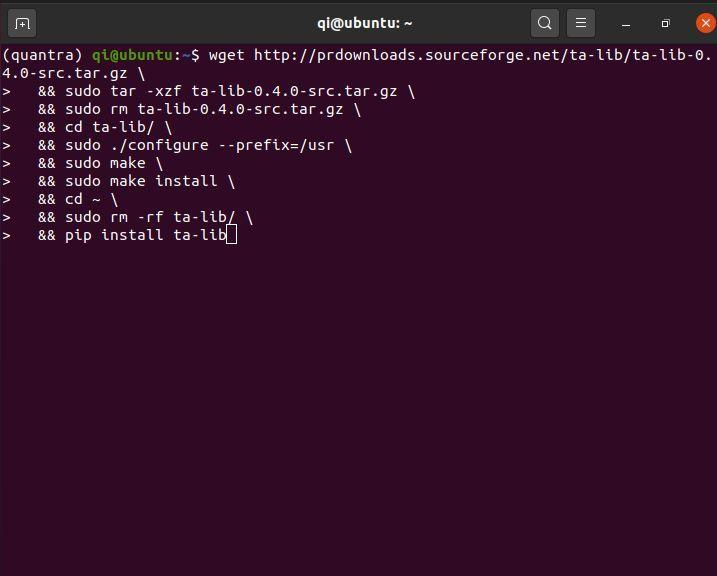

## Table of Contents

## What is TA-Lib and why is it used in Python?

TA-Lib is a library used for technical analysis in finance. It helps people who trade stocks, cryptocurrencies, or other financial instruments to analyze market data and make better decisions. The library contains many tools and functions that can calculate different indicators, like moving averages or the Relative Strength Index (RSI). These indicators help traders understand trends and patterns in the market.

In Python, TA-Lib is popular because it's easy to use and works well with other Python libraries like Pandas and NumPy. Traders and analysts can write Python scripts to automatically process large amounts of data and generate insights quickly. This makes it easier to test trading strategies and see how they might perform in the real market. Overall, TA-Lib helps make the complex job of analyzing financial data simpler and more efficient.

## What are the system requirements for installing TA-Lib on different operating systems?

To install TA-Lib on Windows, you need to have a computer running Windows 7 or later. You also need to download and install the TA-Lib library itself before you can use it with Python. This involves downloading the TA-Lib package from the official website, installing it, and then installing the Python wrapper using pip. Make sure you have enough disk space and that your system meets the minimum requirements for running Python.

For macOS, you need a Mac running macOS 10.9 or later. Similar to Windows, you need to download the TA-Lib package and install it on your system. After that, you can use pip to install the Python wrapper. Ensure your system has the necessary disk space and meets the requirements for running Python smoothly.

On Linux systems, the requirements can vary depending on the distribution you are using, but generally, you need a recent version of your Linux OS. You can usually install TA-Lib using your package manager, like apt for Ubuntu or yum for CentOS. After installing the TA-Lib package, you can then use pip to install the Python wrapper. As with other operating systems, ensure you have enough disk space and that your system supports the Python version you are using.

## How can I install TA-Lib using pip on Windows?

To install TA-Lib using pip on Windows, you first need to download and install the TA-Lib library. Go to the official TA-Lib website and download the Windows installer. Once you have downloaded it, run the installer and follow the instructions to install TA-Lib on your computer. Make sure you install it in a place where your Python can find it, like in the C drive.

After installing the TA-Lib library, you can use pip to install the Python wrapper. Open the command prompt or PowerShell on your Windows computer. Type the command `pip install TA-Lib` and press enter. This will download and install the TA-Lib package for Python. Once it's done, you can start using TA-Lib in your Python scripts to do technical analysis.

## What are the steps to install TA-Lib on macOS?

To install TA-Lib on macOS, first go to the TA-Lib website and download the macOS installer. Once you have the file, open it and follow the instructions to install TA-Lib on your computer. Make sure you install it in a place where your Python can find it, like in your Applications folder.

After you have installed the TA-Lib library, you need to install the Python wrapper. Open the Terminal on your Mac. In the Terminal, type the command `pip install TA-Lib` and press enter. This will download and install the TA-Lib package for Python. Once it's done, you can start using TA-Lib in your Python scripts to do technical analysis.

## How do I install TA-Lib on Linux?

To install TA-Lib on Linux, start by opening a terminal window. First, you need to install the TA-Lib library itself. You can do this using your system's package manager. For example, if you are using Ubuntu, type `sudo apt-get install libta-lib0 libta-lib-dev` and press enter. This command will download and install the necessary files for TA-Lib. Make sure you have the right permissions to install software on your computer.

After the TA-Lib library is installed, you need to install the Python wrapper. In the same terminal window, type `pip install TA-Lib` and press enter. This will download and install the TA-Lib package for Python. Once it's done, you can start using TA-Lib in your Python scripts to do technical analysis.

## What common issues might I encounter during the installation of TA-Lib, and how can I resolve them?

When installing TA-Lib, you might run into problems like missing dependencies or permission errors. If you're using Linux, you might get an error saying that it can't find the TA-Lib library. This usually happens because the library wasn't installed correctly. To fix this, make sure you've installed the library using your package manager, like 'sudo apt-get install libta-lib0 libta-lib-dev' on Ubuntu. If you're still having trouble, try updating your package lists with 'sudo apt-get update' before installing.

Another common issue is permission errors, especially when you're trying to install on Linux or macOS. If you see a message saying you don't have permission to install something, you need to run the command with 'sudo' at the beginning. This gives you the right to install software. On Windows, you might have trouble finding the right version of the TA-Lib library to download. Make sure you pick the one that matches your system, like 32-bit or 64-bit, and install it in a place where Python can find it, like the C drive.

If you're using pip to install the Python wrapper and it fails, it could be because your pip version is outdated. You can update pip by running 'pip install --upgrade pip' before trying to install TA-Lib again. Also, make sure you have a good internet connection, as pip needs to download files from the internet. If all else fails, check the TA-Lib website or forums for help, as other users might have run into the same problems and found solutions.

## How can I verify if TA-Lib has been installed correctly in my Python environment?

To check if TA-Lib is installed correctly in your Python environment, you can open a Python interpreter or create a new Python script. In the interpreter or script, type `import talib` and run it. If you don't see any error messages, it means TA-Lib is installed and working properly. You can also try using a function from TA-Lib, like calculating a moving average. Type `data = [1, 2, 3, 4, 5]` and then `result = talib.SMA(data, timeperiod=3)`. If you see a result without errors, TA-Lib is definitely working.

If you get an error when trying to import TA-Lib, it means something went wrong with the installation. The error message might give you a hint about what's wrong, like saying it can't find the TA-Lib library. In that case, you might need to check if you installed the library correctly on your computer before installing the Python wrapper. Make sure you followed all the steps for your operating system and that you have the right permissions to install software. If you're still having trouble, you can look for help on the TA-Lib website or forums where other users might have faced similar issues.

## What are the alternatives to TA-Lib for technical analysis in Python?

One good alternative to TA-Lib for technical analysis in Python is the `pandas-ta` library. It's easy to use because it works well with Pandas, which is a popular tool for data analysis in Python. With `pandas-ta`, you can quickly add technical indicators to your data without having to install extra stuff on your computer. It has lots of indicators like moving averages, RSI, and MACD, so you can do all sorts of analysis to understand market trends and make trading decisions.

Another option is the `pyalgotrade` library, which is great for backtesting trading strategies. It lets you test how your trading ideas would have worked in the past, so you can see if they might be good for the future. `pyalgotrade` has tools for calculating indicators and even for executing trades, making it a full package for both analysis and trading. It's a bit more complex than `pandas-ta`, but it's powerful for people who want to dive deep into their trading strategies.

Lastly, you can use `Zipline`, which is a Pythonic algorithmic trading library developed by Quantopian. It's designed for large-scale backtesting and has a lot of built-in functions for technical analysis. `Zipline` is more advanced and might take some time to learn, but it's very powerful for professionals who want to analyze markets and test strategies thoroughly. It works well with other Python tools and can handle big data sets, making it a strong choice for serious traders and analysts.

## Can TA-Lib be used within Jupyter Notebooks, and if so, how?

Yes, you can use TA-Lib in Jupyter Notebooks. First, you need to make sure TA-Lib is installed on your computer and that you can import it in Python. Once you have it set up, start a new Jupyter Notebook or open an existing one. In the first cell, type `import talib` and run it. If you don't see any error messages, TA-Lib is ready to use in your notebook.

After importing TA-Lib, you can start using its functions to do technical analysis. For example, if you have a list of numbers representing stock prices, you can calculate a moving average by typing `data = [1, 2, 3, 4, 5]` and then `result = talib.SMA(data, timeperiod=3)` in a new cell. Run the cell, and you'll see the moving average results. This way, you can easily explore different technical indicators and analyze data right in your Jupyter Notebook.

## How can I update TA-Lib to the latest version?

To update TA-Lib to the latest version, you need to check if there's a new version available on the TA-Lib website. If there is, download the new version for your operating system, like Windows, macOS, or Linux. After downloading, install the new version on your computer, making sure to overwrite the old version. Once the library is updated, open a terminal or command prompt and type `pip install --upgrade TA-Lib` to update the Python wrapper. This will ensure you're using the latest features and fixes in TA-Lib.

If you run into any problems while updating, make sure you have the right permissions to install software on your computer. Sometimes, you might need to use `sudo` on Linux or macOS to install or update. Also, if you're using a virtual environment in Python, make sure you're activating it before updating TA-Lib. This way, you can keep your TA-Lib up to date and working smoothly with your Python projects.

## What are some advanced configurations or optimizations I can apply when using TA-Lib?

When using TA-Lib, one advanced configuration you can apply is to optimize the calculation of indicators by using vectorized operations. Instead of looping through each data point, which can be slow, you can pass entire arrays to TA-Lib functions. This makes the calculations much faster, especially when you're working with large datasets. For example, if you're calculating a moving average, you can pass your whole list of prices at once, and TA-Lib will handle it efficiently. This approach saves time and makes your analysis quicker.

Another optimization you can use is to fine-tune the parameters of the indicators you're using. By experimenting with different time periods or thresholds, you can find the settings that work best for your specific trading strategy. For instance, you might try different lengths for a moving average to see which one gives you the most accurate signals for your market. TA-Lib lets you easily change these parameters, so you can test and refine your analysis until you get the results you want. This way, you can make your technical analysis more precise and effective.

## How can I contribute to the TA-Lib project or report issues?

If you want to help with the TA-Lib project or let them know about a problem, you can start by going to the TA-Lib website. There, you'll find a section for reporting issues or bugs. Just click on it, and you can write about the problem you're having. Make sure to give clear details, like what you were doing when the problem happened and what error messages you saw. This helps the people working on TA-Lib understand and fix the issue faster.

If you want to contribute to the project, you can also go to the TA-Lib website and look for a section on how to get involved. They might have a way for you to send in your own code or ideas to improve TA-Lib. It's good to read their guidelines first so you know how to share your contributions. Whether you're reporting a problem or helping to make TA-Lib better, your input can make a big difference for everyone who uses this tool.

## What is TA-Lib?

TA-Lib, short for Technical Analysis Library, is a software library designed by Mario Fortier to facilitate the technical analysis of financial markets. This library is essential for traders and developers who require powerful tools to analyze and interpret market data. 

TA-Lib seamlessly integrates with Python, making it widely accessible for developers engaged in algorithmic trading. However, its origins trace back to a C/C++ implementation, which underscores its robust computational framework. The primary advantage of TA-Lib is its comprehensive collection of over 150 technical indicators, including but not limited to the Average Directional Index (ADX), Moving Average Convergence Divergence (MACD), Relative Strength Index (RSI), and Bollinger Bands.

These indicators serve as vital tools for traders aiming to examine various aspects of market behavior, such as trend strength, [momentum](/wiki/momentum), and [volatility](/wiki/volatility-trading-strategies). For instance, the RSI is used to evaluate whether an asset is overbought or oversold, potentially signaling a reversal. In mathematical terms, RSI can be represented as:

$$
\text{RSI} = 100 - \left(\frac{100}{1 + \text{RS}}\right)
$$

where RS (Relative Strength) is the average of 'n' days' up closes divided by the average of 'n' days' down closes.

Moreover, TA-Lib provides methods for computing both simple and exponential moving averages (SMA and EMA, respectively). These moving averages are integral in identifying price trends by smoothing out price data over specified periods. The library’s utility extends to recognizing complex candlestick patterns, critical for interpreting market sentiment and predicting potential price movements.

TA-Lib’s Python interface has particularly enhanced its appeal, given the simplicity with which complex technical indicators can be implemented using minimal lines of code. Here is a basic example of calculating a moving average using TA-Lib in Python:

```python
import talib
import numpy as np

# Sample data
close_prices = np.array([44.333, 45.567, 46.789, 47.001, 44.232])

# Calculate the Simple Moving Average (SMA) for the last 3 observations
sma = talib.SMA(close_prices, timeperiod=3)
print(sma)
```

The library's versatility makes it a cornerstone in the development of sophisticated [algorithmic trading](/wiki/algorithmic-trading) strategies, allowing traders to programmatically analyze historical market data and derive actionable insights. This level of technical sophistication assists traders in making informed decisions, thereby optimizing their trading strategies. As such, TA-Lib remains a highly valuable asset for those involved in financial analysis and trading.

## What are some examples of technical indicators that can be used with TA-Lib?

TA-Lib is a robust library for deploying various technical indicators, crucial in building effective algorithmic trading strategies. Among the fundamental functions it supports are the calculation of moving averages, utilising Bollinger Bands, implementing the Relative Strength Index (RSI), and integrating with Plotly for enhanced data visualisation.

### Calculating Moving Averages

Moving averages are pivotal in smoothing out price data by creating a constantly updated average price. This helps traders discern trends over time. TA-Lib offers functions to compute two primary types of moving averages:

1. **Simple Moving Average (SMA)**: The SMA is the unweighted mean of the previous `n` data points. It is computed as:
$$
   \text{SMA} = \frac{p_1 + p_2 + \ldots + p_n}{n}

$$

   Where $p_i$ is the price at day $i$.

   **Python Implementation**:
   ```python
   import talib
   import numpy as np

   # Example closing prices
   close_prices = np.array([45, 46, 47, 48, 49, 50])
   sma = talib.SMA(close_prices, timeperiod=5)
   print(sma)
   ```

2. **Exponential Moving Average (EMA)**: Unlike SMA, EMA applies more weight to recent prices, which can make it more responsive to new information. 

   **Python Implementation**:
   ```python
   ema = talib.EMA(close_prices, timeperiod=5)
   print(ema)
   ```

### Utilizing Bollinger Bands

Bollinger Bands are a volatility indicator that consists of a middle band (SMA) and two outer bands that reflect standard deviations away from the mid-band. They can help identify overbought or oversold markets.

**Python Implementation**:
```python
upperband, middleband, lowerband = talib.BBANDS(close_prices, timeperiod=5, nbdevup=2, nbdevdn=2, matype=0)
print(upperband, middleband, lowerband)
```

### Implementing RSI

The Relative Strength Index (RSI) is another essential TA tool provided by TA-Lib. RSI measures the velocity and change of price movements and is used to identify overbought or oversold conditions.

**RSI Calculation**:
$$
   \text{RSI} = 100 - \frac{100}{1 + \text{RS}}

$$
   Where RS is the average gain of up periods divided by the average loss of down periods in a specified timeframe.

**Python Implementation**:
```python
rsi = talib.RSI(close_prices, timeperiod=14)
print(rsi)
```

### Integration with Plotly for Visualization

For a comprehensive analysis, integrating TA-Lib calculations with Plotly allows for insightful visualisation of data, enhancing the analytical process. By plotting moving averages, Bollinger Bands, and RSI on price charts, traders get a clearer picture of market conditions and potential signals for trading.

**Python Plotly Example**:
```python
import plotly.graph_objects as go

# Plotting prices
fig = go.Figure(data=[go.Candlestick(x=np.arange(len(close_prices)),
                open=close_prices, high=close_prices+1, low=close_prices-1, close=close_prices)])

# Adding SMA
fig.add_trace(go.Scatter(x=np.arange(len(sma)), y=sma, mode='lines', name='SMA'))

# Adding Bollinger Bands
fig.add_trace(go.Scatter(x=np.arange(len(upperband)), y=upperband, mode='lines', name='Upper Band'))
fig.add_trace(go.Scatter(x=np.arange(len(lowerband)), y=lowerband, mode='lines', name='Lower Band'))

fig.show()
```

By employing these indicators and their respective visualizations, traders can craft more strategic and informed trading decisions, utilizing the computational strength and ease of access provided by TA-Lib.

## References & Further Reading

[1]: Fortier, M. [TA-Lib: Technical Analysis Library.](https://ta-lib.org/) Available at: http://ta-lib.org/

[2]: ["Installing TA-Lib on Different Platforms." Anaconda Documentation.](https://www.python.org/downloads/?ref=devkoriel)

[3]: Arora, N., & Kale, P. (2021). ["Technical Analysis for Algorithmic Pattern Trading."](https://scholar.google.com/citations?user=RUP4S68AAAAJ) In: Real-Life Applications of Machine Learning. Springer.

[4]: Mazalov, V. (2014). ["Algorithmic Trading and Its Implications on the Financial Markets."](https://books.google.com/books/about/Mathematical_Game_Theory_and_Application.html?id=YqULBAAAQBAJ) Springer. 

[5]: Vaswani, A., & Rahat, Y. (2018). ["Algorithmic Trading and DMA: An Introduction to Direct Access Trading Strategies."](https://www.amazon.com/Algorithmic-Trading-DMA-introduction-strategies/dp/0956399207) 4th Edition. 

[6]: ["Learn Algorithmic Trading: Build and Deploy Algorithmic Trading Systems and Strategies Using Python and Advanced Data Analysis."](https://github.com/PacktPublishing/Learn-Algorithmic-Trading) by Sebastien Donadio, Sourav Ghosh, and Vkissh

[7]: ["Mastering Pandas for Finance"](https://github.com/PacktPublishing/Mastering-Pandas-for-Finance) by James Proulx