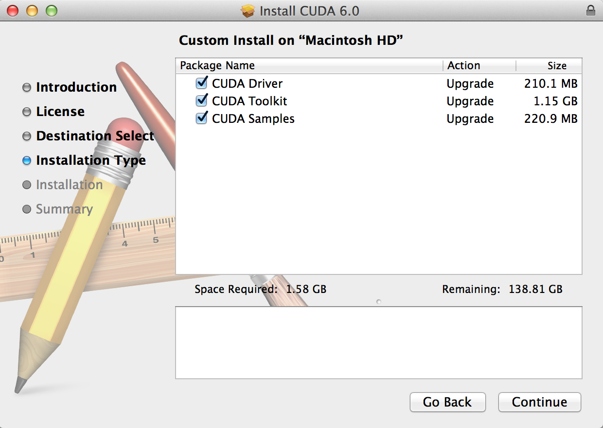

## Table of Contents

## What is Nvidia CUDA and why is it useful for parallel computing?

Nvidia CUDA is a technology that lets you use Nvidia graphics cards to do more than just show pictures on your computer. It's a way to make your computer do many things at the same time, which is called parallel computing. CUDA stands for Compute Unified Device Architecture. It lets programmers write special code that can run on the thousands of small processors inside an Nvidia graphics card, instead of just using the main computer processor.

CUDA is useful for parallel computing because it can make programs run much faster. When you have a big job that can be split into smaller pieces, like searching through a huge list of numbers or making a detailed picture, CUDA can help. Each small processor in the graphics card can work on a different piece of the job at the same time. This means that tasks that would take a long time on a regular computer can be done much quicker with CUDA. It's like having a team of workers instead of just one, making everything more efficient.

## What are the system requirements for installing CUDA on a Mac?

To install CUDA on a Mac, you need a Mac computer with an Nvidia graphics card that supports CUDA. This means your Mac should have a graphics card from the GeForce, Quadro, or Tesla series. You also need to make sure your Mac is running on macOS High Sierra (10.13) or a newer version. It's important to check if your specific model of Mac and its graphics card are on Nvidia's list of supported devices because not all Macs with Nvidia cards will work with CUDA.

Besides the hardware, you'll need to have some software ready. You need to install the Xcode development environment from Apple, which you can get for free from the Mac App Store. Xcode is important because it includes the tools needed to compile and run CUDA programs. Also, make sure you have enough free space on your Mac, as installing CUDA and its toolkit can take up several gigabytes. Once you have all these things ready, you can download and install the CUDA Toolkit from Nvidia's website.

## How do I check if my Mac is compatible with CUDA?

To check if your Mac is compatible with CUDA, you need to look at two main things: your Mac's graphics card and the version of macOS you are using. First, find out if your Mac has an Nvidia graphics card. You can do this by clicking the Apple logo in the top left corner of your screen, then choosing "About This Mac," and then clicking on "System Report." Look under "Graphics/Displays" to see the name of your graphics card. It should be a model from the GeForce, Quadro, or Tesla series if it supports CUDA.

Next, you need to check if your macOS version is supported. CUDA works with macOS High Sierra (10.13) or newer. You can see your macOS version by going to "About This Mac" again; it will show you the version number right there. If your Mac has an Nvidia graphics card from the right series and you are running macOS High Sierra or later, then your Mac is likely compatible with CUDA. But, it's a good idea to also check Nvidia's official website for a list of supported Mac models and graphics cards to be sure.

## What are the steps to download the CUDA toolkit for Mac OSX?

To download the CUDA toolkit for Mac OSX, first go to the Nvidia website. Look for the section that says "CUDA Toolkit" and click on it. You will see a page with different versions of the toolkit. Choose the version that matches your Mac's operating system, which should be macOS High Sierra (10.13) or newer. Once you find the right version, click on the download button. You might need to sign in or create an Nvidia account to start the download.

After the download finishes, you will have a file on your Mac. This file is the CUDA toolkit installer. Double-click on this file to start the installation process. Follow the instructions that appear on your screen. The installer will guide you through setting up the CUDA toolkit on your Mac. Once the installation is done, you can start using CUDA to run programs that use parallel computing on your Nvidia graphics card.

## How do I install the CUDA toolkit on Mac OSX?

To install the CUDA toolkit on your Mac, start by downloading the right version from the Nvidia website. Make sure you pick the one that works with your Mac's operating system, which should be macOS High Sierra or newer. After you download the file, double-click on it to start the installation. The installer will show you some steps to follow. Just go through them, and it will set up the CUDA toolkit on your Mac.

Once the installation is finished, you can use CUDA to run programs that do parallel computing on your Nvidia graphics card. Make sure you have Xcode installed too, because it has tools you need to work with CUDA. If everything is set up correctly, you're ready to start using CUDA to make your computer do many things at the same time and speed up your work.

## What are common issues faced during CUDA installation on Mac and how to resolve them?

One common problem when installing CUDA on a Mac is that the Mac might not have the right graphics card. CUDA only works with Nvidia graphics cards like GeForce, Quadro, or Tesla. If your Mac doesn't have one of these, you can't use CUDA. To fix this, you need to check your Mac's graphics card in the "About This Mac" section under "System Report" and make sure it's on Nvidia's list of supported cards. Another issue could be that your macOS version is too old. CUDA needs macOS High Sierra or newer. If your Mac is running an older version, you'll need to update it before installing CUDA.

Another problem you might face is that you don't have Xcode installed. CUDA uses Xcode's tools to work, so you need to get Xcode from the Mac App Store for free. If you see error messages about missing tools during the CUDA installation, it's probably because Xcode isn't installed or not up to date. Make sure to install or update Xcode before trying to install CUDA again. If you follow these steps and make sure your Mac meets all the requirements, you should be able to install CUDA without too much trouble.

## How can I verify that CUDA has been successfully installed on my Mac?

To check if CUDA has been installed correctly on your Mac, you can use a special command in the Terminal app. Open Terminal and type "nvcc --version", then press Enter. If CUDA is installed right, you'll see some information about the version of CUDA you have. This means the CUDA compiler is working and ready to use.

If you want to make sure everything is set up properly, you can also run a simple CUDA program. First, make sure you have a CUDA program ready, or you can find one online. Save the program in a file with a .cu extension, like "test.cu". Then, in Terminal, go to the folder where you saved the file and type "nvcc test.cu -o test" to compile it. If it compiles without errors, run the program by typing "./test". If it runs and gives the right results, then CUDA is working well on your Mac.

## What are the basic CUDA programming concepts for beginners?

CUDA programming is about using Nvidia graphics cards to make your computer do many things at the same time. This is called parallel computing. In CUDA, you write special code that runs on the graphics card's many small processors, called CUDA cores. These cores work together to solve big problems faster than a regular computer processor could. To start, you need to understand a few key ideas like threads, blocks, and grids. Threads are the smallest units of work in CUDA. They are grouped into blocks, and blocks are organized into a grid. This structure helps the graphics card manage and run your program efficiently.

When you write a CUDA program, you split your work into parts that can be done at the same time. Each thread does a small piece of the job. For example, if you want to add up a big list of numbers, each thread can add a few numbers, and then all the results are combined. You use special CUDA functions, called kernels, to tell the graphics card what to do. Kernels are the parts of your program that run on the graphics card. You also need to move data between your computer's main memory and the graphics card's memory. This is important because the graphics card can only work with data that's in its own memory. By understanding these basic concepts, you can start writing CUDA programs to make your computer work faster on big tasks.

## How do I set up a development environment for CUDA programming on Mac?

To set up a development environment for CUDA programming on your Mac, you first need to make sure your Mac has an Nvidia graphics card like GeForce, Quadro, or Tesla. You also need to be running macOS High Sierra or a newer version. Once you've checked these, download the CUDA Toolkit from Nvidia's website. Make sure you get the version that matches your macOS. After downloading, double-click the file to start the installation and follow the steps it shows you. You'll also need to install Xcode from the Mac App Store because it has tools you need to work with CUDA.

After installing the CUDA Toolkit and Xcode, you can start writing CUDA programs. Open the Terminal app on your Mac and type "nvcc --version" to check if CUDA is installed correctly. If you see the version number, it's working. To write and run a CUDA program, create a file with a .cu extension, like "test.cu". Use a text editor to write your CUDA code in this file. Then, in Terminal, go to the folder where you saved the file and type "nvcc test.cu -o test" to compile it. If it compiles without errors, run the program by typing "./test". If it runs and gives the right results, your CUDA development environment is set up and ready to use.

## What are advanced CUDA programming techniques for optimizing GPU performance?

To make your CUDA programs run faster on the GPU, you need to use some smart tricks. One important trick is to make sure your program uses the GPU's memory well. The GPU has different types of memory, like global memory and shared memory. Global memory is big but slow, while shared memory is small but fast. By moving data that you use a lot into shared memory, you can make your program run much quicker. Another trick is to use something called "coalesced memory access." This means making sure that the threads in a block read or write data from memory in a way that's easy for the GPU to handle, like reading data in big chunks instead of small pieces.

Another way to speed up your CUDA programs is by using more threads and blocks wisely. The GPU can run thousands of threads at the same time, but you need to make sure they're doing useful work. You can do this by breaking your problem into smaller pieces that can be done at the same time. Also, you can use a technique called "occupancy" to make sure the GPU is always busy. This means making sure you have enough threads and blocks to keep all the GPU's processors working without wasting time. By using these advanced techniques, you can make your CUDA programs run faster and use the GPU's power better.

## How can I integrate CUDA with other programming languages or frameworks on Mac?

To use CUDA with other programming languages or frameworks on your Mac, you can start by using CUDA with C or C++. These languages work well with CUDA because they are what CUDA was made for. If you want to use CUDA with other languages like Python, you can use special tools like PyCUDA or Numba. PyCUDA lets you write CUDA code in Python, making it easier to use CUDA if you already know Python. Numba is another tool that can turn some Python code into CUDA code automatically, so you don't have to learn all the details of CUDA programming.

## How to get started with CUDA on Mac for Traders

To harness the potential of CUDA on a Mac for algorithmic trading, traders must first establish a robust computing environment. This process begins with setting up the necessary software and tools—primarily the CUDA Toolkit, which facilitates communication between the operating system and NVIDIA GPUs. 

**Installing the CUDA Toolkit**

Before proceeding with the installation, it's important to verify whether your Mac is compatible with CUDA. This includes ensuring that your Mac has an NVIDIA GPU, as Apple's recent hardware—such as devices featuring Apple Silicon—do not support NVIDIA GPUs. Assuming compatibility, the first step is to download the appropriate version of the CUDA Toolkit from NVIDIA's official website. The toolkit typically includes the CUDA compiler, debugging tools, and various libraries.

During installation, follow these general steps:

1. **Download the Installer**: Visit the official [NVIDIA Developer website](https://developer.nvidia.com/) to download the installer for the desired CUDA version.

2. **Installation Process**: Run the installer and follow the instructions. You may need to authenticate with administrative privileges. It is crucial to install the CUDA drivers, which are necessary for enabling GPU operations on macOS.

3. **Verify Installation**: Open the Terminal and execute the command `nvcc --version` to confirm the successful installation of the CUDA Toolkit. You should observe information about the CUDA version installed.

**Configuring GPU Settings**

After installing CUDA, configuring the GPU settings to optimize performance for algorithmic trading applications might be necessary. This process often involves adjusting settings like clock speed and memory usage, based on the specific requirements of your trading algorithms. Although macOS doesn’t provide extensive tools for GPU configuration like some Linux distributions or Windows, third-party software, such as `gpusniffer` or `CUDA-Z`, can provide insights into GPU performance metrics.

**Resources and Learning Materials**

Several resources are available to help traders leverage CUDA on macOS effectively:

- **NVIDIA's Official CUDA Documentation**: Provides comprehensive guides and technical manuals for setting up and using CUDA.

- **Online Tutorials and Courses**: Platforms such as Coursera, Udemy, or Khan Academy offer courses on CUDA programming and optimization techniques.

- **Community Forums and User Groups**: Engaging with communities like the NVIDIA Developer Forums or MacRumors can provide valuable insights and troubleshooting tips from other users who have implemented similar setups.

- **Open-source Projects and GitHub Repositories**: Reviewing open-source trading projects involving CUDA can offer practical examples and code snippets that can accelerate the learning curve.

By establishing a macOS environment that efficiently incorporates CUDA, traders can significantly enhance their algorithmic trading capabilities, leveraging increased computational power for more precise and faster models.

For frameworks, you can use CUDA with popular ones like TensorFlow or PyTorch for [machine learning](/wiki/machine-learning). Both of these frameworks have ways to use CUDA to make your machine learning models run faster on the GPU. In TensorFlow, you can set up your code to use the GPU by choosing the right device. In PyTorch, you can move your data and models to the GPU with simple commands. By using these tools and frameworks, you can make your programs run faster and take advantage of the power of your Nvidia graphics card on your Mac.

## What are the best practices for managing CUDA-enabled GPU resources on Mac OSX?

When using CUDA on your Mac, it's important to manage your GPU resources well so your programs run smoothly. One good way to do this is by keeping an eye on how much memory your GPU is using. CUDA programs can use a lot of the GPU's memory, so make sure you're not using more than you need. You can check the memory usage with tools like `nvidia-smi` in the Terminal. Also, try to close other programs that might be using the GPU when you're running CUDA code. This helps make sure your CUDA program has enough resources to work well.

Another important thing is to use the right number of threads and blocks in your CUDA programs. The GPU can handle a lot of threads at the same time, but using too many can slow things down. Try to find the right balance so your GPU stays busy but doesn't get overwhelmed. You can also use shared memory wisely to make your programs run faster. Shared memory is a small but fast part of the GPU's memory, and using it well can help your programs run more quickly. By following these tips, you can make sure your CUDA programs on your Mac run as fast and efficiently as possible.

## References & Further Reading

[1]: "CUDA Programming Guide" by NVIDIA Corporation. Available at: https://docs.nvidia.com/cuda/cuda-c-programming-guide/

[2]: "GPU Gems" series by Randima Fernando, Mark J. Kilgard, and others on the use of GPUs for various computational purposes. Available at: https://developer.nvidia.com/gpugems/books

[3]: "Learning CUDA: Programming Massively Parallel Processors" by David B. Kirk and Wen-mei W. Hwu, focusing on leveraging CUDA for parallel computing.

[4]: "High Performance Scientific Computing with CUDA" by Kevin Stratford and others, available at: https://epubs.siam.org/doi/book/10.1137/1.9781611974652

[5]: "Parallel Computing for Data Science: With Examples in R, C++ and CUDA" by Norman Matloff, providing examples of using CUDA for data science applications.

[6]: "Algorithmic Trading and DMA: An Introduction to Direct Access Trading Strategies" by Barry Johnson, discussing strategies and technologies in algorithmic trading.

[7]: "Hands-On GPU Programming with Python and CUDA" by Dr. Brian Tuomanen, providing practical applications for leveraging CUDA in Python.