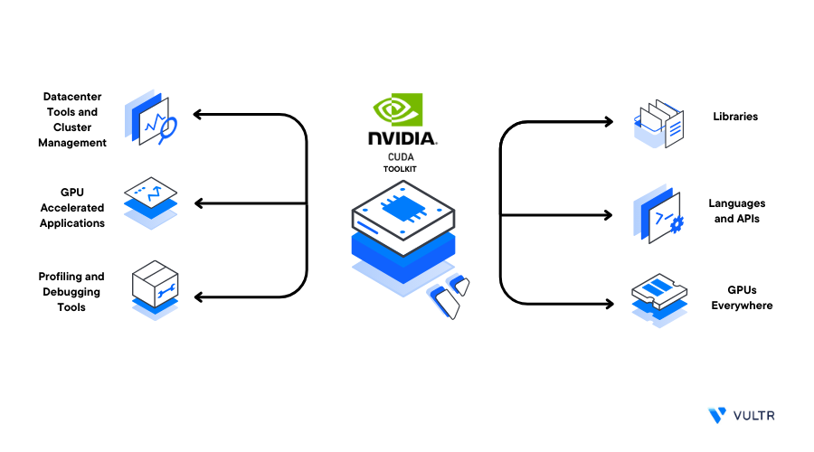

## Table of Contents

## What is Nvidia CUDA and why is it important for GPU computing?

Nvidia CUDA is a technology created by Nvidia that allows developers to use their graphics processing units (GPUs) for more than just graphics. It's a way to make the GPU do lots of math and calculations very quickly, which is great for things like scientific research, machine learning, and video processing. CUDA stands for Compute Unified Device Architecture, and it lets developers write programs that can run on the GPU, taking advantage of its many small processors to do work faster than a regular computer processor could.

CUDA is important for GPU computing because it makes the GPU much more useful. Before CUDA, GPUs were mainly used for making video games and graphics look good. But with CUDA, people can use the GPU to solve big problems that need a lot of math done quickly. This has helped fields like artificial intelligence, where you need to process huge amounts of data to train models. It's also used in things like weather prediction and medical imaging, making these tasks faster and more efficient.

## What are the system requirements for installing CUDA on Ubuntu?

To install CUDA on Ubuntu, your computer needs to meet some basic requirements. You need a computer with an Nvidia GPU that supports CUDA. This means it should be a fairly recent model, usually from the last few years. You also need enough space on your computer, about 2 to 3 gigabytes, to install the CUDA toolkit. Your computer should be running a 64-bit version of Ubuntu, and it's best if it's a recent version like Ubuntu 20.04 or newer. 

You also need to make sure your system has the right drivers. Before installing CUDA, you need to have the Nvidia drivers installed. These drivers let your computer talk to the GPU properly. You can usually get these drivers from the Ubuntu software center or directly from Nvidia's website. Once you have the drivers, you can download the CUDA toolkit from Nvidia's website and follow their instructions to install it. This will let you use your GPU for more than just graphics, opening up a lot of possibilities for faster computing.

## How do I check if my Nvidia GPU is compatible with CUDA?

To check if your Nvidia GPU is compatible with CUDA, you need to find out what model your GPU is and then look it up on Nvidia's website. You can find your GPU model by opening the terminal on your computer and typing "lspci | grep -i nvidia". This command will show you information about your Nvidia GPU, including the model number. Once you have the model number, go to Nvidia's website and look for a list of GPUs that support CUDA. If your GPU is on that list, it's compatible with CUDA.

Once you know your GPU is on the list, you also need to check if the version of CUDA you want to use supports your GPU. Nvidia updates CUDA regularly, and newer versions might not support older GPUs. On Nvidia's website, you can find a table that shows which GPUs are supported by different CUDA versions. Make sure the CUDA version you want to install is compatible with your GPU. If it is, you can go ahead and install CUDA, knowing your GPU will work with it.

## What are the steps to install the Nvidia drivers on Ubuntu?

To install Nvidia drivers on Ubuntu, first open the terminal. Type "ubuntu-drivers devices" and hit enter. This command will show you a list of recommended drivers for your Nvidia GPU. Look for the driver with the word "recommended" next to it. Once you find it, type "sudo ubuntu-drivers autoinstall" and hit enter. This command will download and install the recommended driver for you. After the installation is done, restart your computer by typing "sudo reboot" and hitting enter.

After your computer restarts, you can check if the Nvidia driver installed correctly. Open the terminal again and type "nvidia-smi" and hit enter. If the driver is installed properly, you will see information about your Nvidia GPU, like its model and how much memory it has. If you see this information, the driver is working. If you don't see anything, or if you get an error message, you might need to try installing the driver again or look for help online.

## How do I download and install the CUDA toolkit on Ubuntu?

To download and install the CUDA toolkit on Ubuntu, first make sure you have the Nvidia drivers installed. Open your web browser and go to the Nvidia website. Look for the CUDA downloads section and find the right version for your Ubuntu. Click on the download link for the .deb file that matches your Ubuntu version. Once the file is downloaded, open the terminal and use the command "cd ~/Downloads" to go to your Downloads folder. Then type "sudo dpkg -i cuda-repo-<version>.deb" and hit enter, replacing "<version>" with the actual version number of the file you downloaded. This will install the CUDA repository.

Next, you need to update your package list and install the CUDA toolkit. In the terminal, type "sudo apt update" and hit enter to refresh your package list. After that, type "sudo apt install cuda" and hit enter. This will start the installation process for the CUDA toolkit. It might take a while, so be patient. Once it's done, restart your computer by typing "sudo reboot" and hitting enter. After your computer restarts, open the terminal again and type "nvcc --version" to check if CUDA installed correctly. If you see the version number, CUDA is ready to use on your Ubuntu system.

## What is the difference between CUDA toolkit and CUDA drivers?

The CUDA toolkit is a set of tools and libraries that developers use to write programs that run on Nvidia GPUs. It includes a compiler called nvcc, which turns your code into something the GPU can understand. The toolkit also has libraries that help with math and other tasks, making it easier for developers to use the GPU for things like scientific computing and [machine learning](/wiki/machine-learning). When you install the CUDA toolkit, you get everything you need to start writing and running CUDA programs on your computer.

CUDA drivers, on the other hand, are what let your computer talk to the Nvidia GPU. They are like a translator that helps your operating system understand how to use the GPU. Without the right CUDA drivers, your computer wouldn't be able to use the GPU for anything, including running CUDA programs. When you install the CUDA toolkit, it usually comes with the CUDA drivers, but you can also install the drivers separately if you just need them to run existing CUDA programs without developing new ones.

## How can I verify that CUDA is installed correctly on my Ubuntu system?

To check if CUDA is installed correctly on your Ubuntu system, open the terminal and type "nvcc --version". If CUDA is installed right, you will see the version number of the CUDA compiler, nvcc. This shows that the CUDA toolkit is working. Another way to check is by running "nvidia-smi". This command shows details about your Nvidia GPU, like its model and memory use. If you see this information, it means the CUDA drivers are working fine.

If you want to make sure your GPU can run CUDA programs, you can try a simple CUDA program. First, create a file called "test.cu" with a text editor. In the file, write a small CUDA program, like one that adds two numbers. Save the file, then in the terminal, type "nvcc test.cu -o test" to compile it. If it compiles without errors, run the program by typing "./test". If it runs and gives you the right answer, your CUDA setup is working correctly.

## What are some common issues faced during CUDA installation and how to resolve them?

Sometimes, when you try to install CUDA, you might run into problems. One common issue is that the Nvidia drivers don't install correctly. This can happen if you have old drivers or if there's a conflict with other drivers on your computer. To fix this, you can try removing the old drivers first. Open the terminal and type "sudo apt-get purge nvidia*" to get rid of them. Then, restart your computer and try installing the drivers again. Another problem could be that you don't have enough space on your computer. Make sure you have at least 2 to 3 gigabytes free before you start the installation.

Another issue you might face is that the CUDA toolkit doesn't install properly. This can happen if you're using the wrong version of the toolkit for your Ubuntu or if there's a problem with the package list. To solve this, make sure you're downloading the right version of the CUDA toolkit for your Ubuntu. Also, after you add the CUDA repository, run "sudo apt update" to refresh your package list. If you still have problems, you can try installing the toolkit manually by downloading the .run file from Nvidia's website and following their instructions. If you follow these steps, you should be able to get CUDA working on your Ubuntu system.

## How do I set up a development environment for CUDA programming on Ubuntu?

To set up a development environment for CUDA programming on Ubuntu, start by making sure your Nvidia GPU is supported by CUDA. Check the model of your GPU by typing "lspci | grep -i nvidia" in the terminal. Then, go to Nvidia's website to see if your GPU is on their list of supported devices. Once you know your GPU is compatible, install the Nvidia drivers. Open the terminal and type "ubuntu-drivers devices" to see the recommended drivers. Install the recommended driver by typing "sudo ubuntu-drivers autoinstall". After the drivers are installed, restart your computer.

Next, download the CUDA toolkit from Nvidia's website. Make sure you get the right version for your Ubuntu. Once downloaded, open the terminal and navigate to the Downloads folder by typing "cd ~/Downloads". Install the CUDA repository by typing "sudo dpkg -i cuda-repo-<version>.deb", replacing "<version>" with the actual version number of the file you downloaded. Then, update your package list with "sudo apt update" and install the CUDA toolkit by typing "sudo apt install cuda". After the installation is done, restart your computer. To check if everything is set up correctly, open the terminal and type "nvcc --version" to see the CUDA compiler version, and "nvidia-smi" to see your GPU details. If both commands work, you're ready to start writing CUDA programs.

## What are some basic CUDA programming concepts beginners should know?

CUDA programming lets you use your Nvidia GPU to do a lot of calculations quickly. One important concept is the idea of threads and blocks. In CUDA, you can think of threads as tiny workers that do small pieces of a big job. These threads are grouped into blocks, and many blocks can work together to solve a problem. When you write a CUDA program, you tell the GPU how many threads and blocks to use, and it figures out how to split up the work. This is great for tasks like adding up big lists of numbers or training machine learning models, where you need to do a lot of the same thing over and over.

Another key concept is the difference between the host (your computer's CPU) and the device (your GPU). When you write a CUDA program, you need to move data from the host to the device, do the calculations on the device, and then move the results back to the host. This process is called memory management, and it's important to do it right so your program runs fast. You also need to know about CUDA kernels, which are special functions that run on the GPU. Writing a good kernel means thinking about how to break down your problem into parts that can be done by many threads at the same time.

## How can I optimize CUDA applications for better performance on Ubuntu?

To make your CUDA programs run faster on Ubuntu, start by thinking about how you use your GPU's memory. Try to keep data on the GPU as much as possible instead of moving it back and forth between the GPU and your computer's main memory. This is called minimizing data transfers, and it can make a big difference in speed. Also, make sure your program uses the right number of threads and blocks. Too many or too few can slow things down. You can use the "nvidia-smi" command to see how your GPU is doing while your program runs, which can help you figure out the best settings.

Another way to speed up your CUDA programs is by using shared memory. Shared memory is a fast kind of memory on the GPU that threads in the same block can use to share data quickly. By using shared memory the right way, you can make your program run faster. Also, think about how your program does its calculations. Sometimes, you can change the order of operations to make things run more smoothly on the GPU. Keep testing and tweaking your program, using tools like the CUDA profiler to find and fix slow parts. With practice, you'll get better at making your CUDA programs run as fast as possible on Ubuntu.

## What advanced CUDA features can I use to enhance my GPU computing applications on Ubuntu?

To make your GPU computing applications even better on Ubuntu, you can use something called CUDA streams. Streams let different parts of your program run at the same time on the GPU. This can make your program much faster because while one part is waiting for something, another part can keep working. For example, if you need to read data from memory and then do calculations, you can start reading the next batch of data while the GPU is still working on the current calculations. This way, your GPU stays busy and your program runs quicker.

Another cool feature is using CUDA's dynamic parallelism. This lets your GPU program start new tasks on its own without needing to go back to the main computer's CPU. Imagine you have a big problem to solve, and you can break it into smaller pieces. With dynamic parallelism, the GPU can figure out these smaller pieces and start working on them right away, making your program more efficient. By using these advanced features, you can make your GPU computing applications on Ubuntu run smoother and faster, helping you solve bigger and more complex problems.

## What are the case studies and performance benchmarks?

Case study examples in the field of [algorithmic trading](/wiki/algorithmic-trading) consistently illustrate the transformative impact of Nvidia GPUs in enhancing performance metrics. A renowned case involved a proprietary trading firm that integrated Nvidia GPUs into its trading infrastructure, realizing substantial improvements in execution speed. By leveraging the parallel processing capabilities of GPUs, the firm noted an increase in transaction throughput by over 30%, optimizing the execution of high-frequency trading strategies. For instance, previously latency-bound tasks were significantly expedited, reducing processing times from milliseconds to microseconds.

Performance metrics often highlight the superiority of Nvidia GPUs over traditional CPUs in managing algorithmic tasks. A concrete comparison demonstrates that while CPUs are efficient in sequential processing, GPUs excel in handling parallel operations due to their hundreds of cores dedicated to concurrent task execution. For example, a Monte Carlo simulation, critical in risk assessment and derivative pricing, was conducted using both CPU and GPU architectures. Utilizing a high-end CPU, the simulation completed in approximately 60 seconds, whereas the Nvidia GPU counterpart accomplished it in just 12 seconds. The formula for speedup in such scenarios can be expressed as:

$$
\text{Speedup} = \frac{\text{Time on CPU}}{\text{Time on GPU}} = \frac{60}{12} = 5
$$

This [factor](/wiki/factor-investing) of five increase in efficiency underscores the compelling advantage of GPU usage in algorithmic calculations.

Despite the performance benefits, integrating GPUs poses several challenges, primarily involving compatibility and optimization. For instance, a major hurdle was encountered during the initial setup phase, where the trading algorithms required modification to fully exploit Nvidia’s CUDA platform. This programming model necessitated an adaptation of algorithms from CPU-centric designs to GPU-optimized structures. Resolving these issues demanded significant development resources and expertise in parallel programming.

Overcoming these challenges required iterative optimizations and leveraging GPU-specific libraries. The implementation of Nvidia’s cuBLAS (CUDA Basic Linear Algebra Subprograms) library streamlined computationally intensive linear algebra operations, crucial in financial modeling. Additionally, troubleshooting driver compatibility issues and fine-tuning kernel configurations were critical in achieving desired performance metrics.

The amalgamation of Nvidia GPUs in algorithmic trading results not only in faster execution but also in the ability to analyze larger datasets, enhancing predictive accuracy and trading decisions. Such case studies reinforce the strategic decision for trading firms to incorporate cutting-edge GPU technology to maintain competitive advantage.

## References & Further Reading

[1]: Sanders, J., & Kandrot, E. (2010). ["CUDA by Example: An Introduction to General-Purpose GPU Programming."](https://raw.githubusercontent.com/StephenGuanqi/books/master/CUDA_by_Example.pdf) Addison-Wesley Professional.

[2]: Kirk, D. B., & Hwu, W. W. (2010). ["Programming Massively Parallel Processors: A Hands-on Approach."](https://www.sciencedirect.com/book/9780128119860/programming-massively-parallel-processors) Morgan Kaufmann.

[3]: Núñez, M. A., & Eibe, F. (2010). ["Algorithmic Trading & DMA: An Introduction to Direct Access Trading Strategies."](https://archive.org/details/algorithmictradi0000john) 4Myeloma Press.

[4]: Nvidia. (n.d.). ["CUDA Zone."](https://developer.nvidia.com/cuda-zone) Nvidia Developer.

[5]: Ubuntu Documentation. (2014). ["Ubuntu 14.04 LTS (Trusty Tahr)."](https://www.releases.ubuntu.com/14.04/) Ubuntu.