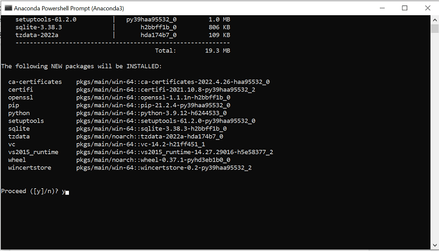

Algorithmic trading has significantly revolutionized the financial markets, primarily through the utilization of advanced data analysis techniques. This quantitative approach allows for the execution of complex trading strategies at high speeds, far surpassing the capabilities of manual trading. Central to this evolution is the integration of sophisticated forecasting models, which are crucial for predicting market trends and making informed trading decisions.

One pivotal tool in this domain is the Prophet library, an open-source forecasting tool developed by Facebook. Since its introduction, Prophet has rapidly gained prominence in time series forecasting, particularly within the financial sector. Its design focuses on providing practitioners with a highly intuitive framework that manages to strike a balance between ease of use and prediction accuracy. This characteristic makes it especially suitable for non-statisticians and analysts who require robust predictive modeling without deep statistical expertise.



In this article, we will explore the process of installing and utilizing Prophet in the context of algorithmic trading. The discussion will encompass not only the practical steps for deploying the library but also the strategic advantages it offers, including its capability to effectively handle outliers and accommodate seasonal variations in financial data. Furthermore, the article will highlight the challenges one might encounter during the installation process, particularly on different operating systems, and offer solutions to mitigate these issues.

By understanding how to implement Prophet in algorithmic trading, financial analysts and developers can enhance their forecasting models, leading to more strategic trading decisions and potentially improving market performance.

## Table of Contents

## Understanding Prophet Library

Prophet is an open-source forecasting tool designed for working with time series data. Developed by Facebook, it emphasizes ease of use for analysts and data scientists, enabling them to create accurate and robust forecasts with limited data preparation. Prophet is particularly valuable in financial markets, where it permits the analysis and forecasting of trends that might include outliers or structural changes.

One of the key strengths of Prophet is its ability to handle various data irregularities and complexities with ease. It is particularly effective in managing outliers—data points that deviate significantly from the overall pattern—which often occur in financial data due to unusual market conditions or abrupt economic events. Prophet uses a piecewise linear or logistic growth model that automatically detects and accommodates these anomalies, minimizing their impact on overall forecasts.

In addition to outliers, Prophet adeptly addresses missing data, a common issue in time series data sets. It interpolates gaps in the data, ensuring continuity in the analysis. This feature is particularly useful in financial markets where trading holidays or abrupt market closures may lead to incomplete data.

Seasonality and trend changes are also competently handled by Prophet. Financial markets often exhibit seasonal variations linked to economic cycles, fiscal quarters, and trading behaviors. Prophet incorporates these patterns using Fourier series to model seasonality, which provides a flexible approach that adapts to diverse seasonal effects. 

Prophet is designed to be scalable and efficient, catering to large data sets that are typical in [algorithmic trading](/wiki/algorithmic-trading) and other finance-related applications. The underlying model is decomposed into three main components: trend, seasonality, and holidays, which together capture the complex patterns in the data. This decomposition allows for straightforward interpretability and adjustability by users.

For more detailed information on the components and working of Prophet, its documentation serves as an essential resource. It provides comprehensive guidance on the model’s structure, parameter tuning, and real-world applications, supporting users in optimizing their forecasting models in diverse scenarios.

## Prerequisites for Installing Prophet

Prophet can be installed for both Python and R, offering flexibility in your choice of programming environment. To ensure a smooth installation process for Prophet, several prerequisites should be met:

1. **Python Version Requirement**: Ensure that your system is running Python 3.7 or higher. You can verify your Python version by executing the following command in your terminal or command prompt:

   ```bash
   python --version
   ```

2. **R Version for CRAN Installation**: If you prefer using R, ensure that your R environment is up-to-date. Prophet can be installed via CRAN, the Comprehensive R Archive Network.

3. **Dependencies**: Crucially, Prophet requires the Pystan library for its backend computations. Pystan serves as a library for Bayesian inference and the statistical modeling upon which Prophet relies. You can install Pystan through pip using the command:

   ```bash
   pip install pystan
   ```

   Additionally, Microsoft C++ Build Tools need to be installed on your system if you're working on a Windows platform. This is essential for compiling the model components and should be available via the Visual Studio Installer.

4. **Environment Setup**: To avoid dependency conflicts and manage package versions more effectively, it is recommended to use a virtual environment. Conda is a popular choice for this, as it simplifies the management of package dependencies and versions across platforms:

   ```bash
   conda create -n prophet39 python=3.9
   conda activate prophet39
   ```

   Using Conda for environment management can help prevent issues caused by conflicting libraries or incompatible versions.

These prerequisites lay the groundwork for installing Prophet efficiently, maximizing the likelihood of a seamless setup and use in your respective programming projects.

## Steps to Install Prophet on Windows

To successfully install the Prophet library on a Windows system, precise steps must be followed. These are necessary not only to ensure a smooth installation process but also for maintaining compatibility with other Python packages. One of the primary steps involves setting up a conda environment, which offers an isolated space to manage dependencies efficiently.

First, verify your Python installation and confirm its version using the following command in your command prompt:

```bash
python --version
```

Ensure that your Python version is 3.7 or higher, as this is a requirement for installing Prophet.

Next, create a new conda environment specifically for Prophet. This is best practice to prevent dependency conflicts with other projects. Run the following command in your terminal:

```bash
conda create -n prophet39 python=3.9
```

This command initiates the creation of a new environment named "prophet39" using Python version 3.9. Adjust the Python version as suitable for your specific needs or compatibility requirements.

After the environment has been created, activate it with the following command:

```bash
conda activate prophet39
```

At this stage, it is important to set up the necessary build tools and additional Python packages that Prophet depends on. Since Prophet requires packages like `numpy` and `matplotlib`, they should be installed prior to Prophet to avoid potential issues. Use the following command to install them:

```bash
conda install numpy matplotlib
```

Installing these packages ensures that the Prophet library can operate seamlessly. Finally, ensure that you have the Microsoft C++ Build Tools installed, as they are essential for compiling certain libraries required by Prophet:

To sum up the installation process on Windows:

1. Confirm your Python version is compatible.
2. Create and activate a dedicated conda environment.
3. Install important packages like `numpy` and `matplotlib`.
4. Ensure required build tools are installed.

Following these steps meticulously will facilitate a smoother installation process, allowing you to use the Prophet library for effective time series forecasting and analysis.

## Installing Prophet Using Conda

Conda provides an efficient approach to managing dependencies when installing the Prophet library, offering enhanced compatibility across different systems. To install Prophet using Conda, you can execute the following command in your terminal or command prompt:

```bash
conda install -c conda-forge prophet
```

This command utilizes the Conda Forge channel, which is a community-led collection of recipes, build infrastructures, and distributions for the Conda package manager. The advantage of using this channel lies in its extensive collection of up-to-date packages that are tested for compatibility, thus ensuring a smooth installation process for Prophet and its dependencies.

When installing Prophet, Conda automatically handles the installation of all required dependencies, simplifying the setup process and reducing the likelihood of encountering compatibility issues. This includes the necessary installation of packages such as `numpy`, `pandas`, and `pystan`, which are crucial for Prophet's functionality.

However, if any issues arise during installation, such as compatibility errors or unsatisfied dependencies, it is important to verify that all dependencies are correctly installed. Ensure that your Conda environment is active and properly configured for compatibility with Prophet. Use the following command to list all installed packages and verify their versions:

```bash
conda list
```

This command helps in checking whether all necessary libraries are correctly installed and whether there are any version conflicts. If problems persist, consulting community forums or the official Prophet documentation may provide additional solutions and insights.

By using Conda, users benefit from a more streamlined installation process, minimizing potential hurdles and facilitating the setup of Prophet for efficient time series forecasting in finance and other domains.

## Using Prophet in Algorithmic Trading

Prophet is a valuable tool in algorithmic trading, primarily because it excels at forecasting trends, seasonality, and holiday effects, which are crucial for stock market analysis. The first step in using Prophet effectively is to transform your dataset to match its required input format. Prophet mandates the use of a dataframe with two columns: 'ds' for dates and 'y' for values. This formatting is crucial as it allows Prophet to recognize and manage the time series data efficiently.

To illustrate this, consider a dataset of historical stock prices. To prepare this data for Prophet, you would structure it as follows:

```python
import pandas as pd

# Sample data
data = {'date': ['2023-01-01', '2023-01-02', '2023-01-03'],
        'closing_price': [150, 155, 160]}

# Transform to match Prophet's required structure
df = pd.DataFrame(data)
df.rename(columns={'date': 'ds', 'closing_price': 'y'}, inplace=True)
```

Once the data is correctly structured, Prophet can be employed to forecast future stock market trends based on historical data. Prophet's predictive capabilities are based on decomposing time series data into trend, seasonality, and holiday components. The model automatically handles missing data and shifts in the trend line due to seasonality and holidays, which are essential elements that can significantly impact stock prices.

To forecast using Prophet, instantiate the model and fit it to your prepared dataframe:

```python
from fbprophet import Prophet

# Initialize and fit the model
model = Prophet()
model.fit(df)

# Make a future dataframe for 30 days
future = model.make_future_dataframe(periods=30)

# Predict future values
forecast = model.predict(future)
```

The resulting `forecast` dataframe contains predicted values along with components detailing trends, seasonality, and holidays, which allows traders to visualize and quantify the potential effects on stock prices.

Incorporating these forecasts into algorithmic trading strategies can enhance decision-making. By using Prophet's output, traders can better anticipate market movements and adjust their strategies accordingly. For instance, traders could use predictions to adjust positions in anticipation of seasonal trends or to mitigate risks associated with holiday effects. Additionally, combining these forecasts with other algorithmic strategies—such as [machine learning](/wiki/machine-learning) models that account for macroeconomic indicators or sentiment analysis—can improve overall trading performance.

By effectively utilizing Prophet, traders acquire a powerful tool to improve the precision of their market predictions, ultimately enhancing their ability to make informed trading decisions.

## Common Issues and Troubleshooting

When using the Prophet library for algorithmic trading, users may encounter several common issues, particularly during installation or execution, due to its dependencies and specific system requirements.

One of the prevalent problems is dependency conflicts, which often arise if incompatible versions of essential libraries, such as Pystan, are installed. Pystan is a critical dependency for Prophet as it enables the model's underlying statistical and probabilistic functionalities. To address this, ensure that the installed version of Pystan aligns with Prophet’s requirements. A typical solution involves upgrading or downgrading Pystan via pip with the command: 

```bash
pip install pystan==<compatible_version>
```

Additionally, users may face issues with incorrect versions of Python. The Prophet library mandates Python 3.7 or higher, and using older Python versions could lead to installation failures or runtime errors. Checking the Python version is essential for troubleshooting and can be done using:

```bash
python --version
```

On Windows systems, a frequent hurdle is the lack of Microsoft Visual C++ Build Tools. These tools are necessary to compile certain Python packages, including those required by Prophet. Users can download and install these tools from the official Microsoft website. Once installed, it's crucial to verify that the system path includes the directory where these tools are located to ensure seamless compilation.

Moreover, environment path discrepancies can lead to complications. Ensuring that the PATH variable correctly points to the Python interpreter and related dependencies helps prevent issues. Users can modify the PATH directly in their operating system settings or by using command-line instructions.

In instances where these resolutions do not suffice, community forums and detailed Prophet documentation can provide additional support and insights. Engaging with platforms such as Stack Overflow or GitHub repositories often reveals solutions to unique or advanced problems, leveraging the experience of the broader community.

Finally, maintaining a clean and isolated environment with tools like Conda can simplify installation and conflict resolution, ensuring that dependencies do not interfere with each other, subsequently enhancing the reliability of Prophet in generating accurate forecasts for trading strategies.

## Conclusion

Prophet offers robust tools for time series forecasting within the financial trading sector, making it an invaluable resource for algorithmic traders. Its simplicity and effectiveness stem from an ability to model complex, non-linear relationships in time series data, capturing trends, seasonal patterns, and events such as holidays. This adaptability can significantly improve the accuracy of trading forecasts, leading to more informed decision-making and potentially enhancing profitability.

Despite its powerful capabilities, installing Prophet can present challenges, particularly due to its dependencies on other software packages and build tools. However, by adhering closely to the installation steps—such as using Conda to manage environments and dependencies—the process becomes more manageable. Ensuring correct versions of Python, Pystan, and necessary build tools are installed is crucial to sidestepping common installation pitfalls.

Once set up, integrating Prophet into trading models can yield significant benefits. By transforming historical stock data into the format required by Prophet, traders can utilize its forecasting power to predict future market movements. Aligning these forecasts with other algorithmic strategies allows traders to create more sophisticated, data-driven approaches to their trading activities.

For traders keen to harness the full potential of Prophet, further exploration of its extensive documentation and community resources is recommended. Engaging with tutorials, courses, and forums can deepen understanding and maximize the benefits derived from this tool, positioning users to tackle the dynamic and competitive landscape of algorithmic trading with greater confidence.

## References & Further Reading

[1]: Taylor, S.J., & Letham, B. (2018). ["Forecasting at Scale."](https://www.semanticscholar.org/paper/Forecasting-at-Scale-Taylor-Letham/ab1f816ce79817a09487ea7866c95ce930d37497) PeerJ Preprints.

[2]: ["Prophet Documentation"](https://facebook.github.io/prophet/docs/quick_start.html) - Official documentation for the Prophet library.

[3]: ["Bayesian Methods for Hackers"](https://github.com/CamDavidsonPilon/Probabilistic-Programming-and-Bayesian-Methods-for-Hackers) by Cameron Davidson-Pilon

[4]: ["Algorithmic Trading: Winning Strategies and Their Rationale"](https://www.wiley.com/en-us/Algorithmic+Trading%3A+Winning+Strategies+and+Their+Rationale-p-9781118460146) by Ernie Chan

[5]: Hyndman, R.J., & Athanasopoulos, G. (2018). ["Forecasting: principles and practice"](https://otexts.com/fpp2/) - An excellent open-access resource for time series forecasting.

[6]: Gelman, A., Carlin, J.B., Stern, H.S., Dunson, D.B., Vehtari, A., & Rubin, D.B. (2013). ["Bayesian Data Analysis, Third Edition"](https://www.taylorfrancis.com/books/mono/10.1201/b16018/bayesian-data-analysis-david-dunson-donald-rubin-john-carlin-andrew-gelman-hal-stern-aki-vehtari). Chapman and Hall/CRC.

[7]: ["Time Series Analysis and Its Applications: With R Examples"](http://www.stat.ucla.edu/~frederic/415/S23/tsa4.pdf) by Robert H. Shumway and David S. Stoffer

[8]: ["Bayesian Forecasting and Dynamic Models"](https://link.springer.com/book/10.1007/b98971) by Mike West and Jeff Harrison