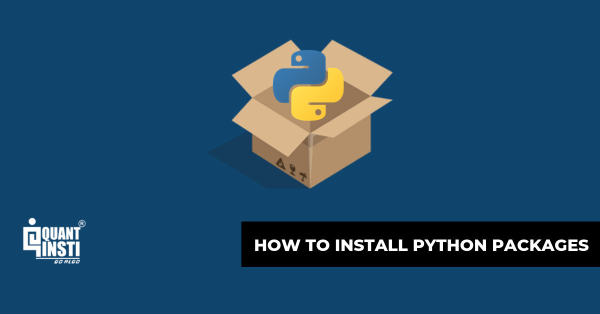

The integration of Python into algorithmic trading has significantly transformed the trading industry, offering unprecedented opportunities for automation and efficiency. Python is favored for its simplicity and extensive range of libraries and packages designed to streamline the process of algorithmic trading. These tools provide essential functionalities for data manipulation, statistical analysis, and technical calculations, all of which are crucial for developing effective trading strategies.

Python's versatility allows traders to implement complex algorithms with relatively concise code, leveraging libraries that perform specialized tasks without the need for exhaustive programming from scratch. This article focuses on guiding traders through the installation of Python packages using the 'pkg install' command, which is pivotal for setting up a robust algorithmic trading environment. Mastery of package installation is fundamental to utilizing the powerful tools Python offers, such as NumPy for numerical computations, Pandas for data manipulation, and TA-Lib for technical analysis.



As we proceed, we will explore several popular Python libraries that are widely used within the trading community. Understanding the installation process and functionality of these libraries will significantly enhance your ability to develop and deploy Python-based trading strategies efficiently. Through this knowledge, traders can optimize their workflows and unlock the full potential of Python in creating sophisticated trading models.

## Table of Contents

## Understanding Python Packages in Algo Trading

Python packages are integral to the practice of algorithmic trading, providing users with a robust framework for executing complex trade strategies. These packages are essentially collections of modules designed to perform specific tasks that facilitate various aspects of trading. Among the most pivotal Python packages in this domain are NumPy, Pandas, and TA-Lib.

NumPy (Numerical Python) is fundamental in handling large datasets efficiently. It offers a variety of mathematical functions and operations that are essential for data manipulation and numerical calculations. For example, traders often use NumPy for calculations like moving averages and statistical measures, which are critical in developing and testing trading strategies. A simple use case might involve calculating a moving average as follows:

```python
import numpy as np

prices = np.array([10, 12, 11, 13, 12, 15])
moving_average = np.convolve(prices, np.ones(3)/3, mode='valid')
print(moving_average)
```

Pandas is another crucial package, widely recognized for its powerful data structures like DataFrames. These structures make it easy to manipulate financial data, such as time series, which traders can use to assess historical price movements or analyze stock performances. Pandas simplifies operations on such data, enabling effective aggregation, transformation, and visualization—all vital elements in crafting data-driven trading strategies.

```python
import pandas as pd

data = {'Price': [100, 102, 104, 103, 110]}
df = pd.DataFrame(data)
df['Rolling Mean'] = df['Price'].rolling(window=2).mean()
print(df)
```

TA-Lib (Technical Analysis Library) is a comprehensive library designed for technical analysis of financial markets. It provides a wide array of functions to compute key technical indicators like the Relative Strength Index (RSI), Moving Average Convergence Divergence (MACD), and Bollinger Bands. These indicators assist traders in identifying trends and making informed decisions based on historical data patterns.

The expertise in using these packages equips traders with the tools needed to perform rigorous analyses and tailor specific trading models that take advantage of potential market opportunities. By utilizing Python packages like NumPy, Pandas, and TA-Lib, traders gain a significant edge in executing strategies that are both data-driven and technically sound, ultimately enhancing the robustness and effectiveness of their trading operations.

## Setting Up Python Environment for Algo Trading

Before commencing with the installation of essential Python packages for [algorithmic trading](/wiki/algorithmic-trading), it is vital to ensure that Python is correctly installed on your system. Python's flexibility and simplicity make it an ideal choice for developing trading algorithms. To check if Python is already installed, you can execute the following command in your terminal or command prompt:

```bash
python --version
```

If Python is not installed, it can be downloaded and installed from the [official Python website](https://www.python.org/).

Managing dependencies effectively is crucial when working on multiple trading projects. This is where setting up a virtual environment becomes advantageous. A virtual environment allows you to isolate project-specific dependencies, preventing potential conflicts with other projects or system-wide Python packages.

To set up a virtual environment, you can use `venv`, which is included with Python's standard library. Here is a basic example of how to create and activate a virtual environment:

```bash
# Create a virtual environment
python -m venv my_trading_env

# Activate the virtual environment
# On Windows
my_trading_env\Scripts\activate
# On macOS and Linux
source my_trading_env/bin/activate
```

With the virtual environment activated, any package installations using a package manager like pip will be contained within the `my_trading_env` directory.

For those who prefer a more comprehensive package and environment management system, Anaconda is a popular choice, especially within data science and trading communities. Anaconda simplifies package management and deployment and comes with a suite of pre-installed libraries that are beneficial for algorithmic trading.

To install Anaconda, download the installer from the [Anaconda website](https://www.anaconda.com/products/distribution) and follow the setup instructions. Once installed, you can create a new environment as follows:

```bash
# Create a new conda environment named 'trading_env' with Python 3.8
conda create --name trading_env python=3.8

# Activate the conda environment
conda activate trading_env
```

Anaconda also integrates well with Jupyter Notebook, enabling you to experiment with trading strategies interactively in a notebook interface. By maintaining separate environments for different projects, you can avoid dependency conflicts, ultimately leading to more efficient workflow management in your algorithmic trading endeavors.

## Installing Python Packages for Algo Trading

To install Python packages necessary for algorithmic trading, the `pkg install` command can be a valuable tool when setting up your system. This command is particularly useful for users operating in environments such as FreeBSD or systems that utilize FreeBSD's package management system. However, it's important to note that for most standard Python environments, especially those running on Windows, macOS, or Linux, the `pip` command is typically used instead of `pkg`.

Here's a basic outline of the installation process:

1. **Install Python:**
   - Before you can install any additional packages, ensure that Python is installed on your system. The command `pkg install python` can be used to install Python through FreeBSD's package manager. For a more common scenario using `pip`, Python should already be installed on your system. You can verify the installation and check the version by running:

     ```bash
     python --version
     ```

2. **Using pip for Python Package Installation:**
   - After confirming Python's installation, you can proceed by using `pip`, Python’s package installer, to install the necessary trading-related packages. For example, you can install Pyalgotrading, a popular library for constructing algorithmic trading strategies, by running the following command:

     ```bash
     pip install pyalgotrading
     ```

   - This command fetches the package from the Python Package Index (PyPI) and installs it onto your system.

3. **Other Essential Libraries:**
   - Beyond Pyalgotrading, there are numerous other libraries that can be installed using pip. For algorithmic trading, libraries like NumPy and Pandas are frequently used for data analysis and manipulation:

     ```bash
     pip install numpy pandas
     ```

4. **Virtual Environment Setup:**
   - To avoid conflicts between different packages and Python versions, it’s advisable to set up a virtual environment. This isolated environment helps in managing dependencies effectively. Here is how you can create and activate a virtual environment:

     ```bash
     python -m venv trading-env
     source trading-env/bin/activate   # On Linux/macOS
     trading-env\Scripts\activate      # On Windows
     ```

5. **Verify Installations:**
   - After the installations, verify if they have been correctly installed by importing them in a Python script or interactive session:

     ```python
     import pyalgotrading
     import numpy
     import pandas
     ```

   - If no errors occur, the packages are successfully installed and ready for use in developing trading strategies.

By following these steps, you ensure a smooth installation process for Python packages essential for algorithmic trading. This foundation allows you to harness Python's capabilities for analyzing and strategizing in financial markets.

## Popular Python Libraries for Algorithmic Trading

Several libraries are particularly useful for algorithmic trading, providing essential tools to implement and refine trading strategies in a programmatic setting.

### Backtrader
Backtrader is an open-source Python library that enables traders to develop and backtest trading strategies with ease. It supports a wide range of data feeds and broker interfaces, making it versatile for various trading environments. The library's design allows for quick prototyping and evaluation of strategies by simulating them on historical data to assess their performance. Backtrader's functionality includes features like optimizing trading parameters, integrating with live trading to test strategies in real-time, and visualizing results through detailed reports. 

Example usage of Backtrader for a simple moving average crossover strategy might look like this:
```python
from __future__ import (absolute_import, division, print_function, unicode_literals)
import datetime
import backtrader as bt

class SMACross(bt.SignalStrategy):
    def __init__(self):
        sma1, sma2 = bt.ind.SMA(period=10), bt.ind.SMA(period=30)
        crossover = bt.ind.CrossOver(sma1, sma2)
        self.signal_add(bt.SIGNAL_LONG, crossover)

cerebro = bt.Cerebro()
cerebro.addstrategy(SMACross)
data = bt.feeds.YahooFinanceData(dataname='AAPL',
                                 fromdate=datetime.datetime(2019, 1, 1),
                                 todate=datetime.datetime(2020, 12, 31))
cerebro.adddata(data)
cerebro.run()
```
The above code initiates a strategy that signals a long position when a short-term moving average crosses above a long-term moving average.

### PyAlgoTrading
PyAlgoTrading is another powerful library tailored for algorithmic trading. This library provides robust APIs for designing and deploying trading algorithms in live markets. It focuses on real-time data handling and execution, allowing traders to connect with different brokers and access market data efficiently. PyAlgoTrading is structured to facilitate [backtesting](/wiki/backtesting), portfolio management, and implementation of advanced trading strategies. It typically supports multiple asset types, such as stocks, [forex](/wiki/forex-system), and cryptocurrencies, making it suitable for diverse trading operations.

## Unique Features of Libraries
Each library in algorithmic trading serves distinct purposes beyond backtesting and strategy development. They may offer unique analytics capabilities, integration options with trading platforms or data providers, and community-driven enhancements that keep them updated with the latest trading paradigms. Hence, selecting a suitable library often depends on specific requirements, such as the need for high-frequency data processing, extensive charting capabilities, or seamless integration with particular brokers or exchanges.

In summary, Backtrader and PyAlgoTrading are exemplary Python libraries aiding in the facilitation of algorithmic trading. Their user-friendly approaches to developing, testing, and deploying trading strategies make them invaluable resources to traders seeking to enhance their trading setups programmatically.

## Troubleshooting Common Installation Issues

Installation issues can significantly disrupt the implementation of algorithmic trading strategies, often stemming from conflicts among Python dependencies. Understanding these conflicts and adopting systematic approaches to resolve them is crucial for ensuring a seamless setup. 

One common cause of conflicts is the version mismatch among dependencies. Different Python packages often rely on specific versions of other packages, which can lead to compatibility issues. To resolve such conflicts, it is advisable to verify and align the versions of these packages. This can be achieved using package management tools like `pip` to specify compatible versions. For example, you might use the command:

```bash
pip install package_name==desired_version
```

This command ensures that the specific version required by one package does not conflict with another. Additionally, utilizing a `requirements.txt` file to document the exact package versions required for a project can help in maintaining consistency across different environments. Here's an example of a `requirements.txt`:

```
numpy==1.21.0
pandas==1.3.0
talib==0.4.0
```

Running the following command installs the packages with the specified versions:

```bash
pip install -r requirements.txt
```

Configuration file errors also frequently cause installation issues. These errors can arise from incorrect paths, typos, or misconfigured environment variables. Carefully reviewing configuration files such as `.bashrc`, `.bash_profile`, or `requirements.txt` can help identify such errors. Ensuring that the Python path and library paths are correctly set is essential. You might use the following command to check the current Python path set in your environment:

```python
import sys
print(sys.path)
```

If discrepancies are found, updating configuration files to reflect the correct paths can resolve the problem. Another effective strategy is to isolate these dependencies within virtual environments using tools like `virtualenv` or `Anaconda`. Virtual environments create isolated spaces where dependencies for specific projects do not interfere with each other. To create and activate a virtual environment, use:

```bash
# Create a virtual environment
python -m venv myenv

# Activate the virtual environment
source myenv/bin/activate  # On Unix or macOS
myenv\Scripts\activate     # On Windows
```

Such environments ensure that the system’s global Python dependencies remain unaffected, preventing version conflicts. If persistent issues occur, consulting online communities, package documentation, or forums dedicated to Python and algorithmic trading can provide further assistance and updates on recent compatibility solutions.

## Leveraging Python Packages for Successful Trading Strategies

Proper utilization of Python packages can significantly improve trading strategies by taking advantage of their powerful data handling, analytical, and computational capabilities. Two of the most essential libraries for data manipulation in algorithmic trading are Pandas and NumPy, while TA-Lib is widely used for technical analysis.

### Pandas and NumPy for Data Handling and Analysis

Pandas is a powerful data manipulation and analysis library that provides data structures like DataFrames, which are useful for handling structured data. This makes it easier to preprocess and clean financial data, perform exploratory data analysis, and visualize trends and patterns.

Using Pandas, traders can efficiently manage large datasets, compute time-based aggregations, and transform data into various formats suitable for analysis. For instance, you can read historical stock data and compute moving averages, as shown in the following code snippet:

```python
import pandas as pd

# Load historical stock data
data = pd.read_csv('historical_stock_data.csv', parse_dates=['Date'], index_col='Date')

# Calculate a 20-day moving average
data['20_MA'] = data['Close'].rolling(window=20).mean()
```

NumPy complements Pandas by providing support for large, multi-dimensional arrays and matrices along with a collection of mathematical functions. It's particularly useful for numerical computation and data transformation tasks, such as calculating returns and standard deviations, which are crucial for risk assessment and portfolio optimization. NumPy's broadcasting capabilities also enhance performance, allowing for efficient array operations without the need for explicit looping.

```python
import numpy as np

# Calculate daily returns
data['Returns'] = data['Close'].pct_change()

# Calculate mean return and standard deviation
mean_return = np.mean(data['Returns'])
std_deviation = np.std(data['Returns'])
```

### TA-Lib for Technical Analysis

TA-Lib is a comprehensive library designed specifically for technical analysis of financial markets. It offers over 150 technical indicators like moving averages, relative strength index (RSI), and Bollinger Bands, enabling traders to develop sophisticated signal generation systems.

For example, calculating the RSI for a particular stock can help traders identify potential overbought or oversold conditions, aiding in entry and [exit](/wiki/exit-strategy) decisions:

```python
import talib

# Calculate RSI
data['RSI'] = talib.RSI(data['Close'], timeperiod=14)
```

By leveraging these libraries, traders can create robust strategies that combine statistical insights with technical signal analysis. This combination allows for a comprehensive approach to algorithmic trading, maximizing the potential for successful trade execution.

## Conclusion

Integrating Python packages within algorithmic trading provides significant opportunities for developing sophisticated trading models that can automatically execute trades based on intricate strategies. Python's diverse libraries, such as NumPy for numerical computations, Pandas for data manipulation, and TA-Lib for technical analysis, empower traders to analyze large datasets and generate insights that underpin effective trading strategies. These tools enable the construction of algorithms that can process vast streams of financial data, apply technical indicators, and execute trades without human intervention.

Familiarity with the installation and use of these Python packages is foundational to crafting successful algorithmic trading strategies. By mastering package management and understanding their functionalities, traders can fine-tune their systems to achieve optimized performance. For instance, the seamless integration of various libraries allows for customized backtesting of trading models, enabling traders to evaluate their strategies under different market conditions and refine them for improved accuracy and efficiency.

Continuous learning and adaptation remain essential in this dynamically evolving field, as new libraries and updates are regularly introduced. Staying informed about these advancements ensures that traders can leverage the latest developments to enhance their trading systems. This endeavor requires a commitment to ongoing education and experimentation, ensuring that one's skills remain aligned with the cutting-edge capabilities offered by the evolving Python ecosystem. In doing so, traders can maintain a competitive edge, adapting to changing market environments with the agility and precision afforded by state-of-the-art algorithmic tools.

## References & Further Reading

[1]: Bergstra, J., Bardenet, R., Bengio, Y., & Kégl, B. (2011). ["Algorithms for Hyper-Parameter Optimization."](https://proceedings.neurips.cc/paper/2011/file/86e8f7ab32cfd12577bc2619bc635690-Paper.pdf) Advances in Neural Information Processing Systems 24.

[2]: ["Advances in Financial Machine Learning"](https://www.amazon.com/Advances-Financial-Machine-Learning-Marcos/dp/1119482089) by Marcos Lopez de Prado

[3]: ["Evidence-Based Technical Analysis: Applying the Scientific Method and Statistical Inference to Trading Signals"](https://www.amazon.com/Evidence-Based-Technical-Analysis-Scientific-Statistical/dp/0470008741) by David Aronson

[4]: ["Machine Learning for Algorithmic Trading"](https://github.com/stefan-jansen/machine-learning-for-trading) by Stefan Jansen

[5]: ["Quantitative Trading: How to Build Your Own Algorithmic Trading Business"](https://books.google.com/books/about/Quantitative_Trading.html?id=j70yEAAAQBAJ) by Ernest P. Chan