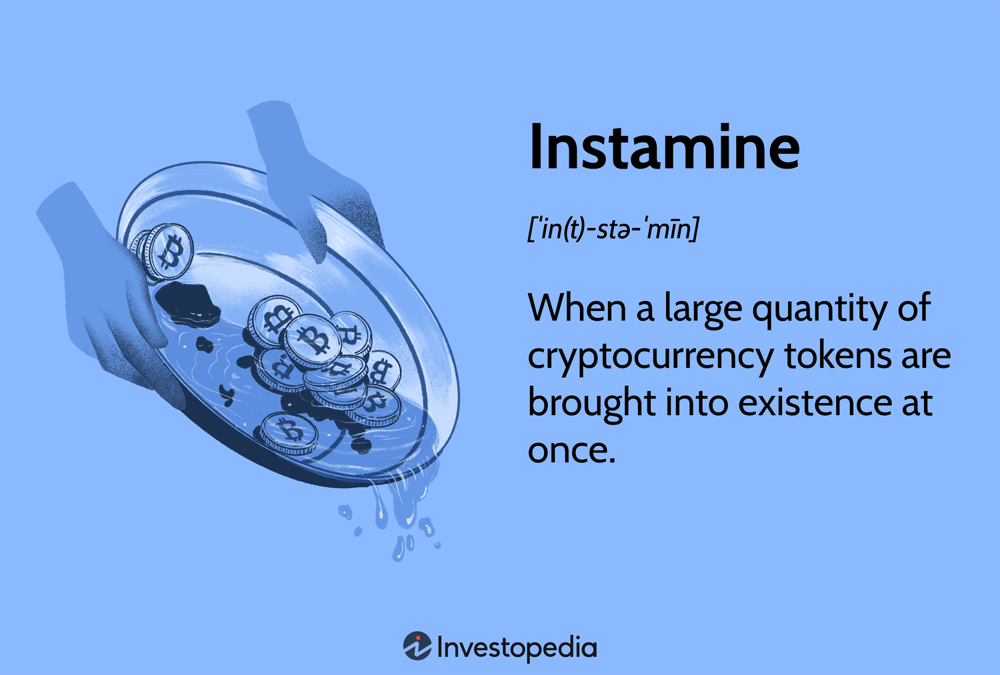

## Table of Contents

## What is Instamine in the context of cryptocurrency?

Instamine is a term used in the world of cryptocurrency to describe a situation where a large number of coins are mined very quickly after a new cryptocurrency is launched. This often happens because of how the mining algorithm is set up, which can allow some people to mine a lot of coins before others even have a chance to start. This can lead to a small group of people owning a big part of the total supply of the cryptocurrency right from the start.

This situation can be a problem because it can make the cryptocurrency seem unfair or centralized, which goes against the idea of cryptocurrencies being open and equal for everyone. When a few people control most of the coins, it can affect the value and trust in the cryptocurrency. People who care about fairness in cryptocurrencies usually see instamine as something to avoid, and they look for ways to make sure new cryptocurrencies start off in a more balanced way.

## How does Instamine differ from regular mining?

Instamine and regular mining are both ways to create new cryptocurrency, but they happen differently. Regular mining is when people use computers to solve hard math problems to add new coins to the cryptocurrency's total supply. It's meant to be fair, so everyone has a chance to mine coins over time. The mining gets harder as more coins are made, which helps keep the process slow and steady.

Instamine, on the other hand, is when a lot of coins are mined very quickly right after a new [cryptocurrency](/wiki/cryptocurrency) starts. This can happen because the way the mining is set up makes it easy to mine a lot of coins fast. This means a few people can end up with a big part of the coins before others even start mining. This can make the cryptocurrency seem unfair because it's not spread out evenly among people.

## What are the potential benefits of Instamine for new cryptocurrency projects?

Instamine can help new cryptocurrency projects get off the ground quickly. When a lot of coins are mined fast at the start, it can make the cryptocurrency seem more active and interesting to people. This can attract more users and investors who want to be part of something that's growing fast. Having a lot of coins in circulation early on can also help the project build a community and get more people talking about it.

However, there are also some risks with instamine. If too many coins are mined by just a few people at the start, it can make the cryptocurrency seem unfair. This can scare away people who care about fairness and equality in cryptocurrencies. So, while instamine can help a new project grow quickly, it's important for the project to think about how to keep things fair and balanced for everyone.

## What are the risks associated with Instamine for investors?

Instamine can be risky for investors because it can make the cryptocurrency seem unfair. When a few people mine a lot of coins right at the start, they can end up with a big part of the total supply. This means those few people have a lot of power over the cryptocurrency's price and how it works. If investors think the cryptocurrency is not fair, they might not want to buy it, and the price could go down.

Another risk is that instamine can make the cryptocurrency seem less trustworthy. When people see that a small group got most of the coins quickly, they might think the whole project is not honest. This can make it hard for the cryptocurrency to grow and attract more users. If investors lose trust, they might sell their coins, which can also make the price drop. So, instamine can be a big worry for investors who want their investments to be safe and fair.

## Can you explain a real-world example of a cryptocurrency that used Instamine?

One real-world example of a cryptocurrency that used instamine is Dash. When Dash first started in 2014, a lot of coins were mined very quickly. This happened because the way the mining was set up made it easy to mine a lot of coins right at the start. Some people were able to mine a big part of the total supply of Dash in just the first few days. This made some people worried because it seemed like the coins were not being shared fairly.

Even though Dash used instamine, it still became a popular cryptocurrency. The people who started Dash worked hard to make the project fair and trustworthy after the instamine happened. They made changes to how the mining worked and did other things to make sure more people could be part of the project. Over time, Dash grew and became known for being fast and private, which helped it attract more users and investors.

## How does Instamine affect the distribution of a cryptocurrency?

Instamine can make the distribution of a cryptocurrency very uneven. When a lot of coins are mined quickly at the start, a few people can end up with a big part of the total supply. This means those few people have more coins than everyone else, which can make the cryptocurrency seem unfair. If people think the coins are not shared equally, they might not want to use or invest in the cryptocurrency.

This uneven distribution can also affect how the cryptocurrency grows. When a small group has most of the coins, they can have a lot of power over the price and how the cryptocurrency works. This can make it hard for the project to attract new users and investors who care about fairness. Over time, the project might need to make changes to how the coins are shared to make things more equal and build trust with more people.

## What are the ethical considerations surrounding Instamine?

Instamine raises big ethical questions about fairness and equality in cryptocurrencies. When a few people can mine a lot of coins fast at the start, it means they get more than everyone else. This can make the cryptocurrency seem unfair because it's not shared equally. People who believe in the idea of cryptocurrencies being open and equal for everyone might not like instamine because it goes against these values. They might think it's wrong for a small group to have so much power over the cryptocurrency just because they were able to mine quickly.

Another ethical issue with instamine is trust. When people see that a few people got most of the coins right at the start, they might think the whole project is not honest. This can make it hard for the cryptocurrency to grow and attract more users. If people don't trust the project, they might not want to use or invest in it. So, the people who start a new cryptocurrency need to think carefully about how to make things fair and keep people's trust, even if they use instamine to get things going quickly.

## How can Instamine be detected in a new cryptocurrency?

Instamine can be detected by looking at how fast coins are being mined right after a new cryptocurrency starts. If a lot of coins are mined in just a few days or even hours, it might be an instamine. People can check the blockchain, which is like a public record of all the coins that have been mined, to see if a small group of people got most of the coins at the beginning.

Another way to spot instamine is by looking at who owns the coins. If a few people or addresses have a big part of the total supply of the cryptocurrency, it could mean that an instamine happened. This information can often be found on websites that track cryptocurrency data. By keeping an eye on these things, people can tell if a new cryptocurrency used instamine and decide if they think it's fair or not.

## What measures can be taken to prevent or mitigate the effects of Instamine?

To prevent or mitigate the effects of instamine, people who start a new cryptocurrency can set up the mining rules in a way that makes it hard to mine a lot of coins quickly. They can make the math problems that miners need to solve harder right from the start, so it takes longer to mine coins. They can also set a limit on how many coins can be mined in the first few days or weeks. By doing these things, they can make sure the coins are shared more evenly among people.

If instamine does happen, the people in charge of the cryptocurrency can take steps to fix it. They can change the mining rules to make it easier for more people to mine coins later on. They can also do things like giving out more coins to people who use the cryptocurrency in certain ways, like making transactions. This can help spread the coins out more and make the cryptocurrency seem fairer. By taking these actions, they can build trust and make the cryptocurrency more equal for everyone.

## How does Instamine impact the long-term viability of a cryptocurrency?

Instamine can hurt the long-term viability of a cryptocurrency by making it seem unfair. When a few people mine a lot of coins quickly at the start, they end up with a big part of the total supply. This can make other people think the cryptocurrency is not equal, and they might not want to use it or invest in it. If people don't trust the cryptocurrency, it can be hard for it to grow and become popular over time. The people who start the cryptocurrency need to work hard to make things fair and keep people's trust if they want it to last.

On the other hand, if the people in charge of the cryptocurrency take steps to fix the problems caused by instamine, it can still be successful in the long run. They can change the rules to make it easier for more people to mine coins later on and do things to spread the coins out more evenly. By making these changes, they can show that they care about fairness and equality, which can help build trust and attract more users and investors. Over time, if they keep working to make things fair, the cryptocurrency can become more stable and grow.

## What role does community consensus play in the acceptance of Instamine?

Community consensus is really important when it comes to whether people will accept instamine in a new cryptocurrency. If the people who use the cryptocurrency think instamine is unfair, they might not want to keep using it or invest in it. They might talk to each other and decide that they don't like how the coins are being shared. If a lot of people feel this way, it can be hard for the cryptocurrency to grow and become popular.

On the other hand, if the community thinks instamine is okay, they might be more willing to accept it. Maybe they see that the people who mined a lot of coins at the start are helping the cryptocurrency grow in other ways, like building new tools or making it easier to use. If the community trusts the people in charge and thinks they are trying to make things fair, they might be more okay with instamine. In the end, what the community thinks and agrees on can make a big difference in whether instamine hurts or helps the cryptocurrency.

## How have regulatory bodies responded to cryptocurrencies that employ Instamine?

Regulatory bodies have been watching cryptocurrencies that use instamine closely because they worry about fairness and equality. When a few people get a lot of coins fast at the start, it can seem unfair to others. Regulators want to make sure that cryptocurrencies are not just making a small group of people rich. They might look at how the coins are shared and see if it's fair. If they think it's not, they might make rules to stop this from happening or to make the cryptocurrency share coins more evenly.

Some countries have rules that say how cryptocurrencies can start and how coins should be shared. If a cryptocurrency uses instamine, regulators might look at it more closely to see if it's breaking any rules. They might talk to the people who started the cryptocurrency and ask them to change how they do things. If the people in charge don't make it fair, regulators might even stop the cryptocurrency from being used in their country. So, regulatory bodies play a big role in making sure that instamine doesn't hurt people or make things unfair.

## References & Further Reading

[1]: Dash Documentation. ["The Instamine Controversy."](https://dashpay.atlassian.net/wiki/spaces/OC/pages/19759164/Dash+Instamine+Issue+Clarification)

[2]: Narayanan, A., Bonneau, J., Felten, E., Miller, A., & Goldfeder, S. (2016). ["Bitcoin and Cryptocurrency Technologies: A Comprehensive Introduction."](https://press.princeton.edu/books/hardcover/9780691171692/bitcoin-and-cryptocurrency-technologies) Princeton University Press.

[3]: Antonopolous, A. M. (2017). ["Mastering Bitcoin: Unlocking Digital Cryptocurrencies."](https://books.google.com/books/about/Mastering_Bitcoin.html?id=IXmrBQAAQBAJ) O'Reilly Media.

[4]: Lopez de Prado, M. (2018). ["Advances in Financial Machine Learning."](https://www.amazon.com/Advances-Financial-Machine-Learning-Marcos/dp/1119482089) Wiley.

[5]: Jansen, S. (2020). ["Machine Learning for Algorithmic Trading."](https://github.com/stefan-jansen/machine-learning-for-trading) Packt Publishing.

[6]: Chan, E. P. (2009). ["Quantitative Trading: How to Build Your Own Algorithmic Trading Business."](https://github.com/ftvision/quant_trading_echan_book) Wiley.

[7]: Kim, T., & Lee, H. (2019). ["Cryptocurrency Mining: Transition from Energy-Intensive PoW to Eco-Friendly PoS."](https://www.sciencedirect.com/science/article/abs/pii/S2214629619305948) International Journal of Information Security.

[8]: Buterin, V. (2014). ["Ethereum White Paper: A Next Generation Smart Contract & Decentralized Application Platform."](https://ethereum.org/content/whitepaper/whitepaper-pdf/Ethereum_Whitepaper_-_Buterin_2014.pdf)
