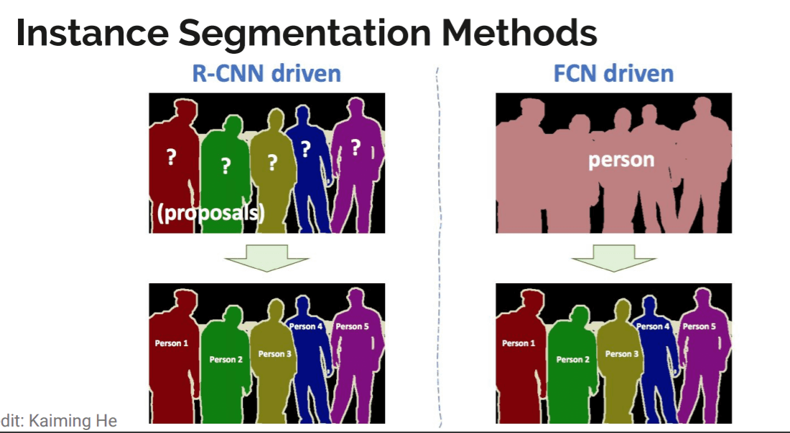

## Table of Contents

## What is instance segmentation in machine learning?

Instance segmentation in machine learning is a technique used to identify and separate each individual object within an image. Unlike simpler methods like object detection, which only draw boxes around objects, or semantic segmentation, which labels all pixels of the same type with one color, instance segmentation goes a step further. It not only recognizes different objects but also distinguishes between individual instances of the same object type. For example, in a picture with multiple cars, instance segmentation would outline each car separately, even if they are of the same make and model.

This task is more complex because it requires the model to understand both the category of each object and its unique boundaries within the image. To achieve this, machine learning models often use a combination of Convolutional Neural Networks (CNNs) for feature extraction and other advanced techniques like Mask R-CNN. Mask R-CNN, for instance, extends the Faster R-CNN model by adding a branch for predicting segmentation masks on each Region of Interest (RoI), allowing the model to output both the class and a pixel-level mask for each detected object. This makes instance segmentation a powerful tool for applications requiring detailed scene understanding, such as autonomous driving, medical image analysis, and robotics.

## How does instance segmentation differ from semantic segmentation?

Instance segmentation and semantic segmentation are both techniques used in computer vision to understand images, but they work differently. Semantic segmentation groups parts of an image that belong to the same class together. For example, if you have a picture with several people and cars, semantic segmentation would color all the people one color and all the cars another color. It doesn't care about individual objects; it just wants to know what's what in the image.

On the other hand, instance segmentation goes a step further. It not only recognizes what's in the image but also tells apart each individual object, even if they are of the same type. Using the same example, instance segmentation would outline each person and each car separately, giving each its own unique color or label. This means that if there are three cars in the picture, you would see three different outlines, not just one big area labeled "car".

Both techniques are useful, but instance segmentation provides more detailed information, which is important for tasks like tracking objects in videos or understanding complex scenes where knowing the difference between individual objects matters.

## What are some common applications of instance segmentation?

Instance segmentation is used in many areas where understanding each object in a scene is important. One common use is in autonomous driving. Cars need to know not just that there are other cars and people around, but exactly where each one is. This helps the car drive safely by knowing which car to go around or which person to stop for. Another use is in medical imaging. Doctors can use instance segmentation to look at each part of an organ or tumor separately, which helps them plan surgeries or treatments more accurately.

Another important application is in robotics. Robots that pick up items in a factory or warehouse need to see each item as a separate thing. This way, they can pick up the right item without mixing them up. In video surveillance, instance segmentation can help track people or vehicles separately, making it easier to follow their paths or spot unusual behavior. These examples show how instance segmentation can be really helpful in many different fields by providing detailed information about each object in an image.

## What is Mask R-CNN and how does it work?

Mask R-CNN is a type of [machine learning](/wiki/machine-learning) model used for instance segmentation. It's like a smart tool that can look at a picture and tell you not just what's in it, but also draw a precise outline around each thing it finds. It builds on another model called Faster R-CNN, which is good at finding objects and putting boxes around them. Mask R-CNN adds a new part to Faster R-CNN that can create a mask, or a detailed outline, for each object it detects.

Here's how it works: First, Mask R-CNN looks at the whole picture and finds areas where it thinks there might be objects. These areas are called Regions of Interest (RoI). Then, it uses something called a Region Proposal Network (RPN) to make guesses about where the objects are and how big they are. After that, it takes a closer look at each RoI and decides what kind of object it is and where exactly it is. The special part of Mask R-CNN is that it also makes a mask for each object. This mask is like a detailed coloring book outline that shows the exact shape of the object. By doing all this, Mask R-CNN can tell you not just that there's a dog in the picture, but also draw a perfect outline around that dog, even if there are other dogs in the picture too.

## How does HTC improve upon Mask R-CNN?

HTC, or Hybrid Task Cascade, is a newer model that builds on Mask R-CNN to make instance segmentation even better. It does this by working in a more connected way. In Mask R-CNN, the model finds objects, then guesses what they are, and finally draws a mask around them. These steps are mostly separate. But in HTC, these steps talk to each other more. The model keeps checking its work as it goes along, making sure that finding objects, guessing what they are, and drawing masks all help each other out. This makes HTC more accurate because it can fix mistakes as it goes, rather than waiting until the end.

One big way HTC improves on Mask R-CNN is by using something called interweaved branches. This means that the model doesn't just do one task at a time; it does them all together, in a way that's more like how a person might look at a picture. For example, when HTC is trying to figure out what an object is, it also uses information about where the object is and what shape it has. This helps the model be more sure about its guesses. By working this way, HTC can often get better results than Mask R-CNN, especially when the pictures are hard to understand or when there are a lot of objects close together.

## What are the key features of Cascade Mask R-CNN?

Cascade Mask R-CNN is an advanced version of Mask R-CNN that helps make instance segmentation more accurate. It does this by using a series of steps, called a cascade, to look at the picture more than once. Each step in the cascade uses what it learned from the last step to make better guesses about where objects are, what they are, and what shape they have. This means that Cascade Mask R-CNN can fix mistakes as it goes along, making its final guesses more accurate than if it only looked once.

One important thing about Cascade Mask R-CNN is that it uses different levels of detail in each step of the cascade. At the beginning, it might use a rough guess to find objects, but as it goes through more steps, it gets more and more detailed. This helps the model be better at finding small objects or objects that are hard to see. By the end, Cascade Mask R-CNN can give very precise outlines around each object in the picture, making it a powerful tool for tasks like self-driving cars or medical imaging where accuracy is really important.

## How does PANet enhance the performance of instance segmentation models?

PANet, or Path Aggregation Network, helps make instance segmentation models better by improving how they understand and process images. It does this by creating a better way for the model to use information from different parts of the image. Instead of just looking at the image once, PANet uses a special path to gather more details from different levels of the image. This helps the model see small objects better and understand the whole picture more clearly. By doing this, PANet can make the model's guesses about where objects are and what they look like more accurate.

One key way PANet helps is by using something called feature pyramid networks. These networks help the model look at the image in different sizes, from very small to very big. This is important because small objects might be hard to see if you only look at the big picture, and big objects might be hard to understand if you only look at small parts. By combining information from all these different sizes, PANet helps the model make better masks for each object. This makes instance segmentation more precise and useful for things like self-driving cars or medical imaging where knowing exactly where each object is matters a lot.

## What role does K-Net play in instance segmentation?

K-Net, or Kernel-based Network, is a new way to do instance segmentation that makes it easier and more accurate. It works by using something called dynamic kernel prediction. This means K-Net can look at an image and guess what each object looks like by creating special shapes, or kernels, for each one. These kernels help K-Net draw very precise outlines around objects, even if they are close together or hard to see. By doing this, K-Net can tell apart different objects better than some older methods.

One big advantage of K-Net is that it can handle many objects at once without getting confused. It does this by using a method that looks at the whole image and then focuses on each object one by one. This helps K-Net be more accurate because it can keep track of where each object is and what it looks like, even in busy scenes. This makes K-Net a powerful tool for things like self-driving cars or medical imaging where knowing exactly where each object is can be really important.

## How does CondInst approach instance segmentation differently?

CondInst, or Conditional Instances, is a special way to do instance segmentation that makes things simpler and faster. It works by using what it calls "conditional convolutions." These are special tools that look at the whole picture and then focus on each object one by one. Instead of making a new mask for each object from scratch, CondInst uses the same basic shape but changes it a little bit for each object. This makes it easier for the computer to draw the right outline around each thing in the picture.

One big advantage of CondInst is that it can handle a lot of objects at the same time without getting confused. It does this by looking at the whole image first and then using the conditional convolutions to make small changes for each object. This helps CondInst be more accurate and faster because it doesn't have to start over for each new object. This makes CondInst a great choice for things like self-driving cars or medical imaging where knowing exactly where each object is can be really important.

## What are the advantages of using CenterMask for instance segmentation?

CenterMask is a smart way to do instance segmentation that makes things easier and more accurate. It works by finding the center of each object in the picture and then figuring out its shape from there. This is different from other methods that might look at the whole object at once. By focusing on the center first, CenterMask can tell apart objects that are close together or hard to see. This makes it really good at drawing the right outline around each thing, even in busy scenes.

One big advantage of CenterMask is that it can handle a lot of objects at the same time without getting confused. It does this by using a special tool called a spatial attention mechanism. This tool helps CenterMask look at the whole picture and then focus on each object's center one by one. This way, CenterMask can keep track of where each object is and what it looks like, making its guesses more accurate. This makes CenterMask a powerful tool for things like self-driving cars or medical imaging where knowing exactly where each object is can be really important.

## How does VisTR utilize transformer architectures in instance segmentation?

VisTR, or Vision Transformer for Instance Segmentation, uses a special kind of computer model called a transformer to make instance segmentation better. Transformers are good at understanding things in a picture because they can look at different parts of the picture all at once. VisTR uses this to find objects and draw outlines around them. It does this by breaking the picture into small pieces and then using the transformer to figure out which pieces belong to which object. This helps VisTR tell apart different objects, even if they are close together or hard to see.

One big advantage of using transformers in VisTR is that it can handle a lot of objects at the same time without getting confused. The transformer looks at the whole picture and then focuses on each object one by one. This makes VisTR very accurate because it can keep track of where each object is and what it looks like. This makes VisTR a powerful tool for things like self-driving cars or medical imaging where knowing exactly where each object is can be really important.

## What makes BlendMask unique among instance segmentation models?

BlendMask is a special kind of instance segmentation model that makes things simpler and more accurate. It works by blending two different ways of looking at a picture. First, it uses a method called top-down, which looks at the whole picture and then focuses on each object one by one. Then, it uses a method called bottom-up, which looks at small parts of the picture and puts them together to see the whole object. By blending these two ways, BlendMask can draw very precise outlines around objects, even if they are close together or hard to see.

One big advantage of BlendMask is that it can handle a lot of objects at the same time without getting confused. It does this by using a special tool called a blending module. This tool helps BlendMask look at the whole picture and then focus on each object's details one by one. This way, BlendMask can keep track of where each object is and what it looks like, making its guesses more accurate. This makes BlendMask a powerful tool for things like self-driving cars or medical imaging where knowing exactly where each object is can be really important.