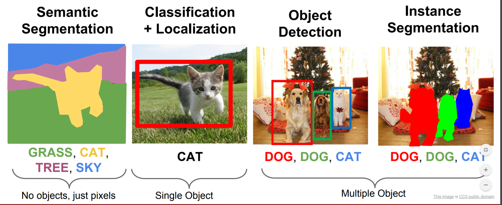

## Table of Contents

## What is instance segmentation in machine learning?

Instance segmentation is a task in machine learning where a computer identifies and separates individual objects within an image. It goes beyond just recognizing what objects are in a picture; it also outlines each object with a precise boundary. For example, if you have a photo with several apples, instance segmentation would not only tell you that there are apples in the image but also draw a separate outline around each apple, showing where one apple ends and another begins.

This task is more challenging than other types of image analysis like classification or object detection because it requires understanding the exact shape and location of each object. Instance segmentation is useful in many fields, such as medical imaging where doctors need to see the exact shape of organs or tumors, or in autonomous driving where cars need to recognize and navigate around different objects on the road. By providing detailed information about each object, instance segmentation helps machines interact with the world more accurately and safely.

## How does instance segmentation differ from semantic segmentation?

Instance segmentation and semantic segmentation are both used in machine learning to understand images, but they do this in different ways. Semantic segmentation looks at an image and groups together parts of the image that belong to the same category. For example, if you have a picture with cars and people, semantic segmentation would color all the cars one color and all the people another color, but it wouldn't tell you where one car ends and another begins.

On the other hand, instance segmentation goes a step further. It not only groups parts of the image by category, but it also separates each individual object within that category. Using the same example, instance segmentation would color each car a different shade, so you can see where one car ends and another starts. This makes it easier to count the number of objects or to understand their exact positions and shapes in the image.

## What are some common applications of instance segmentation?

Instance segmentation is used in many fields where knowing the exact shape and position of things is important. In healthcare, doctors use it to look at medical images. It helps them see the exact outline of organs or tumors. This can make it easier to plan surgeries or treatments. In self-driving cars, instance segmentation helps the car's computer see and understand the world around it. It can tell the difference between different cars, people, or other objects on the road, which is important for safe driving.

Another common use of instance segmentation is in retail and e-commerce. When you take a picture of a shelf full of products, instance segmentation can help count how many of each product there are. This is useful for keeping track of inventory. In robotics, instance segmentation helps robots pick up and move objects. By knowing the exact shape of each object, a robot can plan the best way to grab it without knocking over other things. These examples show how instance segmentation makes many tasks easier and more accurate.

## What is the Blender module for instance segmentation and how does it work?

The Blender module for instance segmentation is a tool that helps computers understand and separate different objects in images or videos. It's part of a bigger software called Blender, which is used for making 3D models and animations. The instance segmentation module in Blender uses [machine learning](/wiki/machine-learning) to look at an image and figure out where each object starts and ends. It's like giving the computer a magic paintbrush that can color each object in the picture differently, so you can see them all clearly.

When you use the Blender module for instance segmentation, you start by training it with lots of example images. These images have labels that show the computer what each object is and where it is in the picture. The module learns from these examples and gets better at recognizing objects. Once it's trained, you can give it new images, and it will draw a line around each object it finds. This is useful for all sorts of things, like helping robots see the world better or making video games more realistic by understanding what's in each scene.

## Can you explain the PointRend module and its approach to instance segmentation?

PointRend is a module used for instance segmentation that focuses on making the edges of objects in images more accurate. It works by zooming in on the edges of objects and using a special method to decide where the edge should be. Imagine you're trying to color a picture but you want to be very careful around the edges. PointRend helps the computer do that by looking closely at the edge pixels and deciding if they belong to the object or the background.

The way PointRend works is by using a technique called point-based rendering. It starts with a rough guess of where the object is and then picks some points along the edge that it's not sure about. For each of these points, it looks at the nearby pixels and uses a [neural network](/wiki/neural-network) to decide if the point should be part of the object or not. This makes the edges of the object much clearer and more accurate, which is really helpful for tasks like medical imaging or self-driving cars where knowing the exact shape of things is important.

## What is PolarMask and how does it improve upon traditional instance segmentation methods?

PolarMask is a new way to do instance segmentation that makes things easier and faster. Instead of drawing a box around objects and then figuring out their shape, PolarMask uses a different idea called polar coordinates. Imagine you're standing in the middle of a circle, and you're pointing at different spots on the edge of the circle. PolarMask works like that, but in a 2D image. It looks at how far away each point on the edge of an object is from the center of that object. This way, it can draw the shape of the object more quickly and accurately.

PolarMask improves on traditional methods because it's simpler and faster. Traditional methods often need to draw a box around an object first and then fill in the details, which can be slow and sometimes not very accurate. With PolarMask, the computer can skip the box part and go straight to figuring out the shape. This not only saves time but also helps the computer get better at understanding the exact edges of objects. That's really helpful in things like self-driving cars or medical imaging where knowing the exact shape of things is important.

## How does the bilayer decoupling technique enhance instance segmentation performance?

The bilayer decoupling technique helps make instance segmentation better by splitting the job into two easier parts. Instead of trying to do everything at once, it first figures out what kind of thing is in the picture and then works on drawing the exact shape of that thing. This is like first deciding that you're looking at a cat and then carefully tracing its outline. By breaking the task into these two steps, the computer can focus on each part separately and do a better job at both.

This method makes instance segmentation more accurate because it lets the computer use different tools for each step. For figuring out what the object is, the computer might use one kind of math, and for drawing the shape, it might use another kind. This is helpful because the skills needed for recognizing an object are different from the skills needed for drawing its exact shape. By using the right tool for each job, the bilayer decoupling technique helps the computer do a better job overall, which is important for things like helping doctors look at medical images or making sure self-driving cars can see the road clearly.

## What is Implicit PointRend and how does it differ from the original PointRend?

Implicit PointRend is a new way to make the edges of objects in pictures even clearer and more accurate. It's like an improved version of the original PointRend. The main difference is that Implicit PointRend uses a special trick called implicit functions to figure out where the edges should be. Imagine you're trying to draw a line around a shape, but instead of guessing where the line goes, you use a magic formula that tells you exactly where to draw. That's what implicit functions do. They help the computer understand the shape better by using math to find the edges.

The original PointRend works by [picking](/wiki/asset-class-picking) some points along the edge of an object and then deciding if those points should be part of the object or the background. It's good at making edges clearer, but it can sometimes miss small details. Implicit PointRend fixes this by using those implicit functions to look at the whole shape at once. This way, it can catch even the tiniest details that the original PointRend might miss. So, if you need to see the exact shape of something in a picture, like a doctor looking at a medical image, Implicit PointRend can help make sure the computer gets it right.

## What are the key challenges faced when implementing instance segmentation modules?

One of the main challenges in implementing instance segmentation modules is getting the computer to understand the exact shape of objects. This is hard because objects in pictures can look different depending on the angle, lighting, or if they're partly hidden. The computer needs to learn from lots of examples to get good at this, and even then, it can still make mistakes, especially around the edges of objects where things can get blurry or unclear.

Another challenge is making the process fast enough to be useful. Instance segmentation can take a lot of time and computer power because it has to look at every little part of the picture to decide where each object starts and ends. This can be a problem in things like self-driving cars or video games where the computer needs to make quick decisions. Researchers are always trying to find new ways to make instance segmentation faster without losing accuracy.

Lastly, there's the challenge of handling new or unusual objects. The computer is trained on certain kinds of pictures, but if it sees something it hasn't seen before, it might not know what to do. This means that instance segmentation modules need to keep learning and adapting to new situations, which can be tricky to set up and maintain.

## How do you evaluate the performance of instance segmentation models?

Evaluating the performance of instance segmentation models involves looking at how well they can identify and outline objects in images. One common way to do this is by using metrics like the Intersection over Union (IoU), also known as the Jaccard Index. IoU measures how much the predicted outline of an object overlaps with the actual outline. If the predicted outline matches the real outline perfectly, the IoU score is 1. If there's no overlap at all, the score is 0. The formula for IoU is $$ \text{IoU} = \frac{\text{Area of Overlap}}{\text{Area of Union}} $$. A good instance segmentation model will have high IoU scores across many different images and objects.

Another important metric is the Average Precision (AP), which looks at how well the model can find all the objects in an image and how accurate its outlines are. AP takes into account both the number of correct predictions and how well those predictions match the real objects. It's calculated by looking at the precision and recall of the model at different confidence thresholds. A high AP score means the model is good at finding all the objects and drawing their outlines correctly. By using these metrics, researchers can compare different instance segmentation models and see which ones work best for their needs.

## What are some advanced techniques used to optimize instance segmentation modules?

One advanced technique to optimize instance segmentation modules is called mask refinement. This technique helps make the outlines of objects more accurate. It works by taking a first guess at where the object is and then using special math to fine-tune the edges. For example, a method called iterative mask refinement might use a neural network to look at the edges of the object and adjust them little by little until they match the real shape as closely as possible. This can be really helpful in tasks like medical imaging where doctors need to see the exact shape of things like tumors or organs.

Another technique is called multi-scale feature fusion. This helps the computer understand objects of different sizes in the image. Imagine you're looking at a picture with both big and small objects. Multi-scale feature fusion lets the computer look at the picture in different levels of detail, like zooming in and out. It combines information from these different levels to make better guesses about where objects are and what they look like. This can make instance segmentation faster and more accurate, which is important for things like self-driving cars where the computer needs to see everything on the road clearly and quickly.

## How can instance segmentation modules be integrated into larger machine learning pipelines?

Instance segmentation modules can be integrated into larger machine learning pipelines by connecting them with other parts of the system that do different jobs. For example, after an instance segmentation module figures out the shapes of objects in a picture, the information can be sent to another part of the pipeline that decides what to do with those objects. This could be a robot that needs to pick up the objects, or a self-driving car that needs to know where other cars are on the road. The instance segmentation module gives the exact shapes and positions of the objects, which helps the other parts of the pipeline work better and make smarter decisions.

To make this work smoothly, the instance segmentation module needs to be able to talk to the other parts of the pipeline. This means the data it produces, like the outlines of objects, has to be in a format that the other parts can understand and use. For example, if the instance segmentation module uses a special way of describing shapes, the next part of the pipeline might need to be taught how to read that description. By making sure all the parts of the pipeline can work together, instance segmentation can help make the whole system more accurate and useful.

## References & Further Reading

[1]: Kirillov, A., Wu, Y., He, K., & Girshick, R. (2020). ["PointRend: Image Segmentation as Rendering."](https://arxiv.org/abs/1912.08193) Proceedings of the IEEE/CVF Conference on Computer Vision and Pattern Recognition (CVPR).

[2]: Xie, E., Ding, J., Wang, W., Zhan, X., & Luo, P. (2020). ["PolarMask: Single Shot Instance Segmentation with Polar Representation."](https://www.sciencedirect.com/science/article/pii/S2095495624007514) Proceedings of the IEEE/CVF Conference on Computer Vision and Pattern Recognition (CVPR).

[3]: Cheng, B., Girshick, R., Dollár, P., Berg, A., & Kirillov, A. (2021). ["Boundary IoU: Improving Object-Centric Image Segmentation Evaluation."](https://arxiv.org/abs/2103.16562) Proceedings of the IEEE/CVF Conference on Computer Vision and Pattern Recognition (CVPR).

[4]: He, K., Gkioxari, G., Dollár, P., & Girshick, R. (2017). ["Mask R-CNN."](https://ieeexplore.ieee.org/document/8237584) Proceedings of the IEEE International Conference on Computer Vision (ICCV).

[5]: Ren, S., He, K., Girshick, R., & Sun, J. (2015). ["Faster R-CNN: Towards Real-Time Object Detection with Region Proposal Networks."](https://ieeexplore.ieee.org/document/7485869) Advances in Neural Information Processing Systems (NeurIPS).

[6]: Blanco, J., & Ribeiro, A. (2010). ["Overview of State-of-the-Art in Object Detection/Recognition."](https://ieeexplore.ieee.org/document/10581202) Institute of Robotics and Industrial Informatics, UPC-CIRS. 

[7]: Chen, L. C., Papandreou, G., Kokkinos, I., Murphy, K., & Yuille, A. L. (2016). ["DeepLab: Semantic Image Segmentation with Deep Convolutional Nets, Atrous Convolution, and Fully Connected CRFs."](https://ieeexplore.ieee.org/document/7913730) IEEE Transactions on Pattern Analysis and Machine Intelligence. 