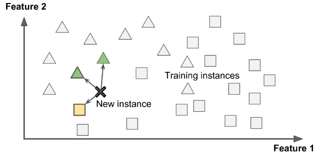

## Table of Contents

## What is an instance in the context of machine learning?

In machine learning, an instance is a single example or data point from a dataset. Think of it as one row in a spreadsheet where each row represents a different example. For example, if you are working on a project to predict house prices, each instance would be one house with its specific features like size, number of bedrooms, and location.

Instances are important because they are used to train machine learning models. During training, the model looks at many instances to learn patterns and make predictions. For instance, by looking at many houses (instances), the model can learn how different features affect the price of a house. This helps the model to predict the price of new houses more accurately.

## How does an instance relate to a dataset in machine learning?

In machine learning, an instance is like one piece of a big puzzle called a dataset. A dataset is a collection of many instances, where each instance represents a single example or data point. For example, if you are trying to teach a computer to recognize cats and dogs, each picture of a cat or dog would be an instance, and all the pictures together would make up the dataset.

When you want to train a machine learning model, you show it many instances from the dataset. The model looks at these instances to learn patterns and make predictions. For example, by looking at many pictures of cats and dogs, the model can learn what features make a picture a cat or a dog. This way, when you show the model a new picture, it can guess correctly if it's a cat or a dog based on what it learned from the instances in the dataset.

## Can you explain the difference between an instance and a feature in machine learning?

In [machine learning](/wiki/machine-learning), an instance is like one example or one data point from your dataset. Imagine you're trying to teach a computer to guess how much a house costs. Each house you show the computer is an instance. So, if you have data on 1000 houses, you have 1000 instances. Each instance is a complete set of information about one specific house.

A feature, on the other hand, is one piece of information about an instance. Going back to the house example, features could be things like the size of the house, the number of bedrooms, or the location. If you have data on 1000 houses, and each house has information about its size, then you have 1000 values for the 'size' feature, one for each instance. Features help the computer understand what makes each instance unique and how to make predictions based on those characteristics.

## What role do instances play in supervised learning?

In supervised learning, instances are super important because they are the examples that the computer looks at to learn. Imagine you're teaching a computer to tell the difference between apples and oranges. Each picture of an apple or an orange is an instance. By looking at many of these instances, the computer can start to see patterns, like the color and shape of apples versus oranges. These instances come with labels, so the computer knows which ones are apples and which ones are oranges. This helps the computer learn how to guess correctly when it sees a new picture.

When you train a model in supervised learning, you show it lots of instances. The model uses these instances to figure out the relationship between the features of each instance and the label it should have. For example, if you're predicting house prices, each house is an instance with features like size and number of bedrooms. The model looks at many houses (instances) to learn how these features affect the price. This way, when you ask the model to guess the price of a new house, it can use what it learned from the instances to make a good prediction.

## How are instances used in unsupervised learning?

In unsupervised learning, instances are the examples that the computer uses to find patterns and group things together, but without any labels to guide it. Imagine you have a bunch of different colored marbles, and you want the computer to figure out which ones are similar without telling it which colors go together. Each marble is an instance, and the computer looks at all these instances to see if it can find groups or patterns on its own.

For example, if you're trying to group customers based on how they shop, each customer is an instance. The computer looks at things like what they buy and how often they buy it, and tries to find groups of customers who shop in similar ways. This can help a store understand its customers better and maybe even find new ways to serve them. So, in unsupervised learning, instances are crucial because they're what the computer uses to discover hidden structures and relationships in the data.

## What is the importance of instance selection in machine learning?

Instance selection is really important in machine learning because it helps make sure the computer learns the right things. When you're teaching a computer, you want to show it examples that are good and useful. If you show it too many examples that are similar or not very helpful, the computer might get confused or take a long time to learn. By [picking](/wiki/asset-class-picking) the right instances, you can help the computer learn faster and make better guesses when it sees new things.

For example, if you're trying to teach a computer to tell the difference between cats and dogs, you want to show it pictures that clearly show what makes a cat a cat and a dog a dog. If you show it too many pictures of cats that look a lot like dogs, the computer might get mixed up. By choosing instances that are different and show clear examples of what you're trying to teach, you help the computer understand better and make more accurate predictions.

## How can instance weighting improve machine learning models?

Instance weighting is like telling the computer which examples are more important when it's learning. Imagine you're teaching someone to cook, and you want them to focus more on the recipes that are harder or more common. By giving more weight to certain instances, you're helping the computer pay more attention to the examples that matter most. This can make the computer's guesses more accurate, especially if some instances are more important or if some are less reliable.

For example, if you're trying to teach a computer to tell the difference between spam and not-spam emails, you might want it to focus more on the emails that are really tricky to classify. By giving these tricky emails a higher weight, the computer learns more from them and gets better at spotting spam. This way, instance weighting helps the computer learn faster and make better decisions by focusing on what's most important.

## What are instance-based learning algorithms and how do they work?

Instance-based learning algorithms, also known as memory-based learning or lazy learning, are a type of machine learning where the computer doesn't create a general model from the training data. Instead, it keeps all the training instances in memory and uses them directly to make predictions on new data. When you want to predict something, the algorithm looks at the new data point and compares it to all the instances it has stored. It then makes a prediction based on how similar the new data is to the stored instances.

For example, if you're using an instance-based algorithm to predict house prices, each house in your dataset is an instance. When you want to guess the price of a new house, the algorithm looks at all the houses it knows about and finds the ones that are most similar to the new house. It might use features like size, number of bedrooms, and location to measure similarity. Once it finds the most similar houses, it uses their prices to make a prediction about the new house's price. This way, the algorithm doesn't need to create a complex model; it just needs to remember all the instances and compare them to new data.

## Can you describe the impact of noisy instances on machine learning models?

Noisy instances can mess up machine learning models. Imagine you're trying to teach a computer to recognize dogs, but some of the pictures you show it are blurry or not even dogs at all. These noisy instances can confuse the computer, making it harder for it to learn the right patterns. If there are too many noisy instances, the model might start to make bad guesses because it's learning from examples that aren't correct or clear.

To deal with noisy instances, people use different tricks. One way is to clean the data before teaching the computer, by getting rid of or fixing the noisy examples. Another way is to use special algorithms that can handle noise better. These algorithms can learn to ignore the noisy instances or give them less importance when making predictions. By doing this, the computer can still learn well even when the data isn't perfect.

## How does instance normalization differ from batch normalization in neural networks?

Instance normalization and batch normalization are two ways to help neural networks learn better by making the data more stable. Batch normalization looks at a bunch of examples (a batch) at the same time and adjusts them so they all have similar averages and spreads. It does this across the whole batch, which means it considers all the examples together. This can be great for making the network learn faster and work better, especially when you're training with lots of examples at once.

Instance normalization, on the other hand, looks at each example by itself. Instead of adjusting a whole batch, it adjusts each example separately. This is really helpful when you're working with things like images, where you want to keep the unique details of each picture. Instance normalization can make the network focus more on the specific features of each example, which can be important for tasks like style transfer in images. So, while batch normalization helps with overall stability across many examples, instance normalization helps with the details of each example on its own.

## What are some advanced techniques for handling imbalanced instances in datasets?

When you have a dataset where some instances are much more common than others, it's called an imbalanced dataset. This can make it hard for a machine learning model to learn well because it might focus too much on the common instances and ignore the rare ones. One advanced way to handle this is called SMOTE, which stands for Synthetic Minority Over-sampling Technique. SMOTE creates new instances of the rare class by mixing the features of existing rare instances. This helps balance the dataset so the model can learn from more examples of the rare class. Another technique is called ADASYN, which is like SMOTE but it creates more synthetic instances for the harder-to-learn rare instances.

Another approach is to use different weights for different instances during training. This is called cost-sensitive learning. You can give higher weights to the rare instances so the model pays more attention to them. For example, if you're trying to predict whether a credit card transaction is fraudulent, you might give higher weights to the rare fraudulent transactions so the model learns to spot them better. There are also special algorithms like Random Forest and Gradient Boosting that can handle imbalanced data well by focusing on the rare instances. These methods help make sure the model doesn't just guess the common class all the time and can learn to predict the rare class too.

## How can multi-instance learning be applied to real-world problems?

Multi-instance learning is a type of machine learning where instead of looking at one example at a time, the computer looks at groups of examples, called bags. Each bag can have many instances inside it, and the computer tries to learn from these bags to make predictions. Imagine you're trying to find out if a person is sick based on their medical tests. Each bag could be all the test results for one person, and the computer looks at all the tests together to decide if the person is sick or not. This is useful when you want to understand the bigger picture from many small pieces of information.

In real life, multi-instance learning can be used in many ways. For example, in drug discovery, scientists might want to know if a new drug works well. They test the drug on many different cells, and each cell is an instance. By looking at all the cells together (the bag), they can see if the drug helps overall. Another use is in image classification, where one image might have many different parts. The computer looks at all the parts of the image to decide what the whole image is about. This helps the computer make better guesses by considering all the pieces together, not just one at a time.