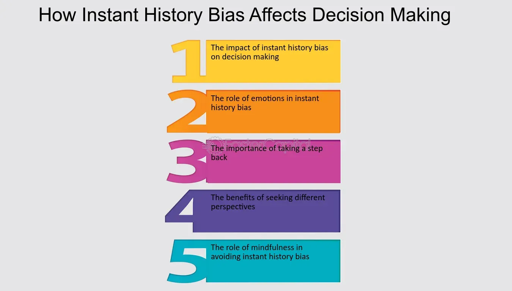

## Table of Contents

## What is Instant History Bias?

Instant History Bias is when people think that what just happened will keep happening in the future. It's like if it rained all day today, you might think it will rain every day from now on. This bias makes people focus too much on recent events and forget about what happened before.

This kind of thinking can be a problem because it can lead to bad decisions. For example, if a stock goes up a lot in one day, someone might think it will keep going up and buy a lot of it. But the stock could go down the next day. So, it's important to look at the bigger picture and not just what happened most recently.

## How does Instant History Bias affect our perception of events?

Instant History Bias makes us think that what just happened will keep happening. If something big or exciting happens, like a team winning a lot of games in a row, we might start to believe they will always win. This can make us see the world in a way that isn't always true. We focus too much on the latest thing and forget about all the other times when different things happened.

This bias can change how we remember and understand events. For example, if a new leader does something good right away, we might think they are the best leader ever. But if we only look at what they did recently, we might miss the bigger picture. It's like looking at just one piece of a puzzle and thinking you know what the whole picture looks like. We need to remember that recent events are just a small part of a much larger story.

## What are the psychological mechanisms behind Instant History Bias?

Instant History Bias happens because our brains like to take shortcuts. When something happens, our brain quickly tries to make sense of it. It's easier for our brain to think that what just happened will keep happening, instead of looking at all the other times when different things happened. This shortcut helps us make quick decisions, but it can also make us see the world in a way that isn't always right.

Another reason for Instant History Bias is that we pay more attention to things that are new or exciting. When something big happens, it sticks in our memory more than the normal, everyday stuff. So, when we think about the future, we remember the big, recent event more than all the other times when things were different. This can make us think that the future will be just like the big event we remember, even if that's not likely to happen.

## Can you provide simple examples of Instant History Bias in everyday life?

Imagine you start a new job and everything goes great on your first day. Everyone is nice, and you feel like you did a good job. Because of Instant History Bias, you might think every day at this job will be just as good. But then, the next day, things might not go so well. Maybe you have a hard time with a task or someone is not as friendly. If you only remember how great the first day was, you might be surprised and disappointed.

Another example is with the weather. Let's say it's been raining all week. Because of Instant History Bias, you might think it will keep raining forever. You might even start to feel sad or annoyed about the rain. But then, the sun comes out the next day, and you realize that the weather changes all the time. If you only focused on the recent rain, you might have missed out on enjoying the sunny day.

## How does Instant History Bias differ from other cognitive biases?

Instant History Bias is different from other cognitive biases because it makes us think that what just happened will keep happening in the future. It's like if you see a dog wag its tail once, you might think it will always wag its tail. Other biases might make us see things differently, but they don't focus on the most recent events like Instant History Bias does. For example, Confirmation Bias makes us look for information that agrees with what we already believe, no matter when it happened.

Another way Instant History Bias is different is that it makes us forget about the past and only focus on the present. This is different from biases like the Availability Heuristic, where we make decisions based on what we can easily remember, which might not be the most recent thing. With Instant History Bias, the most recent event is the most important, and we might ignore all the other times when different things happened. This can lead us to make quick decisions without looking at the bigger picture.

## What role does media play in perpetuating Instant History Bias?

Media can make Instant History Bias worse because it often focuses on the newest and most exciting news. When something big happens, like a natural disaster or a big win in sports, the media talks about it a lot. They show it on TV, write about it in the news, and talk about it on social media. This makes us think that the big event is more important than everything else that happened before. We might start to believe that the future will be just like the big event we keep hearing about, even if that's not true.

For example, if a new technology comes out and the media says it's going to change the world, we might think that technology will keep getting better and better. We might forget about all the times when new technology didn't work out so well. The media's focus on the newest and biggest news can make us see the world in a way that isn't always right. It's important to remember that the media is just showing us a small part of the story, and we need to look at the bigger picture to understand what might happen next.

## How can Instant History Bias impact decision-making processes?

Instant History Bias can make our decision-making processes go wrong. If we think that what just happened will keep happening, we might make choices based only on the most recent thing we remember. For example, if a stock goes up a lot one day, we might decide to buy a lot of it because we think it will keep going up. But if we only look at what happened that one day, we might miss important information about the stock's history and end up losing money.

This bias can also affect bigger decisions, like choosing a job or moving to a new city. If we have a great first day at a new job, we might decide to stay there without thinking about what the job might be like in the future. Or, if we visit a city and the weather is perfect, we might decide to move there without considering what the weather is like the rest of the year. By focusing too much on the most recent event, we might make choices that we later regret because we didn't look at the bigger picture.

## What are some historical events that have been influenced by Instant History Bias?

The stock market crash of 1929, also known as Black Tuesday, was influenced by Instant History Bias. In the years before the crash, the stock market kept going up and up. People saw this and thought it would keep going up forever. They bought a lot of stocks because they believed the good times would never end. But then, the market crashed, and many people lost a lot of money. If they had looked at the bigger picture and not just the recent good times, they might have been more careful with their money.

Another example is the dot-com bubble in the late 1990s. At that time, many new internet companies were starting up, and their stock prices were going up really fast. People saw this and thought that all internet companies would keep making money. They invested a lot of money in these companies because they believed the good times would last forever. But then, in 2000, the bubble burst, and many of these companies failed. If people had not focused so much on the recent success of internet companies, they might have made better investment choices.

## How can individuals recognize Instant History Bias in their own thinking?

To recognize Instant History Bias in your own thinking, pay attention to how you feel about what just happened. If you start to think that what you just saw or experienced will keep happening, that's a sign of Instant History Bias. For example, if you had a really good day and you start to believe that every day will be just as good, you might be falling into this bias. It's important to stop and ask yourself if you are focusing too much on the most recent thing and not looking at the bigger picture.

Another way to spot Instant History Bias is to think about how you make decisions. If you find yourself making choices based only on what happened recently, without thinking about the past, you might be influenced by this bias. For example, if you decide to buy a stock because it went up a lot yesterday, without looking at its history, you could be making a mistake. By taking a step back and considering all the information, not just the most recent event, you can make better decisions and avoid the trap of Instant History Bias.

## What strategies can be employed to mitigate the effects of Instant History Bias?

One way to fight Instant History Bias is to look at the big picture. Instead of just thinking about what happened recently, try to remember all the other times when different things happened. For example, if you see a stock go up one day, don't just think about that day. Look at how the stock did over the past month or year. This can help you make better choices because you're not just focusing on the most recent thing.

Another strategy is to take a break before making a decision. If something big just happened, like a team winning a game or a new technology coming out, wait a little bit before deciding what to do. This gives you time to think about the past and not just the present. By waiting, you can see if the recent event was just a one-time thing or if it's part of a bigger pattern. This can help you avoid making quick choices based only on what just happened.

## How does Instant History Bias influence long-term memory and historical narratives?

Instant History Bias can change how we remember things over a long time. If something big or exciting happens, we might remember it more than other things. This can make us think that the big event was more important than it really was. For example, if a country wins a war, people might focus on the victory and forget about all the hard times that came before it. This can make the history we remember different from what really happened.

This bias can also affect the stories we tell about history. When we write [books](/wiki/algo-trading-books) or make movies about the past, we might focus on the most recent or exciting events. This can make people think that those events were the most important parts of history. But if we only tell the story of the most recent things, we might miss out on understanding the whole story. It's important to look at all the different parts of history, not just the big or exciting ones, to get a true picture of what happened.

## What are the latest research findings on the neurobiological basis of Instant History Bias?

Recent research on the neurobiological basis of Instant History Bias suggests that it's linked to how our brain processes new information. When something big or exciting happens, it activates parts of our brain like the amygdala, which is involved in emotional responses. This can make the event stand out more in our memory. At the same time, the prefrontal cortex, which helps us think about the past and future, might not get as much attention. This can make us focus more on the recent event and forget about other times when different things happened.

Scientists have also found that dopamine, a chemical in our brain that makes us feel good, plays a role in Instant History Bias. When we experience something new and exciting, our brain releases dopamine, which can make us think that the good feeling will last forever. This can lead us to make quick decisions without thinking about the bigger picture. By understanding how these parts of the brain and chemicals work together, researchers hope to find ways to help people avoid the effects of Instant History Bias.

## What is Instant History Bias?

Instant history bias, commonly referred to as backfill bias, is a phenomenon in which the historical performance data of investment funds, such as hedge funds, is selectively reported to present a more favorable track record than what actually exists. This form of data manipulation occurs when fund managers choose to report performance metrics only after achieving certain successful outcomes, thereby omitting periods of underperformance. This editing of past data skews the perceived success rate of a fund, making it appear consistently profitable when, in reality, periods of losses or lesser performance have been hidden. 

This bias is intrinsically linked with survivorship bias, which arises when failed entities (e.g., underperforming funds or strategies) are excluded from datasets, leaving only the 'survivors' to be analyzed. Together, these biases can create a misleading picture, suggesting that the average performance of funds or strategies is significantly better than it truly is.

In the context of [algorithmic trading](/wiki/algorithmic-trading), the implications of instant history bias are particularly significant. Trading algorithms often rely on historical data for [backtesting](/wiki/backtesting), which is the process of testing a trading strategy using past data to evaluate its potential effectiveness. If the data incorporated into these backtests is affected by instant history bias, the strategy may falsely appear robust and reliable during those tests. This can lead to flawed predictive models, as the performance of an algorithm in a live trading environment may drastically differ when genuine, unbiased data is considered.

The misrepresentation caused by instant history bias can be mathematically modeled. Assume a trading model $M$ with a reported average return $\bar{R}$ calculated from a biased dataset. If $\bar{R}_{true}$ is the return computed from an unbiased dataset, then:

$$
\Delta R = \bar{R} - \bar{R}_{true} 
$$

where $\Delta R$ represents the inflation in performance metrics due to omitted negative periods. This distortion can lead to false confidence in the strategy's effectiveness and potentially substantial financial losses when implemented in the real world.

Understanding and mitigating instant history bias is crucial for improving the reliability of trading algorithms. Adjusting reported historical performance to account for omitted data, and regular auditing of backtested strategies, can help in presenting a more accurate assessment of algorithmic trading performance. Additionally, employing rigorous data validation techniques can assist in identifying biased datasets, ensuring more accurate model evaluations.

## References & Further Reading

[1]: Bergstra, J., Bardenet, R., Bengio, Y., & Kégl, B. (2011). ["Algorithms for Hyper-Parameter Optimization."](https://dl.acm.org/doi/10.5555/2986459.2986743) Advances in Neural Information Processing Systems 24.

[2]: ["Advances in Financial Machine Learning"](https://www.amazon.com/Advances-Financial-Machine-Learning-Marcos/dp/1119482089) by Marcos Lopez de Prado

[3]: ["Evidence-Based Technical Analysis: Applying the Scientific Method and Statistical Inference to Trading Signals"](https://www.amazon.com/Evidence-Based-Technical-Analysis-Scientific-Statistical/dp/0470008741) by David Aronson

[4]: ["Machine Learning for Algorithmic Trading"](https://github.com/stefan-jansen/machine-learning-for-trading) by Stefan Jansen

[5]: ["Quantitative Trading: How to Build Your Own Algorithmic Trading Business"](https://www.amazon.com/Quantitative-Trading-Build-Algorithmic-Business/dp/1119800064) by Ernest P. Chan