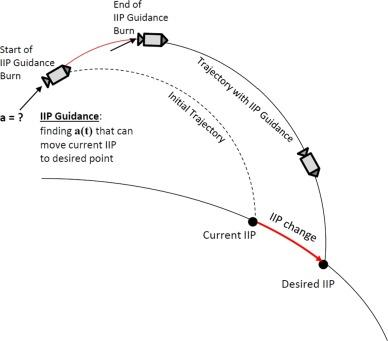

## Table of Contents

## What is meant by 'instantaneous impact'?

'Instantaneous impact' refers to an effect or result that happens immediately after an action or event. It means that as soon as something happens, you can see or feel the result right away, without any delay. For example, if you drop a glass on a hard floor, the instantaneous impact would be the glass breaking into pieces the moment it hits the floor.

This concept is important in many areas, like science, business, and everyday life. In science, for instance, understanding the instantaneous impact of a force on an object can help predict how the object will move or change. In business, a company might launch a new product and see an instantaneous impact on sales if customers respond quickly. Knowing about instantaneous impacts helps us understand and react to the world around us more effectively.

## Can you provide examples of events that have an instantaneous impact?

When you turn on a light switch, the room lights up right away. This is an example of an instantaneous impact because the light comes on as soon as you flip the switch. Another example is when you hit a drum with a drumstick. The sound comes out immediately after you hit it. These are simple things that show how an action can have a quick result.

In sports, if a soccer player kicks the ball into the goal, the score changes instantly. Everyone sees the goal and the scoreboard updates right away. This is another way to see an instantaneous impact. In technology, when you press a button on your phone to make a call, the phone starts dialing immediately. These examples show how different actions can lead to instant results in everyday life.

## How does instantaneous impact differ from gradual impact?

Instantaneous impact happens right away, like when you turn on a light and the room gets bright instantly. It's quick and you can see or feel the change the moment something happens. For example, if you drop a glass, it breaks into pieces right when it hits the floor. This is different from gradual impact, which takes time to show up. 

Gradual impact is when changes happen slowly over time. For instance, if you plant a seed, it doesn't grow into a plant right away. It takes days or weeks for the plant to start showing up. Another example is losing weight. If you start eating healthier, you won't see the change on the scale immediately. It happens little by little. So, the big difference between instantaneous and gradual impact is the speed of the change – one is quick and the other takes time.

## What are the key factors that contribute to an event having an instantaneous impact?

The main thing that makes an event have an instantaneous impact is how fast it happens. If something can change or react very quickly, like a light turning on when you flip a switch, it will have an instant effect. This quick reaction often depends on the technology or the physical properties involved. For example, electricity travels fast, so when you turn on a light, the room lights up right away.

Another factor is how directly the action and the result are connected. When you hit a drum, the sound comes out immediately because hitting the drum directly makes the sound. If the connection between the action and the result is simple and direct, the impact will be instant. In contrast, if there are many steps or delays between the action and the result, the impact won't be instantaneous.

## How can the instantaneous impact of an event be measured or quantified?

To measure the instantaneous impact of an event, you need to look at how quickly the result happens after the action. For example, if you drop a ball and it hits the ground, you can time how long it takes from when you let go to when it hits. This can be done with a stopwatch or special sensors that can measure time very accurately. The shorter the time between the action and the result, the more instantaneous the impact is.

Another way to quantify instantaneous impact is by looking at the change that happens right away. If you press a button on a remote to turn on a TV, you can see how fast the TV responds by turning on. You might count the seconds or use a device to measure the exact time it takes. This helps show how immediate the impact is. By using these methods, you can understand and compare how quickly different events have an effect.

## What are the psychological effects of experiencing an instantaneous impact?

When something has an instantaneous impact, it can make people feel surprised or shocked because the change happens so fast. For example, if a car suddenly stops in front of you, you might feel a quick burst of fear or surprise. This immediate reaction can make your heart beat faster and your body get ready to respond quickly. It's like your brain is trying to keep up with what just happened.

Over time, experiencing a lot of instantaneous impacts can make people feel stressed or anxious. If you're always dealing with sudden changes, like loud noises or unexpected events, it can wear you out. Your mind might stay on high alert, always waiting for the next quick change. This can make it hard to relax and feel calm. So, while an instantaneous impact can be exciting or helpful in some situations, it can also be tough on your mind if it happens too often.

## How do different fields (e.g., physics, economics, psychology) define and study instantaneous impact?

In physics, instantaneous impact is about how quickly things change when a force is applied. For example, when you hit a ball with a bat, physicists study how fast the ball moves right after the hit. They use tools like high-speed cameras and sensors to measure this. They look at things like speed, force, and time to understand how the impact happens so quickly. This helps them predict how objects will move or react in different situations.

In economics, instantaneous impact is about how quickly markets or prices change after an event. For example, if a company announces good news, economists might see the stock price go up right away. They study these quick changes to understand how news or events affect the economy. They use data and charts to see how fast things like stock prices or interest rates change. This helps them make better predictions and decisions about money and business.

In psychology, instantaneous impact is about how people feel or react right after something happens. For example, if someone hears a loud noise suddenly, they might feel scared or surprised right away. Psychologists study these quick reactions to understand how our minds work. They use experiments and observations to see how people respond to sudden changes. This helps them learn about emotions, stress, and how to help people deal with quick, unexpected events.

## What technologies or tools are used to analyze or predict instantaneous impacts?

In physics, scientists use high-speed cameras and sensors to study how things change right after an impact. These tools help them see and measure how fast objects move or how much force is used. For example, when a car crashes, special cameras can show what happens in the first few milliseconds. This helps engineers understand how to make cars safer. Computers also help by running simulations to predict what will happen in an instant.

In economics, people use computers and software to track how prices or markets change quickly after news or events. For example, when a company announces a new product, economists use real-time data to see how the stock price changes right away. They might use charts and graphs to show these fast changes. This helps them predict how the market will react to different news and make better decisions about buying or selling stocks.

In psychology, researchers use tools like electroencephalograms (EEGs) to measure how the brain reacts instantly to stimuli. These machines can show how the brain's electrical activity changes right after someone sees or hears something unexpected. Psychologists also use surveys and experiments to see how people feel or act right after an event. This helps them understand emotions and stress, and how to help people deal with sudden changes.

## Can you discuss a case study where an instantaneous impact had significant long-term effects?

In 1986, the space shuttle Challenger exploded just 73 seconds after it took off. This was an instantaneous impact that shocked the world. The explosion happened because of a small part called an O-ring that failed in the cold weather. The whole world saw it happen live on TV, and it was a big surprise to everyone. This event had a huge effect on the space program. It made NASA stop all shuttle flights for over two years while they figured out what went wrong and how to make things safer.

The long-term effects of the Challenger disaster were big. It made people think more about the risks of space travel and led to lots of changes in how NASA worked. They made new rules to check the shuttles more carefully and to make sure they were safe before flying. It also changed how people felt about space travel. Many people became more worried about the dangers, and it took a long time for the public to trust the space program again. The Challenger disaster showed how a quick, unexpected event can change things for a long time.

## How do societal and cultural contexts influence the perception and consequences of instantaneous impacts?

Societal and cultural contexts play a big role in how people see and deal with instantaneous impacts. In some cultures, quick changes or surprises might be seen as exciting or even good luck. For example, in places where life moves fast, like big cities, people might be used to sudden changes and handle them better. But in other cultures, where things are more calm and slow, a sudden event might be more shocking or upsetting. People's beliefs and values can also change how they react. If a culture values safety and planning, an unexpected event might cause more worry and lead to big changes to prevent it from happening again.

The consequences of an instantaneous impact can also be different based on the society and culture. For example, if a natural disaster like an earthquake happens suddenly, the way people and governments respond can depend a lot on the culture. In some places, there might be strong community support and quick action to help those affected. In other places, the response might be slower or less organized. Also, the long-term effects of an event can be influenced by cultural values. If a society values learning from mistakes, an instantaneous impact might lead to new laws or safety measures. But if a culture is more about moving on quickly, the long-term changes might be smaller.

## What are the ethical considerations when dealing with events that have an instantaneous impact?

When something happens very quickly and has a big effect, we need to think about what is right and wrong. One big thing to consider is how the event affects people right away. For example, if a company makes a sudden change that hurts workers, like closing a factory, they need to think about how to help those workers. It's important to be fair and to think about the people who are affected the most by the quick change. Companies and leaders should try to make sure that the impact doesn't harm people more than it has to.

Another thing to think about is how we can prevent bad things from happening suddenly. If we know that something could have a big, quick impact, we should try to stop it before it happens. This means being careful and planning ahead. For example, if a new medicine could have a sudden bad effect on people, it's important to test it a lot before using it. We also need to be honest about the risks and not hide them from people. Being open and clear can help everyone be ready for what might happen and can make the impact less bad if it does happen.

## How can organizations prepare for and mitigate the effects of potential instantaneous impacts?

Organizations can get ready for sudden changes by making plans ahead of time. They should think about what could happen quickly and make steps to stop it or make it less bad. For example, they can have backup plans and practice them so everyone knows what to do if something big happens suddenly. It's also good to have clear ways to talk to everyone in the organization and to the public. This way, if something happens fast, people can get the right information quickly and know how to respond. Having a strong team that can make quick decisions and take action is also important.

To make the effects of a sudden event less bad, organizations need to be careful and watch for signs that something might happen. They can use technology and data to help predict what might go wrong. For example, they can use computers to see patterns and warn them about possible problems. It's also important to learn from past events and use that knowledge to make things safer. By being ready and having good plans, organizations can handle sudden changes better and help keep people safe.

## What are the factors affecting instantaneous impact?

Various factors influence the instantaneous impact of [algorithmic trading](/wiki/algorithmic-trading), significantly affecting the execution and results of trades. Crucial among these are market conditions, order size, and market depth.

Market conditions play a pivotal role in determining the impact of a trade. Periods of low liquidity, characterized by fewer buyers and sellers, tend to amplify the effect of a trade on asset prices. In such conditions, a single trade consumes a substantial portion of available liquidity, leading to notable price fluctuations. This can be represented mathematically by the equation:

$$
\text{Impact} = \frac{\text{Trade Size}}{\text{Market Liquidity}}
$$

where a higher trade size relative to the available liquidity results in a larger impact. Conversely, trades executed in more liquid markets, where there is a higher volume of buy and sell orders, typically result in a lower instantaneous impact. This is because the increased presence of counterparties in these conditions allows trades to be absorbed more seamlessly without significant price disruptions.

Order size is another primary determinant of instantaneous impact. Larger orders are more likely to exceed available market liquidity, causing noticeable shifts in asset pricing upon execution. To mitigate this, developers employ strategies such as splitting large orders into smaller, more manageable chunks that are executed over time, minimizing their market footprint.

Market depth, reflecting the quantity of buy and sell orders at various price levels, also affects trade impact. A deeper market, with a substantial number of standing orders, can absorb larger trades with minimal price alteration. Conversely, a shallow market, lacking depth, responds more dramatically to trades, as illustrated by more significant price changes across available orders.

Algorithm developers need to [factor](/wiki/factor-investing) in these elements and design adaptable algorithms that respond to changing market conditions. This involves creating models that can dynamically adjust trading behavior based on liquidity and [order book](/wiki/order-book-trading-strategies) analysis, mitigating the adverse impact on prices. Advanced analytics and real-time data monitoring are frequently utilized to achieve this adaptability, enabling the algorithm to optimize executions and reduce costs effectively.

In summary, the instantaneous impact of algorithmic trading is a multifaceted phenomenon driven by market conditions, order size, and depth. By understanding and navigating these factors, traders can significantly enhance their trading efficiency and strategy effectiveness.

## What is the Role of Instantaneous Impact in Risk Management?

Instantaneous impact significantly influences the risk management process in algorithmic trading. As trades are executed, the immediate effect they have on market prices can alter the cost and profitability of these trades. For traders, understanding the nature of this impact is crucial in developing effective risk mitigation strategies. By accurately anticipating the impact, traders can protect their capital and optimize returns.

Effective risk management involves integrating systems capable of monitoring and controlling the instantaneous impact. These systems are often embedded within algorithmic trading platforms, providing real-time analytics on market conditions and the potential effects of specific trades. They enable traders to adjust their strategies instantaneously in response to dynamic market changes.

Mathematically, if $\Delta P$ represents the change in price resulting from a trade of size $V$, the instantaneous impact can sometimes be expressed as:

$$
\Delta P = f(V, L)
$$

where $L$ denotes market liquidity. Higher liquidity generally leads to smaller price changes for a given trade size, thereby reducing instantaneous impact. This function helps traders quantify the expected impact of their trades.

Advanced risk management tools, relying upon machine learning and other analytical techniques, can predict these impacts more accurately and suggest optimal trade execution pathways. These tools can run simulations and back-tests to analyze various scenarios, helping traders to better prepare for potential adverse price movements.

Through continuous monitoring and adjustment, these systems aim to minimize unexpected costs associated with trading, thereby enhancing the overall performance and stability of trading portfolios. As such, the role of instantaneous impact assessment is indispensable in achieving robust risk management in algorithmic trading.

## References & Further Reading

[1]: Almgren, R., & Chriss, N. (2001). ["Optimal execution of portfolio transactions."](https://smallake.kr/wp-content/uploads/2016/03/optliq.pdf) Journal of Risk, 3(2), 5-39.

[2]: Kissell, R. (2014). ["The Science of Algorithmic Trading and Portfolio Management."](https://www.sciencedirect.com/book/9780124016897/the-science-of-algorithmic-trading-and-portfolio-management) Academic Press.

[3]: Gatheral, J. (2010). ["No-Dynamic-Arbitrage and Market Impact."](https://papers.ssrn.com/sol3/papers.cfm?abstract_id=1292353) Quantitative Finance, 10(7), 749-759.

[4]: Bouchaud, J.-P., Farmer, J. D., & Lillo, F. (2008). ["How markets slowly digest changes in supply and demand."](https://arxiv.org/abs/0809.0822) Handbook of Financial Markets: Dynamics and Evolution.

[5]: Aït-Sahalia, Y., & Saglam, M. (2013). ["High Frequency Traders: Taking Advantage of Speed."](https://papers.ssrn.com/sol3/papers.cfm?abstract_id=2342011) National Bureau of Economic Research Working Paper Series.