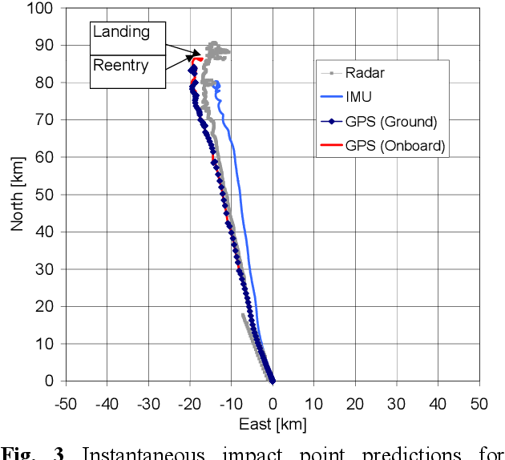

Algorithmic trading, commonly referred to as algo trading, has revolutionized trade execution in financial markets. This approach leverages computer programs alongside sophisticated mathematical models to drive trading decisions, ensuring high efficiency and speed. Algo trading allows for the execution of complex strategies that would be difficult, if not impossible, to manage manually, thus providing significant advantages in terms of execution timing and cost efficiency.

A critical aspect of algo trading is the concept of 'instantaneous impact,' which pertains to the immediate effect that a trade exerts on the market, particularly on price movements. Instantaneous impact is a crucial factor to consider as it directly influences the effectiveness of a trading strategy. The size of the trade and the prevailing market liquidity conditions can lead to significant price adjustments, which in turn affect the trade's profitability. 



This article explores the significance of instantaneous impact in algorithmic trading, examining how it influences trading strategies and market dynamics. By understanding instantaneous impact, traders can optimize their strategies to minimize adverse effects on prices and enhance overall trading performance.

## Table of Contents

## Understanding Instantaneous Impact

Instantaneous impact refers to the immediate effect of a trade on the market price of an asset at the time of execution. This concept is significant because it affects the execution quality of trades and the overall cost of trading. The magnitude of the instantaneous impact is primarily influenced by two factors: trade size and market liquidity.

Trade size is a critical determinant of instantaneous impact. Larger trades tend to move the price more than smaller trades because they require more liquidity. When a large order is placed, it may consume the available volume at the current bid or ask price, causing the price to shift to the next available level. This price change represents the instantaneous impact. For example, in a market with an order book structure, if a buy order is larger than the available volume at the best ask price, the price must adjust upwards to match the remaining order volume with new sell orders. 

Market liquidity also plays a vital role in determining the instantaneous impact. In a highly liquid market, where many buy and sell orders are available, the impact of an individual trade is often diluted because the available liquidity absorbs the order without significant price adjustments. Conversely, in a low-liquidity environment, even small trades can cause substantial price movements due to the scarcity of counterparties willing to trade at the current price.

Understanding the instantaneous impact is crucial for traders employing algorithmic strategies. It assists in developing tactics that minimize adverse price movements and enhance trade execution. For instance, traders might use algorithms to split a large order into smaller ones, executed over time to reduce their market footprint. This approach can help prevent excessive price changes that occur when executing the entire order at once.

In summary, the instantaneous impact of a trade is a function of both trade size and market [liquidity](/wiki/liquidity-risk-premium). Traders must consider these factors when designing and implementing trading algorithms to optimize execution and cost-efficiency. By minimizing instantaneous impact, they can achieve better pricing and improve the overall efficacy of their trading strategies.

## Factors Affecting Instantaneous Impact

Various factors influence the instantaneous impact of [algorithmic trading](/wiki/algorithmic-trading), significantly affecting the execution and results of trades. Crucial among these are market conditions, order size, and market depth.

Market conditions play a pivotal role in determining the impact of a trade. Periods of low liquidity, characterized by fewer buyers and sellers, tend to amplify the effect of a trade on asset prices. In such conditions, a single trade consumes a substantial portion of available liquidity, leading to notable price fluctuations. This can be represented mathematically by the equation:

$$
\text{Impact} = \frac{\text{Trade Size}}{\text{Market Liquidity}}
$$

where a higher trade size relative to the available liquidity results in a larger impact. Conversely, trades executed in more liquid markets, where there is a higher volume of buy and sell orders, typically result in a lower instantaneous impact. This is because the increased presence of counterparties in these conditions allows trades to be absorbed more seamlessly without significant price disruptions.

Order size is another primary determinant of instantaneous impact. Larger orders are more likely to exceed available market liquidity, causing noticeable shifts in asset pricing upon execution. To mitigate this, developers employ strategies such as splitting large orders into smaller, more manageable chunks that are executed over time, minimizing their market footprint.

Market depth, reflecting the quantity of buy and sell orders at various price levels, also affects trade impact. A deeper market, with a substantial number of standing orders, can absorb larger trades with minimal price alteration. Conversely, a shallow market, lacking depth, responds more dramatically to trades, as illustrated by more significant price changes across available orders.

Algorithm developers need to [factor](/wiki/factor-investing) in these elements and design adaptable algorithms that respond to changing market conditions. This involves creating models that can dynamically adjust trading behavior based on liquidity and [order book](/wiki/order-book-trading-strategies) analysis, mitigating the adverse impact on prices. Advanced analytics and real-time data monitoring are frequently utilized to achieve this adaptability, enabling the algorithm to optimize executions and reduce costs effectively.

In summary, the instantaneous impact of algorithmic trading is a multifaceted phenomenon driven by market conditions, order size, and depth. By understanding and navigating these factors, traders can significantly enhance their trading efficiency and strategy effectiveness.

## Strategies to Mitigate Instantaneous Impact

To reduce the instantaneous impact in algorithmic trading, several techniques are employed, aiming at optimizing trade execution and minimizing market disturbances. A common strategy is the slicing of large orders into smaller, more manageable pieces. This technique, often referred to as order splitting, involves breaking a large order down into multiple smaller orders that are executed incrementally over time. This limits the immediate demand or supply effect on the market, thus mitigating the instantaneous impact. 

For example, a trader looking to purchase 10,000 shares of a stock might divide this order into several smaller orders, such as executing 1,000-share orders at different times. The Python code snippet below demonstrates a basic algorithm to implement order slicing:

```python
def slice_order(total_quantity, slice_size):
    return [slice_size] * (total_quantity // slice_size) + [total_quantity % slice_size]

total_quantity = 10000
slice_size = 1000
sliced_orders = slice_order(total_quantity, slice_size)
print(sliced_orders)
```

Another effective strategy is the utilization of dark pools. Dark pools are private financial forums or exchanges for trading securities that allow investors to place large orders without exposing them to the public market, thereby minimizing the impact on the security's price. By executing large trades in these non-disclosed environments, traders can avoid unfavorable price movements resulting from substantial market orders.

Smart order routing (SOR) is also a vital strategy in mitigating instantaneous impact. SOR systems intelligently route orders to different trading venues to ensure the best possible execution. These systems assess various factors such as price, liquidity, and latency across multiple exchanges, directing orders to where they are most likely to receive optimal execution with minimal market impact.

Incorporating advanced analytics and [machine learning](/wiki/machine-learning) techniques further enhances these strategies. By analyzing historical data and utilizing predictive modeling, traders can better anticipate potential market movements and strategically time their trades. Machine learning algorithms can continuously learn and adapt to changing market conditions, refining execution strategies to minimize instantaneous impact effectively.

Overall, the combination of slicing orders, utilizing dark pools, and implementing smart order routing, complemented by advanced analytics and machine learning, serves as a robust framework for reducing the instantaneous impact of trades in algorithmic trading.

## The Role of Instantaneous Impact in Risk Management

Instantaneous impact significantly influences the risk management process in algorithmic trading. As trades are executed, the immediate effect they have on market prices can alter the cost and profitability of these trades. For traders, understanding the nature of this impact is crucial in developing effective risk mitigation strategies. By accurately anticipating the impact, traders can protect their capital and optimize returns.

Effective risk management involves integrating systems capable of monitoring and controlling the instantaneous impact. These systems are often embedded within algorithmic trading platforms, providing real-time analytics on market conditions and the potential effects of specific trades. They enable traders to adjust their strategies instantaneously in response to dynamic market changes.

Mathematically, if $\Delta P$ represents the change in price resulting from a trade of size $V$, the instantaneous impact can sometimes be expressed as:

$$
\Delta P = f(V, L)
$$

where $L$ denotes market liquidity. Higher liquidity generally leads to smaller price changes for a given trade size, thereby reducing instantaneous impact. This function helps traders quantify the expected impact of their trades.

Advanced risk management tools, relying upon machine learning and other analytical techniques, can predict these impacts more accurately and suggest optimal trade execution pathways. These tools can run simulations and back-tests to analyze various scenarios, helping traders to better prepare for potential adverse price movements.

Through continuous monitoring and adjustment, these systems aim to minimize unexpected costs associated with trading, thereby enhancing the overall performance and stability of trading portfolios. As such, the role of instantaneous impact assessment is indispensable in achieving robust risk management in algorithmic trading.

## Innovations in Reducing Instantaneous Impact

Technological advancements have significantly transformed the ways traders address the issue of instantaneous impact in algorithmic trading. The rise of high-frequency trading ([HFT](/wiki/high-frequency-trading-strategies)) exemplifies how speed and efficiency have become central to minimizing this impact. HFT involves executing a large number of orders at extremely high speeds. This allows traders to capitalize on tiny price discrepancies that occur for fractions of a second, effectively reducing the potential adverse effects on market prices since trades are executed swiftly and almost imperceptibly.

Moreover, machine learning algorithms have also become pivotal in predicting and mitigating the instantaneous impact. These algorithms learn from historical data to identify patterns and adjust trading strategies accordingly. For instance, supervised learning models can be trained to predict the likely impact of a trade based on features such as trade size, market [volatility](/wiki/volatility-trading-strategies), and current liquidity. By anticipating potential price movements that a trade might induce, algorithms can proactively adjust their execution to minimize impact.

Real-time data analytics is equally crucial in this context. With access to real-time data, traders can make more informed decisions, allowing them to tailor their strategies in response to current market conditions. This data often includes order book dynamics, market depth, and transactional activity, providing a comprehensive overview of the market's state at any given moment. By integrating this real-time information, algorithms can adjust execution tactics to ensure that trades are distributed optimally over time and market venues, thereby reducing their instantaneous footprint.

The continuous evolution of these innovations promises more efficient handling of the complexities involved in market changes. For example, advanced statistical models and algorithms can be developed to dynamically adjust the order routing process, ensuring optimal placement of trades across various trading venues. Techniques such as [reinforcement learning](/wiki/reinforcement-learning) could autonomously optimize trading strategies by continuously learning from market interactions, further refining impact-reduction methodologies.

As technological innovations progress, the ability of traders to manage and reduce instantaneous impact is set to improve, introducing more effective strategies that can handle the intricacies of the ever-changing financial markets. These innovative solutions present a promising future for enhancing trading performance, minimizing costs, and navigating the complexities of market dynamics.

## Conclusion

Instantaneous impact is integral to algorithmic trading, influencing both market dynamics and trade efficiency. Understanding and managing instantaneous impact is essential for achieving optimal trade execution, as it directly affects the cost, profitability, and execution quality of trading strategies. Unchecked, this impact can lead to increased transaction costs and market slippage, eroding performance and margins.

Traders use a variety of strategies to minimize instantaneous impact, facilitating enhanced trading performance and cost reductions. Techniques such as slicing large orders into smaller, less detectable pieces help to spread the trade across different times and market venues, thereby reducing the risk of significant price movement. The use of dark pools also helps keep large orders anonymous, diminishing market disruption. Additionally, smart order routing can optimally distribute trade orders across multiple exchanges to take advantage of liquidity and pricing, ensuring more favorable execution.

As financial markets continuously evolve, with factors such as market volatility and liquidity dynamics constantly changing, continuous learning and adaptation are paramount. Advances in technology, including machine learning and real-time analytics, offer traders opportunities to predict and adjust to instantaneous impact more effectively. Adaptation in this ever-changing landscape involves not only utilizing current technologies but also being prepared to integrate new innovations that provide a competitive edge.

The ability to anticipate, understand, and mitigate the instantaneous impact is crucial for maintaining and enhancing trading strategies' efficacy in algorithmic trading. As the market evolves, traders who stay informed and agile will be better positioned to exploit opportunities and mitigate risks associated with instantaneous market changes. Thus, maintaining an edge in algorithmic trading requires ongoing learning and a commitment to embracing innovative solutions that address the challenges of instantaneous impact.

## References & Further Reading

[1]: Almgren, R., & Chriss, N. (2001). ["Optimal execution of portfolio transactions."](https://smallake.kr/wp-content/uploads/2016/03/optliq.pdf) Journal of Risk, 3(2), 5-39.

[2]: Kissell, R. (2014). ["The Science of Algorithmic Trading and Portfolio Management."](https://www.sciencedirect.com/book/9780124016897/the-science-of-algorithmic-trading-and-portfolio-management) Academic Press.

[3]: Gatheral, J. (2010). ["No-Dynamic-Arbitrage and Market Impact."](https://papers.ssrn.com/sol3/papers.cfm?abstract_id=1292353) Quantitative Finance, 10(7), 749-759.

[4]: Bouchaud, J.-P., Farmer, J. D., & Lillo, F. (2008). ["How markets slowly digest changes in supply and demand."](https://arxiv.org/abs/0809.0822) Handbook of Financial Markets: Dynamics and Evolution.

[5]: Aït-Sahalia, Y., & Saglam, M. (2013). ["High Frequency Traders: Taking Advantage of Speed."](https://papers.ssrn.com/sol3/papers.cfm?abstract_id=2342011) National Bureau of Economic Research Working Paper Series.