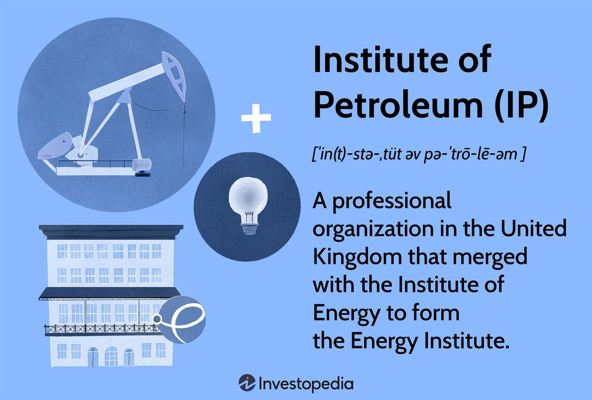

The oil and gas industry has long depended on the acumen of seasoned traders and industry experts to make informed trading decisions. These individuals used their experience and insights to navigate the complex and volatile markets inherent to the energy sector. Traditionally, trading strategies were devised based on a combination of fundamental analysis, historical data, and human intuition. However, the landscape of the industry is undergoing a significant transformation with the incorporation of artificial intelligence (AI) technologies.

In recent years, AI has emerged as a revolutionary force in trading practices, reshaping how decisions are made and executed. AI-powered systems are adept at processing vast amounts of data with speed and precision, offering new possibilities that were previously unattainable through human efforts alone. By leveraging machine learning algorithms and sophisticated data analytics, AI can identify patterns, predict market movements, and optimize trading strategies with remarkable accuracy.

This article investigates the confluence of AI and the oil and gas industry, placing particular emphasis on algorithmic trading. Algorithmic trading utilizes computer programs to automatically execute trades based on predefined criteria. AI enhances these systems by enabling real-time analysis of intricate market data, allowing traders to respond swiftly to fluctuating prices and emerging opportunities. This combination of AI and algorithmic trading not only enhances efficiency but also reshapes the competitive dynamics of the energy market.

As these technologies continue to evolve, understanding their interplay within the energy sector becomes crucial for stakeholders, including industry professionals, investors, and regulators. The adoption of AI in trading necessitates a reevaluation of traditional practices and the development of strategies that harness the full potential of these innovations.

The Institute of Petroleum, renowned for its expertise in the energy industry, has been instrumental in this technological evolution. As it transitions into its current configuration under the Energy Institute (EI), it remains at the forefront of knowledge dissemination and industry standards. Through educational initiatives and technical support, the Institute plays a pivotal role in bridging historical practices with emerging AI-driven trading technologies. This leadership is vital as the industry navigates the challenges and opportunities presented by AI integration in trading activities.

## Table of Contents

## The Role of the Institute of Petroleum

The Institute of Petroleum, once a standalone entity in the energy sector, played a critical role in establishing standards and practices for the industry. Its merger with the Institute of Energy resulted in the formation of the Energy Institute (EI) in 2003, which expanded its role and influence globally. The Energy Institute serves as a crucial platform for learning, development, and technical support across the energy industry. As a global professional membership body, EI provides resources and networking opportunities to the broad spectrum of energy professionals.

To achieve its mission, the Energy Institute emphasizes the importance of integrating traditional energy practices with contemporary innovations, such as [artificial intelligence](/wiki/ai-artificial-intelligence). This integration is pivotal as AI technologies continue to reshape the trading and operational aspects of the industry. By facilitating knowledge sharing among its members and the broader industry, EI promotes sustainability and supports the responsible adoption of AI technologies.

Furthermore, the Energy Institute's educational programs and initiatives assist stakeholders in navigating the complexities of modern energy markets. By doing so, EI ensures that traditional knowledge is preserved while simultaneously fostering the adoption of new technological advancements.

The institution acts as a bridge, connecting historical practices rooted in the early days of oil and gas exploration with the emerging realities of today's digital-driven trading environments. It supports the development and dissemination of best practices that align with both sustainability goals and technological progression.

In conclusion, the Energy Institute remains at the forefront of guiding legal, ethical, and practical frameworks for the energy sector, allowing for a balanced integration of AI technologies in trading and operations. This stewardship ensures that the industry can adapt to ongoing challenges and opportunities presented by AI advancements, maintaining its critical role in global energy discourse.

## AI and Algorithmic Trading in Oil and Gas

AI technology in trading made its initial foray through predictive analytics, where historical market trends and extensive datasets were systematically analyzed to forecast future movements. Through sophisticated algorithms, predictive analytics transformed raw data into actionable insights, enabling traders to make informed decisions about market trends, commodity prices, and trading strategies. In the oil and gas industry, this meant anticipating price shifts based on factors like geopolitical events or changes in supply and demand.

The advent of [algorithmic trading](/wiki/algorithmic-trading) marked a significant evolution, allowing for real-time data processing and decision-making. Algorithms can now execute trades at speeds incomprehensible to human traders, leveraging up-to-the-second market information to respond to fluctuations almost instantaneously. The primary advantage here lies in the ability to continuously monitor thousands of variables, thus making trading dynamic and proactive rather than reactive.

Essentially, AI has transitioned trading from merely predictive to participatory. Sophisticated AI-driven trading systems not only predict market movements but actively shape them. By adjusting strategies based on real-time data, these systems can influence market dynamics by creating a feedback loop where they not only react to market changes but also contribute to them.

One of the pivotal roles of AI-driven trading systems is risk mitigation and opportunity exploitation. These systems utilize quick adaptive strategies, constantly fine-tuning trading models to manage risks and capitalize on market opportunities. For example, [machine learning](/wiki/machine-learning) algorithms might be trained to recognize patterns that precede price spikes or drops, enabling traders to adjust their positions accordingly. These algorithms can also help diversify trading portfolios, minimizing risk exposure by spreading investments across various commodities or markets.

The shift toward autonomous trading systems signifies a transformative change in the traditional trading landscape. These systems, equipped with advanced AI capabilities, operate with minimal human intervention, executing trades based on pre-programmed criteria and adaptive learning processes. This level of automation offers remarkable efficiency and precision, though it also introduces challenges related to oversight and control.

In summary, AI and algorithmic trading have revolutionized the oil and gas trading industry. They have replaced traditional methods with systems that offer unprecedented speed, accuracy, and adaptability, ultimately reshaping market participation and setting new standards for trading practices.

## Benefits and Challenges of AI in Trading

Artificial Intelligence (AI) has significantly impacted trading within the oil and gas sector by enhancing the speed and efficiency of decision-making processes. Through algorithmic trading, AI systems can analyze vast amounts of market data quickly, leading to the rapid execution of trade decisions that outpace human capabilities. This capability not only accelerates trading operations but also provides deeper market insights by identifying patterns and trends that may not be obvious to human traders.

A key advantage of AI-driven algorithmic trading is its ability to eliminate emotional bias from trading decisions. Human traders are often influenced by emotions such as fear and greed, which can lead to irrational decision-making. AI algorithms, however, operate based solely on data and predefined conditions, thus offering a more objective perspective that enhances decision-making accuracy. This objectivity can lead to more consistent and profitable trading outcomes.

However, the deployment of AI in trading is not without its challenges. One of the primary concerns is the need for transparency in AI systems. Stakeholders require an understanding of the decision-making processes employed by AI to ensure that these systems operate fairly and ethically. The lack of transparency can also lead to difficulties in diagnosing and correcting errors within algorithmic processes.

Another significant challenge is the potential for market manipulation. If not carefully monitored, AI algorithms may be exploited to engage in manipulative practices that can disrupt market equilibrium. For instance, high-frequency trading algorithms could be programmed to create false market signals to influence trading behaviors, subsequently benefiting from the resultant market reactions.

To address these challenges, regulatory frameworks must evolve to accommodate and govern the use of AI in trading. These frameworks need to ensure that AI systems are designed and operated in a responsible manner, protecting the integrity of the market and preventing exploitation. This regulatory evolution includes mandates for transparency, ethical behavior, and accountability in AI operations. 

In conclusion, while AI offers substantial benefits to trading practices within the oil and gas industry, stakeholders must actively engage in developing robust regulatory measures. This balance between technological advancement and ethical oversight is essential to harness the full potential of AI in trading.

## Impact on the Global Energy Market

Artificial Intelligence (AI) and algorithmic trading have a profound impact on the global energy market, particularly in oil and gas trading. These technologies influence global oil prices and trading practices by harnessing the ability to process complex market data in real-time. This capability offers traders a competitive edge, allowing them to make informed decisions swiftly, which is crucial in the volatile energy markets. The efficiency of algorithmic trading systems enhances market fluidity, contributing to more balanced pricing mechanisms and reducing the risk of sharp price fluctuations.

AI technologies, with their global reach, help unify fragmented markets. In energy trading, this unification translates into more coherent market operations and reduced barriers to entry for new participants. By distributing AI-driven insights and analytics across global trading platforms, markets become more synchronized, enabling more efficient trading strategies that capitalize on international trends. This harmonization fosters a more competitive and equitable trading environment globally.

Moreover, AI and algorithmic trading facilitate more sustainable and efficient trading practices. The integration of AI in trading algorithms aids in the optimization of supply chains and reduces the carbon footprint of trading operations. AI systems can predict logistic needs, optimize transport routes, and forecast demand in a manner that minimizes resource wastage, thus aligning with global sustainability goals. These advancements support the transition towards more eco-friendly energy trading practices.

The Energy Institute, a key player in the advancement of energy sector knowledge, supports initiatives that align with these global energy needs and technological advancements. The institute plays a vital role in promoting research and facilitating collaboration between various stakeholders in the energy market. By endorsing technological integration and innovation, the Energy Institute helps ensure that advancements in AI and algorithmic trading align with broader energy sustainability and efficiency objectives. This support is crucial in driving forward a future where AI and technological advancements are seamlessly integrated within the global energy trading framework.

## Future Developments and Trends

The continued evolution of artificial intelligence (AI) presents significant opportunities for its deeper integration into trading systems within the oil and gas industry. Future developments are anticipated to facilitate a more seamless blending of AI technologies with traditional oil market practices. This integration is expected to drive efficiencies in trading operations, offering enhanced capabilities for data processing, market analysis, and decision-making.

As AI matures, its role in environmental and sustainability initiatives within trading is poised to expand. AI-driven systems can optimize resource management and minimize environmental impacts by predicting and mitigating adverse effects through advanced modeling. This is especially crucial as the industry seeks to align with global sustainability goals and reduce its carbon footprint.

The development of more robust regulatory frameworks is essential to promote ethical AI usage in trading activities. These frameworks will need to address issues of transparency, accountability, and bias in AI systems. Ensuring that AI applications are both fair and trustworthy will require collaborative efforts between industry stakeholders, regulators, and technology developers to create guidelines that safeguard market integrity while fostering innovation.

The Energy Institute is expected to play a pivotal role in advancing knowledge and setting standards for AI integration in the energy sector. By facilitating research, education, and the dissemination of best practices, the institute can help ensure that AI technologies are used responsibly and effectively. This support will be crucial in maintaining industry alignment with evolving technological capabilities and regulatory requirements, while also enhancing the overall sustainability and efficiency of trading operations.

In summary, the future of AI in oil and gas trading promises an era of increased sophistication and integration. With appropriate regulatory support and continuous advancements in technology, AI can substantially contribute to sustainable and ethical practices in the energy market.

## Conclusion

Artificial intelligence (AI) serves as a transformative force in the oil and gas trading landscape, revolutionizing the ways in which industry stakeholders make decisions and engage with markets. Through its integration, AI enhances predictive analytics, allowing traders to forecast market fluctuations with greater precision and speed. This shift moves beyond the traditional reliance on human intuition and expertise, instead utilizing data-driven insights to shape market dynamics.

The foundational role of the Institute of Petroleum, now functioning through the Energy Institute, is critical in guiding this transformation. The Institute leads in both educational and regulatory aspects, providing a framework for the safe and effective deployment of AI technologies in trading practices. This guidance ensures that stakeholders possess the necessary skills and understanding to harness AI's full potential, thus fostering an environment of innovation and progress.

However, integrating such advanced technologies demands a balanced approach to maintain sustainability, ethical considerations, and profitability within trading futures. This balance requires ongoing vigilance over AI systems to prevent misuse, such as market manipulation, and to address any ethical concerns that may arise from their deployment. The development and implementation of robust regulatory frameworks are paramount to ensuring responsible use, thus averting potential adverse impacts on market stability and integrity.

In this rapidly evolving landscape, stakeholders—ranging from traders to regulatory bodies—must remain informed and responsive to technological advancements. Continuous learning and adaptation are necessary to navigate challenges, exploit new opportunities, and sustain competitive advantages. As AI continues to evolve, its impact on the oil and gas industry promises further innovation, compelling industry players to engage proactively with these emerging technologies.

## References & Further Reading

[1]: Bergstra, J., Bardenet, R., Bengio, Y., & Kégl, B. (2011). ["Algorithms for Hyper-Parameter Optimization."](https://dl.acm.org/doi/10.5555/2986459.2986743) Advances in Neural Information Processing Systems 24.

[2]: ["Advances in Financial Machine Learning"](https://www.amazon.com/Advances-Financial-Machine-Learning-Marcos/dp/1119482089) by Marcos Lopez de Prado

[3]: ["Evidence-Based Technical Analysis: Applying the Scientific Method and Statistical Inference to Trading Signals"](https://www.amazon.com/Evidence-Based-Technical-Analysis-Scientific-Statistical/dp/0470008741) by David Aronson

[4]: ["Machine Learning for Algorithmic Trading"](https://github.com/stefan-jansen/machine-learning-for-trading) by Stefan Jansen

[5]: ["Quantitative Trading: How to Build Your Own Algorithmic Trading Business"](https://www.amazon.com/Quantitative-Trading-Build-Algorithmic-Business/dp/1119800064) by Ernest P. Chan