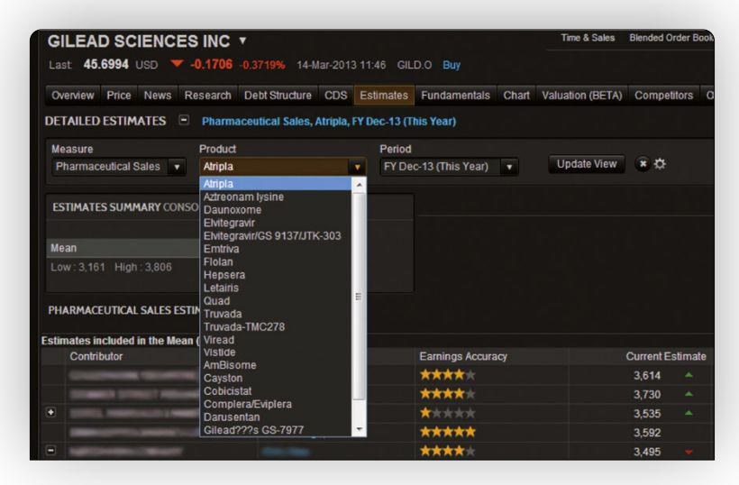

## Table of Contents

## What is the Institutional Brokers' Estimate System (IBES)?

The Institutional Brokers' Estimate System (IBES) is a service that collects and provides analysts' earnings estimates for publicly traded companies. It helps investors and financial professionals understand what experts think about a company's future earnings. This information is important because it can influence investment decisions and stock prices.

IBES is used by many people in the finance world, like fund managers and analysts. They use it to compare their own predictions with those of other experts. This helps them make better decisions about buying or selling stocks. The system is run by Refinitiv, a big company that provides financial data and services.

## Who uses the Institutional Brokers' Estimate System?

The Institutional Brokers' Estimate System, or IBES, is used by many people in the finance industry. This includes fund managers, who manage large amounts of money for investors, and financial analysts, who study companies and make predictions about their future performance. These professionals use IBES to see what other experts think about a company's future earnings. This helps them make better decisions about whether to buy or sell stocks.

IBES is also useful for investors who want to understand the general opinion about a company's future. By looking at the earnings estimates from different analysts, investors can get a sense of whether a company is expected to do well or not. This information can be very important when deciding where to put their money. The system is managed by Refinitiv, a company that provides financial data and services, making it a trusted source for many in the finance world.

## How does IBES collect and compile data?

IBES collects data by getting information from many different financial analysts. These analysts work at big banks and investment firms. They make predictions about how much money a company will make in the future. IBES asks these analysts to share their predictions, and then puts all the information together in one place.

Once IBES has all the predictions, it puts them into a big database. This database is like a giant library of numbers and estimates. IBES then calculates an average of all the predictions to give a general idea of what experts think about a company's future earnings. This average is called the "consensus estimate," and it helps investors and financial professionals make decisions about buying or selling stocks.

## What types of data does IBES provide?

IBES provides different types of data that help people understand what financial experts think about a company's future. The main type of data is earnings estimates. These are predictions made by analysts about how much money a company will make in the future. IBES collects these predictions from many different analysts and then calculates an average, which is called the consensus estimate. This helps investors see the general opinion about a company's future earnings.

Another type of data that IBES provides is revisions to these estimates. Sometimes, analysts change their predictions based on new information. IBES tracks these changes and shows how the estimates are being updated over time. This can give investors a sense of whether the outlook for a company is getting better or worse. 

IBES also offers data on other financial metrics, like revenue forecasts and stock price targets. Revenue forecasts are predictions about how much money a company will make from sales, while stock price targets are estimates of what the price of a company's stock might be in the future. All this information helps investors make better decisions about where to put their money.

## How can one access the data from IBES?

To access the data from IBES, you need to subscribe to the service provided by Refinitiv. This means you have to pay a fee to use their platform. Many big companies, like banks and investment firms, have subscriptions because they need this information to make smart decisions about buying and selling stocks. If you work at one of these companies, you can probably use their subscription to look at the data.

If you're not part of a big company, it can be harder to get access. You might need to find a financial data provider that offers IBES data as part of their services. Some universities and libraries also have subscriptions to financial databases that include IBES, so if you're a student or researcher, you might be able to use those resources. Remember, the data is very useful for understanding what experts think about a company's future, so it's worth trying to find a way to access it if you're interested in investing.

## What is the significance of consensus estimates in IBES?

Consensus estimates in IBES are very important because they give a clear picture of what a lot of experts think about a company's future earnings. When IBES takes all the predictions from different analysts and calculates an average, it creates this consensus estimate. This helps investors see if most people think a company will do well or not. If the consensus estimate is high, it means experts believe the company will make a lot of money. If it's low, it might mean they think the company will struggle.

These estimates are useful for making decisions about buying or selling stocks. If an investor sees that the consensus estimate for a company is going up, it might be a good time to buy the stock because more experts are feeling positive about the company's future. On the other hand, if the consensus estimate is going down, it might be a sign to sell the stock or avoid buying it. By looking at the consensus estimates, investors can make smarter choices and hopefully make more money.

## How does IBES help in financial analysis and decision-making?

IBES helps in financial analysis and decision-making by giving people a lot of important information about what experts think about a company's future. It collects predictions from many different analysts and puts them all together. This helps investors see the big picture and understand if most experts think a company will do well or not. By looking at the consensus estimate, which is the average of all the predictions, investors can get a good idea of what to expect from a company's earnings. This is really helpful when deciding whether to buy or sell a stock.

IBES also tracks changes in these predictions over time. If analysts start to think a company will make more money than they thought before, IBES shows this change. This can tell investors that the outlook for the company is getting better, which might be a good time to buy the stock. On the other hand, if the predictions are going down, it might be a sign to sell or avoid buying the stock. By keeping an eye on these changes, investors can make smarter decisions and hopefully make more money.

## What are the limitations and potential biases of using IBES data?

Using IBES data can have some limitations and potential biases. One big limitation is that the data comes from analysts who work at big banks and investment firms. These analysts might have their own reasons for making certain predictions. For example, they might want to make their own company look good or they might be influenced by what their bosses want them to say. This can make the predictions less accurate or fair. Also, not all analysts have the same amount of information or the same level of expertise, so their predictions can be all over the place.

Another issue is that IBES data can be slow to update. Sometimes, new information about a company comes out, but it takes a while for analysts to change their predictions. This means the data you see might not be the most up-to-date. Also, because IBES data is based on what a lot of people think, it can sometimes miss out on new or unusual things that might affect a company's future. So, while IBES data is very helpful, it's important to use it along with other information and to think carefully about what it means.

## How has the methodology of IBES evolved over time?

Over the years, the way IBES collects and puts together data has changed a lot. When it first started, IBES mainly focused on getting earnings estimates from analysts. But as more people started using it, they added more types of data, like revenue forecasts and stock price targets. They also started to include more analysts from different places around the world, which made the data more complete and useful. Another big change was how they started to track changes in estimates over time, which helps investors see if the outlook for a company is getting better or worse.

IBES also improved how it calculates the consensus estimate. At first, they just took a simple average of all the predictions. But they realized that some analysts might be better at predicting than others, so they started to give more weight to the predictions from analysts who have a good track record. This made the consensus estimate more accurate. Also, with new technology, IBES can now update its data more quickly and make it easier for people to access and use. All these changes have made IBES a more powerful tool for investors and financial professionals.

## Can IBES data be integrated with other financial tools and systems?

Yes, IBES data can be integrated with other financial tools and systems. This means that people who use different software for their financial work can add IBES data to it. For example, if you use a program to keep track of your investments, you can set it up to also show the IBES consensus estimates and other data. This makes it easier to see all the important information in one place.

Many big companies that use financial software have special ways to connect to IBES data. They can use something called an API, which is like a special link that lets different programs talk to each other. This way, the software can automatically get the latest IBES data and use it to help make better decisions about buying and selling stocks. It's like having a helper that always keeps you up to date with what experts think about a company's future.

## What are some case studies or examples of IBES being used effectively in financial markets?

One good example of IBES being used effectively is in the work of a big investment firm. They used IBES data to help them decide which stocks to buy and sell. By looking at the consensus estimates, they could see which companies were expected to do well. They noticed that one company's estimates were going up a lot, so they decided to buy more of that company's stock. It turned out to be a good decision because the company did even better than expected, and the stock price went up a lot. This helped the firm make more money for their clients.

Another example is how a financial analyst used IBES data to write a report on a company. The analyst looked at the earnings estimates from IBES and saw that most experts thought the company would make less money in the next year. The analyst used this information to warn investors that the company might not be a good investment right now. When the company's earnings came out, they were indeed lower than expected, and the stock price dropped. The analyst's report, which used IBES data, helped investors avoid losing money.

## How does IBES compare to other earnings estimate systems in terms of accuracy and reliability?

IBES is one of the most popular systems for getting earnings estimates, but it's not the only one. Other systems, like Zacks and Bloomberg, also collect and share earnings estimates from analysts. When it comes to accuracy, IBES is often seen as very reliable because it uses a lot of data from many different analysts. This helps to make the consensus estimate more accurate because it's based on a lot of different opinions. But no system is perfect, and sometimes the estimates can be off if the analysts don't have all the right information or if they make mistakes.

In terms of reliability, IBES is trusted by many big companies and investors because it has been around for a long time and is run by Refinitiv, a well-known company. But other systems like Zacks and Bloomberg also have their own strengths. For example, Zacks is known for its detailed analysis and sometimes can be more accurate for certain types of companies. Bloomberg, on the other hand, offers a lot of other financial data along with earnings estimates, which can be very helpful for investors who need a lot of different information. So, while IBES is very reliable, it's good to look at other systems too to get the best picture of a company's future.

## References & Further Reading

[1]: ["I/B/E/S: Systems, Data, and Issues"](https://www.investopedia.com/terms/i/ibes.asp) by Wayne Ferson, Franklin Allen, William Goetzmann - ResearchGate.

[2]: ["Advances in Financial Machine Learning"](https://www.amazon.com/Advances-Financial-Machine-Learning-Marcos/dp/1119482089) by Marcos Lopez de Prado.

[3]: ["Quantitative Trading: How to Build Your Own Algorithmic Trading Business"](https://www.amazon.com/Quantitative-Trading-Build-Algorithmic-Business/dp/1119800064) by Ernest P. Chan.

[4]: Gulen, H., & Jablonski, D. (2017). ["The Informational Efficiency of Stock Prices: Measurement and Implications."](https://academic.oup.com/rfs/article/29/3/523/1887688) CFA Institute Research Foundation.

[5]: ["Machine Learning for Algorithmic Trading"](https://github.com/stefan-jansen/machine-learning-for-trading) by Stefan Jansen.