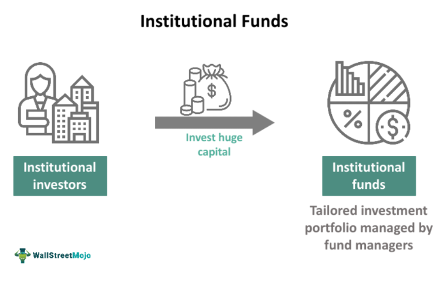

## Table of Contents

## What is an institutional fund?

An institutional fund is a type of investment fund that is specifically designed for large organizations, like pension funds, insurance companies, and endowments. These funds are different from the ones that regular people might invest in because they usually require a lot more money to start with and have different rules and fees.

Institutional funds are managed by professional investment managers who make decisions about where to invest the money. Because these funds handle such large amounts of money, they can often get better deals and have access to investment opportunities that smaller investors can't reach. This can lead to potentially higher returns, but like all investments, there are also risks involved.

## How do institutional funds differ from retail funds?

Institutional funds and retail funds are both types of investment funds, but they are meant for different groups of people. Institutional funds are for big organizations like pension funds or universities. They need a lot of money to start, often millions of dollars, and the fees can be different from what regular people pay. Retail funds, on the other hand, are for everyday people. You can start investing in them with much less money, sometimes just a few hundred dollars.

The way these funds work is also different. Institutional funds are managed by professionals who can make big investment choices because they have so much money to work with. They might get special deals or access to investments that smaller investors can't touch. Retail funds, while also managed by professionals, usually don't have the same level of access to these big opportunities. This means that the potential returns and risks can be different between the two types of funds.

## What are the main types of institutional funds?

Institutional funds come in different types, each designed for specific needs and goals of large organizations. One common type is the pension fund, which is set up by companies or governments to provide retirement benefits for their employees. Pension funds invest in a mix of assets like stocks, bonds, and real estate to grow the money over time so they can pay out pensions when people retire. Another type is endowment funds, which are used by universities and other non-profit organizations to support their long-term goals. These funds often invest in a variety of assets to ensure they can provide financial support for the organization's activities and scholarships.

There are also insurance company funds, which are managed by insurance companies to back up the policies they sell. These funds invest in safe assets to make sure they can pay out claims when needed. Lastly, sovereign wealth funds are set up by governments using money from sources like oil revenues or foreign exchange reserves. These funds aim to stabilize the economy, save for future generations, or invest in strategic assets. Each type of institutional fund has its own rules and investment strategies to meet the specific needs of the organization it serves.

## Who typically invests in institutional funds?

Institutional funds are mainly for big organizations that have a lot of money to invest. These organizations include pension funds, which are set up by companies or governments to help their workers save for retirement. Universities and other non-profits also use institutional funds, called endowment funds, to support their long-term goals like scholarships and research. Insurance companies invest in these funds to make sure they can pay out claims when people need them. And some countries set up sovereign wealth funds to manage money from things like oil sales or foreign exchange reserves.

These big organizations choose institutional funds because they need to invest large amounts of money. Institutional funds often require millions of dollars to start, which is much more than what regular people can invest. Because they handle so much money, these funds can get better deals and have access to special investment opportunities that smaller investors can't reach. This can help the organizations meet their goals, like providing retirement benefits or supporting educational programs.

## What are the advantages of investing in institutional funds?

One big advantage of investing in institutional funds is that they can handle a lot of money. Because these funds are for big organizations like pension funds or universities, they can start with millions of dollars. This means they can get better deals on investments than smaller investors. For example, they might be able to buy stocks or bonds at a lower price. They also have access to special investment opportunities that regular people can't reach, like big real estate projects or private companies. This can lead to higher returns for the organizations that invest in these funds.

Another advantage is that institutional funds are managed by professional investment managers. These experts know a lot about the market and can make smart decisions about where to invest the money. They often have teams of people who study the market and look for the best opportunities. This can help the funds grow over time and meet the goals of the organizations, like providing retirement benefits or supporting scholarships. While there are risks with any investment, having professionals manage the funds can help reduce those risks and make the most of the money invested.

## What are the risks associated with institutional funds?

Investing in institutional funds comes with some risks. One big risk is that the value of the investments can go up and down. This is called market risk. If the stock market or other investments don't do well, the value of the fund can drop, and the organizations that invested in it might lose money. Another risk is called [liquidity](/wiki/liquidity-risk-premium) risk. This means that it might be hard to sell the investments quickly if the organization needs the money right away. Institutional funds often invest in things like real estate or private companies, which can be hard to sell fast.

There's also something called credit risk. This happens if the fund invests in bonds or loans, and the people or companies that owe the money can't pay it back. If that happens, the fund could lose money. Another risk is called operational risk. This is when something goes wrong with how the fund is managed, like if there's a mistake or fraud. Even though institutional funds are managed by professionals, these kinds of problems can still happen and affect the fund's performance.

## How are institutional funds regulated?

Institutional funds are watched over by different rules and organizations to make sure they are run fairly and safely. In the United States, the main group that keeps an eye on these funds is the Securities and Exchange Commission (SEC). The SEC has rules that say how funds should be managed, what they need to tell investors, and how they should handle money. Other countries have their own groups that do similar things, like the Financial Conduct Authority (FCA) in the UK. These rules help make sure that the people in charge of the funds are doing a good job and not taking too many risks with the money.

Besides the SEC and other country-specific groups, there are also rules that come from the funds themselves. For example, pension funds have to follow laws like the Employee Retirement Income Security Act (ERISA) in the US, which says how they should invest money to help workers save for retirement. These rules are important because they help protect the big organizations that invest in these funds, like pension funds and universities, and make sure their money is being used the right way. By following these regulations, institutional funds can work to meet their goals while keeping risks under control.

## What role do institutional funds play in the financial markets?

Institutional funds are really important in the financial markets because they handle a lot of money. These funds, like pension funds and endowment funds, invest big amounts in things like stocks, bonds, and real estate. When they buy or sell these investments, it can move the prices in the market. For example, if a big pension fund decides to buy a lot of a certain stock, the price of that stock might go up because there's more demand for it. This means institutional funds can have a big impact on how the market works and how prices change.

Another way institutional funds affect the financial markets is by helping to keep them stable. Because these funds are managed by professionals who know a lot about investing, they can make smart choices about where to put their money. This can help balance out the ups and downs in the market. For instance, if the market starts to drop, institutional funds might buy more investments to take advantage of lower prices, which can help stop the market from falling too far. So, institutional funds not only influence market prices but also help keep the financial system running smoothly.

## How can one evaluate the performance of an institutional fund?

To evaluate the performance of an institutional fund, you need to look at a few key things. One important thing is the fund's returns. This means checking how much money the fund has made over time. You can compare these returns to a benchmark, which is like a standard that shows how well the market is doing. If the fund's returns are higher than the benchmark, it's doing well. Another thing to look at is the risk the fund takes. Some funds might make more money, but they also take bigger risks. You can see this by looking at something called the standard deviation, which shows how much the fund's returns go up and down.

Another way to evaluate an institutional fund is by looking at its fees and costs. These are the charges that the fund takes out of the money it manages. Lower fees are usually better because they mean more of the money stays in the fund to grow. You should also check the fund's investment strategy and how well it sticks to it. If the fund says it will invest in certain types of assets, like stocks or bonds, you want to make sure it's doing that. Finally, it's good to look at the fund manager's experience and track record. A manager who has done well in the past might be more likely to do well in the future. By looking at all these things, you can get a good idea of how well an institutional fund is performing.

## What are the key considerations when choosing an institutional fund?

When choosing an institutional fund, one of the first things to think about is what the fund aims to do. Different funds have different goals, like growing money over a long time or keeping it safe and steady. You need to pick a fund that matches what your organization wants to achieve. Another big thing to consider is how much risk the fund takes. Some funds might try to make a lot of money quickly, but they could also lose a lot. Others might grow more slowly but are safer. You need to find a fund that fits the level of risk your organization is okay with.

Another key thing to look at is the fees and costs of the fund. These are the charges that come out of the money the fund manages. Lower fees mean more of your money stays in the fund to grow. It's also important to check the fund's past performance. This can give you an idea of how well the fund has done before, but remember that past results don't guarantee future success. Finally, think about the people managing the fund. Experienced managers who have a good track record might be more likely to do well in the future. By considering all these things, you can choose an institutional fund that's right for your organization.

## How do institutional funds impact the economy?

Institutional funds have a big impact on the economy because they handle a lot of money. When these funds, like pension funds or endowment funds, invest in things like stocks, bonds, and real estate, they can move the prices in the market. For example, if a big pension fund buys a lot of a certain stock, the price of that stock might go up because more people want to buy it. This can help companies grow by giving them more money to use for new projects or to expand their business. When companies do well, they can hire more people and pay them more, which helps the economy grow.

Institutional funds also help keep the economy stable. Because these funds are managed by professionals who know a lot about investing, they can make smart choices about where to put their money. If the market starts to drop, these funds might buy more investments to take advantage of lower prices, which can help stop the market from falling too far. This can prevent big economic problems like a crash. Also, when institutional funds invest in things like infrastructure or real estate, it can lead to new jobs and better services, which makes the economy stronger and more stable over time.

## What future trends are expected in the institutional fund sector?

In the future, one big trend in the institutional fund sector will be more focus on sustainable and responsible investing. This means that funds will look more at how their investments affect the environment and society. For example, they might choose to invest in companies that use clean energy or have good labor practices. This trend is growing because more people and organizations want to make sure their money is used in a way that helps the world, not just makes a profit. Institutional funds will need to change how they pick investments to meet these new goals.

Another trend will be the use of new technology, like [artificial intelligence](/wiki/ai-artificial-intelligence) and big data, to help manage funds. These tools can help fund managers make better decisions by looking at a lot of information quickly. For example, AI can find patterns in the market that humans might miss. This can help funds make more money and take less risk. As technology keeps getting better, institutional funds will use it more and more to stay ahead in the market.

## References & Further Reading

[1]: Bergstra, J., Bardenet, R., Bengio, Y., & Kégl, B. (2011). ["Algorithms for Hyper-Parameter Optimization."](https://dl.acm.org/doi/10.5555/2986459.2986743) Advances in Neural Information Processing Systems 24.

[2]: ["Advances in Financial Machine Learning"](https://www.amazon.com/Advances-Financial-Machine-Learning-Marcos/dp/1119482089) by Marcos Lopez de Prado

[3]: ["Evidence-Based Technical Analysis: Applying the Scientific Method and Statistical Inference to Trading Signals"](https://www.amazon.com/Evidence-Based-Technical-Analysis-Scientific-Statistical/dp/0470008741) by David Aronson

[4]: ["Machine Learning for Algorithmic Trading"](https://github.com/stefan-jansen/machine-learning-for-trading) by Stefan Jansen

[5]: ["Quantitative Trading: How to Build Your Own Algorithmic Trading Business"](https://www.amazon.com/Quantitative-Trading-Build-Algorithmic-Business/dp/1119800064) by Ernest P. Chan