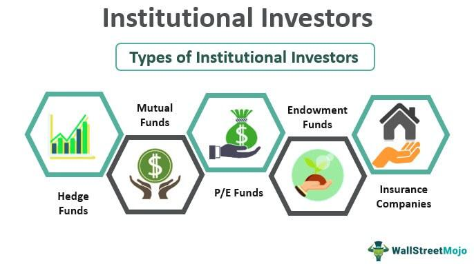

Institutional investing is crucial to the stability and growth of global financial markets. It involves major participants such as pension funds, mutual funds, insurance companies, and hedge funds, whose significant holdings and large-scale trading activities often set the tone for market trends. Unlike retail investors, these entities possess vast resources and expert teams capable of executing sophisticated strategies that influence asset pricing and market stability.

Understanding how institutional trading and investment strategies operate is essential for grasping the dynamics of financial markets. Institutional investors adopt strategic approaches that differ substantially from those of retail investors, leveraging research, predictive analytics, and market trends to maximize returns. Their investment choices, informed by comprehensive data analysis and risk assessment models, display a profound impact on market movements and economic cycles.



A pivotal aspect of modern institutional investing is the integration of algorithmic trading. This approach employs complex algorithms to automate trading decisions, enabling institutions to efficiently process vast quantities of transactions with precision and speed. Algorithmic and high-frequency trading are reshaping the investment landscape, bringing benefits such as reduced transaction costs and increased market liquidity, while also posing challenges related to market volatility and regulatory oversight.

This article outlines the operations of institutional investors, their strategic inclinations, and the transformative role of algorithmic trading. By exploring these elements, we gain insight into how these entities maintain a substantial influence and continually adapt to an evolving financial environment.

## Table of Contents

## Understanding Institutional Investors

Institutional investors are entities that pool resources to invest in a wide array of financial markets, significantly affecting both market dynamics and economic growth. They include banks, mutual funds, pension funds, and insurance companies, each playing distinct roles in the financial markets. These investors are crucial due to their ability to manage substantial sums of money, which allows them to influence asset prices, liquidity, and even corporate governance.

Banks act as both intermediaries and investors in financial markets. They manage significant portions of financial assets through their lending activities, proprietary trading, and handling of client assets. Mutual funds are investment vehicles that collect money from many investors to purchase securities, providing a diversification strategy for average investors while benefiting from economies of scale. Pension funds manage the retirement savings of individuals, investing these large pools in diverse asset classes to ensure long-term growth and stability. These funds are crucial for providing stable income to retirees and are typically more risk-averse in their investment strategies. Insurance companies invest the premiums they collect from policyholders, managing a diverse range of investments to meet future obligations while seeking returns that exceed their liabilities.

The distinction between institutional and retail investors lies primarily in their market influence and access to resources. Institutional investors wield significant market influence due to the large volumes of trades they execute. This market power enables them to negotiate better fees, access privileged information, and participate in exclusive investment opportunities. In contrast, retail investors, typically individual investors, have fewer resources and influence, often facing higher transaction costs and limited access to specialized financial products.

Institutional investors benefit from economies of scale, enabling cost efficiencies in trade execution and portfolio management that retail investors find challenging to achieve. Additionally, they often have sophisticated risk management frameworks and access to advanced analytical tools, contributing to informed decision-making and investment strategy development. This disparity is evident as institutional investors are able to employ teams of financial analysts, economists, and strategists to monitor markets continuously and adjust their portfolios proactively.

Overall, institutional investors are indispensable in maintaining the efficiency and stability of financial markets, contributing to [liquidity](/wiki/liquidity-risk-premium) and price discovery. Their operations and strategic decisions significantly impact market trends, with their investment activities often seen as signals by other market participants. Understanding these entities' roles, strategies, and market impact is crucial for grasping the broader financial ecosystem's complexities.

## The Role and Influence of Institutional Investors

Institutional investors hold a pivotal position in financial markets due to the substantial financial assets they manage. These entities, which include pension funds, mutual funds, insurance companies, and sovereign wealth funds, among others, control significant portions of market capital. For instance, it is estimated that institutional investors in the United States manage approximately 80% of all equities, underscoring their central role in market dynamics.

The immense [volume](/wiki/volume-trading-strategy) of assets under management by institutional investors allows them to exert considerable influence on market stability and pricing. Their ability to make large-scale trades means that their decisions can significantly impact stock prices and market trends. For example, when an institutional investor decides to buy or sell a substantial number of shares in a particular company, it can lead to noticeable price movements due to the sheer volume of shares involved. This effect is often referred to as the "institutional footprint" in the marketplace.

Institutional investors tend to have a stabilizing effect on markets, primarily because they are often driven by long-term strategic objectives rather than short-term speculative gains. Their investment approach typically involves thorough research and analysis, contributing to more informed price-setting in financial markets. Moreover, their participation is crucial during market downturns as they can provide liquidity and reduce [volatility](/wiki/volatility-trading-strategies) by continuing to invest or hold assets amidst widespread sell-offs.

Large-scale trading activities by institutional investors can also influence asset values and market trends. During market rallies, institutional buying can amplify upward movements, while during downturns, massive sell-offs can exacerbate declines. Furthermore, institutional investors often shape market trends through their use of sophisticated investment strategies and tools that allow them to anticipate and respond swiftly to market changes.

The role of institutional investors also extends to corporate governance. By virtue of their sizable shareholdings, they can influence corporate policies and practices, advocating for changes that align with their investment goals and ethical considerations. This capacity to impact corporate decision-making further underscores their influence in the financial markets.

Overall, institutional investors play a crucial role in the functioning of financial markets, from providing liquidity and stability to influencing market prices and trends. Their decisions and strategies often set the tone for market behavior, thereby shaping the broader economic landscape.

## Investment Strategies of Financial Institutions

Institutional investors employ a range of sophisticated investment strategies to optimize returns and manage risk, taking into account the prevailing market conditions and their long-term financial goals. These strategies are often more advanced than those used by individual investors due to the significant resources and expertise available to these institutions.

One fundamental strategy is asset allocation, which involves diversifying investments across various asset classes such as equities, fixed income securities, real estate, commodities, and alternative investments. The choice of allocation depends on the institution's risk tolerance, investment horizon, and economic outlook. For example, in a bullish market, institutions might increase their allocation in equities to capitalize on anticipated growth, while in uncertain times, they might favor bonds or other fixed-income securities to preserve capital and generate steady income.

The distinction between long-term and short-term investment horizons is critical in determining the strategies employed by institutional investors. Pension funds and insurance companies, for instance, often adopt a long-term perspective due to their future liabilities and obligations. This long-term outlook allows them to invest in growth-oriented assets that may experience short-term volatility. They might focus on acquiring stable, income-generating properties or dividend-paying stocks that promise capital appreciation over several years.

In contrast, hedge funds and certain mutual funds may operate on a shorter investment horizon, seeking to exploit market inefficiencies and generate quick returns. These funds often engage in active trading strategies, including market timing and [arbitrage](/wiki/arbitrage). For instance, they might employ [statistical arbitrage](/wiki/statistical-arbitrage), a strategy that uses quantitative models to identify pricing discrepancies between related financial instruments, allowing them to capitalize on short-term mispricings.

Additionally, institutional investors might utilize dynamic asset allocation strategies to adjust their portfolios in response to changing market conditions and economic forecasts. This approach requires continuous monitoring of market trends and signals to rebalance the asset mix as needed, aiming to enhance returns while mitigating risks.

Overall, the investment strategies of financial institutions are characterized by their diversity and adaptability, reflecting the need to balance risk and return across varying economic landscapes. These strategies leverage extensive research, analytical tools, and market insights to meet their financial objectives and uphold fiduciary responsibilities to stakeholders.

## Algorithmic and Quantitative Trading

Algorithmic and [quantitative trading](/wiki/quantitative-trading) play a pivotal role in the strategies employed by institutional investors, offering a technological edge in executing trades with efficiency and precision. Algorithmic trading involves the use of complex algorithms to automate the process of buying and selling securities. These algorithms are designed to analyze a multitude of market variables and make decisions based on predefined criteria, allowing institutions to process vast quantities of trades in fractions of a second.

One of the primary advantages of [algorithmic trading](/wiki/algorithmic-trading) is the ability to execute trades at high speeds, which is crucial in markets where price fluctuations occur within milliseconds. High-frequency trading ([HFT](/wiki/high-frequency-trading-strategies)) systems, a subset of algorithmic trading, utilize sophisticated technological infrastructure to capitalize on minor price discrepancies across different markets or securities. The rapid execution capability of these systems provides an opportunity to maximize gains from brief market inefficiencies.

Furthermore, algorithmic trading enhances accuracy and reduces human error. By eliminating the manual input in decision-making, algorithms can minimize biases and ensure consistent execution based on data-driven insights. This precision is particularly beneficial for strategies that require executing high-volume trades without significantly impacting the market price.

Despite these advantages, algorithmic trading presents several challenges. One significant concern is the potential for systemic risk, as the automated nature of algorithmic trading can trigger cascading effects if not properly controlled. Errors in the algorithms, whether due to coding mistakes or unforeseen market conditions, can lead to significant financial losses. Moreover, the reliance on speed and computational power often leads to an arms race in technological infrastructure, requiring substantial investment from firms to maintain a competitive edge.

Regulatory concerns also accompany the rise of algorithmic trading. Market regulators focus on ensuring that algorithmic trading does not compromise market fairness or stability. Various regulations aim to enhance transparency and mitigate risks associated with market manipulation and flash crashes, where rapid sell-offs can lead to abrupt market downturns.

In summary, algorithmic and quantitative trading strategies provide institutional investors with tools to execute trades with remarkable speed and accuracy. While these strategies offer significant benefits, they also come with challenges related to system reliability, regulatory compliance, and technological investment. As markets evolve, the role of algorithmic trading in institutional investments will likely continue to expand, driven by innovations in technology and data analytics.

## Case Studies: Successful Institutional Investment Strategies

Institutional investors, with their vast resources and access to a range of financial instruments, employ diverse strategies to maximize returns while managing risk. Notable among these are pension funds, hedge funds, and large investment firms, each of which has crafted strategies that leverage their unique structures and objectives to succeed. 

### Pension Funds: The Case of CalPERS

California Public Employees' Retirement System (CalPERS) is one of the largest pension funds globally. With assets under management exceeding $400 billion, CalPERS employs a robust asset allocation strategy that includes equities, fixed income, real estate, and private equity. During the financial crisis of 2008, CalPERS demonstrated resilience by maintaining a well-diversified portfolio and adhering to their long-term investment horizon. The fund’s strategy highlights the importance of diversification across asset classes to mitigate risk, particularly during volatile market periods. Adapting such a strategy might involve employing quantitative models to dynamically adjust asset allocation in response to changing economic conditions.

### Hedge Funds: Bridgewater Associates’ Risk Parity Approach

One of the most successful institutional investment strategies comes from Bridgewater Associates, renowned for its innovative 'Risk Parity' approach. Developed by Ray Dalio, this strategy allocates risk rather than capital equally across various asset classes, aiming to achieve a balanced portfolio that can perform across different market environments. The underlying principle of Risk Parity is that by holding a diversified mix of assets weighted by their risk contributions (often expressed as the standard deviation of returns, $\sigma$), an investor can achieve more stable returns. For instance, if the volatility of equities is twice that of bonds, the fund might hold twice as much in bonds as in equities to maintain parity in risk contributions. This strategy can be adapted by using [machine learning](/wiki/machine-learning) algorithms to predict asset volatilities and correlations, continually recalibrating the portfolio as market conditions evolve.

### Investment Firms: The Vanguard Group

The Vanguard Group has been a pioneer in cost-effective investing, primarily through its vast offering of index funds. Vanguard's strategy emphasizes low-cost index fund investing, capitalizing on the efficient market hypothesis which suggests that it is difficult to consistently outperform the market. As a result, Vanguard’s strategy aligns with a passive investment approach where funds are designed to mirror market indices. The success of Vanguard’s strategy is evident in its ability to attract over $7 trillion in assets under management. Other institutional investors might adapt this by integrating passive strategies as a core component of their portfolios, especially in highly efficient markets where active management costs might outweigh potential benefits.

### Lessons and Adaptations

These case studies underscore the efficacy of a clear objective-driven strategy, be it focusing on risk diversification, cost minimization, or market outperformance. Institutional investors can learn from these examples by:

1. **Diversification**: Emphasizing broad asset diversification to hedge against market-specific risks.

2. **Risk Management**: Implementing quantitative risk management approaches that adapt to shifting market dynamics.

3. **Cost Efficiency**: Maintaining a vigilant approach towards minimizing fees and expenses to maximize net returns.

4. **Innovation**: Continuously leveraging technological advancements and data analytics to refine investment strategies.

By examining the successful strategies of notable institutions, financial entities can refine their approaches to align with diverse market conditions, ensuring long-term stability and growth.

## Challenges Facing Institutional Investors

Institutional investors today are navigating an increasingly complex landscape characterized by regulatory compliance, market volatility, sustainability pressures, and the relentless pace of technological advancements. These challenges necessitate adaptive strategies to maintain their influential role in global financial markets.

### Regulatory Compliance and Market Volatility

Institutional investors operate under rigorous regulatory frameworks that vary across jurisdictions. Regulations such as the Dodd-Frank Act in the United States and the European Market Infrastructure Regulation (EMIR) in Europe impose strict compliance requirements. These regulations are designed to enhance transparency and reduce systemic risk, yet they also increase operational complexity and compliance costs for institutional investors. Navigating these regulations requires significant legal and administrative resources, impacting overall investment efficiency.

Market volatility presents another challenge. Economic uncertainties, geopolitical events, and rapid technological changes contribute to increased market fluctuations. Such volatility can adversely affect asset valuations and undermine market stability, complicating investment decisions. Institutional investors must employ sophisticated risk management strategies to navigate these turbulent conditions and protect their portfolios.

### Transition to Sustainable and Socially Responsible Investing

The shift towards sustainable and socially responsible investing (SRI) is gaining [momentum](/wiki/momentum) among institutional investors, driven by stakeholder demands and regulatory pressures. Environmental, Social, and Governance ([ESG](/wiki/esg-investing)) criteria are increasingly pivotal in investment decision-making. For some investors, integrating ESG factors involves significant restructuring of traditional investment portfolios to align with sustainability objectives.

The transition to SRI poses several challenges. Identifying suitable investment opportunities that deliver both financial returns and positive societal impact can be difficult. Additionally, there is a lack of standardized metrics for assessing ESG performance, complicating comparative analysis across different investments. Institutional investors are compelled to enhance their due diligence processes and engage in shareholder activism to influence corporate behavior positively.

### Technological Advancements and Investments

Continuous technological advancements pose a dual challenge for institutional investors: they must capitalize on emerging technologies to remain competitive, while also safeguarding their operations against technological disruptions. The integration of technologies such as big data analytics, [artificial intelligence](/wiki/ai-artificial-intelligence) (AI), and blockchain has the potential to revolutionize investment strategies by improving decision-making precision and operational efficiencies.

Investing in these technologies requires substantial financial and human capital. Institutions must continuously upgrade their IT infrastructure and ensure their workforce is adept at utilizing advanced technological tools. Moreover, the pace at which technology evolves necessitates a proactive approach to stay ahead of potential cyber threats and data privacy concerns, which are increasingly critical in an era of digital interconnectivity.

In conclusion, institutional investors face multifaceted challenges that require agile adaptation and strategic foresight. Successfully navigating these challenges is essential to sustain their market influence and capitalize on emerging opportunities. By addressing regulatory demands, adopting sustainable practices, and embracing technological innovation, institutional investors can continue to play a pivotal role in shaping the future of financial markets.

## The Future of Institutional Investing

Institutional investing is on the cusp of transformation, driven by technological advancements and shifting investor priorities. A major trend is the integration of big data and machine learning, which is enabling more sophisticated investment strategies. Institutions are adopting algorithms capable of analyzing vast datasets to unearth market patterns and predict future trends. Machine learning models can process both structured and unstructured data, allowing insights from diverse sources including social media sentiment, news reports, and economic indicators. These insights help institutions identify investment opportunities and optimize portfolios.

Algorithmic trading, enhanced by machine learning, facilitates strategies such as predictive modeling where algorithms forecast asset price movements based on historical data and market signals. An example includes Natural Language Processing (NLP) models that assess market sentiment from news articles, impacting trading decisions. Python, with its robust libraries like TensorFlow and Scikit-learn, is popular for developing these financial models:

```python
import numpy as np
from sklearn.model_selection import train_test_split
from sklearn.ensemble import RandomForestRegressor

# Example: Predictive model for stock prices
# Load dataset
# X = features, y = target variable (e.g., stock price)

X_train, X_test, y_train, y_test = train_test_split(X, y, test_size=0.2, random_state=42)

# Creating a Random Forest Model
model = RandomForestRegressor(n_estimators=100, random_state=42)
model.fit(X_train, y_train)

predictions = model.predict(X_test)
```

Alongside technological integration, evolving investor expectations regarding sustainability and ethical considerations are reshaping institutional strategies. There is a discernible demand for Environmental, Social, and Governance (ESG) initiatives within investment practices. Institutional investors are increasingly incorporating ESG criteria into their decision-making processes, aligning portfolios with long-term sustainability goals. This reflects a growing understanding that sustainable investing not only mitigates risk but can also drive long-term returns.

The shift is supported by regulations encouraging transparent ESG reporting, pushing institutions to focus on social responsibility and ethical governance. Investors' interest in sustainability has prompted the development of specific ESG-focused investment products, such as green bonds and social impact funds, addressing environmental and societal challenges while aiming for financial returns.

As institutional investors navigate these changes, the intersection of technology and sustainability will likely expand. Those capable of leveraging big data and aligning investments with environmental and social principles are poised to lead in the future of institutional investing.

## Conclusion

Institutional investors are pivotal to understanding global financial markets due to their substantial influence and the vast amounts they invest. These entities, which include banks, mutual funds, pension funds, and insurance companies, possess the power to sway market trends and asset values significantly. The distinction between them and retail investors is primarily their market influence and resources. Recognizing these differences is vital for both market professionals and individual investors.

The investment strategies employed by these financial giants are varied and strategically complex. They range from traditional asset allocation across equities and real estate to more modern approaches, incorporating algorithmic trading. The use of algorithms and high-frequency trading systems allows institutions to execute trades with remarkable speed and precision, addressing some of the challenges presented by market volatility. Nevertheless, these strategies are not without challenges; regulatory compliance, transitioning to sustainable and socially responsible investing, and keeping pace with technological advancements are chief among them.

Looking towards the future, the integration of financial technology, including big data and machine learning, is anticipated to continue reshaping institutional investing. These tools enable the development of smarter, data-driven investment strategies, allowing institutional investors to remain competitive in a rapidly evolving financial landscape. Moreover, as expectations for sustainability and ethical investing grow, institutions will need to adapt their strategies to meet these new demands. Understanding these shifts is crucial for navigating the future of investing, both for large institutions and individual market participants.

## References & Further Reading

[1]: Bergstra, J., Bardenet, R., Bengio, Y., & Kégl, B. (2011). ["Algorithms for Hyper-Parameter Optimization."](https://papers.nips.cc/paper/4443-algorithms-for-hyper-parameter-optimization) Advances in Neural Information Processing Systems 24.

[2]: ["Advances in Financial Machine Learning"](https://www.amazon.com/Advances-Financial-Machine-Learning-Marcos/dp/1119482089) by Marcos Lopez de Prado

[3]: ["Evidence-Based Technical Analysis: Applying the Scientific Method and Statistical Inference to Trading Signals"](https://www.amazon.com/Evidence-Based-Technical-Analysis-Scientific-Statistical/dp/0470008741) by David Aronson

[4]: ["Machine Learning for Algorithmic Trading"](https://github.com/stefan-jansen/machine-learning-for-trading) by Stefan Jansen

[5]: ["Quantitative Trading: How to Build Your Own Algorithmic Trading Business"](https://www.amazon.com/Quantitative-Trading-Build-Algorithmic-Business/dp/1119800064) by Ernest P. Chan