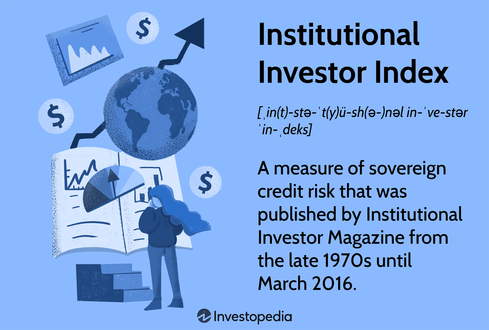

The financial markets have undergone significant transformation with the advent of technological advancements, establishing a dynamic environment for investors. This evolution has introduced a myriad of sophisticated tools and strategies, facilitating a more nuanced approach to investment. Among the various participants in the financial markets, institutional investors possess substantial stakes and wield considerable influence. These investors, including hedge funds, mutual funds, and pension funds, manage vast pools of capital, which allows them to shape markets through their investment decisions.

Algorithmic trading, or algo trading, has become an integral component of modern investment strategies, particularly for institutional investors. It involves the use of automated systems to execute trades based on predefined criteria, offering benefits such as increased speed, efficiency, and reduced emotional influence on trading decisions. As technology continues to advance, algorithmic trading has expanded to incorporate sophisticated techniques such as artificial intelligence and machine learning, enhancing its efficacy and appeal to institutional participants.



The purpose of this article is to examine the intersection of institutional investing and algorithmic trading within the broader context of financial markets. We aim to analyze how these elements collaborate to form a robust investment index, a critical tool for tracking the performance of a set of assets. By understanding the synergy between institutional investors and algorithmic trading, stakeholders can gain valuable insights into market dynamics and make informed investment decisions. This combination of factors not only enhances the efficiency of market operations but also contributes to the competitiveness and robustness of financial indices.

## Table of Contents

## Understanding Financial Markets and Investment Indices

Financial markets are multifaceted systems allowing the exchange of financial instruments. These systems encompass a variety of venues dedicated to trading assets like stocks, bonds, commodities, and derivatives. Stocks represent ownership claims in corporations and can be traded on the stock market. Bonds are debt securities issued by entities such as governments or corporations to raise capital. Commodities are raw materials or primary agricultural products that can be bought and sold, such as gold, oil, and wheat. Derivatives are complex financial contracts that derive their value from an underlying asset, index, or security, such as options and futures.

Investment indices are fundamental tools designed to track the performance of a specific group of assets. They serve as benchmarks for evaluating investment success, providing a comparative measure against which investment performance can be judged. Prominent examples include the S&P 500, which tracks the performance of 500 large companies listed on stock exchanges in the United States, and the MSCI World Index, which monitors stock performance globally across 23 developed markets.

By providing data-driven insights, these indices allow for the assessment of market trends and aid investors in making informed decisions. They help in understanding market sentiment, gauging economic conditions, and predicting future market movements. Analysts and investors use various statistical and analytical methods, including moving averages and regression analysis, to interpret index data and forecast market trends.

Institutional investors—entities like hedge funds, mutual funds, and pension funds—frequently rely on indices to evaluate market health and strategically adjust their portfolios. By aligning their investments with index performance, they can manage risk, diversify assets, and enhance returns. For instance, a pension fund might adjust its stock holdings to match the composition of a relevant index, thereby ensuring it captures the market's returns while minimizing idiosyncratic risks. Leveraging indices allows these investors to implement passive investment strategies, where the goal is to mirror the index performance rather than outperform it, thereby reducing management costs and risk exposure.

Overall, financial markets and investment indices play pivotal roles in the global economy by facilitating capital formation, fostering economic growth, and enabling investors to make informed decisions through established benchmarks.

## Role of Institutional Investors in Financial Markets

Institutional investors are significant players in financial markets, wielding substantial influence through their management of large capital pools. These entities, encompassing hedge funds, mutual funds, and pension funds, have the capacity to drive market movements and affect pricing and [liquidity](/wiki/liquidity-risk-premium) with their investment decisions. Their prominent role arises from their substantial market volumes and strategic financial activities, which ensure that they are integral to maintaining the health and functionality of markets globally.

The investment strategies employed by institutional investors are typically anchored in data-driven techniques, reflecting a sophisticated understanding of market risks and opportunities. Such tactics are informed by quantitative models, statistical tools, and increasingly, [machine learning](/wiki/machine-learning) algorithms that allow for nuanced assessments of market conditions. By leveraging these techniques, institutional investors can make informed predictions about potential asset performance, optimize portfolio allocations, and mitigate risks. For example, they routinely utilize risk management metrics, such as Value-at-Risk (VaR), to quantify potential losses in investment portfolios under normal market conditions.

Moreover, institutional investors contribute to market efficiency and competitiveness. Their substantial trades often result in increased liquidity, reducing transaction costs for other market participants and narrowing bid-ask spreads. This higher liquidity attracts additional market activity, further emphasizing their critical role within financial systems. 

Furthermore, these investors often take long-term perspectives in their investment approaches, aligning strategies with broader economic and demographic trends. For example, pension funds typically align their investment strategies with their long-term liabilities, such as future pension payouts, driving them to seek stable and predictable returns over extended periods. This long-term investment horizon can contribute to market stability, as it provides a counterbalance to the short-term [volatility](/wiki/volatility-trading-strategies) often introduced by speculative trading activities.

Institutional investors also possess the resources to engage in active governance. By holding significant equity stakes in companies, they can exert considerable influence on corporate governance, engage with management teams, and influence strategic business changes. This engagement can lead to improved corporate performance and enhanced shareholder value. 

In summary, the role of institutional investors in financial markets is profound and multifaceted. Their investment decisions, driven by sophisticated data analytics, play a crucial role in influencing market dynamics, enhancing market liquidity, and fostering corporate governance, thereby underpinning the stability and efficiency of the financial markets.

## Emergence of Algorithmic Trading

Algorithmic trading, often abbreviated as algo trading, is a method of executing trades using automated and pre-programmed trading instructions that account for variables such as timing, price, and [volume](/wiki/volume-trading-strategy). Since its inception, it has transformed the landscape of financial markets.

The primary advantage of [algorithmic trading](/wiki/algorithmic-trading) lies in its ability to process complex data and execute trades at a pace and accuracy unattainable by human traders. Speed is a critical [factor](/wiki/factor-investing) in the success of trading strategies, particularly in markets where rapid price changes can lead to significant gains or losses. Algorithms can assess a vast array of data feeds in real-time and make decisions in milliseconds, a crucial capability in volatile markets.

Efficiency is another significant benefit of algorithmic trading. By automating the trade execution process, algorithms minimize the risk of human errors such as misplacing orders or delays due to manual processing. This automation leads to a streamlined trading process, optimizing the use of resources and reducing transaction costs.

Moreover, algorithmic trading reduces emotional bias in the trading process. Human traders are subject to emotional influences, which can lead to irrational decision-making, particularly during periods of market turbulence. Algorithms, by contrast, strictly adhere to predefined rules, ensuring that trades are executed based on logic and data rather than emotion.

The integration of [artificial intelligence](/wiki/ai-artificial-intelligence) (AI) and machine learning into algorithmic trading systems has further enhanced their capabilities. AI algorithms can continuously learn from and adapt to new market data, improving their strategies over time. Machine learning models analyze historical data to predict market trends and make informed trading decisions. These technologies enable more sophisticated trading strategies that can anticipate and react to market changes more effectively than traditional algorithms.

For example, a simple moving average crossover strategy can be enhanced using machine learning by dynamically adjusting the time periods based on current market conditions. A basic Python implementation might involve using the `pandas` library to calculate moving averages and `scikit-learn` to predict optimal parameters.

```python
import pandas as pd
from sklearn.linear_model import LinearRegression

# Sample data and setup
data = pd.DataFrame({'price': [10, 11, 12, 13, 12, 11, 14, 13, 15]})
data['short_mavg'] = data['price'].rolling(window=3).mean()
data['long_mavg'] = data['price'].rolling(window=5).mean()

# Predictive model setup
X = data.index.values.reshape(-1, 1)
y = data['price'].values
model = LinearRegression().fit(X, y)

# Predict future price, which can influence algorithm decision-making
future_time = [[10]]  # Predicting one step ahead
predicted_price = model.predict(future_time)

# Basic trade logic
data['signal'] = 0
data['signal'][data['short_mavg'] > data['long_mavg']] = 1
```

This code snippet depicts a simplified version of how machine learning models could be integrated into algorithmic strategies to enhance decision-making capabilities by predicting future price movements and adjusting the trading signals accordingly.

In conclusion, algorithmic trading represents a fusion of finance and technology, designed to optimize trading performance. Its evolution, driven by the advances in AI and machine learning, continues to shape the way institutional investors approach the financial markets, offering a promising vista for future trading strategies.

## Benefits of Algo Trading for Institutional Investors

Algorithmic trading offers several significant benefits to institutional investors, primarily through its ability to improve scalability and enhance risk management. One of the most compelling advantages of algorithmic trading is its capacity to handle large trade volumes efficiently. This capability is paramount for institutional investors who operate with substantial capital and require precise execution to minimize market impact and optimize execution prices.

The automation inherent in algorithmic trading enables institutions to execute high-volume trades at optimal prices by breaking large orders into smaller, manageable pieces. This process, often referred to as order slicing, minimizes the potential for price slippage and helps achieve better average execution prices. By employing sophisticated algorithms, institutional investors can not only automate the trading process but also continuously adapt strategies in response to real-time market data.

High-frequency trading ([HFT](/wiki/high-frequency-trading-strategies)), a specialized subset of algorithmic trading, is leveraged extensively by institutional investors to exploit short-term market inefficiencies. HFT systems deploy complex algorithms to execute numerous trades at extremely high speeds, often within fractions of a second. This rapid execution capability allows institutions to capitalize on fleeting [arbitrage](/wiki/arbitrage) opportunities and pricing discrepancies across various markets. By doing so, institutional investors can achieve substantial profits with minimal risk exposure.

Moreover, algorithmic trading enhances risk management for institutional investors by facilitating systematic and disciplined trading strategies. Algorithms are designed to adhere strictly to predefined criteria, thus reducing the influence of human emotions and biases that often lead to suboptimal decision-making. The ability to backtest trading strategies on historical data also provides institutions with valuable insights to refine and improve their trading models continuously.

In summary, algorithmic trading empowers institutional investors through scalability, efficient execution, and superior risk management, all of which are crucial for maintaining competitive advantage in ever-evolving financial markets.

## Comparison: Retail vs. Institutional Algo Trading

Algorithmic trading has become an integral component of trading strategies for both retail and institutional investors. However, the scale and sophistication of algo trading tools and strategies differ significantly between these two types of market participants.

Retail traders, individual investors who trade for their own accounts, typically have access to limited algorithmic trading resources. They often utilize off-the-shelf trading software, which provides basic algorithmic trading capabilities. These tools generally include features like automated order execution, technical analysis indicators, and risk management protocols. Despite these capabilities, retail traders face limitations in terms of computational power, capital, and access to real-time data, which can restrict the complexity and efficacy of their algo trading strategies.

In contrast, institutional investors, such as hedge funds, mutual funds, and pension funds, operate on a vastly larger scale. These entities possess substantial financial resources, allowing them to invest in advanced trading infrastructure and develop sophisticated algorithms. Institutions often employ teams of quantitative analysts and data scientists who use cutting-edge technologies, including machine learning and artificial intelligence, to create highly specialized and adaptive trading models. These models are capable of executing trades at microsecond speeds, processing vast amounts of data, and adapting to rapidly changing market conditions.

The differences between retail and institutional algo trading are further amplified by the scale of operations. Institutional investors execute large volumes of trades, which requires advanced infrastructure capable of handling high-frequency trading (HFT) without significant latency. Furthermore, institutions leverage their access to private exchange data, co-location services, and direct market access to gain competitive advantages. In contrast, retail traders usually rely on public data feeds and are susceptible to latency issues, which can affect the execution of trades.

The disparity in resources results in differing strategies and objectives. Retail traders often focus on shorter-term trading opportunities and may employ derivatives like CFDs to amplify their positions. Institutional investors, with their superior capacity, can engage in more complex strategies, such as [statistical arbitrage](/wiki/statistical-arbitrage), [market making](/wiki/market-making), and portfolio rebalancing, that require extensive data analysis and continuous algorithm refinement.

In summation, while retail traders can engage in algo trading, their operations are constrained by technological and financial limitations. Institutional investors, on the other hand, leverage their substantial resources to implement elaborate trading strategies, utilizing advanced algorithms and infrastructure to maintain a competitive edge in the financial markets.

## Challenges and Risks in Algo Trading

Algorithmic trading, while offering numerous advantages, also presents significant challenges and risks that require careful consideration and management. Notably, market volatility poses a substantial challenge for algo trading systems. Algorithms must be robust enough to cope with sudden market shifts, which can lead to substantial financial losses if not properly managed. Volatility affects the predictability of asset prices, making it crucial for trading algorithms to adapt swiftly to changing market conditions. Moreover, the inherent risk of erroneous trades, often caused by system glitches or misconfigured algorithms, can have significant financial implications. Such errors can lead to incorrect trade executions, resulting in potential market disruptions and financial losses.

To address these challenges, institutions employing algorithmic trading must implement rigorous monitoring and frequent updates to their trading algorithms. This involves employing advanced analytics and technology to detect and rectify any anomalies in real time. Continuous monitoring ensures that any unforeseen market conditions are promptly addressed, and algorithms are adjusted accordingly to mitigate risks. 

Regulatory considerations also play a crucial role in managing the risks associated with algo trading. Regulatory bodies, such as the U.S. Securities and Exchange Commission (SEC) and the European Securities and Markets Authority (ESMA), closely scrutinize automated trading practices to prevent market manipulation and ensure fair trading environments. Algorithms must comply with regulatory standards, and trading activities are often subject to audits to ensure transparency and accountability. Institutions may need to invest in compliance technologies and frameworks to align with these regulations, thereby minimizing the risk of legal repercussions.

In conclusion, while algorithmic trading offers increased efficiency and precision, the associated challenges and risks necessitate a proactive and comprehensive approach to risk management and regulatory compliance. Institutions must emphasize a robust infrastructure and a stringent regulatory framework to navigate the complexities of algorithmic trading effectively.

## The Future of Institutional Investing and Algo Trading

As technology continues to advance, the integration of artificial intelligence (AI) within algorithmic trading systems is poised to increase significantly. AI's ability to analyze vast amounts of data efficiently and uncover patterns that may be imperceptible to human traders is transforming the landscape of institutional investing. This transformation is characterized by the emergence of more sophisticated, data-driven strategies which are crucial for maintaining a competitive edge.

One of the fundamental advancements anticipated in this area is the enhancement of data analytics capabilities. Machine learning algorithms are being leveraged to process and analyze massive datasets, providing institutional investors with insights that enable more informed decision-making processes. These data-driven insights help in predicting market trends, assessing risk factors, and optimizing trade executions. The blending of AI and algorithmic trading facilitates not only improved precision in executing trades but also the ability to adapt rapidly to changing market conditions.

The sophistication of AI algorithms presents opportunities for institutional investors to refine their trading strategies further. With AI-powered predictive analytics, institutions can forecast price movements and execute trades with increased accuracy. This ability to predict and adjust positions in real time fosters a more proactive approach to asset management, reducing reliance on reactive measures that can be costly during volatile market phases.

Moreover, the synergy between institutional investors and algorithmic trading paves the way for a more efficient and competitive market landscape. The use of algorithmic strategies reduces transaction costs by optimizing order execution and minimizing the market impact of large trades. Additionally, high-frequency trading (HFT), a subset of algorithmic trading, enables institutions to exploit market inefficiencies quickly, further contributing to market liquidity and price stability.

As AI continues to evolve, its integration with algorithmic trading will likely result in the development of autonomous trading systems that can operate with minimal human intervention. These advanced systems will be capable of self-learning and adapting to new market patterns, thereby continuously enhancing trading efficiency and effectiveness.

In conclusion, the future of institutional investing is intrinsically linked with advancements in algorithmic trading technologies. The ongoing enhancements in AI and data analytics are set to redefine the competitive dynamics of financial markets, enabling institutional investors to meet their investment objectives with unprecedented precision and speed. As these technologies evolve, they promise to create a more dynamic, efficient, and resilient market environment.

## Conclusion

The intersection of financial markets, institutional investors, and algorithmic trading forms a multifaceted but advantageous composite that revolutionizes modern investing. Institutional investors, with their substantial resources and impact, employ algorithmic trading to achieve investment goals with enhanced precision and speed, allowing for more efficient allocation and reallocation of capital in response to changing market conditions. The synergy between these elements not only enhances the operational efficiency of financial transactions but also contributes to a more competitive and resilient market environment.

Algorithmic trading, characterized by automated decision-making systems, assists institutional investors in navigating complex market structures, optimizing trade execution, and minimizing transaction costs. By leveraging algorithmic systems, institutional players can swiftly respond to market signals, effectively managing large datasets and executing trades at scales and speeds unachievable through traditional methods. This harnessing of technology allows institutions to achieve consistency and accuracy in their trading strategies, aligning closely with their objectives of risk management and return maximization.

Understanding the dynamics between financial markets, institutional investors, and algorithmic trading is crucial for stakeholders aiming to make well-informed decisions. As market environments evolve with technological advancements, comprehending the implications and advantages of using algorithmic tools becomes essential for maintaining competitiveness. The continuous interplay of data analytics, algorithmic sophistication, and institutional capital will likely shape the future landscape of financial markets, offering new opportunities and challenges for those engaged in this domain.

## References & Further Reading

[1]: Bergstra, J., Bardenet, R., Bengio, Y., & Kégl, B. (2011). ["Algorithms for Hyper-Parameter Optimization."](https://dl.acm.org/doi/10.5555/2986459.2986743) Advances in Neural Information Processing Systems 24.

[2]: ["Advances in Financial Machine Learning"](https://www.amazon.com/Advances-Financial-Machine-Learning-Marcos/dp/1119482089) by Marcos Lopez de Prado

[3]: ["Evidence-Based Technical Analysis: Applying the Scientific Method and Statistical Inference to Trading Signals"](https://www.amazon.com/Evidence-Based-Technical-Analysis-Scientific-Statistical/dp/0470008741) by David Aronson

[4]: ["Machine Learning for Algorithmic Trading"](https://github.com/stefan-jansen/machine-learning-for-trading) by Stefan Jansen

[5]: ["Quantitative Trading: How to Build Your Own Algorithmic Trading Business"](https://github.com/LucindaYa/quant-resources/blob/master/Quantitative%20Trading%20How%20to%20Build%20Your%20Own%20Algorithmic%20Trading%20Business.pdf) by Ernest P. Chan