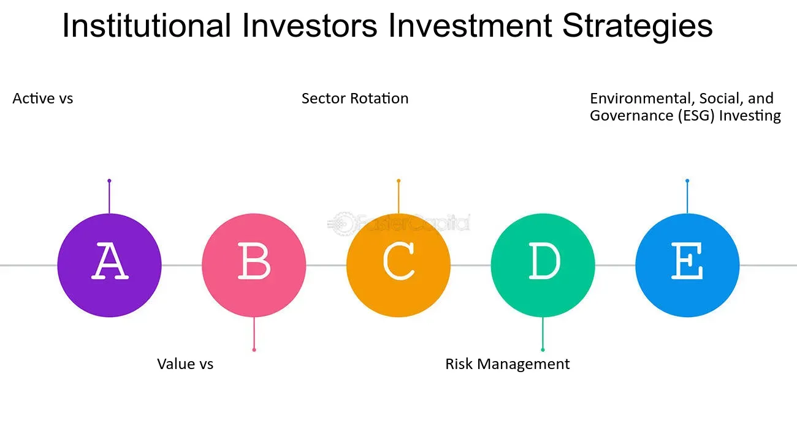

## Table of Contents

## What is an institutional investor?

An institutional investor is a big organization that invests a lot of money in things like stocks, bonds, and real estate. These organizations include banks, insurance companies, pension funds, and mutual funds. They have a lot more money to invest than regular people, so they can buy a lot more and often get special deals.

Because they handle so much money, institutional investors can affect the prices of stocks and other investments. When they buy or sell a lot of something, it can make the price go up or down. They also have teams of experts who study the markets and make decisions based on a lot of information. This makes them very important players in the world of investing.

## What are the different types of institutional investors?

Institutional investors come in different forms, each with their own way of managing money. Some common types are banks, which not only hold your savings but also invest in various financial instruments to grow their funds. Insurance companies are another type; they collect premiums from policyholders and invest those funds to ensure they can pay out claims when needed. Pension funds manage money for people's retirement, investing contributions from employees and employers to grow the retirement pot over time.

Mutual funds and exchange-traded funds (ETFs) pool money from many investors to buy a diverse range of assets, making it easier for individuals to invest in a broad market. Hedge funds are more exclusive, often requiring high minimum investments and using complex strategies to seek high returns. Lastly, endowments and foundations, like those run by universities or charities, invest their funds to support their long-term goals and missions.

Each type of institutional investor plays a unique role in the financial markets, influencing how money flows and how investment decisions are made. They all aim to grow their funds, but they do so with different goals and strategies, affecting the economy in various ways.

## How do institutional investors differ from retail investors?

Institutional investors and retail investors are two different kinds of people who invest money, but they have some big differences. Institutional investors are big organizations like banks, insurance companies, and pension funds. They have a lot of money to invest, often in the millions or billions of dollars. Because they have so much money, they can buy a lot of stocks, bonds, and other things all at once. They also have teams of experts who study the markets and make smart decisions about where to put their money.

Retail investors, on the other hand, are just regular people like you and me. They usually don't have as much money to invest, so they might buy just a few stocks or put money into a savings account. Retail investors often don't have the same level of knowledge or resources as institutional investors. They might make decisions based on what they read in the news or advice from a financial advisor. Because of this, the way they invest and the impact they have on the market is much smaller compared to big institutional investors.

## What are the common investment strategies used by institutional investors?

Institutional investors often use a strategy called diversification to spread their money across different types of investments like stocks, bonds, and real estate. This helps them reduce the risk of losing a lot of money if one investment does poorly. They also use something called asset allocation, which means they decide how much money to put into each type of investment based on their goals and how much risk they are willing to take. For example, they might put more money into bonds if they want a safer investment, or into stocks if they are looking for higher returns.

Another common strategy is active management, where teams of experts constantly buy and sell investments to try and beat the market. They use a lot of research and analysis to make these decisions. On the other hand, some institutional investors prefer passive management, where they invest in index funds or ETFs that track the performance of a market index like the S&P 500. This is usually less expensive and can be just as effective over the long term. Both strategies have their own benefits and are chosen based on the investor's goals and beliefs about the market.

## How do institutional investors influence the market?

Institutional investors have a big impact on the market because they have so much money to invest. When they buy or sell a lot of stocks, bonds, or other investments, it can change the prices. For example, if a big pension fund decides to buy a lot of shares in a company, the price of that company's stock might go up because there's more demand. On the other hand, if they sell a lot of shares, it can make the price go down. This means they can move the market in ways that smaller investors can't.

Because institutional investors have a lot of money and resources, they can also affect the market in other ways. They often do a lot of research and make smart decisions based on that research. This can lead to trends in the market, where many institutional investors start buying or selling the same types of investments. Their actions can make other investors follow along, creating bigger market movements. Overall, institutional investors play a big role in shaping how the market works and how prices change.

## What role do institutional investors play in corporate governance?

Institutional investors have a big say in how companies are run. They own a lot of shares in different companies, so they can vote on important things like who should be on the board of directors or whether the company should make big changes. When they vote, they can push companies to do things that they think are good for the business and its shareholders. This can include making the company more open about what it does, or making sure it treats its workers well and takes care of the environment.

Because they have so much power, institutional investors can also talk directly with the company's leaders. They can suggest ideas or ask for changes that they think will make the company better. This can help the company do well in the long run, which is good for everyone who owns its shares. So, by being active in corporate governance, institutional investors help make sure that companies are run in a way that is fair and helps them grow.

## How do institutional investors manage risk?

Institutional investors manage risk by spreading their money across different types of investments. This is called diversification. By not putting all their money in one place, they reduce the chance that a bad event in one area will hurt all their money. For example, if they invest in stocks, bonds, and real estate, a drop in stock prices won't affect their entire portfolio. They also use something called asset allocation, where they decide how much money to put into each type of investment based on how safe or risky it is. This helps them balance the potential for high returns with the need to protect their money.

Another way they manage risk is by using different investment strategies. Some institutional investors use active management, where they constantly buy and sell investments to try and beat the market. They use a lot of research and analysis to make these decisions, which can help them avoid big losses. Others use passive management, investing in index funds or ETFs that track a market index. This is often less risky because it follows the overall market, which tends to grow over time. By choosing the right mix of strategies, institutional investors can manage risk while still trying to grow their funds.

## What are the regulatory requirements for institutional investors?

Institutional investors have to follow a lot of rules set by governments and other groups to make sure they are doing things the right way. These rules are called regulations. For example, in the United States, the Securities and Exchange Commission (SEC) makes sure that institutional investors follow the law. They have to report what they are doing with their money, like what they are buying and selling, and how much they own in different companies. This helps keep the market fair and honest.

There are also rules about how institutional investors can use other people's money. For example, if they are managing a pension fund, they have to make sure they are investing the money wisely and not taking too many risks. They might have to follow something called the "prudent man rule," which means they need to invest the money like a careful person would. These rules help protect the people whose money is being invested and make sure that institutional investors are acting responsibly.

## How do institutional investors use derivatives in their investment strategies?

Institutional investors use derivatives as tools to manage risk and boost their investment strategies. Derivatives are financial contracts whose value comes from something else, like stocks, bonds, or commodities. For example, they might use options, which give them the right to buy or sell an asset at a set price in the future. This can help them protect their investments from big price swings. If they think the price of a stock might go down, they can buy a put option to sell it at a higher price than the market, reducing their loss.

Another way institutional investors use derivatives is to make money from market movements without actually owning the assets. They might use futures contracts, which are agreements to buy or sell an asset at a future date for a set price. By trading futures, they can bet on where they think the market is going. If they are right, they can make a profit without having to buy the stocks or commodities directly. This can be a way to increase their returns, but it also comes with more risk because derivatives can be complicated and their value can change a lot.

## What are the performance metrics used to evaluate institutional investors?

Institutional investors are often judged by how well they do their job. One common way to measure this is by looking at their returns. This means checking how much money they made compared to what they started with. People also look at something called the Sharpe Ratio, which tells you how much return they got for the risk they took. A higher Sharpe Ratio means they did a good job of making money without taking too many chances. Another important measure is the alpha, which shows if the investor did better than the market as a whole. If the alpha is positive, it means they beat the market.

Another way to evaluate institutional investors is by looking at how they manage risk. This can be seen through metrics like the standard deviation of their returns, which shows how much their performance goes up and down. A lower standard deviation means their returns are more stable, which is good for investors who don't like big surprises. They also look at the beta, which shows how much the investor's returns move with the market. A beta of 1 means they move exactly with the market, while a beta less than 1 means they are less affected by market swings. By using these different measures, people can get a full picture of how well an institutional investor is doing.

## How do institutional investors approach sustainable and responsible investing?

Institutional investors are paying more attention to sustainable and responsible investing. This means they look at more than just making money. They think about things like the environment, how companies treat their workers, and if they follow good rules. They might choose to invest in companies that are trying to be better for the planet or that treat people well. This is called [ESG](/wiki/esg-investing) investing, which stands for Environmental, Social, and Governance. By doing this, they hope to make a positive impact on the world while still getting good returns on their money.

To make sure they are investing responsibly, institutional investors often use special tools and research. They might use ESG ratings to see how well a company is doing in these areas. They can also talk to the companies they invest in, asking them to make changes that are better for the environment or society. Some institutional investors even join groups that work together to push for more responsible practices in the companies they own. This way, they can help make the world a better place while also looking after the money they are managing.

## What advanced portfolio management techniques are utilized by institutional investors?

Institutional investors use advanced portfolio management techniques to make their investments work better. One technique is called [factor](/wiki/factor-investing) investing, where they look at different things that can affect how well an investment does. These things, called factors, might include how big a company is, how much it grows, or how much risk it takes. By focusing on these factors, institutional investors can build a portfolio that is more likely to do well over time. Another technique is risk parity, which means they try to balance the risk in their portfolio. Instead of putting most of their money in one type of investment, they spread it out so that each part of their portfolio has the same amount of risk. This can help them avoid big losses if one type of investment does badly.

Another advanced technique is dynamic asset allocation, where institutional investors change how much money they put into different types of investments based on what is happening in the market. If they think stocks are going to do well, they might put more money into stocks. If they think bonds will do better, they might shift more money into bonds. This helps them take advantage of market trends and make more money. They also use quantitative models, which are math formulas that help them make decisions about what to buy and sell. These models can look at a lot of data very quickly and help the investors make smart choices. By using these advanced techniques, institutional investors can manage their money in a way that is more likely to lead to good results.

## References & Further Reading

[1]: Bergstra, J., Bardenet, R., Bengio, Y., & Kégl, B. (2011). ["Algorithms for Hyper-Parameter Optimization."](https://dl.acm.org/doi/10.5555/2986459.2986743) Advances in Neural Information Processing Systems 24.

[2]: ["Advances in Financial Machine Learning"](https://www.amazon.com/Advances-Financial-Machine-Learning-Marcos/dp/1119482089) by Marcos Lopez de Prado

[3]: ["Evidence-Based Technical Analysis: Applying the Scientific Method and Statistical Inference to Trading Signals"](https://www.amazon.com/Evidence-Based-Technical-Analysis-Scientific-Statistical/dp/0470008741) by David Aronson

[4]: ["Machine Learning for Algorithmic Trading"](https://github.com/stefan-jansen/machine-learning-for-trading) by Stefan Jansen

[5]: ["Quantitative Trading: How to Build Your Own Algorithmic Trading Business"](https://www.amazon.com/Quantitative-Trading-Build-Algorithmic-Business/dp/1119800064) by Ernest P. Chan