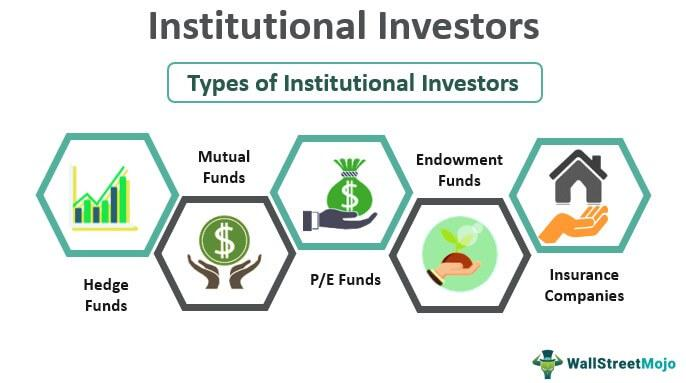

Investment shareholding has become increasingly important in today's global financial markets. This significance stems from its potential to influence market dynamics and corporate governance. Investment shareholding refers to the ownership of company shares by individuals or entities, allowing shareholders to benefit from potential profits and to influence company decisions.

Institutional ownership plays a crucial role in shaping financial markets. Institutional investors, such as mutual funds, pension funds, and hedge funds, hold substantial portions of equity in publicly traded companies. Their significant buying power and strategic decisions can move markets, influence stock prices, and affect overall market stability. Institutional investors often prioritize long-term objectives, contributing to market stabilization but potentially creating challenges for smaller individual investors.

Algorithmic trading (algo trading) has revolutionized modern finance by using computer algorithms to execute trades at speeds and volumes that surpass human capabilities. This rise facilitates market liquidity and minimizes transaction costs, transforming the way trading occurs. However, it also introduces challenges, such as increased market volatility and the risk of systemic technical failures.

The purpose of this article is to analyze the interaction between investment shareholding, institutional ownership, and algo trading. By examining these components, we aim to understand their combined impact on market trends, liquidity, and corporate governance.

Subsequent sections will provide a detailed exploration of investment shareholding, delving into the distinction between individual and institutional shareholders and their influence on company decisions. The article will further investigate how institutional ownership affects market behavior and stability, alongside potential conflicts between institutional and individual investors. A discussion on algorithmic trading will highlight its advantages, challenges, and effects on traditional trading practices. Finally, we will assess how institutional investors are leveraging algo trading and the resulting implications for market dynamics, followed by predictions about future trends and regulatory considerations.

## Table of Contents

## Understanding Investment Shareholding

Investment shareholding refers to the ownership of shares in a company, which represents an equity stake in that entity. It plays a crucial role in the financial ecosystem by enabling capital accumulation and distribution, influencing corporate governance, and providing a mechanism for wealth generation both for individuals and institutions.

### Types of Shareholders

Shareholders can generally be categorized into two types: individual shareholders and institutional shareholders. 

1. **Individual Shareholders**: These are private investors who purchase stocks in organizations for personal financial gain, savings, or speculative purposes. Individual shareholders are often influenced by personal financial goals, risk tolerance, and market conditions.

2. **Institutional Shareholders**: These entities include mutual funds, pension funds, hedge funds, and insurance companies, among others. Institutional investors often manage large pools of capital and thus hold significant stakes in companies. Their decisions are typically driven by strategic investment objectives, risk management considerations, and fiduciary responsibilities to their beneficiaries.

### Influence on Company Decision-Making and Governance

Investment shareholding can significantly affect a company's decision-making and governance through mechanisms such as voting rights and shareholder resolutions. Large shareholders, particularly institutional investors, can exert influence over major corporate decisions, including executive compensation, board appointments, mergers and acquisitions, and strategic direction. The presence of substantial institutional ownership can lead to more rigorous oversight and better alignment of management's interests with those of shareholders, promoting accountability and potentially leading to improved company performance.

### Trends in Investment Shareholding

In recent years, there has been a noticeable shift towards increased institutional ownership in global equity markets. According to a study by the Organisation for Economic Co-operation and Development (OECD), institutional investors held over 40% of equities in major global markets as of 2020, marking a steady increase over the past decades. This trend is indicative of the growing importance of institutional investors in shaping market dynamics.

### Benefits and Risks of Investment Shareholding

Investment shareholding offers several benefits:

- **Wealth Creation**: Shareholding enables individuals and institutions to participate in the economic achievements of companies, potentially yielding dividends and capital gains.
- **Company Performance**: Shareholders can influence corporate strategies to enhance operational efficiency and business growth, potentially elevating the company's valuation.
- **Market Liquidity**: Share ownership, particularly by institutional investors, can enhance liquidity in financial markets, facilitating easier buying and selling of stocks.

However, there are inherent risks:

- **Market Volatility**: The value of shares can fluctuate with market conditions, leading to uncertain returns.
- **Concentration of Power**: Large institutional ownership may lead to a concentration of decision-making power, which might override the interests of smaller, individual shareholders.
- **Short-Term Focus**: There is a concern that institutional investors may prioritize short-term gains over long-term value creation, influencing companies to focus on immediate returns rather than sustainable growth.

In conclusion, understanding the nuances of investment shareholding is crucial for those participating in financial markets. It influences not only the strategic direction and governance of companies but also the broader market trends and investment strategies employed by both individuals and institutions.

## Institutional Ownership: A Dominant Force

Institutional ownership refers to the holding of company shares by large organizations rather than individual investors. These institutions are often influential players in the financial markets due to their substantial assets and trading volumes. Key types of institutional investors include mutual funds, pension funds, and hedge funds, among others. Mutual funds pool resources from multiple investors to purchase a diversified portfolio of stocks, thereby mitigating risk. Pension funds manage retirement savings for employees, providing significant capital for long-term investments. Hedge funds, although smaller in amount, are known for their aggressive strategies and flexibility in investment choices.

Institutional investors wield significant financial muscle, commanding large amounts of capital which they can deploy across a variety of assets. This positions them as critical drivers of economic and market trends. The substantial holdings of these investors can lead to pronounced effects on stock prices. For instance, when an institutional investor acquires a significant portion of a company's shares, it often signals confidence in the company’s prospects, which can drive up the stock price. Conversely, if such an entity decides to sell its holdings, it could lead to a decrease in the stock price.

The influence of institutional ownership extends beyond stock price fluctuations to market stability. On one hand, institutional investors provide [liquidity](/wiki/liquidity-risk-premium) and stability since they tend to hold large volumes of stocks for longer periods. On the other hand, their collective actions could precipitate market [volatility](/wiki/volatility-trading-strategies). For example, simultaneous buying or selling by these entities can lead to abrupt market shifts.

Conflicts may arise between institutional investors and individual shareholders, particularly when the interests of these groups diverge. Institutional investors, owing to their size and influence, might lobby for changes that enhance shareholder value in the short term, potentially at the expense of long-term goals favored by individual shareholders. This could result in tension when it comes to corporate governance issues like dividend policies or mergers and acquisitions.

Concentrated institutional ownership can both positively and negatively affect corporate policies and shareholder value. High levels of institutional ownership often result in more stringent oversight of management practices, as these investors have the resources and motivation to monitor corporate performance closely. This can lead to improved corporate governance, aligning management actions with shareholder interests. However, there is a risk that institutions may exert excessive pressure on companies to meet short-term financial targets, potentially undermining broader strategic objectives and long-term value creation.

Overall, institutional ownership presents a dynamic component of modern financial markets, influencing everything from individual stock performance to broader market trends and corporate governance. As such, understanding the role of these investors is crucial for both market participants and company management.

## Algo Trading: The New Era of Trading

Algorithmic trading, often referred to as algo trading, is a method of executing trades using automated and pre-programmed trading instructions. These instructions take into account variables such as timing, price, and [volume](/wiki/volume-trading-strategy), and are designed to make trading decisions at speeds and frequencies that cannot be managed by a human trader. Algo trading utilizes high-frequency trading ([HFT](/wiki/high-frequency-trading-strategies)) systems that scan multiple markets and execute orders based on predefined criteria.

One of the primary advantages of [algorithmic trading](/wiki/algorithmic-trading) is speed. Algorithms can execute trades in milliseconds, leveraging advanced computational abilities to process large volumes of data instantaneously. This rapid execution is complemented by efficiency, as algorithms can handle complex calculations and transactions with minimal human intervention, reducing the scope for human error. Additionally, algo trading offers data-driven decision-making. By systematically analyzing historical data and trends, algorithms can identify profitable opportunities that may not be readily apparent through traditional analysis.

Despite its advantages, algorithmic trading also presents challenges and risks. One significant concern is market volatility. Algorithms can exacerbate price swings by executing large volumes of trades rapidly in response to market events. Technical failures represent another risk; glitches in trading algorithms can lead to erroneous trades and financial losses. Such risks necessitate robust risk management protocols to safeguard against unexpected market movements and technical malfunctions.

Popular algorithmic trading strategies include [arbitrage](/wiki/arbitrage), where traders exploit price differentials between markets; trend-following strategies, which align trades with current market trends; and mean reversion, which assumes that prices will return to their long-term average. Technologies such as [machine learning](/wiki/machine-learning) and [artificial intelligence](/wiki/ai-artificial-intelligence) are increasingly being integrated into these strategies, enhancing their predictive capabilities and adaptability to market changes.

The rise of algorithmic trading has significantly impacted traditional trading practices and investor behavior. Traditional brokers and traders must now compete with algorithm-driven trades that dominate the markets. This has led to an increase in the use of technology and data analytics in trading practices. Furthermore, the speed and volume at which algo trading operates have provided enhanced liquidity in the markets, though this can be a double-edged sword as it may also lead to the aforementioned volatility.

Overall, the integration of algorithmic trading within financial markets represents a paradigm shift, offering opportunities for increased trading precision and efficiency yet necessitating careful management of its inherent risks. As financial markets continue to evolve, the role and influence of algorithmic trading are likely to expand, shaping the future landscape of trading and investment strategies.

## Interconnection Between Institutional Ownership and Algo Trading

Institutional investors, such as mutual funds, pension funds, and hedge funds, have traditionally played a dominant role in financial markets due to their substantial capital resources and influence. With the advent of algorithmic trading (algo trading), these powerful entities have increasingly turned to sophisticated algorithms to enhance their investment strategies. Algo trading involves the use of complex mathematical models and predetermined sets of rules to execute trades at speeds and frequencies beyond the capacity of human traders. Institutional investors leverage this technology to optimize their trading strategies by analyzing vast datasets to identify profitable opportunities, manage risks, and efficiently execute large volume trades without significantly impacting market prices.

The integration of algo trading into the operations of institutional investors has significantly transformed their behavior and strategies. One of the primary impacts is the increased emphasis on data-driven decision-making. Algorithms can process massive amounts of market data in real time, allowing institutional investors to make more informed decisions. This data-centric approach enhances their ability to react swiftly to market changes, predict price movements, and adjust their portfolios accordingly.

Moreover, algorithmic trading enables institutional investors to participate in high-frequency trading (HFT), which involves executing a large number of orders at extremely fast speeds. This ability allows them to capitalize on short-term market inefficiencies and liquidate positions rapidly to exploit small price differentials. Consequently, algo trading increases market liquidity by ensuring continuous buying and selling activities, reducing bid-ask spreads, and providing tighter market integration. However, this increased speed and volume of trading can contribute to heightened market volatility, particularly during periods of financial uncertainty or market stress.

The synergy between institutional ownership and algo trading also raises several ethical and regulatory concerns. Algorithmic trading systems are prone to technical failures, which can lead to market disruptions. Instances like the 2010 Flash Crash, where the Dow Jones Industrial Average plummeted and rebounded rapidly within minutes, highlight the potential risks associated with algo-driven trading strategies. Regulatory bodies worldwide continue to address these challenges by enhancing oversight and implementing rules to mitigate the risks of systemic failures. For instance, the introduction of circuit breakers and stricter reporting requirements are some measures aimed at safeguarding market stability.

Case studies offer practical examples of how institutional investors capitalize on algorithmic trading. For example, Renaissance Technologies, a [hedge fund](/wiki/hedge-fund-trading-strategies) known for using quantitative models and algo trading, has consistently outperformed traditional hedge funds. By using algorithms to forecast market trends based on historical data, Renaissance Technologies manages to sustain a competitive advantage. Similarly, investment banks like Goldman Sachs utilize algorithms to conduct program trading, optimizing the execution of massive trades and minimizing market impact.

In conclusion, the interplay between institutional ownership and algorithmic trading is continually shaping the financial markets. While this synergy improves market efficiency and liquidity, it also necessitates vigilant regulatory oversight to address the accompanying ethical and systemic risks. As technology evolves, institutional investors will likely develop more refined algorithms, further influencing market dynamics and the investment landscape.

## The Future of Investments: Trends and Predictions

Emerging trends in investment shareholding and institutional ownership continue to shape the financial landscape. In recent years, there has been a notable shift towards increased institutional ownership as large entities such as mutual funds, pension funds, and hedge funds consistently capture significant shares of the market. This trend is driven by the need for diversification, risk management, and a professionalized approach to investment. Furthermore, there is a growing emphasis on Environmental, Social, and Governance ([ESG](/wiki/esg-investing)) criteria, influencing investment decisions and company policies. As institutions wield more influence, their focus on sustainable and socially responsible investing is likely to impact corporate governance and shareholder activism.

Algorithmic trading technologies are advancing at a rapid pace, propelled by machine learning, artificial intelligence, and big data analytics. These advancements are set to enhance the predictive capabilities and execution efficiencies of trading strategies. For instance, machine learning algorithms can analyze vast amounts of market data in real-time, enabling traders to forecast trends and make more informed decisions. HFT (High-Frequency Trading) techniques will continue to evolve, further accelerating trading speeds and reducing costs.

Regulatory changes are pivotal in shaping the future of investment shareholding and algo trading. As markets adapt to technological innovations, regulators are tasked with ensuring market integrity and fairness. Increased scrutiny and potential regulatory measures could be directed towards addressing the ethical concerns and market risks associated with algorithmic trading, such as market manipulation and unchecked volatility. It is likely that new regulations will focus on transparency, risk management practices, and establishing clearer guidelines for automated trading systems and institutional accountability.

The market structure is expected to witness significant shifts due to the dominance of institutional players and technological advancements. The consolidation of power among large institutions may lead to reduced market competition and liquidity concentration. Enhanced algorithms and trading platforms could result in market fragmentation, where the speed and complexity of transactions outpace traditional trading infrastructures. This may necessitate the development of innovative financial products and services to address the evolving needs of investors.

Predicting the future interplay between investment shareholding, institutional ownership, and algorithmic trading involves examining their combined effects on global markets. The rising influence of ESG factors along with advanced trading algorithms may lead to more sustainable investment strategies, albeit with the risk of increased volatility. Institutional investors are likely to deepen their engagement in sophisticated algorithmic trading, enhancing market efficiency but potentially marginalizing individual investors. 

Overall, the convergence of these elements suggests a future where technological prowess and institutional strategies are closely intertwined, driving global market dynamics. Investors and financial professionals must remain vigilant and adaptable to thrive amidst these changes, as the financial landscape continues to evolve with unprecedented speed and complexity.

## Conclusion

The exploration of investment shareholding, institutional ownership, and algorithmic trading provides valuable insights into the mechanics of modern financial markets. Each of these elements plays a pivotal role in shaping market dynamics and investment strategies. Investment shareholding highlights the power dynamics between individuals and institutions, influencing corporate decision-making and governance structures. Institutional ownership, characterized by entities such as mutual funds and pension funds, underscores the dominance of large investors who possess considerable financial clout, potentially stabilizing or destabilizing markets depending on their investment behaviors.

Algorithmic trading represents a transformative force, introducing unparalleled speed, efficiency, and data-driven decision-making to trading practices. While offering significant advantages, such as enhanced liquidity and precision, algorithmic trading also poses risks, including technical failures and increased market volatility. The integration of algorithmic trading by institutional investors exemplifies the synergy between technology and financial power, resulting in strategies that can significantly influence market liquidity and trends.

Understanding these concepts is imperative for investors and financial professionals, as they navigate an increasingly complex and technologically sophisticated landscape. Staying informed about these developments is crucial, given their potential to reshape investment strategies and market structures. As financial markets continue to evolve, driven by advancements in technology and changing regulatory environments, the interplay between investment shareholding, institutional ownership, and algorithmic trading will likely intensify, warranting continuous attention and adaptation from market participants.

The ongoing evolution in financial markets suggests a future where strategic foresight and technological integration will define successful investment approaches. It is essential for stakeholders to remain vigilant, adapt to emerging trends, and harness the opportunities presented by these dynamic forces to optimize their investment outcomes and maintain robust financial ecosystems.

## References & Further Reading

[1]: Organisation for Economic Co-operation and Development (OECD). ["The Role of Institutional Investors in Promoting Good Corporate Governance."](https://one.oecd.org/document/C(2020)94/en/pdf) OECD Publishing.

[2]: David Easley, Marcos M. López de Prado, and Maureen O'Hara. (2011). ["The Microstructure of the 'Flash Crash': Flow Toxicity, Liquidity Crashes and the Probability of Informed Trading."](https://www.stern.nyu.edu/sites/default/files/assets/documents/con_035928.pdf) The Journal of Portfolio Management.

[3]: Lopez de Prado, Marcos. (2018). ["Advances in Financial Machine Learning."](https://www.amazon.com/Advances-Financial-Machine-Learning-Marcos/dp/1119482089) John Wiley & Sons.

[4]: Stefan Jansen. (2020). ["Machine Learning for Algorithmic Trading: Predictive Models to Extract Signals from Market and Alternative Data for Systematic Trading Strategies with Python."](https://github.com/stefan-jansen/machine-learning-for-trading) Packt Publishing.

[5]: Chan, Ernest P. (2008). ["Quantitative Trading: How to Build Your Own Algorithmic Trading Business."](https://github.com/ftvision/quant_trading_echan_book) John Wiley & Sons.

[6]: Aronson, David R. (2006). ["Evidence-Based Technical Analysis: Applying the Scientific Method and Statistical Inference to Trading Signals."](https://www.amazon.com/Evidence-Based-Technical-Analysis-Scientific-Statistical/dp/0470008741) John Wiley & Sons.

[7]: Andrew W. Lo. (2004). ["The Adaptive Markets Hypothesis: Market Efficiency from an Evolutionary Perspective."](https://papers.ssrn.com/sol3/papers.cfm?abstract_id=602222) The Journal of Portfolio Management.