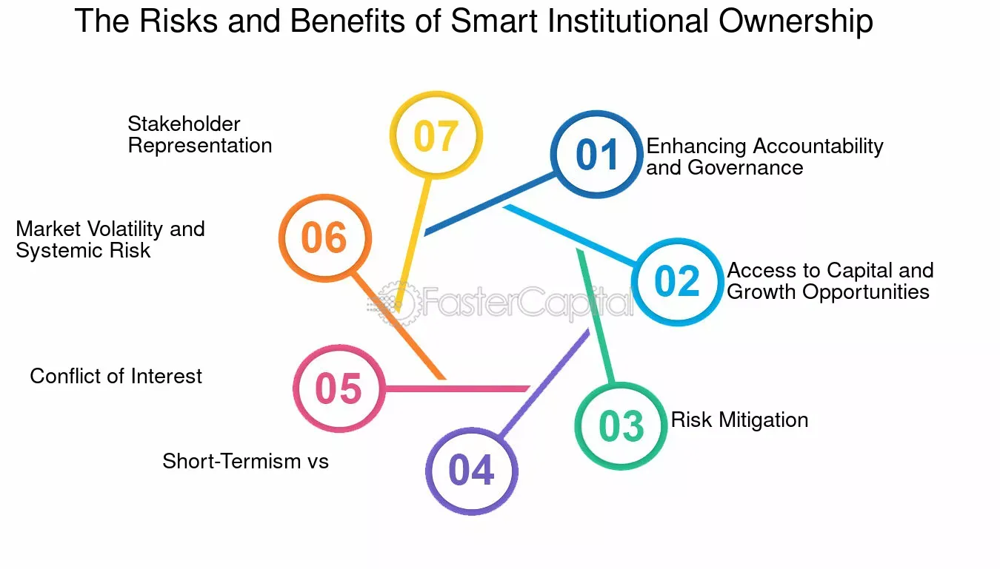

## Table of Contents

## What is institutional ownership?

Institutional ownership refers to the shares of a company that are owned by large organizations like banks, insurance companies, mutual funds, pension funds, and other investment firms. These organizations, known as institutional investors, often buy and hold large amounts of stock in various companies. Because they manage big pools of money, their investment decisions can significantly affect the stock prices and the overall market.

When a company has a high percentage of its shares owned by institutional investors, it often signals to other investors that the company is a good investment. This is because institutional investors usually have teams of analysts who thoroughly research companies before investing. However, if many institutional investors decide to sell their shares at the same time, it can lead to a sharp drop in the stock price, which can be risky for individual investors.

## How does institutional ownership differ from individual ownership?

Institutional ownership means that big organizations like banks and mutual funds own a lot of a company's stock. These groups have a lot of money to invest and they often do a lot of research before they buy stocks. Because they buy so many shares, when they decide to buy or sell, it can really change the stock's price. It's like a big whale moving in the ocean - it makes big waves.

Individual ownership is when regular people like you and me own shares of a company. We might not have as much money to invest as the big organizations, so we usually buy fewer shares. When we buy or sell, it doesn't affect the stock price as much as when big organizations do it. It's more like a small fish swimming around - it doesn't make big waves.

So, the main difference is the size and impact of their investments. Big organizations can move the market, while individual investors usually don't have as much influence.

## What are the common types of institutions that own stocks?

There are several types of institutions that own stocks. The most common ones are banks, which use their money to invest in different companies. Another big group is mutual funds, which collect money from many people and use it to buy stocks. Pension funds are also important; they manage the money that people save for retirement and invest it in stocks to grow over time.

Insurance companies are another type of institution that owns stocks. They invest the money from the premiums people pay for insurance policies. Lastly, there are hedge funds, which are a bit different because they often use more risky strategies to try to make more money from their investments. All these institutions play a big role in the stock market because they have a lot of money to invest.

## What are the benefits of institutional ownership for a company?

When big organizations like banks and mutual funds own a lot of a company's stock, it can be really good for the company. One big benefit is that it can make the company look more trustworthy to other investors. When people see that big organizations are investing in the company, they think, "Hey, if those smart investors believe in this company, maybe I should too!" This can help the company's stock price go up and make it easier for the company to get more money from investors if it needs to.

Another benefit is that these big organizations often have a lot of experience and knowledge. They can give the company good advice on how to grow and do better. Sometimes, they might even help the company find new ways to make money or save money. Having these smart investors on their side can be a big help for a company trying to do well in the market.

## How can institutional ownership impact stock prices?

When big organizations like banks and mutual funds buy a lot of a company's stock, it can push the stock price up. This is because they have a lot of money to spend, and when they start buying, there are more people wanting to buy the stock than there are people wanting to sell it. This makes the stock more valuable, kind of like how a popular toy becomes more expensive when everyone wants one. Plus, when other investors see these big organizations buying, they often think the company must be a good investment, so they start buying too, which can make the stock price go up even more.

On the other hand, if these big organizations decide to sell their shares, it can make the stock price go down. When they sell a lot of shares at once, it's like a big wave hitting the market. There are suddenly more people wanting to sell the stock than there are people wanting to buy it, which makes the stock less valuable. This can be a big problem for the company because a falling stock price can make it harder for them to get money from investors in the future.

## What are the potential drawbacks of high institutional ownership for a company?

When a lot of a company's stock is owned by big organizations, it can be risky. If these big investors decide to sell their shares all at once, it can make the stock price drop a lot. This is because there are suddenly more people wanting to sell the stock than there are people wanting to buy it. A big drop in the stock price can make it hard for the company to get money from investors in the future, which can be a big problem.

Another problem is that these big organizations might want to have a say in how the company is run. They might push for changes that they think will make the stock price go up, but these changes might not be good for the company in the long run. For example, they might want the company to focus on making more money right away instead of investing in things that will help the company grow over time. This can make it hard for the company to plan for the future and do what's best for everyone involved.

## How does institutional ownership affect corporate governance?

When big organizations own a lot of a company's stock, they can have a big say in how the company is run. These big investors often want to make sure the company is doing well so their investment grows. They might ask for seats on the company's board of directors or vote on important decisions. This can be good because they can help the company make smart choices and keep things running smoothly. But it can also be tough for the company because these investors might push for changes that help their stock prices go up right away, even if those changes aren't good for the company in the long run.

Sometimes, having a lot of big investors can make the company focus more on what these investors want instead of what's best for everyone. For example, they might want the company to cut costs or sell off parts of the business to make more money quickly. This can make it hard for the company to plan for the future and do things that will help it grow over time. So, while having big investors can bring a lot of good advice and help, it can also make it tricky for the company to balance what's best for them with what these big investors want.

## Can institutional ownership lead to increased market volatility?

When big organizations like banks and mutual funds own a lot of a company's stock, they can make the stock price go up and down a lot. This is because they have a lot of money to spend, and when they buy a lot of stock, it can make the price go up quickly. But if they decide to sell their shares all at once, it can make the price drop a lot too. This can cause the stock to be more unpredictable and move around a lot, which is what we call market [volatility](/wiki/volatility-trading-strategies).

This kind of up-and-down movement can be risky for other investors. When big investors start selling, it can make other people nervous and they might start selling too, which makes the price drop even more. On the other hand, when these big investors are buying, it can make other people feel more confident and they might start buying too, pushing the price up. So, having a lot of big investors can make the stock market feel like a roller coaster, with lots of ups and downs.

## What role do institutional investors play in shareholder activism?

Institutional investors often play a big role in shareholder activism. This is when they use their power as big shareholders to push for changes in the companies they invest in. They might want the company to be more environmentally friendly, treat their workers better, or make other changes that they think will make the company better in the long run. Because they own a lot of the company's stock, their voice can be really loud and hard for the company to ignore.

Sometimes, these big investors will team up with other shareholders to make their voices even stronger. They might propose new ideas at shareholder meetings or vote against the company's current plans if they don't like them. This can help make the company more responsible and focused on what's best for everyone, not just the people running it. So, institutional investors can be a big force for change and help make companies better places.

## How do institutions decide which stocks to invest in?

Big organizations like banks and mutual funds decide which stocks to invest in by doing a lot of research. They look at things like how much money the company is making, how fast it's growing, and if it's a good deal compared to other companies. They also talk to the company's leaders to understand their plans for the future. This helps them figure out if the company is a smart place to put their money.

Sometimes, these big investors also use special computer programs to help them decide. These programs can look at a lot of information really fast and find patterns that might be hard for people to see. They might also think about what's happening in the world, like new laws or changes in the economy, because these things can affect how well a company does. By putting all this information together, they can pick stocks that they think will make them a good return on their investment.

## What are the regulatory considerations for institutional investors?

Institutional investors have to follow a lot of rules set by the government. These rules are there to make sure they are being fair and not taking too many risks with the money they manage. For example, they have to report how much of a company's stock they own, especially if they own a big part of it. This is so everyone knows who the big investors are and can see if they are trying to control the company too much. They also have to be careful about insider trading, which means using secret information to make money. If they break these rules, they can get in big trouble.

Another important rule is about how they manage the money they invest. They have to make sure they are not putting all their money into just one or two companies, which is called diversification. This helps spread out the risk so if one company does badly, it doesn't hurt all their investments. They also have to be clear about their fees and how they make money, so the people whose money they are investing know what's going on. These rules help keep the market fair and safe for everyone.

## How can retail investors use information about institutional ownership to their advantage?

Retail investors can use information about institutional ownership to help them decide which stocks to buy. When big organizations like banks and mutual funds own a lot of a company's stock, it often means they think the company is a good investment. Retail investors can look at which stocks these big investors are buying and think, "If these smart investors believe in this company, maybe I should too." This can help them find good companies to invest in and feel more confident about their choices.

However, retail investors should also be careful. If a lot of big investors own a stock, it can be risky because if they all decide to sell at the same time, the stock price can drop a lot. Retail investors should not just follow what the big investors are doing without thinking about it. They should do their own research too, to make sure the company is a good fit for their investment goals. By keeping an eye on what institutional investors are doing, but also doing their own homework, retail investors can make smarter choices.

## References & Further Reading

[1]: Organisation for Economic Co-operation and Development (OECD). ["The Role of Institutional Investors in Promoting Good Corporate Governance."](https://one.oecd.org/document/C(2020)94/en/pdf) OECD Publishing.

[2]: David Easley, Marcos M. López de Prado, and Maureen O'Hara. (2011). ["The Microstructure of the 'Flash Crash': Flow Toxicity, Liquidity Crashes and the Probability of Informed Trading."](https://www.stern.nyu.edu/sites/default/files/assets/documents/con_035928.pdf) The Journal of Portfolio Management.

[3]: Lopez de Prado, Marcos. (2018). ["Advances in Financial Machine Learning."](https://www.amazon.com/Advances-Financial-Machine-Learning-Marcos/dp/1119482089) John Wiley & Sons.

[4]: Stefan Jansen. (2020). ["Machine Learning for Algorithmic Trading: Predictive Models to Extract Signals from Market and Alternative Data for Systematic Trading Strategies with Python."](https://github.com/stefan-jansen/machine-learning-for-trading) Packt Publishing.

[5]: Chan, Ernest P. (2008). ["Quantitative Trading: How to Build Your Own Algorithmic Trading Business."](https://github.com/ftvision/quant_trading_echan_book) John Wiley & Sons.

[6]: Aronson, David R. (2006). ["Evidence-Based Technical Analysis: Applying the Scientific Method and Statistical Inference to Trading Signals."](https://www.amazon.com/Evidence-Based-Technical-Analysis-Scientific-Statistical/dp/0470008741) John Wiley & Sons.

[7]: Andrew W. Lo. (2004). ["The Adaptive Markets Hypothesis: Market Efficiency from an Evolutionary Perspective."](https://papers.ssrn.com/sol3/papers.cfm?abstract_id=602222) The Journal of Portfolio Management.