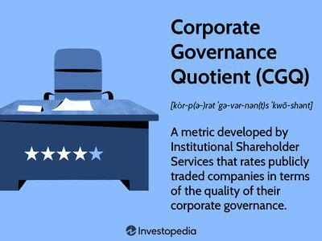

This article explores the dynamic intersection of shareholder solutions, corporate governance, and algorithmic trading, highlighting their critical roles in modern financial ecosystems. At the heart of this exploration is the prominent role of Institutional Shareholder Services (ISS), a key player in shaping the landscape for institutional investors. As a proxy advisory service, ISS has a significant influence on how institutional investors execute their voting strategies and engage with corporate governance matters.

Corporate governance serves as a fundamental component in crafting investment strategies, primarily due to its role in aligning the interests of stakeholders and enhancing organizational accountability and transparency. Good governance practices are linked to stronger financial performance and risk mitigation, making them vital for institutional investors seeking sustainable returns.

Algorithmic trading further integrates into this ecosystem by offering advanced technologies that optimize trading efficiencies and decisions. These computational techniques allow investors to rapidly process vast amounts of data, adapt to market changes, and align trading strategies with corporate governance objectives.

This article will unfold various dimensions of these interactions: ISS’s pivotal role in providing governance solutions, how these solutions influence institutional investors, and the integration of algorithmic trading into governance and investment strategies. Through this exploration, we aim to provide an in-depth understanding of how these facets collectively contribute to informed and responsible investment practices.

## Table of Contents

## Institutional Shareholder Services and Proxy Advisory

Institutional Shareholder Services (ISS) is a pivotal entity in the finance industry, primarily recognized for its role as a proxy advisory firm. Founded in 1985, ISS provides a range of governance solutions, allowing institutional investors to make informed voting decisions. By offering proxy voting advice, ISS helps investors align their voting strategies with their investment governance policies. A substantial part of ISS's influence stems from its comprehensive data analytics, which enable investors to assess corporate governance practices effectively.

ISS influences voting strategies by providing detailed analyses and recommendations on proxy issues. These analyses encompass a wide array of topics including mergers and acquisitions, executive compensation, environmental, social, and governance (ESG) criteria, and other critical governance matters. Investors, particularly institutional ones, use these insights to navigate complex voting decisions, ensuring their choices reflect both financial goals and governance principles.

The services provided by ISS extend beyond voting advice. They include in-depth benchmarks and evaluations of corporate boards, compensation programs, and shareholder proposals. Through its data analytics, ISS offers valuable insights into governance trends and best practices. This data-driven approach not only enhances decision-making capabilities but also promotes transparency and accountability in corporate management.

One of the key issues addressed by ISS is executive compensation. ISS regularly assesses pay-for-performance alignment and issues recommendations on executive pay packages. Another significant focus is on mergers and acquisitions, where ISS evaluates the strategic and financial merits of proposed deals. Additionally, [ESG](/wiki/esg-investing) factors are increasingly pivotal in ISS's analyses as investors seek sustainable and ethical investment opportunities.

ISS boasts a significant global presence, impacting corporate governance across various markets. Its influence extends to proxy fights and resolutions proposed by activist investors, wherein ISS's recommendations can sway the outcomes significantly. This global reach underscores the firm's role in shaping corporate governance norms and holds corporations accountable to their investors worldwide. The guidance offered by ISS in proxy contests exemplifies its capacity to balance the interests of different stakeholders, thus reinforcing its status as a vital player in the corporate governance and investment landscape.

## Corporate Governance Solutions

Institutional Shareholder Services (ISS) offers a broad array of governance solutions tailored for institutional investors. These solutions are centered on equipping investors with the tools and insights necessary to ensure strong oversight and strategic alignment with long-term corporate objectives. A significant aspect of these governance solutions involves integrating Environmental, Social, and Governance (ESG) factors into investment decision-making processes.

### Importance of ESG Factors

ESG factors have become a cornerstone in contemporary governance strategies. They provide a framework for evaluating the sustainability and ethical impact of an investment in a company. ISS plays a crucial role in this by offering data and analytics services that help institutional investors assess a company's ESG performance. This evaluation is vital because a firm's ESG standing can significantly impact both its operational efficiency and its public perception, thereby influencing its financial performance. The adoption of ESG criteria allows investors to identify risks and opportunities that may not be immediately apparent through traditional financial analysis alone.

### Risk Identification and Policy Implementation

ISS enhances sustainable investing by aiding in the identification of risks associated with environmental, social, and governance factors. Through comprehensive analytics and reporting tools, ISS helps investors formulate policies that not only mitigate these risks but also promote sustainable business practices. This support extends to offering guidelines for proxy voting and shareholder engagement that align with sustainable investing goals. These efforts are crucial as they ensure that firms are held accountable to high standards of governance while aligning with investor priorities for long-term value creation.

### Success Stories

Numerous companies have benefited from robust corporate governance strategies facilitated by ISS's solutions. For instance, companies that have effectively integrated ESG factors into their business models often report improved operational efficiencies and cost savings. Some have even seen enhanced brand reputation and customer loyalty, translating into greater market share and shareholder returns. While specific case studies are proprietary, the correlation between strong governance practices and improved financial performance is well-documented across sectors.

### Role of Governance in Enhancing Shareholder Value

Corporate governance has a direct impact on enhancing shareholder value and boosting investor confidence. For instance, a strong governance framework can lead to improved decision-making processes by management, fostering a culture of accountability and transparency. This, in turn, can minimize risks such as financial fraud or mismanagement, ultimately protecting investor interests. Additionally, companies with sound governance structures often enjoy a lower cost of capital as they are perceived as less risky investments.

In conclusion, ISS's governance solutions not only ensure compliance and strategic alignment with best practices but also foster environments where sustainable investing can thrive. These solutions help institutional investors navigate complex governance landscapes, ultimately enhancing both shareholder value and corporate accountability.

## Algorithmic Trading and Market Intelligence

Algorithmic trading refers to the use of computer algorithms to automate trading decisions, thereby executing orders at speeds and frequencies that are impossible for human traders. These algorithms are programmed based on complex mathematical models which take into account various market factors and predefined instructions such as timing, price, and quantity. In modern investment strategies, [algorithmic trading](/wiki/algorithmic-trading) is relevant because it allows for greater efficiency, precision, and the ability to capitalize on short-lived market conditions.

Institutional Shareholder Services (ISS) utilizes market intelligence to provide specialized insights pertinent to algorithmic trading. By analyzing vast amounts of financial data, ISS aids in identifying market trends and anomalies, which can be crucial for developing effective algorithmic strategies. This data-driven approach ensures that trading decisions are backed by comprehensive analysis, enhancing the potential for more profitable outcomes.

The benefits of algorithmic trading for institutional investors include increased speed and efficiency, reduced transaction costs, and minimized market impact through strategic trade execution. Moreover, algorithmic trading can enhance [liquidity](/wiki/liquidity-risk-premium) management by executing large orders in smaller chunks, thus reducing the likelihood of significant price movements. However, it also poses risks such as system failures, the amplification of market [volatility](/wiki/volatility-trading-strategies), and the potential for market manipulation through high-frequency trading algorithms designed to exploit minute price discrepancies.

To align trading strategies with corporate governance goals, a variety of tools and analytics are employed. These tools often include [machine learning](/wiki/machine-learning) algorithms, predictive analytics, and sentiment analysis, which help investors assess the governance policies of potential investment targets. By integrating these analytics, traders can ensure that their investment decisions and trading activities are consistent with responsible governance practices, thereby sustaining long-term shareholder value.

One notable case study illustrating the impact of algorithmic trading on market dynamics involves the 2010 "Flash Crash," where rapid algorithmic trading was partly blamed for creating excessive market volatility, resulting in a significant yet temporary stock market drop. This incident underscored both the power and risk of algorithmic trading, highlighting the need for robust risk management and regulatory oversight.

In summary, algorithmic trading stands as a cornerstone of contemporary investment strategies due to its capacity to process large volumes of data rapidly, enabling informed and efficient trading decisions. As institutional investors demand more responsive and strategic trading frameworks, the interplay between algorithmic trading and market intelligence will continue to evolve, potentially reshaping traditional approaches to corporate governance and investment analysis.

## ISS's Influence in Corporate Governance and Investment Strategies

Institutional Shareholder Services (ISS) plays a pivotal role in influencing corporate governance and shaping investment strategies through its comprehensive and analytical approach to voting recommendations. ISS provides guidance to institutional investors on various corporate issues, which significantly affects corporate policies and investor decisions. These recommendations can alter the outcomes of shareholder meetings by swaying key votes on issues such as board elections, executive compensation, and mergers.

The collaboration between ISS and activist investors further exemplifies its dual role in corporate governance. ISS supports these investors by providing detailed analyses and recommendations that often align with activist agendas aimed at improving corporate performance and governance practices. This collaboration underscores ISS's influence in pushing companies towards policies that may align more directly with shareholder interests rather than existing management preferences.

Through its governance scoring system, ISS evaluates corporate management practices, allowing investors to make informed decisions. Governance scores provide a standardized measure of a company’s governance quality, assessing factors such as board structure, shareholder rights, and audit processes. This scoring system not only influences investor perceptions but also encourages companies to improve their governance practices to appeal to conscientious investors.

In diverse market conditions, ISS employs strategies that strive to achieve a balanced approach to corporate governance. By considering regional regulatory environments and cultural norms, ISS tailors its recommendations to ensure they are relevant and effective across different markets. This adaptability helps maintain its global impact while respecting local governance traditions.

Moreover, ISS has made significant contributions to the development of sustainable and responsible investment practices globally. This is evident in their emphasis on Environmental, Social, and Governance (ESG) factors, which have become integral to assessing a company’s long-term viability and ethical impact. By incorporating ESG criteria into their analyses and recommendations, ISS drives companies towards more sustainable practices, thereby fostering a corporate environment that values responsibility and ethical governance.

ISS’s efforts have encouraged a broader adoption of sustainable investment strategies, compelling companies to integrate ESG considerations into their corporate agendas. This transition is facilitated by ISS’s influence on investor behavior and the growing demand for accountability and transparency in corporate governance. As such, ISS continues to be a key player in shaping the future of corporate governance and responsible investing worldwide.

## Challenges and Future Trends in Shareholder Solutions

Institutional investors are currently navigating a landscape characterized by evolving governance requirements and dynamic trading environments. One of the foremost challenges they face is the integration of Environmental, Social, and Governance (ESG) criteria into investment and governance strategies. This has heightened the demand for comprehensive and transparent data, creating pressure on institutions like Institutional Shareholder Services (ISS) to provide clear and unambiguous proxy advisory services. The growing call for transparency and accountability in these services is driven by investors' need for reassurance that their voting rights align with sustainable and ethical business practices.

Transparency in proxy advisory services is becoming increasingly crucial as shareholders demand more detailed insights into the decision-making processes that influence their investments. Investors expect these services to adhere to stringent standards that ensure impartiality and accuracy in voting recommendations. As a result, regulatory entities around the world are pushing for greater disclosures and compliance, thereby increasing the operational and administrative burden on services like ISS.

In terms of future trends, shareholder solutions are witnessing a surge in technological advancements aimed at optimizing investment strategies and governance frameworks. Blockchain technology, for instance, holds the potential to revolutionize how voting is conducted by enhancing security and ensuring immutability in vote recording systems. The integration of Artificial Intelligence (AI) and Machine Learning (ML) in analyzing vast datasets is also transforming how market trends and investor sentiments are understood, facilitating more informed decision-making processes.

Innovation plays a significant role in refining ISS’s service offerings and client solutions. By leveraging advanced analytics and predictive algorithms, ISS can offer more tailored advice that aligns with each investor's unique strategic goals. The use of AI tools not only aids in identifying risks but also helps in proposing proactive measures to mitigate them, thereby enhancing the investor's ability to maintain robust governance practices.

Looking ahead, ISS’s strategies are likely to evolve in response to both market needs and regulatory changes. As regulators globally enforce stricter governance and ESG standards, ISS will need to adapt by offering tools and services that ensure compliance while also providing strategic value. This could involve expanding digital platforms to streamline data access or developing new analytics models to better anticipate market shifts and investor behavior.

In summary, the future of shareholder solutions is set to be shaped by technological innovation, regulatory oversight, and the ever-increasing demand for transparency. ISS and similar entities are expected to continue evolving, ensuring their strategies meet the nuanced needs of institutional investors while maintaining compliance in a shifting regulatory landscape.

## Conclusion

This article has highlighted the significant role of Institutional Shareholder Services (ISS) in the interplay between corporate governance and algorithmic trading within the investment community. ISS stands out as a critical player, providing integrated governance solutions and advisory services that influence investment decisions. The organization’s recommendations on corporate policies and voting strategies underscore the necessity for institutional investors to incorporate comprehensive governance considerations into their strategies, enhancing both shareholder value and investor confidence.

Emphasizing sustainable investing, ISS and similar services have the potential to significantly shape corporate social responsibility practices by consistently advocating for ESG factors. This advocacy reflects the evolving priorities of investors towards more responsible and sustainable investment practices. The influence exerted by ISS through governance scoring, policy recommendations, and collaboration with activist investors ensures that sustainability becomes a central component of modern investment strategies.

Stakeholders are encouraged to actively engage in discussions to refine governance strategies. Such engagement is vital for adapting to the continuous changes in market conditions and regulatory policies. Ongoing dialogue among investors, corporate management, and advisory firms like ISS is essential to foster innovation and enhance the effectiveness of governance frameworks globally.

Technology and data are revolutionizing corporate governance landscapes, providing unprecedented insights and tools for decision-making. The rise of algorithmic trading underscores the importance of data-driven strategies in achieving alignment with governance objectives. As technology continues to evolve, its integration into governance and investment strategies will likely lead to more dynamic and responsive approaches to shareholder solutions. Embracing these technological advancements offers the opportunity to achieve greater transparency, accountability, and ultimately, sustainable value creation in the investment ecosystem.

## References & Further Reading

[1]: ["Corporate Governance and Institutional Shareholder Services: Overview and Impact"](https://www.issgovernance.com/) by Stephen M. Bainbridge, UCLA Law Review

[2]: Lopez de Prado, Marcos. ["Advances in Financial Machine Learning"](https://www.amazon.com/Advances-Financial-Machine-Learning-Marcos/dp/1119482089). Wiley, 2018.

[3]: Jansen, Stefan. ["Machine Learning for Algorithmic Trading"](https://github.com/stefan-jansen/machine-learning-for-trading). Packt Publishing, 2020.

[4]: Chan, Ernest P. ["Quantitative Trading: How to Build Your Own Algorithmic Trading Business"](https://github.com/ftvision/quant_trading_echan_book). Wiley, 2008.

[5]: Aronson, David R. ["Evidence-Based Technical Analysis: Applying the Scientific Method and Statistical Inference to Trading Signals"](https://www.amazon.com/Evidence-Based-Technical-Analysis-Scientific-Statistical/dp/0470008741). Wiley, 2006.

[6]: BlackRock Investment Institute. ["Sustainability: The Future of Investing"](https://www.wlrk.com/docs/bii-sustainability-future-investing-jan-2019.pdf). BlackRock, 2019.