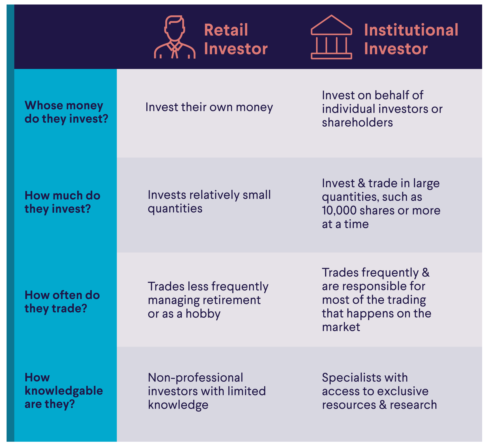

## Table of Contents

## What are institutional shares?

Institutional shares are a type of mutual fund share class that is designed for large investors, like banks, insurance companies, and pension funds. These shares usually have a high minimum investment requirement, often in the range of hundreds of thousands or even millions of dollars. Because of the large investment amounts, institutional shares typically have lower expense ratios compared to other share classes, which means the fees charged to investors are smaller.

The lower costs of institutional shares can make them more attractive to big investors who are looking to maximize their returns. These shares are not usually available to individual investors because of the high minimum investment. However, some financial advisors or investment platforms might offer access to institutional shares through special programs or accounts that pool smaller investments together to meet the minimum requirements.

## Who is eligible to purchase institutional shares?

Institutional shares are mostly for big investors like banks, insurance companies, and pension funds. These groups have a lot of money to invest, so they can meet the high minimum investment that institutional shares need. This minimum can be very high, often hundreds of thousands or even millions of dollars.

Because of the large amount of money needed, regular people usually can't buy institutional shares on their own. But sometimes, financial advisors or special investment platforms can help. They might let smaller investors join together to meet the minimum and buy these shares, making it possible for more people to invest in them.

## What are the minimum investment requirements for institutional shares?

Institutional shares usually need a big amount of money to start investing. This minimum investment can be very high, often between hundreds of thousands to millions of dollars. Because of this, they are mainly for big investors like banks, insurance companies, and pension funds that have a lot of money to invest.

Regular people usually can't buy institutional shares because they don't have enough money to meet the high minimum. But sometimes, financial advisors or special investment platforms can help. They might let smaller investors pool their money together to meet the minimum and buy these shares, making it possible for more people to invest in them.

## How do institutional shares differ from retail shares?

Institutional shares and retail shares are different types of mutual fund share classes. Institutional shares are made for big investors like banks, insurance companies, and pension funds. They need a lot of money to start, often hundreds of thousands or even millions of dollars. Because these big investors put in so much money, the fees they pay, called expense ratios, are usually lower than those for retail shares.

Retail shares, on the other hand, are for regular people who want to invest in mutual funds. The minimum amount needed to start investing in retail shares is much smaller, usually just a few thousand dollars or less. But because the investments are smaller, the fees, or expense ratios, are higher than those for institutional shares. This means that regular people pay more in fees compared to the big investors with institutional shares.

## What are the benefits of investing in institutional shares?

Investing in institutional shares has some big advantages, especially for those who can meet the high minimum investment. One main benefit is lower fees. Because institutional shares are for big investors like banks and pension funds, the expense ratios, or the fees you pay, are much lower than for retail shares. This means more of the money you invest goes toward growing your investment, instead of paying for fees.

Another benefit is better access to professional management. Institutional shares often come with top-notch investment managers who are experts at [picking](/wiki/asset-class-picking) the best investments. This can lead to better performance over time. Plus, these shares might also give you access to special investment opportunities that are not available to regular investors. So, if you can invest a lot of money, institutional shares can offer a good way to grow your investments with less cost and more expert help.

## Can individual investors buy institutional shares?

Individual investors usually can't buy institutional shares on their own because these shares need a lot of money to start, often hundreds of thousands or even millions of dollars. This high minimum investment is meant for big investors like banks, insurance companies, and pension funds who have a lot of money to invest.

But sometimes, financial advisors or special investment platforms can help. They might let smaller investors pool their money together to meet the high minimum and buy these shares. This way, individual investors can get access to institutional shares and enjoy the benefits of lower fees and better investment management, even if they don't have a lot of money to invest on their own.

## What types of institutions typically invest in institutional shares?

Institutional shares are mainly for big investors who have a lot of money to put into mutual funds. These investors are usually big organizations like banks, insurance companies, and pension funds. They can easily meet the high minimum investment that institutional shares need, which can be hundreds of thousands or even millions of dollars.

Because these big investors put in so much money, they get lower fees than regular investors. This means more of their money goes toward growing their investment instead of paying for fees. Also, institutional shares often come with expert management, which can help these big investors make the best choices for their money.

## How do the fees and expenses of institutional shares compare to other share classes?

Institutional shares have lower fees and expenses compared to other share classes like retail shares. This is because institutional shares are for big investors like banks, insurance companies, and pension funds. These big investors can put in a lot of money, often hundreds of thousands or even millions of dollars. Because they invest so much, the fees they pay, called expense ratios, are smaller. This means more of their money goes toward growing their investment instead of paying for fees.

Retail shares, on the other hand, are for regular people who want to invest in mutual funds. The minimum amount needed to start investing in retail shares is much smaller, usually just a few thousand dollars or less. But because the investments are smaller, the fees, or expense ratios, are higher than those for institutional shares. This means that regular people pay more in fees compared to the big investors with institutional shares.

## What are some examples of mutual funds that offer institutional shares?

Some mutual funds that offer institutional shares are the Vanguard Institutional Index Fund and the Fidelity 500 Index Institutional Fund. These funds are popular because they follow the performance of the S&P 500, which is a big group of stocks from the biggest companies in the U.S. They are a good choice for big investors like banks and pension funds who want to invest a lot of money in a way that tracks the overall market.

Another example is the T. Rowe Price Equity Income Fund, which focuses on stocks that pay dividends. This fund is good for investors who want to get regular income from their investments. The American Funds Washington Mutual Investors Fund is also available in an institutional share class. It invests in a mix of big and medium-sized companies, aiming to grow over time while also being less risky than funds that only invest in small companies.

## How can an investor qualify for institutional shares?

To qualify for institutional shares, an investor usually needs to have a lot of money to invest. These shares are made for big investors like banks, insurance companies, and pension funds. The minimum amount needed to start investing in institutional shares can be very high, often hundreds of thousands or even millions of dollars. Because of this, regular people usually can't buy these shares on their own.

But sometimes, financial advisors or special investment platforms can help. They might let smaller investors join together to meet the high minimum and buy these shares. This way, individual investors can get access to institutional shares and enjoy the benefits of lower fees and better investment management, even if they don't have a lot of money to invest on their own.

## What are the potential risks associated with institutional shares?

Investing in institutional shares comes with some risks, just like any other type of investment. One risk is that the value of the mutual fund can go up and down. This means you might lose money if the stocks or bonds in the fund don't do well. Also, because institutional shares are for big investors, they might not be as easy to buy or sell as other types of shares. If a lot of big investors want to sell their shares at the same time, it could be harder for you to sell yours quickly.

Another risk is that the high minimum investment needed for institutional shares can be a problem. If you need your money back and can't sell your shares right away, you might have to wait longer than you want. Plus, even though the fees for institutional shares are lower, you still have to pay them. If the fund doesn't perform well, these fees can eat into your returns, making it harder to make money from your investment.

## How do institutional shares impact the overall performance of a fund?

Institutional shares can affect how well a mutual fund does because big investors like banks and pension funds put a lot of money into them. When these big investors buy a lot of shares, it can make the fund's total amount of money grow quickly. This can be good because the fund can buy more stocks or bonds, which might help it grow even more. But if a lot of these big investors want to sell their shares at the same time, it can make the fund's value go down. This is because the fund might have to sell some of its investments to give the money back to the investors, and this can happen when the market is not doing well.

Also, because institutional shares have lower fees, more of the money goes toward buying stocks or bonds instead of paying for costs. This can help the fund do better over time because less money is taken out for fees. But if the fund doesn't do well, the lower fees might not make up for the losses. So, while institutional shares can help a fund grow by bringing in a lot of money and keeping fees low, they can also make the fund's value go up and down more if big investors decide to buy or sell a lot of shares at once.

## What are Institutional Shares and how can they be understood?

Institutional shares constitute a distinct category of mutual fund shares predominantly accessible to major financial entities such as retirement plans, endowments, and hedge funds. These shares are specifically designed to cater to institutional investors by offering the lowest possible expense ratios. This advantageous cost structure arises from the economies of scale that become feasible when handling substantial sums of capital.

Economies of scale in this context refer to the cost advantages that businesses obtain due to scale efficiency. As the amount of investment increases, the cost per unit of investment typically decreases. This is expressed in the formula:

$$
\text{Cost per Unit of Investment} = \frac{\text{Total Costs}}{\text{Total Units of Investment}}
$$

For institutional shares, this means that the expense ratio – the fee mutual funds charge annually to cover their operational costs – decreases as the invested amount grows larger, thus benefiting large-scale investors.

Eligibility for purchasing these shares is generally restricted to those who can meet high minimum investment thresholds, often set at $200,000 or more. This criterion reflects the idea that institutional shares are tailored for investors with the capability to manage and leverage large investments effectively. As a result, individual or retail investors typically do not qualify unless they can meet these substantial investment requirements.

Institutional investors enjoy several other benefits compared to retail investors, extending beyond cost savings. They have enhanced buying power, which allows them to negotiate better terms and conditions due to the scale of their investments. This buying power contributes to their ability to diversify portfolios more effectively, thereby potentially reducing risk and improving returns over time.

An example of institutional shares in the market includes Vanguard's Admiral Shares, which exemplify the structural benefits and minimal expense ratios inherent to these shares. Vanguard's Admiral Shares require a significant minimum investment but offer reduced management fees, thus becoming an attractive proposition for eligible institutional investors aiming to maximize their investment efficiency.

In summary, institutional shares serve as a strategic investment vehicle for large-scale investors by offering reduced costs through minimized expense ratios and enhanced buying power. They are a crucial component in the toolkit of institutional investors, enabling them to achieve optimized portfolio outcomes.

## References & Further Reading

[1]: ["The Basics of Algorithmic Trading"](https://onlinelibrary.wiley.com/doi/pdf/10.1002/9781119244066.ch1) by Investopedia

[2]: ["Institutional Shares in a Mutual Fund"](https://www.investopedia.com/terms/i/institutionalshares.asp) by Kent Thune, The Balance

[3]: J.P. Morgan (2018). ["The Manual of Ideas: The Proven Framework for Finding the Best Value Investments"](https://onlinelibrary.wiley.com/doi/book/10.1002/9781118722848) by John Mihaljevic

[4]: ["High-Frequency Trading: A Practical Guide to Algorithmic Strategies and Trading Systems"](https://www.amazon.com/High-Frequency-Trading-Practical-Algorithmic-Strategies/dp/1118343506) by Irene Aldridge

[5]: ["Handbook of Financial Data and Risk Information: Volume I: Principles and Context"](https://assets.cambridge.org/97811070/12011/frontmatter/9781107012011_frontmatter.pdf) by Margarita S. Brose et al.

[6]: Narang M. (2013). ["Inside the Black Box: A Simple Guide to Quantitative and High Frequency Trading"](https://onlinelibrary.wiley.com/doi/book/10.1002/9781118662717) by Rishi K. Narang

[7]: Haslett, Walter Jr. (ed.) (2010). ["Algorithmic Trading & DMA: An introduction to direct access trading strategies"](https://archive.org/details/algorithmictradi0000john) by Barry Johnson