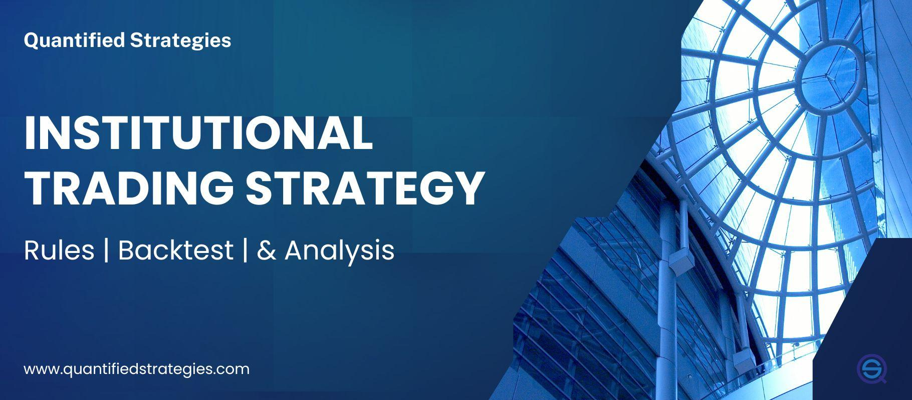

In the modern trading ecosystem, institutional trading within algorithmic trading has become increasingly prominent. Algorithmic trading, often referred to as algo trading, involves the use of sophisticated technological systems to execute intricate trading strategies with a high degree of precision and speed. These strategies are pre-programmed into complex algorithms that can assess multiple market variables in real-time and execute trade orders at optimal points, often much faster than human capabilities would allow.

The advantages offered by algorithmic trading systems include reduced transaction costs and minimized human error. By automating trading decisions, institutions can efficiently manage their extensive portfolios and swiftly capitalize on market opportunities. Moreover, these systems are capable of processing vast amounts of data and executing orders with speed and accuracy that is indispensable in today's fast-paced markets.



Institutional investors, like banks and hedge funds, leverage algorithmic trading to implement strategies that are finely tuned to market dynamics, often utilizing high-frequency trading, statistical arbitrage, and other sophisticated tactics. These approaches enable institutions to maintain a competitive edge over individual retail traders who may lack the infrastructure and resources to deploy similar strategies.

The integration of institutional trading strategies into algorithmic systems extends benefits such as improved liquidity, disciplined trading practices, and enhanced risk management. As a result, institutional algo trading has carved out a significant niche in modern financial markets, influencing the way assets are traded on a global scale.

## Table of Contents

## Understanding Institutional Trading

Institutional trading involves the active participation of large entities such as banks, hedge funds, and insurance companies in the buying and selling of financial assets. These institutions typically engage in substantial volumes of trading, a [factor](/wiki/factor-investing) that can considerably influence market dynamics due to the sheer size and frequency of their trades. As a result, institutional traders wield significant power in financial markets, often shaping price trends and liquidity.

One of the distinguishing features of institutional trading is the use of sophisticated strategies, which can be further enhanced through algorithmic systems. These strategies often involve complex decision-making processes that consider a multitude of variables such as market trends, economic indicators, and risk assessments. For example, institutions may use quantitative models to predict price movements or to perform statistical [arbitrage](/wiki/arbitrage). These models help in identifying small price discrepancies across different markets or securities that can be exploited for profit.

Algorithmic trading systems play a crucial role in the execution of these sophisticated strategies. By leveraging advanced technological tools, institutional traders can enhance their decision-making capabilities, allowing them to manage extensive portfolios with greater efficiency and accuracy. Algorithms can swiftly analyze large datasets to identify trading opportunities that may not be visible to human traders within the same timeframe. This capability is particularly important given the fast-paced nature of modern financial markets.

Furthermore, through [algorithmic trading](/wiki/algorithmic-trading), institutions can automate the execution of trades according to predefined criteria. This automation reduces the influence of human emotions and biases, leading to more consistent trading outcomes. Algorithms can also optimize order execution to minimize market impact, such as splitting large orders into smaller increments to avoid significant price movements.

The integration of algorithmic systems within institutional trading is not without its challenges, requiring continuous refinement and [backtesting](/wiki/backtesting) of strategies to adapt to changing market conditions. Moreover, institutions must consider various factors such as risk management, regulatory requirements, and the ethical implications of automated trading. Nonetheless, for institutions, the potential benefits of algorithmic trading systems in managing large portfolios and executing sophisticated strategies are substantial, highlighting their pivotal role in modern finance.

## The Rise of Algorithmic Trading in Institutions

Algorithmic trading has emerged as a pivotal technology in institutional trading, allowing institutions to automate trading by employing complex computer algorithms. These algorithms automatically execute trades by evaluating multiple predefined criteria such as timing, price, [volume](/wiki/volume-trading-strategy), and other market data. The use of algorithms enables a shift from manual to automated processes, which can enhance trading performance significantly.

Institutional adoption of algorithmic trading is partially driven by the desire to exploit market inefficiencies. These inefficiencies might arise from price differentials, temporal market discrepancies, or [liquidity](/wiki/liquidity-risk-premium) variations across different trading venues. By leveraging algorithmic systems, institutions can identify and act on such inefficiencies rapidly before they vanish, often executing transactions in milliseconds. This form of execution minimizes human error, as computers are not prone to the emotional factors or biases that can affect human traders.

Moreover, the demand for algorithmic trading systems arises from their capacity for speed, precision, and their ability to process and analyze vast amounts of data instantaneously. This capability is crucial in today’s high-frequency trading environment, where decisions need to be made within microseconds. Mathematical models underpin the operation of these algorithms, often using statistical and computational techniques to predict market behaviors, optimize trade execution, and manage risk.

For example, consider the implementation of a simple moving average crossover strategy, which triggers buy or sell signals based on the crossover of short-term and long-term moving averages. In Python, a basic version of such a strategy might look like this:

```python
import pandas as pd

def moving_average_crossover_strategy(data, short_window, long_window):
    data['Short_Moving_Avg'] = data['Close'].rolling(window=short_window).mean()
    data['Long_Moving_Avg'] = data['Close'].rolling(window=long_window).mean()

    data['Signal'] = 0
    data['Signal'][short_window:] = \
        (data['Short_Moving_Avg'][short_window:] > data['Long_Moving_Avg'][short_window:]).astype(int)

    data['Position'] = data['Signal'].diff()
    return data

# Sample usage:
# df = pd.read_csv('historical_data.csv')
# result = moving_average_crossover_strategy(df, short_window=40, long_window=100)
```

This example illustrates how algorithmic systems automate the decision-making process, reducing reliance on discretionary human intervention. The rise of algorithmic trading within institutions is not just an adaptation to technological advancements but also a strategic move to achieve superior trading outcomes in increasingly complex and competitive markets.

Overall, algorithmic trading has become integral to the toolkit of institutional investors, empowering them to achieve high efficiency and effectiveness in their trading operations. This transformation in institutional trading practices is likely to continue, driven by ongoing innovations and the relentless pursuit of speed and data-driven decision-making.

## Institutional Trading Strategies in Algo Trading

Institutional trading strategies in algorithmic trading are designed to leverage large-scale market insights and extensive computational capabilities to maximize returns and manage risks. One prevalent strategy is the exploitation of [global macro](/wiki/global-macro-strategy) trends, where algorithms analyze economic indicators, political events, and other macroeconomic factors to predict market movements. For example, trading strategies might consider central bank announcements, GDP growth rates, or geopolitical tensions, using this information to make informed trades across various asset classes.

Another common strategy is index rebalancing, which involves adjusting the holdings to align with a benchmark index. Institutions use algorithms to optimize the timing and size of trades to minimize transaction costs and mitigate market impact. For instance, when an index announces changes in its composition, algorithms can preemptively adjust the portfolio to accommodate these changes, ensuring alignment with the index’s performance.

Liquidity-seeking strategies are also vital for institutions dealing with large volumes of trades. These strategies aim to execute trades in a manner that minimizes market impact and trading costs. Algorithms identify pockets of liquidity, potentially using dark pools or non-displayed trading venues, to complete trades discreetly without causing significant price fluctuations.

Algorithmic systems enhance the efficacy of these strategies by managing risk and quickly adapting to market conditions. They employ complex models for risk assessment and utilize quantitative techniques to adjust portfolios dynamically. Backtesting is a crucial component of this process, allowing institutions to simulate trading strategies using historical data to evaluate performance. This iterative process of backtesting and strategy refinement helps institutions to continuously improve their algorithms.

A simplified Python code snippet for backtesting a strategy could look like this:

```python
import pandas as pd
import numpy as np

# Load historical data
data = pd.read_csv('historical_data.csv')

# Define the trading strategy
def trading_strategy(data):
    signals = pd.DataFrame(index=data.index)
    signals['signal'] = 0.0
    signals['price'] = data['Close']

    # Example: Moving Average Crossover Strategy
    signals['short_mavg'] = data['Close'].rolling(window=40, min_periods=1, center=False).mean()
    signals['long_mavg'] = data['Close'].rolling(window=100, min_periods=1, center=False).mean()

    signals['signal'][40:] = np.where(signals['short_mavg'][40:] > signals['long_mavg'][40:], 1.0, 0.0)
    signals['positions'] = signals['signal'].diff()

    return signals

# Backtest the strategy
signals = trading_strategy(data)
print(signals.head())
```

This code defines a simple moving average crossover strategy, where buy orders are triggered when a short-term moving average crosses above a long-term moving average. Such quantitative frameworks serve as a foundation upon which financial institutions build more sophisticated models, fine-tuning them to optimize returns while maintaining risk within acceptable parameters. Through strategic use of algorithmic trading, institutions can effectively capitalize on market opportunities, demonstrating the profound potential of integrative technology in finance.

## Impact of Institutional Trades on Markets

Institutional trades are instrumental in shaping market dynamics due to their considerable order sizes and sophisticated trading strategies. The significant volume of these trades can lead to substantial market movements, impacting prices and liquidity. When large orders are executed without strategic considerations, they can cause price slippage, where the execution price deviates from the intended one due to insufficient market depth.

Algorithmic trading is pivotal in mitigating the adverse market impacts associated with large institutional trades. By leveraging computational tools, institutions can break down a large order into smaller parts, executed over time or across various market venues, minimizing the market footprint. This approach, often described through algorithms like the Volume Weighted Average Price (VWAP) or Time Weighted Average Price (TWAP), allows for a more controlled and less disruptive market entry:

```python
import numpy as np

def vwap(prices, volumes):
    return np.sum(prices * volumes) / np.sum(volumes)

# Example usage
prices = np.array([100, 101, 102, 99])
volumes = np.array([200, 150, 300, 250])

weighted_avg = vwap(prices, volumes)
print("VWAP:", weighted_avg)
```

Additionally, institutional traders frequently employ dark pools, which are private exchanges that offer anonymity and facilitate larger trades without significant market disruption. Trading in these venues can decrease the visibility of large transactions, thus reducing the likelihood of unfavorable price movements caused by information leakage.

Understanding the market impact is crucial for the effective design and execution of institutional algorithmic trading strategies. By comprehensively analyzing the potential effects of trades before execution, institutions can develop systems that optimize trade efficiency and cost-effectiveness. This involves continuously refining algorithmic approaches to adapt to market conditions, considering factors like liquidity, [volatility](/wiki/volatility-trading-strategies), and current market participants' behaviors.

In essence, the market impact of institutional trades necessitates an advanced understanding of financial markets and the judicious application of technology. By employing innovative strategies and leveraging available technological tools, institutions aim to achieve minimal market disruption while fulfilling their extensive trading mandates.

## Challenges and Considerations

Institutional algorithmic trading presents significant challenges, primarily stemming from the reliance on technology. This dependency can lead to operational risks, such as system failures or glitches, which may result in substantial financial losses. To mitigate these risks, institutions must implement robust risk management strategies, including diversification and systematic trade execution. Diversification involves spreading investments across various assets to reduce exposure to any single asset, thereby minimizing potential losses. Systematic trade execution ensures that trades are conducted in a controlled manner, adhering to predefined parameters that help manage volatility and enhance decision-making accuracy.

Additionally, regulatory constraints pose a considerable challenge for institutional algo traders. Institutions must navigate a complex web of regulatory requirements that govern market conduct, transparency, and financial reporting. Compliance with these regulations is crucial to avoid legal repercussions and maintain market integrity. This involves a thorough understanding of regional and international regulatory frameworks and implementing systems to monitor and report trading activities accurately.

Ethical considerations also form a critical part of institutional algorithmic trading. Institutions are tasked with ensuring that their trading practices do not manipulate markets or create unfair advantages. Ethical trading practices are essential to maintaining trust with stakeholders and preserving the institution's reputation. This requires ongoing assessment of algorithms to prevent unintended market impacts and careful consideration of the ethical implications of trading strategies.

Overall, institutions engaged in algorithmic trading must balance the pursuit of technological advancement with adherence to risk management protocols, regulatory compliance, and ethical standards. These considerations are vital to sustaining long-term success and minimizing the challenges inherent in the dynamic landscape of institutional algorithmic trading.

## Future of Institutional Algorithmic Trading

As technology continues its rapid progression, the field of institutional algorithmic trading stands on the brink of transformative changes. One of the most significant anticipated trends is the integration of [artificial intelligence](/wiki/ai-artificial-intelligence) (AI) and [machine learning](/wiki/machine-learning) into trading strategies. These technologies offer the capability to analyze vast datasets with unprecedented speed and accuracy, thus providing insights that are not discernible through traditional methods.

AI-driven algorithms can learn from historical data to detect patterns and generate predictive models, thereby enhancing decision-making processes. Machine learning's ability to adapt to new data and refine its models ensures that trading strategies remain robust and effective in volatile markets. Techniques such as [reinforcement learning](/wiki/reinforcement-learning) and [deep learning](/wiki/deep-learning) are particularly promising. Reinforcement learning optimizes strategies through trial and error, allowing algorithms to make decisions that maximize returns. Deep learning, with its capacity to process complex and unstructured data, could revolutionize the manner in which market trends and anomalies are detected.

Python, a language known for its extensive libraries and ease of use, plays a crucial role in developing these AI models. Libraries such as TensorFlow and PyTorch facilitate the design and implementation of sophisticated neural networks. A basic Python script employing machine learning for algorithmic trading might look like this:

```python
import numpy as np
from sklearn.ensemble import RandomForestRegressor

# Assume historical_data is a NumPy array with market features
features = historical_data[:, :-1]  # All columns except the last
target = historical_data[:, -1]  # Last column

model = RandomForestRegressor(n_estimators=100)
model.fit(features, target)

# Future data to predict
future_data = np.array([[...]])
predicted_return = model.predict(future_data)
```

Institutions are increasingly focusing on innovations in algorithmic trading, seeking a competitive edge. High-frequency trading, which relies on high-speed data and low-latency execution, benefits greatly from AI, allowing for the exploitation of minute market inefficiencies. Quantum computing, while still in its infancy, has the potential to further enhance data processing speeds and risk assessment capabilities. Moreover, enhanced natural language processing (NLP) algorithms are being developed to analyze news and social media sentiment, providing an additional layer of market insight.

These advancements, however, are accompanied by challenges such as increased regulatory scrutiny and ethical concerns, urging institutions to develop robust compliance frameworks alongside technological innovations. As algorithmic abilities advance, the trading landscape will likely witness significant shifts, with institutions that effectively harness these technologies gaining a decisive advantage in global financial markets.

## Conclusion

Institutional trading within algorithmic trading is an area where technology and finance converge, offering significant advantages through speed and precision in executing large-scale trading strategies. These benefits, however, are not without challenges. The reliance on sophisticated algorithms and technology necessitates robust risk management frameworks to mitigate potential technological failures or system disruptions. Additionally, the integration of vast, complex data sets requires ongoing strategic planning and adaptation to ensure trading algorithms remain effective in the face of evolving market conditions.

Continuous advancements in the field of algorithmic trading present both opportunities and challenges. As technology evolves, institutions are poised to leverage even more complex algorithms, integrating artificial intelligence and machine learning to enhance predictive capabilities and improve decision-making processes. Despite the potential for innovation, institutions must navigate regulatory and ethical considerations, ensuring that their trading practices align with legal frameworks and promote market stability.

Looking forward, institutional algorithmic trading is expected to augment its vital role in global financial markets. As more institutions adopt advanced technologies, fluidity and efficiency in markets may increase, potentially reducing transaction costs and improving market access for all participants. However, with this increased market activity comes the responsibility to manage systemic risks and maintain fair trading environments. The trajectory of institutional algorithmic trading will likely be marked by a balance between leveraging technological advancements and strategically addressing the accompanying risks and regulatory complexities.

## References & Further Reading

[1]: Bergstra, J., Bardenet, R., Bengio, Y., & Kégl, B. (2011). ["Algorithms for Hyper-Parameter Optimization."](https://papers.nips.cc/paper/4443-algorithms-for-hyper-parameter-optimization) Advances in Neural Information Processing Systems 24.

[2]: ["Advances in Financial Machine Learning"](https://www.amazon.com/Advances-Financial-Machine-Learning-Marcos/dp/1119482089) by Marcos Lopez de Prado

[3]: ["Evidence-Based Technical Analysis: Applying the Scientific Method and Statistical Inference to Trading Signals"](https://www.amazon.com/Evidence-Based-Technical-Analysis-Scientific-Statistical/dp/0470008741) by David Aronson

[4]: ["Machine Learning for Algorithmic Trading"](https://github.com/stefan-jansen/machine-learning-for-trading) by Stefan Jansen

[5]: ["Quantitative Trading: How to Build Your Own Algorithmic Trading Business"](https://books.google.com/books/about/Quantitative_Trading.html?id=j70yEAAAQBAJ) by Ernest P. Chan

[6]: Aldridge, Irene. (2013). ["High-Frequency Trading: A Practical Guide to Algorithmic Strategies and Trading Systems."](https://books.google.com/books/about/High_Frequency_Trading.html?id=8QpIsVUMhmEC) John Wiley & Sons.

[7]: Kissell, R., & Glantz, M. (2003). ["Optimal Trading Strategies: Quantitative Approaches for Managing Market Impact and Trading Risk."](https://www.semanticscholar.org/paper/Optimal-Trading-Strategies%3A-Quantitative-Approaches-Kissell-Glantz/0552eba9819c8b3091684cbe8c94fc68724e739e) AMACOM.

[8]: Cartea, Á., Jaimungal, S., & Penalva, J. (2015). ["Algorithmic and High-Frequency Trading."](https://assets.cambridge.org/97811070/91146/frontmatter/9781107091146_frontmatter.pdf) Cambridge University Press.