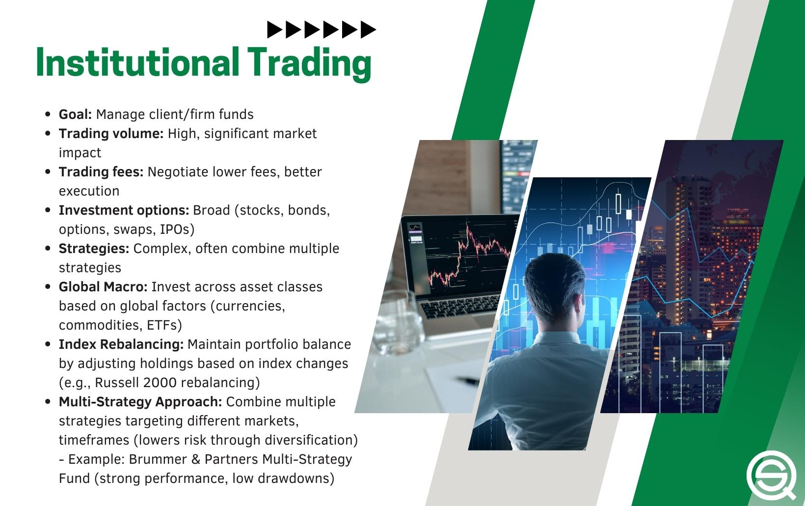

Algorithmic trading, commonly known as algo trading, represents a significant shift in the financial trading landscape. Unlike the traditional manual trading processes, algo trading leverages sophisticated computer programs and algorithms to execute trades at speeds and volumes humans cannot match. These algorithms are designed based on preset conditions that dictate optimal trading moments, enabling execution with precision and efficiency.

Trading institutions such as banks, hedge funds, and proprietary trading firms have become pivotal participants in algo trading. Due to their massive trading volumes and access to advanced technological infrastructure, these entities play a critical role in shaping the algo trading environment. The integration of complex algorithms allows these institutions to execute a multitude of trades within milliseconds, harnessing their technological edge to potentially gain market advantages.



This exploration highlights the substantial impacts trading institutions have on algo trading practices. Delving into their strategic approaches, it is clear these organizations employ varied algorithms to enhance trade execution, mitigate risks, and capitalize on market opportunities. While the advantages of algo trading, such as speed and reduced errors, are significant, the challenges, including technology dependency and market volatility, are equally pronounced and must be navigated thoughtfully. The following sections of this article will examine these factors to provide a comprehensive understanding of the relationship between trading institutions and algorithmic trading.

## Table of Contents

## Role of Trading Institutions in Algo Trading

Trading institutions such as hedge funds, banks, and proprietary trading firms are pivotal in the framework of algorithmic trading. These institutions leverage their substantial resources to develop sophisticated algorithms capable of executing large volumes of trades within fractions of a second. This capability is primarily facilitated by high-frequency trading (HFT), a subset of algorithmic trading, which relies on powerful computational systems and advanced algorithms to capitalize on minuscule price discrepancies across markets.

Institutions deploy complex algorithms that enable them to make rapid trading decisions, often within milliseconds. This speed is achieved through the deployment of high-frequency trading strategies, which are designed to exploit inefficiencies in the market before they are corrected by slower market participants. The substantial investment in technology infrastructure—including co-location services, where trading systems are housed close to exchange servers to minimize latency—underscores the importance these institutions place on speed.

Additionally, trading institutions have the advantage of accessing exotic financial instruments that are often unavailable to individual retail traders. These instruments include derivatives, such as options and futures, allowing institutions to create more diverse and sophisticated trading strategies to hedge risks or speculate on market movements. The ability to trade such instruments at scale provides a strategic advantage, enabling institutions to tailor their risk exposures and liquidity needs more precisely.

Moreover, institutions benefit from reduced transaction costs due to their high trading volumes, which often allow them to negotiate lower fees with exchanges or brokerage services. This economy of scale in transaction costs contributes to improved market [liquidity](/wiki/liquidity-risk-premium), which, in turn, can lead to tighter bid-ask spreads and more efficient price discovery in the markets they engage with.

In summary, the role of trading institutions in [algorithmic trading](/wiki/algorithmic-trading) is marked by the use of advanced technology to execute trades rapidly and efficiently. Their access to various financial tools and reduced costs not only enhances their trading performance but also contributes positively to market liquidity, providing a more dynamic and efficient trading environment.

## Types of Algorithms Used by Institutions

Institutions use a diverse set of algorithms to address specific trading objectives and market conditions. These algorithms are generally categorized into execution algorithms, profit-seeking algorithms, and high-frequency trading algorithms. 

**Execution Algorithms**

Execution algorithms are designed to optimize the timing and pricing of trade executions, crucial for minimizing market impact and transaction costs. They ensure that large orders are broken down into smaller segments to be executed over a period to avoid disrupting the market. Common types of execution algorithms include:

1. **VWAP (Volume-Weighted Average Price)**: This algorithm splits a large order into several small orders, aiming to execute them at the average price over the trading period. The goal is to achieve an average price close to the VWAP, thereby reducing the market impact. The VWAP is calculated using the formula:
$$
   \text{VWAP} = \frac{\sum (\text{Price}_i \times \text{Volume}_i)}{\sum \text{Volume}_i}

$$

2. **TWAP (Time-Weighted Average Price)**: This strategy divides an order into fractions that are executed evenly over a specified time period. It is mainly used for large trades to minimize market influence by ensuring participation at intervals irrespective of market conditions.

3. **POV (Percentage of Volume)**: This involves trading a specified percentage of the market volume until the order is completely executed. It adjusts the execution speed based on the traded volume of the asset in the market during a given period.

**Profit-Seeking (Black-Box) Algorithms**

Profit-seeking algorithms aim to maximize returns by leveraging automated decision-making processes. Such algorithms analyze vast amounts of data to identify trading opportunities often imperceptible through manual analysis. Features of these algorithms include:

1. **Statistical Arbitrage**: These models identify profit opportunities from the relative price movements of correlated securities. By exploiting statistical discrepancies, they seek to profit from the convergence or divergence of stock prices. A typical approach involves pairs trading, where two statistically correlated stocks are traded in opposite directions based on temporary divergences.

2. **Machine Learning Models**: Utilizing advanced data analysis techniques, these models predict future price movements based on historical data, news sentiment, or economic indicators. They adapt to new information patterns, improving decision-making over time. Python is often used for building and deploying such models. For instance:

   ```python
   from sklearn.ensemble import RandomForestRegressor
   import numpy as np

   # Historical data
   X = np.array([[1, 2], [2, 3], [3, 4]])
   y = np.array([0.1, 0.2, 0.3])

   # Building a Random Forest model
   model = RandomForestRegressor(n_estimators=100)
   model.fit(X, y)

   # Predicting future price movement
   future_data = np.array([[4, 5]])
   prediction = model.predict(future_data)
   ```

**High-Frequency Trading Algorithms**

High-frequency trading ([HFT](/wiki/high-frequency-trading-strategies)) algorithms are built to capitalize on minimal price discrepancies across multiple markets or order [books](/wiki/algo-trading-books), typically executing hundreds of trades in a second. The minimal holding periods and fast order execution require robust infrastructure and direct market access to ensure latency advantages. Key attributes of these algorithms involve:

1. **Latency Arbitrage**: These algorithms exploit tiny price differentials between exchanges caused by latency. Ensuring minimal delay in order execution involves co-locating servers near exchange hosts, granting a time advantage over competitors.

2. **Momentum-Based Trading**: Leveraging immediate market reactions, these strategies trade based on short-lived trends or patterns. Algorithms detect trend setups and execute trades swiftly before the pattern dissipates.

These algorithm types highlight the intricate blend of technological sophistication and strategic acumen that institutions employ in algorithmic trading, adjusting and refining their strategies to align with market dynamics.

## Advantages of Institutional Algo Trading

Institutional algorithmic trading offers several advantages that significantly enhance the efficacy and performance of trading activities. One of the primary benefits is the accelerated execution of trades. By utilizing high-speed algorithms, trading institutions can process transactions far quicker than traditional manual methods, often executing trades in milliseconds. This speed is critical for capturing favorable market trends and capitalizing on transient pricing discrepancies, as algorithms can swiftly analyze vast data sets to identify optimal trading opportunities.

Moreover, the implementation of algorithmic trading leads to improved efficiency by automating repetitive and time-consuming tasks. This automation not only reduces the likelihood of human errors but also enables traders to focus on strategy development and other high-level decision-making processes. For example, algorithms can be designed to execute specific strategies, such as statistical [arbitrage](/wiki/arbitrage), where profits are derived from price differentials caused by inefficiencies in the market.

The anonymity provided by algorithmic trading is another significant advantage for institutions. Traditional trading can often lead to information leakage, where the intentions or actions of a trader are revealed to the market. This can adversely affect the trade's outcome as other market participants may react to this information. Algorithms, on the other hand, can execute trades in a fragmented manner, distributing orders across multiple venues and reducing the likelihood of detection. This anonymity helps mitigate risks associated with information spillover and potential market impacts.

Furthermore, institutional algorithmic trading can lead to reduced transaction costs. Algorithms can be programmed to optimize the trade execution process, ensuring that trades are conducted under the most favorable conditions. This optimization includes weighing various factors such as timing, order size, and venue selection to minimize costs and maximize returns.

In summary, faster execution, improved efficiency, enhanced anonymity, and lower transaction costs are core advantages that make algorithmic trading an integral part of modern institutional trading strategies. These benefits enable trading institutions to maintain a competitive edge while navigating the dynamic and complex financial markets.

## Challenges Facing Institutional Algo Trading

High-frequency trading (HFT) algorithms are a cornerstone of modern institutional algo trading, but they bring with them a set of challenges that can impact the financial markets significantly. One key issue is market [volatility](/wiki/volatility-trading-strategies). The speed and [volume](/wiki/volume-trading-strategy) with which HFT algorithms operate can lead to rapid price changes. This was exemplified in events such as the "flash crash" of May 6, 2010, where the Dow Jones Industrial Average plunged about 1,000 points within minutes before quickly rebounding. Such events highlight the risks posed by automated trading systems, where massive buy or sell orders can drastically influence market prices.

Another challenge facing institutional algo trading is the dependency on technology. Advanced algorithms require robust infrastructure to function effectively. System failures, software bugs, or connectivity issues can halt trading operations or lead to incorrect trade executions, subsequently causing substantial financial losses. For example, Knight Capital Group incurred a loss of approximately $440 million in 2012 due to a software error that led to errant trades.

Black-box algorithms add another layer of complexity. These algorithms, often centered around proprietary models, operate without transparency, making it difficult for even their developers to fully understand their decision-making processes. This opacity poses significant challenges for regulators tasked with ensuring market stability and fairness. The lack of transparency can hinder the ability of institutions to audit and modify their own algorithms, possibly leading to unintended behaviors in volatile markets.

The combination of high-frequency operations, technological reliance, and opaque systems requires continuous scrutiny and refinement. Solutions to mitigate these challenges might include stricter regulatory oversight, improved algorithmic transparency, and the development of failsafe mechanisms to protect against technological failures.

## Impact on Retail Traders

As algorithmic trading has become a dominant force in financial markets, retail traders find themselves navigating a landscape that is increasingly shaped by advanced technologies and powerful institutions. Institutional traders possess a significant technological edge, with access to high-speed execution, sophisticated algorithms, and comprehensive market data. These advantages allow them to enter and [exit](/wiki/exit-strategy) positions with precision, often capitalizing on minuscule price movements that occur in fractions of a second.

Retail traders, on the other hand, frequently encounter challenges due to this technological disparity. One primary issue is increased market volatility, a byproduct of high-frequency trading (HFT) algorithms used by institutional players. Such algorithms can amplify price swings in the market, creating an environment where prices may fluctuate rapidly and unpredictably. This volatility can be particularly detrimental to retail traders who may not have the tools or strategies to manage abrupt market changes effectively.

Additionally, institutional algo trading often leads to reduced market transparency. Large players utilizing dark pools and proprietary algorithms can obscure market activities, making it difficult for retail traders to discern true market intentions or price signals. This lack of transparency adds a layer of complexity for retail traders striving to make informed decisions based on visible market data.

Despite these challenges, the rise of open-source trading platforms and collaborative community efforts has started to level the playing field. Platforms such as QuantConnect and MetaTrader provide retail traders with access to algorithmic trading capabilities, allowing them to develop, back-test, and implement trading strategies without the need for significant financial investment in technology infrastructure. Furthermore, online communities and educational resources have proliferated, offering retail traders the knowledge and tools necessary to create and refine their own trading algorithms.

Python, a popular language in algorithmic trading, offers various libraries such as pandas for data manipulation, NumPy for numerical calculations, and libraries like Backtrader or PyAlgoTrade for [backtesting](/wiki/backtesting) trading strategies. Below is a simple example of a moving average crossover strategy using Python's backtesting library:

```python
import backtrader as bt

class MovingAverageStrategy(bt.SignalStrategy):
    def __init__(self):
        # Add a moving average crossover signal
        self.signal_add(bt.SIGNAL_LONG, self.data.close > self.data.close(-1))
        self.signal_add(bt.SIGNAL_SHORT, self.data.close < self.data.close(-1))

# Initialize the backtest framework
cerebro = bt.Cerebro()

# Create a data feed
data = bt.feeds.YahooFinanceData(dataname='AAPL', fromdate=datetime(2021, 1, 1), todate=datetime(2021, 12, 31))

# Add data feed to Cerebro
cerebro.adddata(data)

# Add the strategy
cerebro.addstrategy(MovingAverageStrategy)

# Run the backtest
cerebro.run()

# Plot the results
cerebro.plot()
```

This code snippet demonstrates how retail traders can utilize open-source libraries to develop trading strategies and test their effectiveness over historical data. Through continuous learning and adaptation, retail traders can leverage these tools to attempt to mitigate the gap between themselves and institutional players, although challenges remain in the ever-evolving world of algo trading.

## Future Prospects for Institutional Algo Trading

Advancements in [artificial intelligence](/wiki/ai-artificial-intelligence) (AI) and [machine learning](/wiki/machine-learning) (ML) are poised to significantly enhance the capabilities of institutional algorithmic trading. Neural networks, [reinforcement learning](/wiki/reinforcement-learning), and natural language processing are among the technologies that can be harnessed to develop more adaptive and efficient trading algorithms. For instance, AI can analyze vast datasets to identify complex patterns that may not be evident through traditional statistical methods. This allows for the development of algorithms that can anticipate market movements with greater accuracy.

Regulatory bodies are becoming increasingly vigilant in their oversight of algorithmic trading to ensure market stability and fairness. The high-speed nature of algo trading, particularly high-frequency trading (HFT), can exacerbate market volatility, prompting regulatory concerns. Institutions are required to comply with stringent guidelines to mitigate risks associated with flash crashes and market manipulation. Initiatives such as the Markets in Financial Instruments Directive II (MiFID II) in the European Union and the Consolidated Audit Trail (CAT) in the United States exemplify efforts to monitor and regulate trading activities more effectively.

Fintech innovations are playing a critical role in democratizing access to algorithmic trading techniques. By developing more accessible tools and platforms, fintech companies are narrowing the technological gap between institutional and retail traders. Application programming interfaces (APIs), cloud-based services, and user-friendly trading platforms enable retail traders to employ sophisticated trading strategies akin to those used by large institutions. Additionally, the proliferation of open-source algorithmic trading libraries and frameworks further empowers retail traders to build and deploy custom trading algorithms with relative ease.

The integration of AI in trading algorithms, reinforced by regulatory scrutiny and fintech solutions, heralds a transformative period for institutional algo trading. The continuous evolution of these technologies and regulatory measures aims to sustain market integrity while expanding participation in algorithmic trading across different trader segments.

## Conclusion

Trading institutions have effectively leveraged algorithmic trading to augment their market strategies, allowing them to execute trades with speed and precision that manual processes cannot match. This paradigm shift enhances market efficiency by enabling institutions to respond to market signals and trends with remarkable swiftness, thereby optimizing their profitability. With algorithms capable of analyzing vast datasets and predicting price movements, institutions can execute complex trading strategies at a scale and speed previously unattainable.

However, the advantages of algo trading do not come without significant challenges. Regulatory compliance is a pressing concern, as the rapid execution speed and complexity of algorithms can obscure transparency and accountability. Regulators are continually updating frameworks to ensure that these trading activities do not destabilize markets or unfairly disadvantage other market participants. Market stability is another critical issue, as high-frequency trading algorithms can exacerbate market fluctuations, leading to events such as 'flash crashes' which cause market disruption and loss of confidence amongst investors.

Ethical considerations also arise from the use of sophisticated algorithms, particularly those that exploit minor discrepancies in price for profit, potentially leading to unfair practices or an uneven playing field. Ethical trading and the responsibility of institutions to maintain fairness are key areas that need to be continually addressed.

Both institutional and retail traders must navigate these challenges to succeed in the dynamically evolving landscape of algorithmic trading. Institutional traders wield an advantage through access to advanced technologies and capital, but retail traders are increasingly finding opportunities through open-source platforms and advanced fintech solutions. As technology advances, the gap may narrow, offering more equitable opportunities for retail traders.

In conclusion, while algorithmic trading presents substantial benefits in terms of efficiency and profitability, the associated challenges require careful consideration and management. By implementing robust regulatory frameworks and maintaining ethical standards, both institutions and retail investors can capitalize on the advantages of algorithmic trading while promoting a stable and fair trading environment. The future prospects for algorithmic trading are promising, with technological advancements anticipated to further refine strategies and broaden access across the trading community.

## References & Further Reading

[1]: Bergstra, J., Bardenet, R., Bengio, Y., & Kégl, B. (2011). ["Algorithms for Hyper-Parameter Optimization."](https://papers.nips.cc/paper/4443-algorithms-for-hyper-parameter-optimization) Advances in Neural Information Processing Systems 24.

[2]: ["Advances in Financial Machine Learning"](https://www.amazon.com/Advances-Financial-Machine-Learning-Marcos/dp/1119482089) by Marcos Lopez de Prado

[3]: ["Evidence-Based Technical Analysis: Applying the Scientific Method and Statistical Inference to Trading Signals"](https://www.amazon.com/Evidence-Based-Technical-Analysis-Scientific-Statistical/dp/0470008741) by David Aronson

[4]: ["Machine Learning for Algorithmic Trading"](https://github.com/stefan-jansen/machine-learning-for-trading) by Stefan Jansen

[5]: ["Quantitative Trading: How to Build Your Own Algorithmic Trading Business"](https://books.google.com/books/about/Quantitative_Trading.html?id=j70yEAAAQBAJ) by Ernest P. Chan