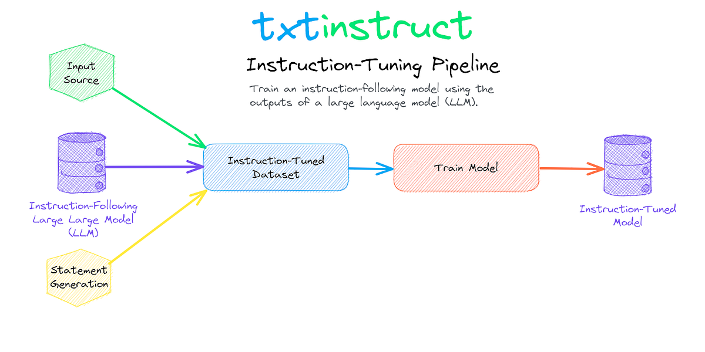

## Table of Contents

## What is Instruction Tuning in machine learning?

Instruction tuning is a way to make machine learning models better at following specific instructions. It's like teaching a student to not just learn facts, but also how to use those facts to do what you ask. In machine learning, we do this by showing the model many examples of instructions and the right answers to those instructions. This helps the model understand what we want it to do when we give it a new instruction.

For example, if we want a model to summarize news articles, we would show it lots of articles and their summaries. The model learns from these examples and gets better at summarizing new articles. This method is useful because it helps models do exactly what we need them to do, making them more helpful and accurate in real-world situations.

## How does Instruction Tuning differ from traditional model training?

Instruction tuning is different from traditional model training because it focuses on teaching the model to follow specific instructions, rather than just learning from data. In traditional training, a model might learn to recognize patterns in data, like identifying cats in pictures. But with instruction tuning, we show the model examples of instructions and the correct responses to those instructions. This helps the model understand not just the data, but also how to use that data to do what we ask.

For example, if we want a model to answer questions about history, traditional training might involve feeding it lots of history texts. The model would learn about history, but it might not be good at answering specific questions. With instruction tuning, we would show the model questions about history and the correct answers to those questions. This way, the model learns to use its knowledge of history to answer questions accurately. This makes the model more useful because it can do exactly what we need it to do.

## What are the main benefits of using Instruction Tuning?

Instruction tuning helps make [machine learning](/wiki/machine-learning) models better at doing what we ask them to do. When we use instruction tuning, we show the model lots of examples of instructions and the right answers to those instructions. This helps the model understand what we want it to do when we give it a new instruction. For example, if we want a model to summarize news articles, we show it many articles and their summaries. The model learns from these examples and gets better at summarizing new articles. This makes the model more useful because it can do exactly what we need it to do.

Another big benefit of instruction tuning is that it makes models more accurate and helpful in real-world situations. Traditional training might teach a model to recognize patterns in data, but it might not be good at following specific instructions. Instruction tuning bridges this gap by training the model on how to use its knowledge to answer questions or perform tasks correctly. For instance, if we want a model to answer questions about history, we show it questions and the correct answers. This way, the model learns to use its history knowledge to answer questions accurately. This makes the model more reliable and useful in practical applications.

## Can you explain the process of Instruction Tuning?

Instruction tuning is a way to make machine learning models better at following specific instructions. It's like teaching a student not just facts, but also how to use those facts to do what you ask. We start by showing the model many examples of instructions and the right answers to those instructions. For example, if we want the model to summarize news articles, we show it lots of articles and their summaries. The model looks at these examples and learns to do the same thing when it sees a new instruction.

As the model sees more examples, it gets better at understanding what we want it to do. This is because the model is not just learning from data, but also learning how to use that data to follow instructions. For instance, if we want the model to answer questions about history, we show it questions and the correct answers. The model learns from these examples and becomes good at using its history knowledge to answer new questions. This makes the model more useful because it can do exactly what we need it to do in real-world situations.

## What types of models are typically used for Instruction Tuning?

Instruction tuning is often used with large language models, like those based on transformer architectures. These models are good at understanding and generating text, which makes them perfect for learning from examples of instructions and their correct answers. For example, models like BERT, GPT, and T5 are commonly used because they can handle a lot of different types of instructions and learn from them effectively.

These models are trained on huge amounts of text data first, which helps them understand language. Then, during instruction tuning, we show them specific examples of instructions and the right responses. This extra training helps the models get better at doing exactly what we ask them to do. For instance, if we want the model to summarize news articles, we show it many articles and their summaries, and the model learns to do the same with new articles.

## How do you collect and prepare data for Instruction Tuning?

To collect data for instruction tuning, you first need to gather examples of instructions and their correct answers. These examples can come from many places, like [books](/wiki/algo-trading-books), websites, or even made-up scenarios. For example, if you want the model to summarize news articles, you would collect a lot of news articles and their summaries. You might also need to create some examples yourself, especially for specific tasks that don't have many existing examples. The key is to have a diverse set of examples so the model can learn from different types of instructions.

Once you have collected the data, you need to prepare it for the model. This means organizing the instructions and answers into a format that the model can understand. You might need to clean up the text, making sure it's clear and free of errors. Then, you pair each instruction with its correct answer and put them into a dataset. This dataset is what you use to train the model, showing it many examples of instructions and their answers so it can learn to do the same with new instructions.

## What are common challenges faced during Instruction Tuning?

One common challenge in instruction tuning is getting enough good examples. You need a lot of different instructions and their correct answers to teach the model well. Sometimes, it's hard to find these examples, especially for specific tasks. You might have to make up some examples yourself, which can be time-consuming and might not cover all the situations the model will face in the real world.

Another challenge is making sure the model understands the instructions correctly. Sometimes, the model might get confused if the instructions are not clear or if the answers are not always the same. For example, if you're teaching the model to summarize news articles, different people might write different summaries for the same article. This can make it hard for the model to learn what the right answer is. You have to be careful to give the model clear and consistent examples so it can learn properly.

## How can Instruction Tuning improve model performance on specific tasks?

Instruction tuning helps make machine learning models better at doing specific tasks by showing them lots of examples of instructions and the right answers. For example, if you want a model to summarize news articles, you show it many articles and their summaries. The model learns from these examples and gets better at summarizing new articles. This way, the model can do exactly what you need it to do, making it more useful in real-world situations.

Another way instruction tuning improves model performance is by making the model more accurate and helpful. Traditional training might teach a model to recognize patterns in data, but it might not be good at following specific instructions. Instruction tuning bridges this gap by training the model on how to use its knowledge to answer questions or perform tasks correctly. For instance, if you want a model to answer questions about history, you show it questions and the correct answers. This way, the model learns to use its history knowledge to answer questions accurately, making it more reliable and useful in practical applications.

## What metrics are used to evaluate the effectiveness of Instruction Tuning?

To evaluate how well instruction tuning works, we use different metrics that show how good the model is at following instructions. One common metric is accuracy, which measures how often the model gives the right answer to an instruction. For example, if we ask the model to summarize news articles, we check how many times its summaries match the correct ones. Another important metric is the F1 score, which looks at both how many correct answers the model gives and how many it misses. The F1 score is useful because it gives a balanced view of the model's performance.

Another metric we use is BLEU (Bilingual Evaluation Understudy) score, which is often used to check how well a model can generate text that matches a reference text. For instance, if the model is supposed to translate sentences, the BLEU score tells us how close its translations are to human translations. We also look at human evaluations, where people check the model's answers to see if they make sense and are helpful. These metrics together help us understand if instruction tuning is making the model better at doing what we ask it to do.

## How does Instruction Tuning integrate with other machine learning techniques?

Instruction tuning works well with other machine learning techniques because it helps make models better at following specific instructions. For example, after a model is trained using traditional methods like supervised learning, where it learns from lots of data, instruction tuning can be added to teach the model how to use that data to answer questions or perform tasks correctly. This is like adding a special class to a student's education, where they learn not just facts but how to use those facts to do what you ask. By combining instruction tuning with other techniques, the model becomes more useful and accurate in real-world situations.

Another way instruction tuning integrates with other techniques is through transfer learning. In transfer learning, a model that has been trained on one task can be used as a starting point for another task. Instruction tuning can be applied to this pre-trained model to fine-tune it for the new task. For example, a model trained on general language understanding can be further tuned with instruction tuning to answer specific types of questions, like those about history or science. This makes the model more versatile and effective, as it can use its existing knowledge in new and helpful ways.

## What are the latest advancements in Instruction Tuning research?

Recent advancements in instruction tuning research have focused on making models better at understanding and following complex instructions. One exciting development is the use of multi-task learning, where models are trained on many different tasks at the same time. This helps the model learn to handle a wide variety of instructions more effectively. Researchers have also been working on improving the quality of the data used for instruction tuning. They use techniques like [data augmentation](/wiki/data-augmentation), where they create more examples by changing existing ones slightly. This makes the model more robust and able to handle different ways of asking the same thing.

Another important advancement is the development of better evaluation methods. Researchers are using more detailed metrics to see how well models follow instructions. For example, they use human evaluations where people check if the model's answers are helpful and make sense. They also use automated metrics like the BLEU score to measure how close the model's answers are to the correct ones. These new methods help researchers understand what the model is doing well and where it needs to improve. Overall, these advancements are making instruction tuning more effective and helping models become more useful in real-world situations.

## Can you discuss case studies where Instruction Tuning significantly impacted model outcomes?

One case study where instruction tuning made a big difference is in the field of customer service chatbots. A company wanted to improve its chatbot to handle customer questions better. They used instruction tuning to show the chatbot lots of examples of customer questions and the right answers. After instruction tuning, the chatbot was much better at understanding and answering customer questions accurately. It could even handle tricky questions that it used to struggle with. This made customers happier because they got quick and correct answers to their questions.

Another example is in the area of educational tools. Researchers wanted to create a model that could help students with math problems. They used instruction tuning to train the model on math questions and their step-by-step solutions. After instruction tuning, the model was able to not only solve math problems but also explain the steps in a way that was easy for students to understand. This helped students learn better because they could see how to solve problems and get help when they were stuck. The model became a valuable tool in the classroom, making math education more effective.

## References & Further Reading

[1]: Sanh, V., Webson, A., Raffel, C., Bach, S. H., Sutawika, L., Alyafeai, Z., ... & Wolf, T. (2021). ["Multitask Prompted Training Enables Zero-Shot Task Generalization."](https://arxiv.org/abs/2110.08207) arXiv preprint arXiv:2110.08207.

[2]: Raffel, C., Shazeer, N., Roberts, A., Lee, K., Narang, S., Matena, M., ... & Liu, P. J. (2020). ["Exploring the Limits of Transfer Learning with a Unified Text-to-Text Transformer."](https://arxiv.org/abs/1910.10683) Journal of Machine Learning Research, 21(140), 1-67.

[3]: Wei, J., Wang, X., Schuurmans, D., Bosma, M., Ichter, B., Xia, F., ... & Le, Q. V. (2022). ["Chain of Thought Prompting Elicits Reasoning in Large Language Models."](https://arxiv.org/abs/2201.11903) arXiv preprint arXiv:2201.11903.

[4]: Brown, T. B., Mann, B., Ryder, N., Subbiah, M., Kaplan, J., Dhariwal, P., ... & Amodei, D. (2020). ["Language Models are Few-Shot Learners."](https://arxiv.org/abs/2005.14165) arXiv preprint arXiv:2005.14165.

[5]: Vaswani, A., Shazeer, N., Parmar, N., Uszkoreit, J., Jones, L., Gomez, A. N., ... & Polosukhin, I. (2017). ["Attention is All You Need."](https://arxiv.org/abs/1706.03762) Advances in Neural Information Processing Systems, 30, 5998-6008.