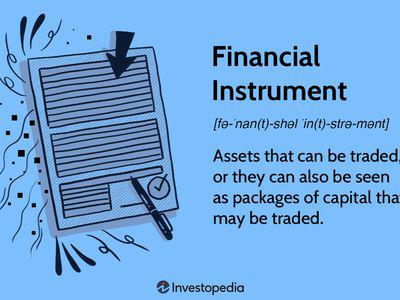

Algorithmic trading, often referred to as algo trading, is the use of pre-programmed trading instructions to execute orders in financial markets at high speeds and frequencies that a human trader could not achieve. This type of trading harnesses the capabilities of complex mathematical models and algorithms to make trading decisions, allowing for rapid responses to market conditions, which has become a cornerstone in modern financial markets. Algo trading is not only significant for its role in improving market efficiency and liquidity but also in its capability to execute intricate and sophisticated trading strategies with precision.

The integration of economics, finance, legal instruments, and technology into algorithmic trading showcases the complexity and multidisciplinary nature of the financial markets today. Economics provides the foundational theories regarding market behavior and the dynamics of supply and demand, which are crucial for developing trading algorithms. Finance brings in an understanding of asset valuation, risk management, and portfolio optimization, which are essential components for designing effective trading strategies. Legal instruments and regulatory frameworks govern the operation of financial markets, ensuring that trading activities are conducted within the bounds of legality and ethical standards. Technology, particularly advancements in computing power and data analytics, underpins the ability to process vast amounts of information and execute trades at lightning speed.

The popularity and usage of algorithmic trading have surged in recent years across various sectors within the financial industry. High-frequency trading firms and institutional investors increasingly rely on algorithmic solutions to gain competitive advantages. Additionally, advances in artificial intelligence and machine learning are pushing the boundaries of what can be achieved through algo trading, allowing for more adaptive and intelligent trading systems.

The objective of this article is to explore the intersections of economics, finance, legal instruments, and algorithmic trading, providing a comprehensive overview of how these areas come together to shape contemporary market environments. By examining these components, we can better understand the role of algorithmic trading within the financial industry, its potential impacts, and the challenges it presents.

This article will outline the fundamentals of algorithmic trading and analyze its economic implications, delve into the financial instruments commonly traded via these systems, explore the regulatory frameworks governing them, and assess the associated risks. Finally, it will offer insights into the future trajectory of algorithmic trading, emphasizing the importance of ongoing innovation, regulation, and ethical considerations. Through this exploration, practitioners, scholars, and regulators alike will be better equipped to navigate and contribute to the rapidly evolving landscape of algorithmic trading.

## Table of Contents

## Fundamentals of Algorithmic Trading

Algorithmic trading, commonly known as algo trading, is a method of executing orders using automated pre-programmed trading instructions. This approach utilizes mathematical models and high-speed computer programs to make decisions and execute trades at speeds and frequencies that are impossible for human traders. The basic functioning of algo trading involves identifying trading opportunities based on defined criteria and executing trades to capitalize on these opportunities, all with minimal human intervention.

One of the primary advantages of [algorithmic trading](/wiki/algorithmic-trading) is speed. Algorithms can analyze vast amounts of data and execute trades in milliseconds, thus capturing opportunities that might be missed by human traders. This leads to increased efficiency, as the algorithm can process complex computations faster and more accurately than a human. By reducing the reliance on human judgment, algo trading minimizes errors and biases, ensuring more consistent outcomes over time.

There are several types of algorithms used in trading. High-frequency trading ([HFT](/wiki/high-frequency-trading-strategies)) is one of the most notable forms. It involves executing a large number of orders at extremely high speeds, often capitalizing on small price discrepancies across different markets. Arbitrage strategies, another form of algo trading, seek to profit from imbalances in prices across different markets or asset classes by simultaneously buying and selling securities to lock in profit.

Despite its advantages, algorithmic trading is not without risks. Market [volatility](/wiki/volatility-trading-strategies) can be exacerbated by the high speed and [volume](/wiki/volume-trading-strategy) of trades executed by algorithms. System failures, such as software glitches or connectivity issues, can lead to significant financial losses if trades are not executed as intended. Additionally, reliance on historical market data to make trading decisions can be problematic in rapidly changing market conditions, leading to potential mispricing and unexpected risks.

The evolution of algorithmic trading in financial markets dates back to the 1970s when the New York Stock Exchange first implemented widespread electronic trading systems. The 1980s and 1990s saw significant advancements with the adoption of statistical models and the advent of direct market access technologies. The early 2000s experienced an exponential growth in algorithmic trading, fueled by advances in computing power and the availability of vast datasets. By the 2010s, algorithmic trading accounted for a substantial portion of trading volumes on major exchanges worldwide.

In conclusion, algorithmic trading represents a powerful intersection of technology and finance, offering profound advantages in terms of speed and efficiency. However, it also introduces unique challenges and risks that must be carefully managed to ensure stable and fair financial markets. The continued evolution of algorithmic trading will likely shape the future of global trading practices.

## Economic Implications of Algorithmic Trading

Algorithmic trading, widely adopted in financial markets, significantly influences economic indicators, particularly market [liquidity](/wiki/liquidity-risk-premium) and price stability. By executing orders at speeds unrivaled by human traders, algorithmic trading enhances liquidity, facilitating smoother market operations and reducing transaction costs. A high volume of algorithmic transactions tends to narrow bid-ask spreads, a key metric for liquidity.

However, while enhancing liquidity, algorithmic trading can also impact price stability. The rapid execution capability can lead to price fluctuations, especially during periods of market stress or panic. For instance, the 2010 Flash Crash demonstrated how trading algorithms could contribute to sudden and sharp price movements. This incident highlighted the need for robust mechanisms to manage and curb unintended consequences of high-speed trading.

Economic variables play a crucial role in algorithmic trading strategies. Many algorithms incorporate economic indicators such as interest rates, inflation rates, and GDP growth into their decision-making processes. These parameters help algorithms identify trading opportunities or adjust strategies in response to changing economic conditions. For example, a sudden change in interest rates might trigger algorithmic adjustments in bond or [forex](/wiki/forex-system) markets.

Global economic trends significantly influence the development and adaptation of trading algorithms. As economies become more interconnected, algorithmic traders increasingly integrate data reflecting global economic developments. This integration allows algorithms to exploit [arbitrage](/wiki/arbitrage) opportunities across different markets or asset classes. Moreover, advancements in data analytics and [machine learning](/wiki/machine-learning) enable algorithms to process vast quantities of economic data, enhancing predictive capabilities and allowing for more sophisticated trading strategies.

The macroeconomic consequences of widespread algorithmic trading practices are noteworthy. While increased liquidity and efficient market operations represent clear benefits, concerns persist regarding systemic risks posed by algorithmic trading. The concentration of similar algorithms across trading desks can amplify market movements, potentially leading to market distortions or bubbles. Additionally, the speed at which algorithms react to one another can exacerbate market volatility, affecting investor confidence and leading to broader economic ramifications.

To mitigate these risks, regulatory frameworks often mandate safeguards such as circuit breakers and other emergency measures designed to stabilize markets in the event of extreme volatility. These mechanisms help curtail the cascading effects of rapid algorithmic trading responses, maintaining orderly market conditions.

In conclusion, while algorithmic trading offers numerous benefits in terms of liquidity and efficiency, its implications for economic stability necessitate careful consideration. A balanced approach, combining technological innovation with effective regulatory oversight, is essential to harness the full potential of algorithmic trading while minimizing associated risks.

## Financial Instruments in Algorithmic Trading

Financial instruments are crucial components of algorithmic trading, acting as the vehicles through which trading strategies are executed. These instruments represent various types of financial assets that can be traded, and their selection is integral to the formulation of robust trading algorithms. The primary asset classes involved in algorithmic trading include stocks, bonds, derivatives, and commodities, each offering distinct characteristics and trading opportunities.

Stocks are one of the most commonly traded assets in algorithmic trading due to their availability, liquidity, and the breadth of market data available. Equities provide traders with the chance to capitalize on price fluctuations and market [momentum](/wiki/momentum). Bonds, while typically less volatile than stocks, offer opportunities for algorithms designed to exploit [interest rate](/wiki/interest-rate-trading-strategies) changes or yield curve shifts. 

Derivatives, such as options and futures, enable traders to speculate on the price movements of other financial instruments without owning the underlying assets. They are particularly popular in algorithmic trading for constructing complex trading strategies, such as hedging, arbitrage, and leveraging positions. Commodities, including gold, oil, and agricultural products, also play a significant role due to their inherent volatility and correlation with macroeconomic factors.

The effectiveness of algorithmic trading heavily relies on the availability and quality of financial market data. This data, encompassing historical prices, trading volume, and economic indicators, is essential for developing predictive models and optimizing algorithms. High-quality data allows for [backtesting](/wiki/backtesting) strategies, evaluating potential returns, and refining algorithms to improve accuracy and performance.

Cryptocurrencies have emerged as a new class of financial instruments integrated into algorithmic trading. Their decentralized nature, significant price volatility, and the growing acceptance of digital currencies have made them attractive to traders looking to diversify their portfolios and capitalize on rapid market movements. Algorithms designed to trade cryptocurrencies often focus on high-frequency trading and arbitrage across different exchanges to exploit price inefficiencies.

In summary, financial instruments are fundamental to the execution and success of algorithmic trading strategies. The diversity of asset classes available provides traders with numerous opportunities to leverage algorithmic approaches. As the financial markets evolve, the integration of new instruments, such as cryptocurrencies, continues to shape the landscape and present new possibilities for algorithmic trading initiatives.

## Legal Instruments and Regulatory Frameworks

Legal instruments play a critical role in the functioning and regulation of financial markets, particularly in algorithmic trading (algo trading). These instruments provide the legal framework that facilitates financial transactions and ensures market integrity, transparency, and fairness. Legal instruments encompass a range of laws, regulations, and guidelines established by governments and regulatory bodies to oversee the activities of financial institutions and traders.

Key regulatory bodies, such as the Securities and Exchange Commission (SEC) and the Commodity Futures Trading Commission (CFTC) in the United States, have established specific rules to govern algo trading practices. The SEC oversees securities markets and is responsible for ensuring that the financial markets operate in a fair and orderly manner. It imposes rules that require algorithmic traders to register as broker-dealers, maintain accurate records, and ensure the integrity of their trading systems. The CFTC regulates the derivative markets and focuses on the oversight of futures and options markets, enforcing compliance with trading practices to prevent manipulation and fraud.

Regulations specific to algorithmic trading include compliance measures and reporting requirements. These measures are designed to prevent undesirable trading practices, such as spoofing and layering, which can create artificial market movements. Compliance mandates may include pre-trade risk checks, post-trade reporting, and maintaining an audit trail of trading activities. These requirements are crucial for monitoring trading behavior and ensuring accountability.

Regulators face challenges in keeping pace with the rapid technological advances in trading. The decentralized and high-speed nature of algo trading makes it difficult to detect and address malicious activities promptly. Regulatory frameworks often lag behind technological innovations, creating potential gaps in oversight and enforcement. Adapting existing regulations to address new forms of trading and emerging technologies is a constant challenge for regulators.

Legal and ethical concerns in algo trading include market manipulation and unfair advantages. Market manipulation occurs when traders use algorithms to create misleading impressions of supply or demand, potentially leading to unequal market conditions. The anonymity and speed of algo trading can facilitate such manipulative practices, posing significant risks to market stability. Additionally, the use of advanced algorithms can provide some traders with unfair advantages in accessing market information and executing trades, raising ethical considerations about market fairness.

The integration of legal instruments and regulatory frameworks is essential in maintaining the integrity of algo trading. Ongoing collaboration between regulators, financial institutions, and technology developers is necessary to create robust and adaptive regulations that address the challenges posed by algorithmic trading while fostering innovation and growth in financial markets.

## Risks and Risk Management in Algorithmic Trading

Algorithmic trading, characterized by its utilization of complex mathematical models and the automation of trading decisions, faces a multitude of risks that can disrupt financial markets if not properly managed. Understanding these risks and implementing effective risk management strategies is crucial for traders and financial institutions engaged in algorithmic trading activities.

### Common Risks in Algorithmic Trading

1. **Operational Risks**: These arise from the internal processes, systems, and people involved in algorithmic trading. Errors in code, system failures, and inadequate infrastructure can lead to unintended trades and significant financial losses. For example, a bug in an algorithm might execute trades at incorrect prices, or system outages could prevent timely execution of trades, affecting liquidity and pricing.

2. **Market Risks**: Algorithmic trading strategies are susceptible to market risks like sudden price movements, liquidity shortages, and market turbulence. High-frequency trading strategies, which rely on rapid execution, can exacerbate market volatility and lead to substantial losses during unexpected market swings.

3. **Legal and Compliance Risks**: These include risks of non-compliance with regulatory requirements and potential legal actions. Algorithmic trades must adhere to relevant regulations, and failure to do so could result in fines or sanctions. Additionally, algorithms that inadvertently manipulate markets may lead to legal scrutiny and reputational damage.

### Risk Management Strategies

To mitigate these risks, traders and institutions employ various strategies:

- **Robust Algorithm Design and Testing**: Algorithms must undergo extensive testing and validation before deployment. Backtesting using historical data allows traders to evaluate the algorithm's performance and stability under different market conditions. Moreover, implementing simulation frameworks can help in identifying potential weaknesses in trading strategies.

- **Real-time Monitoring and Supervision**: Continuous monitoring of algorithmic trading activities is essential for identifying anomalies and intervening when necessary. Implementing dashboards and alerts helps traders respond promptly to unexpected events or deviations from expected behavior.

- **Diversification**: By diversifying trading strategies and asset classes, traders can reduce the impact of adverse market movements on their overall portfolio. Diversification acts as a hedge against strategy-specific failures or market disruptions affecting particular assets.

### Regulatory Risk Controls

Financial regulators impose controls to safeguard market integrity and stability. Stress testing, for example, is a regulatory measure requiring financial institutions to assess the resilience of their trading systems under extreme market conditions. Stress tests simulate adverse scenarios to evaluate the impact on an institution's financial health and ensure sufficient capital reserves.

Regulatory bodies also mandate the implementation of emergency measures, such as kill switches, which allow traders to quickly shut down trading activities if systems detect abnormal or potentially harmful activity. This helps prevent cascading failures that could amplify market disruptions.

### Importance of Governance and Oversight

Effective governance and oversight are critical to managing risks in algorithmic trading. Regulatory compliance requires institutions to establish robust governance frameworks, which include defining roles and responsibilities, implementing independent auditing processes, and maintaining transparent reporting systems. Oversight ensures that algorithms operate within predefined risk parameters and are continuously updated in response to changing market conditions and regulatory requirements.

In conclusion, the complexity and speed of algorithmic trading necessitate comprehensive risk management frameworks. By understanding and mitigating operational, market, and legal risks, traders can safeguard against potential pitfalls while capitalizing on the efficiencies offered by algorithmic trading technologies. Institutions must also align with regulatory controls and ensure strong governance to maintain market integrity and investor confidence.

## Future of Algorithmic Trading in the Financial Markets

Algorithmic trading (algo trading) continues to evolve with advancements in technology and shifts in economic and regulatory landscapes. Several key trends and technological advancements are likely to shape its future, with [artificial intelligence](/wiki/ai-artificial-intelligence) (AI) and machine learning (ML) playing pivotal roles.

AI and ML are set to revolutionize trading algorithms by enhancing predictive accuracy and decision-making capabilities. These technologies enable the analysis of vast datasets to identify patterns and correlations that traditional methods might overlook. In practice, AI-driven trading algorithms can adapt to new market conditions more effectively, improving returns and reducing risk. For example, [reinforcement learning](/wiki/reinforcement-learning) algorithms can optimize trading strategies through trial and error, adjusting their actions based on past performance to maximize cumulative profit.

Economic conditions and regulatory environments are also crucial in determining the trajectory of algorithmic trading. As global markets become more interconnected, fluctuations in economic variables such as interest rates, inflation, and currency exchange rates can influence algorithmic strategies. Regulatory frameworks must evolve to manage these complexities, emphasizing transparency and risk management. The ongoing challenge for regulators is to create guidelines that ensure fair and stable markets while fostering innovation within the industry. 

Emerging markets and financial products represent new opportunities for algo trading. With developing economies modernizing their financial infrastructure, algorithmic trading can be crucial in improving market efficiency and liquidity. Additionally, the rise of novel financial instruments, notably cryptocurrencies and tokenized assets, provides new domains for the deployment of advanced trading algorithms. These instruments demand bespoke trading strategies, which can be developed using AI and ML techniques to cater to their unique characteristics, such as volatility and liquidity.

In conclusion, the future of algorithmic trading will be significantly influenced by technological advancements, economic trends, and regulatory developments. The integration of AI and ML in trading strategies is expected to deliver enhanced performance and adaptability. However, as the domain grows, ensuring robust risk management and adherence to evolving regulatory standards will be paramount to maintaining market integrity and investor trust.

## Conclusion

Algorithmic trading represents a sophisticated intersection of economics, finance, legal instruments, and cutting-edge technology, fundamentally transforming modern financial markets. A key takeaway from this discussion is the profound impact that algo trading has on vital economic and financial metrics, such as market liquidity and price stability, emphasizing the importance of strategic economic insights in developing effective trading algorithms. As algorithms become increasingly integral to financial markets, they also interact dynamically with various asset classes—ranging from traditional stocks and bonds to modern cryptocurrencies—demonstrating the need for comprehensive financial data to refine trading strategies.

The legal and regulatory landscapes are equally crucial in algorithmic trading. The intricate legal frameworks governing financial transactions are essential for maintaining market integrity, ensuring compliance, and managing the risks inherent in high-speed, high-volume trading environments. Regulatory bodies, such as the SEC and CFTC, grapple with the challenges posed by rapid technological advancements, necessitating proactive measures to prevent market manipulation and ensure fair trading practices.

Innovation and regulation stand at the forefront of this evolving domain. The integration of artificial intelligence and machine learning into trading strategies presents unparalleled opportunities for enhanced decision-making and efficiency. However, these technological advancements must be balanced with robust regulatory oversight to prevent systemic risks and ensure ethical conduct. Ethical considerations, including the potential for unfair advantages and market disruption, must also be addressed to sustain trust and stability in financial markets.

Continuous research and dialogue are essential to understanding and improving algo trading. As the economic and regulatory environments evolve, stakeholders must collaborate to push the boundaries of knowledge and adapt trading practices for future challenges and opportunities. This integrative approach will shape the sustainable growth of algorithmic trading and its ability to contribute positively to global financial systems.

## References & Further Reading

[1]: Hasbrouck, J., & Saar, G. (2013). ["Low-latency trading."](https://www.sciencedirect.com/science/article/abs/pii/S1386418113000165) Review of Financial Studies

[2]: Cartea, Á., Jaimungal, S., & Penalva, J. (2015). ["Algorithmic and High-Frequency Trading."](https://assets.cambridge.org/97811070/91146/frontmatter/9781107091146_frontmatter.pdf) Cambridge University Press

[3]: Aldridge, I. (2013). ["High-Frequency Trading: A Practical Guide to Algorithmic Strategies and Trading Systems."](https://www.amazon.com/High-Frequency-Trading-Practical-Algorithmic-Strategies/dp/1118343506) Wiley

[4]: McGowan, M. J. (2010). ["The rise of computerized high frequency trading: Use and controversy."](https://scholarship.law.duke.edu/cgi/viewcontent.cgi?article=1211&context=dltr) Duke Law & Technology Review

[5]: Harris, L. (2003). ["Trading and Exchanges: Market Microstructure for Practitioners."](https://www.amazon.com/Trading-Exchanges-Market-Microstructure-Practitioners/dp/0195144708) Oxford University Press